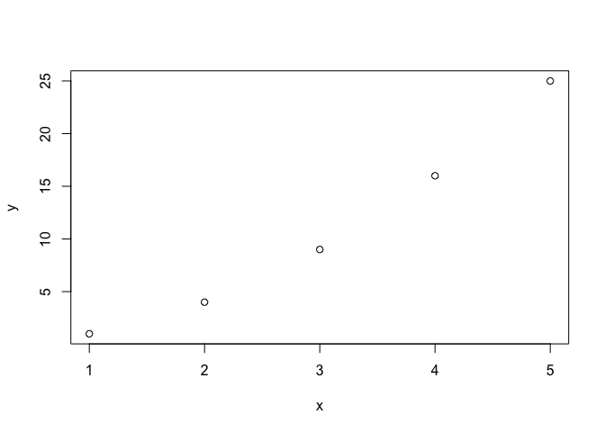
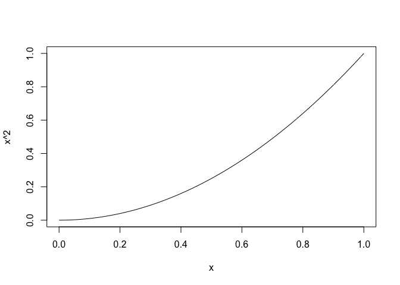
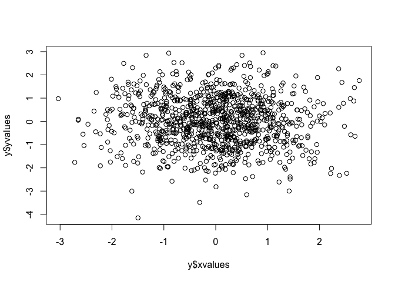
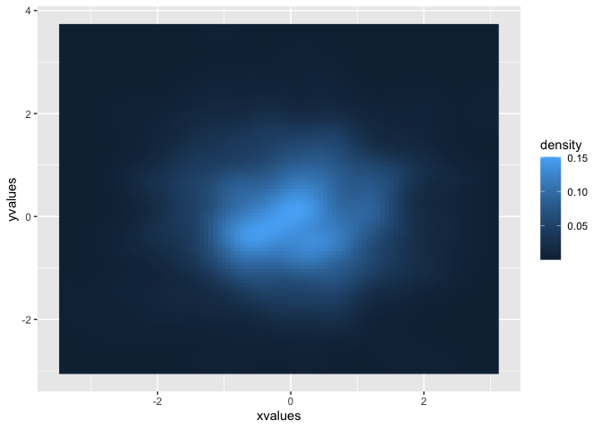
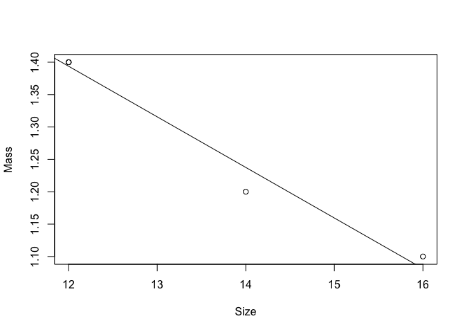

Introduction to R Programming
================
Mingyang Lu
10/6/2021

  - [Why Using R?](#why-using-r)
  - [A crash course of R](#a-crash-course-of-r)
      - [Typical data types & math
        operations](#typical-data-types-math-operations)
      - [Vectors](#vectors)
      - [Factors](#factors)
      - [If statement](#if-statement)
      - [For loops](#for-loops)
      - [While statement](#while-statement)
      - [Apply](#apply)
      - [Functions](#functions)
      - [List](#list)
      - [Data frame](#data-frame)
      - [Input/output](#inputoutput)
      - [Package](#package)
      - [Basic plotting](#basic-plotting)
  - [A few notes](#a-few-notes)
      - [Factor vs. string](#factor-vs.-string)
      - [Data frame vs. matrix](#data-frame-vs.-matrix)
      - [List vs. vector](#list-vs.-vector)
  - [Efficient R programming](#efficient-r-programming)
      - [Avoid growing vectors](#avoid-growing-vectors)
      - [Vectorize codes](#vectorize-codes)
      - [Byte compile package](#byte-compile-package)
      - [Use C/Fortran codes](#use-cfortran-codes)
      - [Parallelization](#parallelization)

## Why Using R?

R is a programming language designed for statistical computing and
graphics. Unlike a compiled language, such as C and Fortran, R is
typically used as an interpreted language. There are several reasons why
I choose R here.

  - R is simple to use. If you have some experience with any other
    programming language, it should be pretty easy to learn R.

  - R comes with an interactive environment for programming. Many users
    also use [RStudio](https://www.rstudio.com) for R. It provides an
    integrated environment for coding and scripting and a user-friendly
    Graphic User Interface (GUI), very similar to Matlab. [Here is an
    article comparing R and Matlab.](https://hackr.io/blog/r-vs-matlab)

  - R is cross-platform. Both R and RStudio are available in Windows,
    Mac, and Linux.

  - Many R packages have been developed and are freely accessible for
    statistical analyses and biomedical research. R packages can usually
    be found via (1) [Github](https://github.com); (2) The Comprehensive
    R Archive Network ([CRAN](https://cran.r-project.org)); (3)
    [BioConductor](https://www.bioconductor.org) for bioinformatics.

  - It is not difficult to develop R packages. R also provides interface
    for other languages, such as C++ and Fortran, for computational
    efficiency.

  - R packages can also be easily converted into interactive web app
    using [Shiny](https://shiny.rstudio.com).

To get started, one needs to download and install R and RStudio from the
following websites: [CRAN](https://cran.r-project.org) and
[RStudio](https://www.rstudio.com/). I recommend R version 3.6.3 for
this tutorial.

From the R Console, type the following command to get help.

``` r
help(runif)     # show documentation for the topic -- runif in this example
```

## A crash course of R

I will not provide a detailed R tutorial, as they are already available.
I recommend the following resources for learning R.

  - [An Introduction to
    R](https://cran.r-project.org/doc/manuals/r-release/R-intro.html)
    from [CRAN](https://cran.r-project.org)

  - [R & Bioconductor
    Manual](http://manuals.bioinformatics.ucr.edu/home/R_BioCondManual)
    by Thomas Girke at UC Riverside

  - [Efficient R programming](https://csgillespie.github.io/efficientR/)
    by Colin Gillespie & Robin Lovelace

Here, I will provide a brief overview of R syntax and highlight a few
R’s unique features.

#### Typical data types & math operations

``` r
a = 10 + 3.14    # integer, real number; assignment to a
a*a # a multiplies a
```

    ## [1] 172.6596

``` r
a**2 # square of a, which gives the same value as the previous one
```

    ## [1] 172.6596

``` r
b = 3.0 + 4.0i  # complex number; assignment to b
Mod(b) # The modulus of b
```

    ## [1] 5

``` r
c = (3 + 4 == 7)   # logical; c is TRUE
!c   # not c, which is FALSE
```

    ## [1] FALSE

``` r
d = "Monday"  # character
class(d)  # showing the data type of d
```

    ## [1] "character"

``` r
nchar(d)  # number of characters in a string
```

    ## [1] 6

#### Vectors

``` r
vec = c("Man","Woman","Woman","Man","Woman")   # a vector of characters
length(vec) #length of a vector
```

    ## [1] 5

``` r
vec == "Woman" # logic values comparing each element to "Woman"
```

    ## [1] FALSE  TRUE  TRUE FALSE  TRUE

``` r
which(vec == "Woman") # identifying the indices of the elements being "Woman"
```

    ## [1] 2 3 5

#### Factors

Factor type is an important data type in R. It is commonly used to
represent categorical data.

``` r
vec_factor = as.factor(vec)   # converting the character vector to a factor vector
class(vec);class(vec_factor)  # checking the data types
```

    ## [1] "character"

    ## [1] "factor"

``` r
levels(vec_factor); nlevels(vec_factor)  # levels and the number of levels
```

    ## [1] "Man"   "Woman"

    ## [1] 2

#### If statement

``` r
a = 0
if(a == 1){   # conditions
  print("a equals to 1")
} else {
  print("a is not 1")
}
```

    ## [1] "a is not 1"

#### For loops

``` r
for (i in 1:5) print(i)   # version 1
```

    ## [1] 1
    ## [1] 2
    ## [1] 3
    ## [1] 4
    ## [1] 5

``` r
for (i in seq_len(5)) print(i)   # version 2
```

    ## [1] 1
    ## [1] 2
    ## [1] 3
    ## [1] 4
    ## [1] 5

``` r
v = c(1,2,5,7)
for (i in v){
  print(i)   # version 3
}
```

    ## [1] 1
    ## [1] 2
    ## [1] 5
    ## [1] 7

#### While statement

``` r
i = 0
while(i < 5){
  i = i + 2
  print(i)
}
```

    ## [1] 2
    ## [1] 4
    ## [1] 6

#### Apply

Another unique feature in R. Apply performs a function iteratively
through an array or matrix. It’s usually more efficient than a for-loop.
Syntax: apply(X, MARGIN, FUN). Here, X is an array or matrix. MARGIN=1
performs the specified function by rows, MARGIN=2 by columns. FUN is the
function to apply.

``` r
mat = matrix(rnorm(16), nrow = 4)    # generating a random matrix of 4 x 4
mat
```

    ##            [,1]       [,2]       [,3]       [,4]
    ## [1,] -0.0902297  1.1380551  0.1367340 -0.6177632
    ## [2,]  0.3722407 -1.5746884  0.2345532  0.5704284
    ## [3,]  0.9343333  0.2401492 -0.8433827 -0.1688769
    ## [4,] -0.3087685 -1.4850208  1.3330041 -0.2518285

``` r
apply(mat, 1, sum)   # row sum
```

    ## [1]  0.5667963 -0.3974661  0.1622229 -0.7126136

``` r
rowSums(mat)   # An alternative way to do row sum
```

    ## [1]  0.5667963 -0.3974661  0.1622229 -0.7126136

``` r
apply(mat, 2, sum)   # column sum
```

    ## [1]  0.9075759 -1.6815049  0.8609086 -0.4680402

``` r
colSums(mat)  # An alternative way to do column sum
```

    ## [1]  0.9075759 -1.6815049  0.8609086 -0.4680402

There are other apply-like functions, such as lappy, sappy, tapply,
*etc.* [Check here for more
details.](https://www.datacamp.com/community/tutorials/r-tutorial-apply-family)

#### Functions

``` r
myfunction <- function(x) {    # a simple function to perform x square
  x*x
}
b = myfunction(4)
print(paste0("b = ",b))
```

    ## [1] "b = 16"

#### List

Lists can contain elements of different types.

``` r
my_list = list("a", c(1,2,3), FALSE, 3.14)  # Defining a new list
my_list[[1]]   # the first element
```

    ## [1] "a"

``` r
my_list[[2]]   # the second element
```

    ## [1] 1 2 3

``` r
names(my_list) = c("letters", "array", "TF", "pi")  # naming list elements
my_list$TF   # retrieve elements by names
```

    ## [1] FALSE

``` r
my_vector = unlist(my_list)   # convert the list to a vector
my_vector
```

    ## letters  array1  array2  array3      TF      pi 
    ##     "a"     "1"     "2"     "3" "FALSE"  "3.14"

#### Data frame

Data frame is widely used in R. It’s similar to a matrix but allows
mixed data types in it.

``` r
my_data = data.frame(
          id = c(1:5),
          atom = c("N","CA","CB","C","O"),
          mass = c(14, 12, 12, 12, 16),
          size = c(1.2, 1.4, 1.4, 1.4, 1.1),
          stringsAsFactors = F
)
print(my_data)
```

    ##   id atom mass size
    ## 1  1    N   14  1.2
    ## 2  2   CA   12  1.4
    ## 3  3   CB   12  1.4
    ## 4  4    C   12  1.4
    ## 5  5    O   16  1.1

``` r
colnames(my_data)
```

    ## [1] "id"   "atom" "mass" "size"

``` r
str(my_data)      # get the structure 
```

    ## 'data.frame':    5 obs. of  4 variables:
    ##  $ id  : int  1 2 3 4 5
    ##  $ atom: chr  "N" "CA" "CB" "C" ...
    ##  $ mass: num  14 12 12 12 16
    ##  $ size: num  1.2 1.4 1.4 1.4 1.1

``` r
my_data$mass      # retrieve a column
```

    ## [1] 14 12 12 12 16

``` r
my_data$backbone = c(T, T, F, T, T)   # add a column
print(my_data)
```

    ##   id atom mass size backbone
    ## 1  1    N   14  1.2     TRUE
    ## 2  2   CA   12  1.4     TRUE
    ## 3  3   CB   12  1.4    FALSE
    ## 4  4    C   12  1.4     TRUE
    ## 5  5    O   16  1.1     TRUE

``` r
my_data = rbind(my_data, c(6, "S", 32, 1.6, F))   # add a row
print(my_data)
```

    ##   id atom mass size backbone
    ## 1  1    N   14  1.2     TRUE
    ## 2  2   CA   12  1.4     TRUE
    ## 3  3   CB   12  1.4    FALSE
    ## 4  4    C   12  1.4     TRUE
    ## 5  5    O   16  1.1     TRUE
    ## 6  6    S   32  1.6    FALSE

#### Input/output

``` r
save(my_data,file = "my_data.Rdata")    # save the data frame my_data to file
saveRDS(my_data, file = "my_data.RDS")  # save my_data to an RDS file
load("my_data.Rdata")   # read data from an Rdata file; my_data, if exist, would be overwritten
my_data2 = readRDS("my_data.RDS")   # read data from an RDS file, assign it to another variable
```

#### Package

The following code works to install/remove packages (not in the R
markdown format to avoid adding/removing packages)

    if(! "umap" %in% rownames(installed.packages())) {      # check if the package exists
      install.packages("umap")   # if not, install "umap"
    }
    library("umap")    # load the umap library
    help(umap)
    remove.packages("umap")    # remove it ...

#### Basic plotting

``` r
x = seq_len(5)
y = x**2
plot(x, y)       # plot points
```

<!-- -->

``` r
curve(x**2)      # plot f(x) = x*x
```

<!-- -->

``` r
y = data.frame(xvalues = rnorm(1000), yvalues = rnorm(1000))    # 1000 random points in 2D
plot(y$xvalues, y$yvalues)     # scatter plot
library(ggplot2)
```

    ## Registered S3 methods overwritten by 'tibble':
    ##   method     from  
    ##   format.tbl pillar
    ##   print.tbl  pillar

<!-- -->

``` r
ggplot(y, aes(x = xvalues, y = yvalues)) +    # density map
  stat_density2d(aes(fill = ..density..), geom = "raster", contour = FALSE)
```

<!-- -->

## A few notes

The previous section highlights the basic usage of R. Please refer to
“[An Introduction to
R](https://cran.r-project.org/doc/manuals/r-release/R-intro.html)” and
[R & Bioconductor
Manual](http://manuals.bioinformatics.ucr.edu/home/R_BioCondManual) for
more details. In the following, I will emphasize a few R features that
new learners may overlook or be confused.

#### Factor vs. string

Factors may look similar to Strings, but they are very different in R
scripting. What makes things worse is that, in R version before 4.0,
stringsAsFactors = TRUE by default. That means, for R funtionality using
the parameter stringsAsFactors, any string would be interpreted as a
factor . However, in R version 4.0 or later, the default
stringsAsFactors = FALSE. If a package is developed for R before v4.0
and by assuming default treatment of strings (as factors), the same
package may not work properly for R v.4.0 or later. A good practice for
R programming is (1) Use R version 3.6.3 if many legacy R packages are
required; (2) always specify how string would be treated. Here is an
example to create a data frame containing characters/strings.

``` r
my_data = data.frame(
          id = c(1:5),
          atom = c("N","CA","CB","C","O"),
          mass = c(14, 12, 12, 12, 16),
          size = c(1.2, 1.4, 1.4, 1.4, 1.1)
)
print(my_data)
```

    ##   id atom mass size
    ## 1  1    N   14  1.2
    ## 2  2   CA   12  1.4
    ## 3  3   CB   12  1.4
    ## 4  4    C   12  1.4
    ## 5  5    O   16  1.1

``` r
class(my_data$atom)   # factor if R version < 4.0; character if R version >=4.0
```

    ## [1] "factor"

``` r
my_data = data.frame(
          id = c(1:5),
          atom = c("N","CA","CB","C","O"),
          mass = c(14, 12, 12, 12, 16),
          size = c(1.2, 1.4, 1.4, 1.4, 1.1),
          stringsAsFactors = F
)

class(my_data$atom)  # always character type
```

    ## [1] "character"

Here is an example to read a table from a file.

``` r
write.table(my_data, file = "my_data.txt", quote = F, sep="\t", row.names = F) #The table is saved to a file
data_read = read.table("my_data.txt", header = T, sep = "\t")   #Read the table from the saved file
class(data_read$atom)   # factor if R version < 4.0; character if R version >=4.0
```

    ## [1] "factor"

``` r
data_read = read.table("my_data.txt", header = T, sep = "\t", as.is = T)   # as.is = T reads strings as characters
class(data_read$atom)
```

    ## [1] "character"

#### Data frame vs. matrix

Matrix is more suitable for linear algebra analysis; while data frame is
good to save heterogeneous data and ideal for statistics analysis,
plotting, *etc.* Sometimes, data can be saved as either a data frame or
a matrix. It is important to be aware of the data type, so that
appropriate functions/operators are applied. Refer to [the following
article](https://www.geeksforgeeks.org/matrix-vs-dataframe-in-r/) for
the comparison of matrix and data frame. [Basic
plotting](#basic-plotting) shows an example of plotting with data frame.
Here is an example of linear regression with data frame.

``` r
plot(my_data$mass, my_data$size, xlab = "Size", ylab = "Mass")    # size vs. mass in my_data
model = lm(size~mass, data = my_data)   # linear regression
abline(model)   # add fited line
```

<!-- -->

``` r
summary(model)   # summary of the linear model
```

    ## 
    ## Call:
    ## lm(formula = size ~ mass, data = my_data)
    ## 
    ## Residuals:
    ##        1        2        3        4        5 
    ## -0.03750  0.00625  0.00625  0.00625  0.01875 
    ## 
    ## Coefficients:
    ##              Estimate Std. Error t value Pr(>|t|)    
    ## (Intercept)  2.331250   0.092913   25.09 0.000139 ***
    ## mass        -0.078125   0.006988  -11.18 0.001534 ** 
    ## ---
    ## Signif. codes:  0 '***' 0.001 '**' 0.01 '*' 0.05 '.' 0.1 ' ' 1
    ## 
    ## Residual standard error: 0.025 on 3 degrees of freedom
    ## Multiple R-squared:  0.9766, Adjusted R-squared:  0.9687 
    ## F-statistic:   125 on 1 and 3 DF,  p-value: 0.001534

#### List vs. vector

Lists are recursive type of vectors – lists can have values of different
types. A data frame is a list where column elements have the same data
type. In the above-mentioned linear regression example, model is a list
containing results of the linear model.

``` r
str(model)   # show the structure of the list
```

    ## List of 12
    ##  $ coefficients : Named num [1:2] 2.3312 -0.0781
    ##   ..- attr(*, "names")= chr [1:2] "(Intercept)" "mass"
    ##  $ residuals    : Named num [1:5] -0.0375 0.00625 0.00625 0.00625 0.01875
    ##   ..- attr(*, "names")= chr [1:5] "1" "2" "3" "4" ...
    ##  $ effects      : Named num [1:5] -2.9069 -0.2795 0.0127 0.0127 0.0394
    ##   ..- attr(*, "names")= chr [1:5] "(Intercept)" "mass" "" "" ...
    ##  $ rank         : int 2
    ##  $ fitted.values: Named num [1:5] 1.24 1.39 1.39 1.39 1.08
    ##   ..- attr(*, "names")= chr [1:5] "1" "2" "3" "4" ...
    ##  $ assign       : int [1:2] 0 1
    ##  $ qr           :List of 5
    ##   ..$ qr   : num [1:5, 1:2] -2.236 0.447 0.447 0.447 0.447 ...
    ##   .. ..- attr(*, "dimnames")=List of 2
    ##   .. .. ..$ : chr [1:5] "1" "2" "3" "4" ...
    ##   .. .. ..$ : chr [1:2] "(Intercept)" "mass"
    ##   .. ..- attr(*, "assign")= int [1:2] 0 1
    ##   ..$ qraux: num [1:2] 1.45 1.4
    ##   ..$ pivot: int [1:2] 1 2
    ##   ..$ tol  : num 1e-07
    ##   ..$ rank : int 2
    ##   ..- attr(*, "class")= chr "qr"
    ##  $ df.residual  : int 3
    ##  $ xlevels      : Named list()
    ##  $ call         : language lm(formula = size ~ mass, data = my_data)
    ##  $ terms        :Classes 'terms', 'formula'  language size ~ mass
    ##   .. ..- attr(*, "variables")= language list(size, mass)
    ##   .. ..- attr(*, "factors")= int [1:2, 1] 0 1
    ##   .. .. ..- attr(*, "dimnames")=List of 2
    ##   .. .. .. ..$ : chr [1:2] "size" "mass"
    ##   .. .. .. ..$ : chr "mass"
    ##   .. ..- attr(*, "term.labels")= chr "mass"
    ##   .. ..- attr(*, "order")= int 1
    ##   .. ..- attr(*, "intercept")= int 1
    ##   .. ..- attr(*, "response")= int 1
    ##   .. ..- attr(*, ".Environment")=<environment: R_GlobalEnv> 
    ##   .. ..- attr(*, "predvars")= language list(size, mass)
    ##   .. ..- attr(*, "dataClasses")= Named chr [1:2] "numeric" "numeric"
    ##   .. .. ..- attr(*, "names")= chr [1:2] "size" "mass"
    ##  $ model        :'data.frame':   5 obs. of  2 variables:
    ##   ..$ size: num [1:5] 1.2 1.4 1.4 1.4 1.1
    ##   ..$ mass: num [1:5] 14 12 12 12 16
    ##   ..- attr(*, "terms")=Classes 'terms', 'formula'  language size ~ mass
    ##   .. .. ..- attr(*, "variables")= language list(size, mass)
    ##   .. .. ..- attr(*, "factors")= int [1:2, 1] 0 1
    ##   .. .. .. ..- attr(*, "dimnames")=List of 2
    ##   .. .. .. .. ..$ : chr [1:2] "size" "mass"
    ##   .. .. .. .. ..$ : chr "mass"
    ##   .. .. ..- attr(*, "term.labels")= chr "mass"
    ##   .. .. ..- attr(*, "order")= int 1
    ##   .. .. ..- attr(*, "intercept")= int 1
    ##   .. .. ..- attr(*, "response")= int 1
    ##   .. .. ..- attr(*, ".Environment")=<environment: R_GlobalEnv> 
    ##   .. .. ..- attr(*, "predvars")= language list(size, mass)
    ##   .. .. ..- attr(*, "dataClasses")= Named chr [1:2] "numeric" "numeric"
    ##   .. .. .. ..- attr(*, "names")= chr [1:2] "size" "mass"
    ##  - attr(*, "class")= chr "lm"

Below, mean value is computed for each column of the matrix using
lapply.

``` r
means = lapply(mat, mean)    # this doesn't work
length(means)
```

    ## [1] 16

``` r
mat_list =  lapply(seq_len(ncol(mat)), function(i) mat[,i])  # convert to a list by column vectors
means = lapply(mat_list,mean)  # calculate means for a list
means
```

    ## [[1]]
    ## [1] 0.226894
    ## 
    ## [[2]]
    ## [1] -0.4203762
    ## 
    ## [[3]]
    ## [1] 0.2152272
    ## 
    ## [[4]]
    ## [1] -0.11701

``` r
means2 = colMeans(mat)   # an alternative way to compute column means
means2
```

    ## [1]  0.2268940 -0.4203762  0.2152272 -0.1170100

## Efficient R programming

So far, the basics of R are introduced. Writing R code is not difficult,
in fact quite intuitive. However, using R efficiently is not easy. R
scripts are interpretive, thus R can’t compete with compiled languages,
such as C and Fortran, in terms of computational efficiency. That
becomes especially important for numerical analyses. Interestingly, many
approaches we learn from compiled languages are not necessarily
applicable to R programming. Here, I will introduce a few techniques to
make R codes more efficient. I highly recommend the online book
[Efficient R programming](https://csgillespie.github.io/efficientR/) for
details of this topic. For example, one should use factors when
possible, as they are good for statistical analysis. A general principle
is to avoid computation in R scripts. A good practice of R programming
is to avoid intensive/iterative calculations directly in R code. The
goal is to do these calculations with more efficient functions,
typically written in C or Fortran.

#### Avoid growing vectors

The following code is extremely slow for large n.

``` r
n = 10
v = c()
for(i in seq_len(n)){
  v = c(v, i**2)
}
v
```

    ##  [1]   1   4   9  16  25  36  49  64  81 100

A better way creates an array of final length first.

``` r
n = 10
v = numeric(n)
for(i in seq_len(n)) {
  v[i] = i**2
}
v
```

    ##  [1]   1   4   9  16  25  36  49  64  81 100

#### Vectorize codes

An even better appraoch is the following. It uses vector operations
instead.

``` r
v = seq_len(n)
v = v*v
v
```

    ##  [1]   1   4   9  16  25  36  49  64  81 100

Iteration is commonly used in programming. Unfortunately, iteration,
*e.g.*, using a For Loop, is very slow in R. For example, the following
code calculates the mean and standard deviation (SD) of a series of
numbers.

``` r
my_sum = 0
my_sum2 = 0
num = 100
for (i in seq_len(num)) {
  my_sum = my_sum + i
  my_sum2 = my_sum2 + i*i
}
my_mean = my_sum/num
my_sd = sqrt(my_sum2/num - my_mean**2)
my_mean; my_sd
```

    ## [1] 50.5

    ## [1] 28.86607

While the above code is typical for C or Fortran, a better approach for
R is to use vector operations.

``` r
v = seq_len(num)
my_mean = mean(v)
my_variance = mean(v*v)
my_sd = sqrt(my_variance - my_mean**2)
my_mean; my_sd
```

    ## [1] 50.5

    ## [1] 28.86607

Apply can be used to perform operations for columns (or rows) of a
matrix.

``` r
means = apply(mat, 2, mean)
means2 = apply(mat*mat, 2, mean)
sd = sqrt(means2 - means*means)
sd
```

    ## [1] 0.4767331 1.1544378 0.7708137 0.4313327

#### Byte compile package

Any function can be compiled into byte code for an easy performance
boost.

``` r
library(compiler)
my_sd =  function(x) {   # define the function
  my_mean = mean(x)
  my_mean2 = mean(x*x)
  sqrt(my_mean2 - my_mean**2)
}
cmp_sd = cmpfun(my_sd)   # compile it to byte code
cmp_sd(seq_len(100))   # same calculations as a previous example, but with compiled function
```

    ## [1] 28.86607

``` r
apply(mat, 2, cmp_sd)  # apply to a matrix 
```

    ## [1] 0.4767331 1.1544378 0.7708137 0.4313327

#### Use C/Fortran codes

Many R packages are written in a compiled language. It is important to
use them when possible. It is also feasible to write functions in C,
C++, or Fortran, and call these functions from R. Here is an example of
Fortran subroutines, provided in the file “mysub.f90”. Note that only
integer, double precision and logical arguments are allowed in Fortran-R
interface approach.

    subroutine cal_sd(n,x,sd)
      integer,intent(in) :: n
      double precision, intent(in) :: x(n)
      double precision, intent(out) :: sd
      integer :: i
      double precision :: mean, mean2
      mean = 0.d0
      mean2 = 0.d0
      do i = 1, n
        mean = mean + x(i)
        mean2 = mean2 + x(i)**2
      end do
      mean = mean/n
      mean2 = mean2/n
      sd = sqrt(mean2 - mean**2)
    end subroutine cal_sd

The Fortran code needs to be first compiled into a .so file. This needs
to be done in command line with a fortran compiler (gfortran from gcc).

    gfortran -fpic -shared mysub.f90 -o mysub.so

Then, in R load the shared library

``` r
dyn.load("mysub.so")
```

cal\_sd can be called in R below. The arguments of the Fortran
subroutines can be found in the output list.

``` r
n = 100
v = seq_len(n)
my_sd = 0.0
results = .Fortran("cal_sd",as.integer(n),as.double(v), my_sd)
results             # [[3]] outputs the sd 
```

    ## [[1]]
    ## [1] 100
    ## 
    ## [[2]]
    ##   [1]   1   2   3   4   5   6   7   8   9  10  11  12  13  14  15  16  17  18
    ##  [19]  19  20  21  22  23  24  25  26  27  28  29  30  31  32  33  34  35  36
    ##  [37]  37  38  39  40  41  42  43  44  45  46  47  48  49  50  51  52  53  54
    ##  [55]  55  56  57  58  59  60  61  62  63  64  65  66  67  68  69  70  71  72
    ##  [73]  73  74  75  76  77  78  79  80  81  82  83  84  85  86  87  88  89  90
    ##  [91]  91  92  93  94  95  96  97  98  99 100
    ## 
    ## [[3]]
    ## [1] 28.86607

To make it even more convenient, one can write a R wrapper.

``` r
 my_sd_R <- function(x) {
   if (!is.numeric(x))
           stop("argument x must be numeric")
   my_sd = 0.0
   results =  .Fortran("cal_sd", as.integer(length(x)), as.double(x), my_sd)
   return(results[[3]])
 }
my_sd_R(seq_len(100))
```

    ## [1] 28.86607

More details can be found in [this
page](http://users.stat.umn.edu/~geyer/rc/).

#### Parallelization

Lastly, parallelization is another way to improve the performance of R.
If simple parallelization is needed, it’s pretty simple with Apply
functions. Simply setup the desired calculations in a list. Instead of
using lapply, use mclapply and specify the number of cores in use. As
demonstrated below, the code with parallelization is about three times
faster.

``` r
library(parallel)   # load the parallel library
numCores = detectCores()     # the number of available cores 
tests = seq(1, 10000)
my_test <- function(test_id) {
  v = rnorm(5000)
  return(my_sd_R(v))
}
system.time({      # no parallel
  results = lapply(tests, my_test)
})
```

    ##    user  system elapsed 
    ##   3.564   0.293   3.896

``` r
system.time({      # with parallel
  results = mclapply(tests, my_test, mc.cores = numCores)
})
```

    ##    user  system elapsed 
    ##   0.902   0.095   1.041
