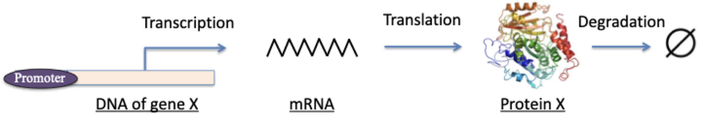
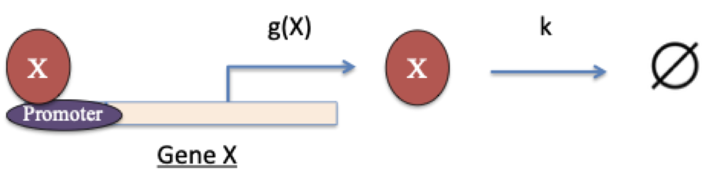

Starting here, we introduce numerical methods in the context of concrete
real-world applications. Each section opens with the background of an
application and the quantitative model behind it, then develops the associated
numerical method. For every method we focus on three things: (1) the underlying
theory, (2) its implementation in both R and Python, and (3) the libraries
available in each language.

This first section is about how gene regulation can be turned into a set of
*rate equations* — ordinary differential equations (ODEs) that track how the
concentration of a gene product changes over time. The modeling framework used
throughout follows the standard treatment of gene-regulatory circuits in systems
biology [@alon2019systems].

## Circuit of a constitutively expressed gene

### Concept

Consider a gene whose expression is independent of any regulator. The full
process — transcription, translation, and protein degradation — is sketched
below.

{width=70% fig-align="center"}

The promoter of gene $X$ plays no active role here. The symbol $\varnothing$
denotes "null", *i.e.*, a protein $X$ is removed in the degradation step. We
adopt a simplified model in which transcription and translation are lumped into
a single zero-order reaction with transcription rate $g$, while degradation is a
first-order reaction with degradation rate $k$. The corresponding chemical
scheme is

\begin{equation}
\varnothing {\stackrel{g}{\rightarrow}} X {\stackrel{k}{\rightarrow}} \varnothing
\end{equation}

The rate equation for the level of gene $X$ is

\begin{equation}
\frac{dX}{dt} = g - kX \tag{1}
\end{equation}

This is a typical ordinary differential equation (ODE). At steady state, the
level $X_s$ satisfies

\begin{equation}
\frac{dX}{dt} = 0 ,
\end{equation}

so that

\begin{equation}
X_s = \frac{g}{k} . \tag{2}
\end{equation}

We can also solve for $X$ as an explicit function of time, $X(t)$, given the
initial condition

\begin{equation}
X(t=0) = X_0 .
\end{equation}

Introducing the shifted variable

\begin{equation}
x = X - X_s \tag{3}
\end{equation}

and substituting into Equation (1) gives

\begin{equation}
\frac{dx}{dt} = -kx , \tag{4}
\end{equation}

whose general solution is

\begin{equation}
x(t) = c_1 e^{-kt} + c_2 . \tag{5}
\end{equation}

The constants $c_1$ and $c_2$ are fixed by the initial condition. Combining
Equations (2), (3), and (5), we obtain

\begin{equation}
X(t) = X_0 + \left(\frac{g}{k} - X_0\right)\left(1 - e^{-kt}\right) . \tag{6}
\end{equation}

Let us set $g = 50$ nM per minute and $k = 0.1$ per minute. The plots below show
$X(t)$ for five initial conditions, $X = 300, 400, 500, 600, 700$ nM.

### R implementation

```{r}
ode1 <- function(X0, t) {   # closed-form X(t) from Equation (6)
  g <- 50; k <- 0.1
  X0 + (g / k - X0) * (1 - exp(-k * t))
}

t_all <- seq(0, 80, 0.1)          # time points (minutes)
X0_all <- seq(300, 700, 100)      # initial conditions
my_col <- seq_len(5)              # default colors
my_label <- paste0(X0_all, "nM")  # legend labels

plot(NULL, xlab = "t (Minute)", ylab = "X (nM)",
     xlim = c(0, 80), ylim = c(250, 750))
for (i in seq_len(5)) {
  lines(t_all, ode1(X0_all[i], t_all), col = my_col[i])
}
legend("topright", inset = 0.02, title = "Initial conditions",
       legend = my_label, col = my_col, lty = 1, cex = 0.8)
```

### Python implementation

```{python}
import numpy as np
import matplotlib.pyplot as plt

def ode1(X0, t):            # closed-form X(t) from Equation (6)
    g, k = 50, 0.1
    return X0 + (g / k - X0) * (1 - np.exp(-k * t))

t_all = np.arange(0, 80 + 0.1, 0.1)   # time points (minutes)
X0_all = np.arange(300, 701, 100)     # initial conditions

fig, ax = plt.subplots()
for X0 in X0_all:
    ax.plot(t_all, ode1(X0, t_all), label=f"{X0}nM")
ax.set_xlabel("t (Minute)"); ax.set_ylabel("X (nM)")
ax.set_xlim(0, 80); ax.set_ylim(250, 750)
ax.legend(title="Initial conditions", loc="upper right", fontsize=8)
plt.show()
```

### Discussion

The system has a single stable steady state: regardless of the initial
condition, $X$ always relaxes to $X_s = g/k = 500$ nM. Here an analytical
solution is easy to obtain, but in most problems it is much harder or impossible
to find one, so numerical integration becomes necessary. We introduce numerical
methods for integrating ODEs in Part 2B.

## Circuit with a self-activating gene

### Concept

Now consider a gene whose expression is regulated by its own product: protein
$X$ binds its own promoter and modifies the transcription rate, making it a
function $g(X)$.

{width=55% fig-align="center"}

Because $X$ activates its own expression, the circuit is drawn as

{width=68px fig-align="center"}

The transcription rate is modeled as

\begin{equation}
g(X) = g_0 + g_1 H^{ex}(X) , \tag{7}
\end{equation}

where $g_0$ is the basal (minimum) transcription rate, $g_0 + g_1$ is the maximum
rate, and $H^{ex}(X)$ is the *excitatory Hill function*

\begin{equation}
H^{ex}(X) \equiv \frac{(X/X_{th})^{n_X}}{1 + (X/X_{th})^{n_X}} . \tag{8}
\end{equation}

Here $X_{th}$ is the threshold level of $X$ and $n_X$ is the Hill coefficient.
$H^{ex}$ is nonlinear, rising from $0$ at $X = 0$ toward $1$ as
$X \to \infty$. The Hill function originates from Hill's model of cooperative
oxygen binding to haemoglobin [@hill1910aggregation] and is now the standard way
to describe cooperative protein interactions and transcription-factor–DNA
binding [@alon2019systems]. The plots below show $H^{ex}$ for several Hill
coefficients.

### R implementation

```{r}
hill_ex <- function(X, X_th, n) {   # excitatory Hill function
  a <- (X / X_th)^n                 # X_th: threshold, n: Hill coefficient
  a / (1 + a)
}

X_all <- seq(0, 3, 0.1)
n_all <- seq_len(5)
my_col <- seq_len(5)
my_label <- paste0(n_all)

plot(NULL, xlab = "X/Xth", ylab = "Excitatory Hill function",
     xlim = c(0, 3), ylim = c(0, 1.05))
for (i in seq_len(5)) {
  lines(X_all, hill_ex(X_all, 1, n_all[i]), col = my_col[i])
}
legend("bottomright", inset = 0.02, title = "Hill coefficient",
       legend = my_label, col = my_col, lty = 1, cex = 0.8)
```

### Python implementation

```{python}
def hill_ex(X, X_th, n):     # excitatory Hill function
    a = (X / X_th)**n        # X_th: threshold, n: Hill coefficient
    return a / (1 + a)

X_all = np.arange(0, 3 + 0.1, 0.1)
n_all = range(1, 6)

fig, ax = plt.subplots()
for n in n_all:
    ax.plot(X_all, hill_ex(X_all, 1, n), label=str(n))
ax.set_xlabel("X/Xth"); ax.set_ylabel("Excitatory Hill function")
ax.set_xlim(0, 3); ax.set_ylim(0, 1.05)
ax.legend(title="Hill coefficient", loc="lower right", fontsize=8)
plt.show()
```

### Discussion

The rate equation for a self-activating gene is

\begin{equation}
\frac{dX}{dt} = g_0 + g_1 H^{ex}(X) - kX . \tag{9}
\end{equation}

Finding an analytical solution of Equation (9) is non-trivial because of the
nonlinear Hill term; we return to its numerical solution in Part 2D.

## Circuit with a self-inhibiting gene

### Concept

A third example is a gene $X$ whose product represses its own expression.

{width=68px fig-align="center"}

The transcription rate is now

\begin{equation}
g(X) = g_0 + g_1 H^{inh}(X) , \tag{10}
\end{equation}

where $H^{inh}(X)$ is the *inhibitory Hill function*

\begin{equation}
H^{inh}(X) \equiv \frac{1}{1 + (X/X_{th})^{n_X}} . \tag{11}
\end{equation}

By construction $H^{inh}(X) \equiv 1 - H^{ex}(X)$. The plots below show $H^{inh}$
for several Hill coefficients.

### R implementation

```{r}
hill_inh <- function(X, X_th, n) {   # inhibitory Hill function
  a <- (X / X_th)^n                  # X_th: threshold, n: Hill coefficient
  1 / (1 + a)
}

plot(NULL, xlab = "X/Xth", ylab = "Inhibitory Hill function",
     xlim = c(0, 3), ylim = c(0, 1.05))
for (i in seq_len(5)) {
  lines(X_all, hill_inh(X_all, 1, n_all[i]), col = my_col[i])
}
legend("topright", inset = 0.02, title = "Hill coefficient",
       legend = my_label, col = my_col, lty = 1, cex = 0.8)
```

### Python implementation

```{python}
def hill_inh(X, X_th, n):    # inhibitory Hill function
    a = (X / X_th)**n        # X_th: threshold, n: Hill coefficient
    return 1 / (1 + a)

fig, ax = plt.subplots()
for n in n_all:
    ax.plot(X_all, hill_inh(X_all, 1, n), label=str(n))
ax.set_xlabel("X/Xth"); ax.set_ylabel("Inhibitory Hill function")
ax.set_xlim(0, 3); ax.set_ylim(0, 1.05)
ax.legend(title="Hill coefficient", loc="upper right", fontsize=8)
plt.show()
```

### Discussion

The rate equation for the self-inhibiting gene is

\begin{equation}
\frac{dX}{dt} = g_0 + g_1 H^{inh}(X) - kX . \tag{12}
\end{equation}

## Toggle switch circuit

### Concept

Finally, we consider a two-gene circuit with transcription factors $X$ and $Y$
in which $X$ represses gene $Y$ and $Y$ represses gene $X$. This mutually
repressive motif is the classic genetic *toggle switch* first engineered in
*Escherichia coli* [@gardner2000toggle].

{width=38% fig-align="center"}

The chemical rate equations for the levels of $X$ and $Y$ are

\begin{equation}
\begin{cases}
\frac{dX}{dt} = g_{X0} + g_{X1}\dfrac{1}{1+(Y/Y_{th})^{n_Y}} - k_X X \\[2mm]
\frac{dY}{dt} = g_{Y0} + g_{Y1}\dfrac{1}{1+(X/X_{th})^{n_X}} - k_Y Y
\end{cases} \tag{13}
\end{equation}

The system is now described by two coupled ODEs, with solutions $X(t)$ and
$Y(t)$. Because there are two variables, more sophisticated tools are needed to
analyze the dynamics; we take this up in Part 3.

## References

::: {#refs}
:::
