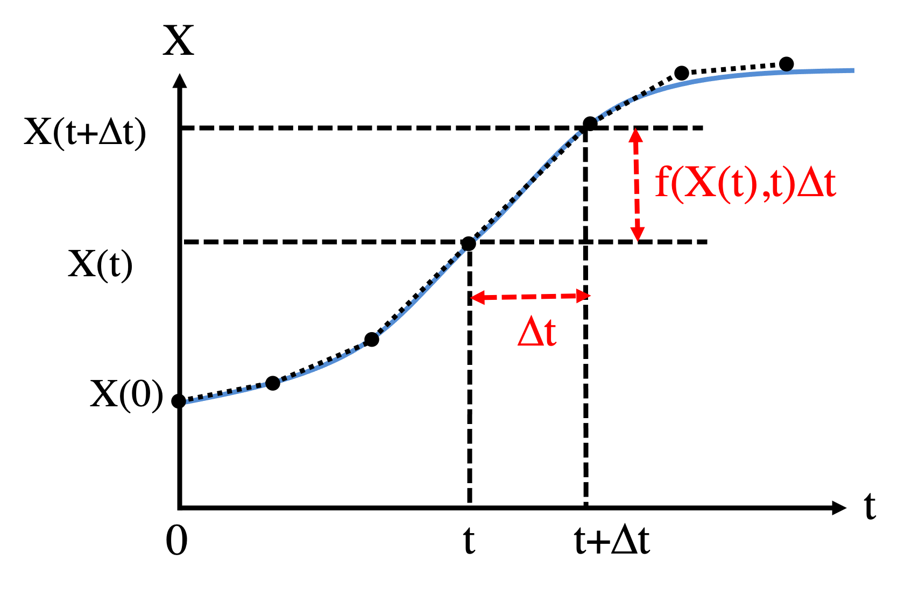
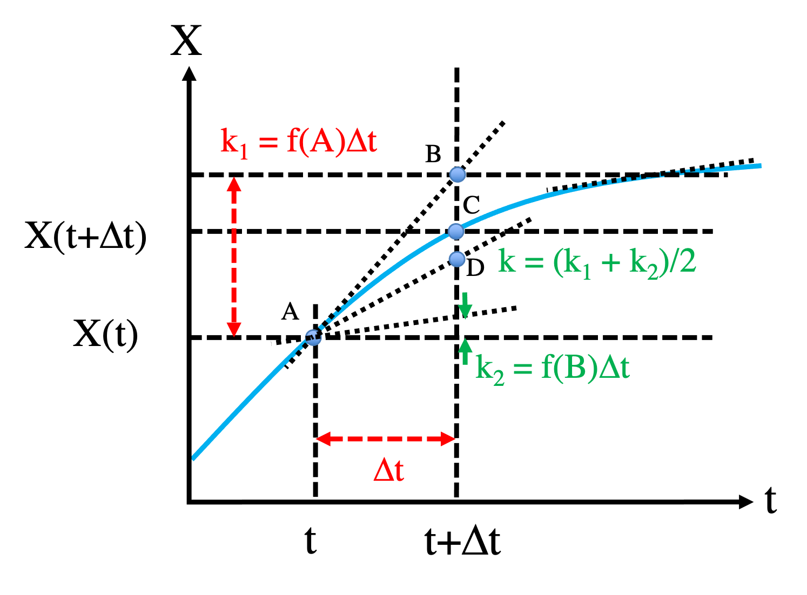

Here we introduce numerical methods to solve ODEs, using the constitutively
expressed gene circuit from [Part 2A](02a-modeling-gene-circuits.qmd) as a running example:

\begin{equation}
\frac{dX}{dt} = f(X) \equiv g - kX \tag{1}
\end{equation}

The methods below (Euler, Heun, Runge–Kutta, backward Euler) are standard
numerical integrators for ordinary differential equations; see [@hairer1993solving]
for a thorough treatment and [@press2007numerical] for practical implementations.

## 2B.1 First-order approximation: the Euler method

The Euler method is a first-order method for integrating ODEs
[@hairer1993solving]. Given $X$ at time $t$, it estimates $X$ at the next time
step $t + \Delta t$ by

\begin{equation}
X(t+\Delta t) = X(t) + f(X,t)\,\Delta t . \tag{2}
\end{equation}

{width=55% fig-align="center"}

Starting from the initial condition $X(t=0)$ and iterating Equation (2) yields
$X(t)$ at every time step. The smaller the step size $\Delta t$, the more
accurate the integration, but the more iterations (and the more compute time)
are needed to simulate a fixed duration.

::: {.callout-note title="Recipe"}
**Objective.** Integrate the gene-expression ODE from an initial value and compare
the numerical solution to the exact one at two step sizes.

**Method.** The Euler method, `X(t+dt) = X(t) + (g - k*X(t))*dt`, stepped from t = 0.

**Test.** g = 50, k = 0.1, X0 = 300, from t = 0 to 80, with dt = 1 and dt = 0.1.

**Verification.** The exact solution is `X(t) = g/k + (X0 - g/k)*exp(-k*t)`. At dt = 0.1
the numerical curve tracks it closely (largest error well under 1 nM); at dt = 1 there
is a visible gap near t = 10; both reach the steady state g/k = 500.
:::

### R implementation {.impl}

```{r}
ode1 <- function(X0, t.total, g, k) {  # analytical solution, see Part 2A
  X0 + (g / k - X0) * (1 - exp(-k * t.total))
}

t_all <- seq(0, 80, 0.1)               # time points for plotting

dX <- function(t, X, g, k) {           # derivative function, Equation (1)
  g - k * X
}

# Generic Euler integrator for a one-variable system. The ellipsis (...) passes
# any extra parameters through to the derivative function.
Euler <- function(derivs, X0, t.total, dt, ...) {
  t_all <- seq(0, t.total, by = dt)
  n_all <- length(t_all)
  X_all <- numeric(n_all)
  X_all[1] <- X0
  for (i in 1:(n_all - 1)) {
    X_all[i + 1] <- X_all[i] + dt * derivs(t_all[i], X_all[i], ...)
  }
  cbind(t_all, X_all)                  # matrix of t and X(t) for all steps
}

g <- 50
k <- 0.1

results1 <- Euler(derivs = dX, X0 = 300, t.total = 80, dt = 1,   g = g, k = k)
results2 <- Euler(derivs = dX, X0 = 300, t.total = 80, dt = 0.1, g = g, k = k)

plot(t_all, ode1(X0 = 300, t.total = t_all, g = g, k = k), type = "l", col = 2,
     xlab = "t (Minute)", ylab = "X (nM)", xlim = c(0, 80), ylim = c(300, 500))
lines(results1[, 1], results1[, 2], col = 3)
lines(results2[, 1], results2[, 2], col = 4)
legend("bottomright", inset = 0.02, title = "Time dynamics",
       legend = c("Analytical", "Euler: dt=1", "Euler: dt=0.1"),
       col = 2:4, lty = 1, cex = 0.8)
```

### Python implementation {.impl}

```{python}
import numpy as np
import matplotlib.pyplot as plt

def ode1(X0, t_total, g, k):           # analytical solution, see Part 2A
    return X0 + (g / k - X0) * (1 - np.exp(-k * t_total))

t_all = np.arange(0, 80.1, 0.1)        # time points for plotting

def dX(t, X, g, k):                    # derivative function, Equation (1)
    return g - k * X

# Generic Euler integrator; **kwargs passes extra parameters to the derivative.
def Euler(derivs, X0, t_total, dt, **kwargs):
    t_all = np.arange(0, t_total + dt, dt)
    n_all = len(t_all)
    X_all = np.zeros(n_all)
    X_all[0] = X0
    for i in range(1, n_all):
        X_all[i] = X_all[i - 1] + dt * derivs(t_all[i - 1], X_all[i - 1], **kwargs)
    return np.column_stack((t_all, X_all))

g, k = 50, 0.1

results1 = Euler(derivs=dX, X0=300, t_total=80, dt=1,   g=g, k=k)
results2 = Euler(derivs=dX, X0=300, t_total=80, dt=0.1, g=g, k=k)

plt.plot(t_all, ode1(X0=300, t_total=t_all, g=g, k=k), color="red",   label="Analytical")
plt.plot(results1[:, 0], results1[:, 1], color="green", label="Euler: dt=1")
plt.plot(results2[:, 0], results2[:, 1], color="blue",  label="Euler: dt=0.1")
plt.xlabel("t (Minute)"); plt.ylabel("X (nM)")
plt.xlim(0, 80); plt.ylim(300, 500)
plt.legend(loc="lower right", title="Time dynamics", fontsize=8)
plt.show()
```

With $\Delta t = 0.1$ the Euler method closely tracks the analytical solution;
with $\Delta t = 1$ there is a visible discrepancy near $t \approx 10$.

## 2B.2 Accuracy

By Taylor expansion for small $\Delta t$,

\begin{equation}
X(t+\Delta t) = X(t) + \frac{dX}{dt}\Delta t + O(\Delta t^2) . \tag{3}
\end{equation}

The term $O(\Delta t^2)$ collects the leading truncated contribution as
$\Delta t \to 0$ and bounds the error of the expansion. Comparing Equations (1)
and (3) recovers the Euler formula (2), so the local error of the Euler method
is $O(\Delta t^2)$. The same reasoning estimates the error of other integrators.

## 2B.3 Code efficiency

Beyond writing an integrator by hand, one can use an established ODE library or
call compiled code for speed. Here we compare three routes for the same Euler
integration: a hand-written implementation, a library routine, and a compiled
function, and benchmark them.

### R implementation {.impl}

R has mature ODE solvers such as `deSolve` [@soetaert2010desolve]. The same
system integrated with two step sizes reproduces our own implementation:

```{r}
#| message: false
library(deSolve)

# Derivative in the form deSolve expects; parms holds c(g, k)
dy_deSolve <- function(t, y, parms) list(parms[1] - parms[2] * y)

results3 <- ode(y = 300, times = seq(0, 80, 1),   func = dy_deSolve,
                parms = c(50, 0.1), method = "euler")
results4 <- ode(y = 300, times = seq(0, 80, 0.1), func = dy_deSolve,
                parms = c(50, 0.1), method = "euler")

plot(results3[, 1], results3[, 2], type = "l", col = 2,
     xlab = "t (Minute)", ylab = "X (nM)", xlim = c(0, 80), ylim = c(300, 500))
lines(results4[, 1], results4[, 2], col = 3)
legend("bottomright", inset = 0.02, title = "Time dynamics",
       legend = c("deSolve euler: dt=1", "deSolve euler: dt=0.1"),
       col = 2:3, lty = 1, cex = 0.8)
```

For maximum speed the derivative and the integration loop can be written in a
compiled language. The Fortran routine below (`02-odes/src/sub_ode_1g.f90`)
implements the same Euler step:

```fortran
function derivs_1g(t, x)
  implicit none
  double precision :: derivs_1g
  double precision, intent(in) :: t, x
  double precision :: g = (50.d0), k = (0.1d0)
  derivs_1g = g - k * x
end function derivs_1g

subroutine ode_1g_euler(x0, dt, nsteps, results)
  implicit none
  integer, intent(in) :: nsteps
  double precision, intent(in) :: x0, dt
  double precision, dimension(2, nsteps), intent(out) :: results
  double precision :: derivs_1g
  integer :: i
  double precision :: t, x
  t = 0.d0
  x = x0
  do i = 1, nsteps
    t = t + dt
    x = x + derivs_1g(t, x) * dt
    results(1, i) = t
    results(2, i) = x
  enddo
end subroutine ode_1g_euler
```

We compile it into a shared library with `gfortran` (run once at the terminal,
not during rendering):

```bash
gfortran -fpic -shared 02-odes/src/sub_ode_1g.f90 -o 02-odes/src/sub_ode_1g.so
```

The shared library can then be loaded and called from R:

```{r}
dyn.load("02-odes/src/sub_ode_1g.so")

dt <- 0.1; t_total <- 80.0; X0 <- 300.0
nsteps <- as.integer(t_total / dt)
res <- matrix(0, nrow = 2, ncol = nsteps)
results5 <- .Fortran("ode_1g_euler", as.double(X0), as.double(dt),
                     as.integer(nsteps), res)
a <- rbind(c(0, X0), t(results5[[4]]))   # prepend the initial condition
plot(a[, 1], a[, 2], type = "l", xlab = "t (Minute)", ylab = "X (nM)")
```

Finally we benchmark the three approaches with a smaller step size
($\Delta t = 0.01$):

```{r}
#| message: false
#| warning: false
library(microbenchmark)
library(ggplot2)

X0 <- 300; dt <- 0.01; t_total <- 80.0
my_benchmark <- microbenchmark(
  euler_ours    = Euler(dX, X0, t_total, dt, g = g, k = k),
  euler_desolve = {
    t_all <- seq(0, t_total, dt)
    ode(y = X0, times = t_all, func = dy_deSolve, parms = c(g, k), method = "euler")
  },
  euler_fortran = {
    nsteps <- as.integer(t_total / dt)
    res <- matrix(0, nrow = 2, ncol = nsteps)
    o <- .Fortran("ode_1g_euler", as.double(X0), as.double(dt),
                  as.integer(nsteps), res)
    rbind(c(0, X0), t(o[[4]]))
  },
  times = 10, unit = "ms")
autoplot(my_benchmark)
```

### Python implementation {.impl}

Python's general-purpose ODE solver is `scipy.integrate.solve_ivp`
[@virtanen2020scipy]. Note it has no dedicated fixed-step Euler method; by
default it uses an adaptive Runge–Kutta (RK45) scheme, so its output is not
step-for-step identical to the Euler results but solves the same system:

```{python}
from scipy.integrate import solve_ivp

sol = solve_ivp(lambda t, X: g - k * X, [0, 80], [300],
                t_eval=np.arange(0, 80.1, 0.1))
plt.plot(sol.t, sol.y[0], color="green", label="scipy solve_ivp (RK45)")
plt.xlabel("t (Minute)"); plt.ylabel("X (nM)")
plt.xlim(0, 80); plt.ylim(300, 500)
plt.legend(loc="lower right", fontsize=8)
plt.show()
```

The same compiled Fortran shared library can be called from Python through
`ctypes`. gfortran appends a trailing underscore to subroutine names, arguments
are passed by reference, and the `results(2, nsteps)` array is column-major
(stored as `t, x, t, x, …`):

```{python}
import ctypes

_lib = ctypes.CDLL("02-odes/src/sub_ode_1g.so")

def euler_fortran(X0, dt, nsteps):
    fn = _lib.ode_1g_euler_
    results = np.zeros(2 * nsteps)
    fn(ctypes.byref(ctypes.c_double(float(X0))),
       ctypes.byref(ctypes.c_double(float(dt))),
       ctypes.byref(ctypes.c_int(int(nsteps))),
       results.ctypes.data_as(ctypes.POINTER(ctypes.c_double)))
    out = results.reshape(nsteps, 2)          # columns: t, x
    return np.vstack(([0.0, X0], out))        # prepend the initial condition

dt, t_total, X0 = 0.1, 80.0, 300.0
nsteps = int(t_total / dt)
a = euler_fortran(X0, dt, nsteps)
plt.plot(a[:, 0], a[:, 1], color="purple")
plt.xlabel("t (Minute)"); plt.ylabel("X (nM)")
plt.show()
```

We benchmark the three Python approaches with `timeit` at $\Delta t = 0.01$:

```{python}
import timeit

X0, dt, t_total = 300, 0.01, 80.0
nsteps = int(t_total / dt)
n_rep = 10

t_ours = timeit.timeit(lambda: Euler(dX, X0, t_total, dt, g=g, k=k),
                       number=n_rep) / n_rep
t_scipy = timeit.timeit(lambda: solve_ivp(lambda t, X: g - k * X, [0, t_total],
                        [X0], t_eval=np.arange(0, t_total + dt, dt)),
                        number=n_rep) / n_rep
t_fortran = timeit.timeit(lambda: euler_fortran(X0, dt, nsteps),
                          number=n_rep) / n_rep

labels = ["pure Python", "scipy solve_ivp", "Fortran (ctypes)"]
times_ms = [t_ours * 1e3, t_scipy * 1e3, t_fortran * 1e3]
for name, tt in zip(labels, times_ms):
    print(f"{name:18s}: {tt:8.2f} ms")

plt.bar(labels, times_ms, color=["cyan", "orange", "purple"])
plt.ylabel("time per call (ms)"); plt.yscale("log")
plt.show()
```

For this simple, fixed-step problem the hand-written loop is typically a little
faster than `deSolve` (which stores each step's result in a list), and the
compiled Fortran routine is about an order of magnitude faster than either. Two
things make the R versions slow: the derivative function is interpreted R, and
the array of time steps is repeatedly processed in the R interpreter during the
loop. The Fortran routine avoids both: the derivative is compiled in, and,
although it allocates a result matrix, that matrix is only used for output, never
during the integration. Exact timings vary by machine and run, and `deSolve` can
itself call compiled derivative functions (in C or Fortran), which would narrow
the gap. None of this makes libraries slow. They are robust and general, but for
tight inner loops a compiled kernel wins.

## 2B.4 Second-order approximation: Heun's method

In the Euler method the derivative is treated as constant over the interval
$t \to t+\Delta t$. This works well when $\Delta t$ is small and the derivative
varies slowly; otherwise a higher-order approximation is required. Heun's method
[@hairer1993solving] is a second-order scheme, illustrated below.

{width=55% fig-align="center"}

We start from point A, $(X(t), t)$. An Euler step lands at point B,
$(X(t) + f(X,t)\Delta t,\ t + \Delta t)$, which is still some distance from the
true point C on the $X(t)$ curve. To do better, we evaluate the derivative at B,
$f(X(t) + f(X,t)\Delta t,\ t + \Delta t)$, and average the two slopes (at A and
at B); this takes us to point D, which is usually closer to C than B is. In math,

\begin{equation}
\begin{aligned}
k_1 &= f(X(t), t)\,\Delta t \\
X_B &= X(t) + k_1 \\
k_2 &= f(X_B, t + \Delta t)\,\Delta t \\
X(t+\Delta t) &= X(t) + \frac{k_1 + k_2}{2}
\end{aligned} \tag{4}
\end{equation}

The local error is $O(\Delta t^3)$. To see this, Taylor-expand the exact update,

$$
\begin{aligned}
X(t + \Delta t) &= X(t) + \frac{dX}{dt}\Delta t + \frac{1}{2}\frac{d^2 X}{dt^2}\Delta t^2 + O(\Delta t^3) \\
&= X(t) + f(X,t)\Delta t + \frac{1}{2}\frac{df(X,t)}{dt}\Delta t^2 + O(\Delta t^3) ,
\end{aligned}
$$

where $\frac{df}{dt} = \frac{\partial f}{\partial t} + f\frac{\partial f}{\partial X}$
(chain rule, using $\frac{dX}{dt} = f$). Expanding $k_2$ to the same order,

$$
k_2 = f(X,t)\Delta t + \left(f\frac{\partial f}{\partial X} + \frac{\partial f}{\partial t}\right)\Delta t^2 + O(\Delta t^3) ,
$$

so $\dfrac{k_1 + k_2}{2} = f(X,t)\Delta t + \dfrac{1}{2}\dfrac{df}{dt}\Delta t^2 + O(\Delta t^3) = X(t+\Delta t) - X(t) + O(\Delta t^3)$,
which proves Heun's method is accurate to $O(\Delta t^3)$ per step.

::: {.callout-note title="Recipe"}
**Objective.** Implement a second-order Heun integrator for a one-variable ODE.

**Method.** Heun's method: take an Euler step to a predicted endpoint, evaluate the
slope there, and advance by the average of the starting and predicted slopes.

**Test.** Integrate `dX/dt = g - k*X` with g = 50, k = 0.1, X0 = 300.

**Verification.** At the same step size it should sit closer to the exact solution
`X(t) = g/k + (X0 - g/k)*exp(-k*t)` than the Euler method; halving the step should cut
its error by roughly a factor of 4.
:::

### R implementation {.impl}

```{r}
Heun <- function(derivs, X0, t.total, dt, ...) {
  t_all <- seq(0, t.total, by = dt)
  n_all <- length(t_all)
  X_all <- numeric(n_all)
  X_all[1] <- X0
  for (i in 1:(n_all - 1)) {
    k1 <- dt * derivs(t_all[i], X_all[i], ...)
    xb <- X_all[i] + k1
    k2 <- dt * derivs(t_all[i + 1], xb, ...)
    X_all[i + 1] <- X_all[i] + (k1 + k2) / 2
  }
  cbind(t_all, X_all)
}
```

### Python implementation {.impl}

```{python}
def Heun(derivs, X0, t_total, dt, **kwargs):
    t_all = np.arange(0, t_total + dt, dt)
    n_all = len(t_all)
    X_all = np.zeros(n_all)
    X_all[0] = X0
    for i in range(0, n_all - 1):
        k1 = dt * derivs(t_all[i], X_all[i], **kwargs)
        xb = X_all[i] + k1
        k2 = dt * derivs(t_all[i + 1], xb, **kwargs)
        X_all[i + 1] = X_all[i] + (k1 + k2) / 2
    return np.column_stack((t_all, X_all))
```

## 2B.5 Second-order Runge–Kutta method (RK2)

RK2, the midpoint method [@hairer1993solving], takes a trial half-step to the
midpoint of the interval and uses the derivative there for the full step:

\begin{equation}
\begin{aligned}
k_1 &= f(X(t), t)\,\Delta t \\
k_2 &= f\!\left(X(t) + \tfrac{1}{2}k_1, t + \tfrac{1}{2}\Delta t\right)\Delta t \\
X(t+\Delta t) &= X(t) + k_2
\end{aligned} \tag{5}
\end{equation}

::: {.callout-note title="Recipe"}
**Objective.** Implement the second-order Runge-Kutta (midpoint) integrator.

**Method.** RK2: take a trial half-step to the midpoint of the interval and use the
slope there for the full step.

**Test.** Integrate `dX/dt = g - k*X` with g = 50, k = 0.1, X0 = 300.

**Verification.** Accuracy comparable to Heun and better than the Euler method at the
same step size, checked against `X(t) = g/k + (X0 - g/k)*exp(-k*t)`.
:::

### R implementation {.impl}

```{r}
RK2 <- function(derivs, X0, t.total, dt, ...) {
  t_all <- seq(0, t.total, by = dt)
  n_all <- length(t_all)
  X_all <- numeric(n_all)
  X_all[1] <- X0
  for (i in 1:(n_all - 1)) {
    k1 <- dt * derivs(t_all[i], X_all[i], ...)
    k2 <- dt * derivs(t_all[i] + dt / 2, X_all[i] + k1 / 2, ...)
    X_all[i + 1] <- X_all[i] + k2
  }
  cbind(t_all, X_all)
}
```

### Python implementation {.impl}

```{python}
def RK2(derivs, X0, t_total, dt, **kwargs):
    t_all = np.arange(0, t_total + dt, dt)
    n_all = len(t_all)
    X_all = np.zeros(n_all)
    X_all[0] = X0
    for i in range(0, n_all - 1):
        k1 = dt * derivs(t_all[i], X_all[i], **kwargs)
        k2 = dt * derivs(t_all[i] + dt / 2, X_all[i] + k1 / 2, **kwargs)
        X_all[i + 1] = X_all[i] + k2
    return np.column_stack((t_all, X_all))
```

## 2B.6 Fourth-order Runge–Kutta method (RK4)

RK4 is the most widely used general-purpose integrator [@hairer1993solving;
@press2007numerical], with local error $O(\Delta t^5)$:

\begin{equation}
\begin{aligned}
k_1 &= f(X, t)\,\Delta t \\
k_2 &= f\!\left(X + \tfrac{k_1}{2}, t + \tfrac{\Delta t}{2}\right)\Delta t \\
k_3 &= f\!\left(X + \tfrac{k_2}{2}, t + \tfrac{\Delta t}{2}\right)\Delta t \\
k_4 &= f\!\left(X + k_3, t + \Delta t\right)\Delta t \\
X(t+\Delta t) &= X(t) + \frac{k_1 + 2k_2 + 2k_3 + k_4}{6}
\end{aligned} \tag{6}
\end{equation}

::: {.callout-note title="Recipe"}
**Objective.** Implement the fourth-order Runge-Kutta integrator.

**Method.** RK4: combine four slope evaluations across the step (at the start, twice
at the midpoint, and at the end) with weights 1, 2, 2, 1.

**Test.** Integrate `dX/dt = g - k*X` with g = 50, k = 0.1, X0 = 300.

**Verification.** Far more accurate than RK2 or Euler at the same step size; halving
the step should cut its error by roughly a factor of 16.
:::

### R implementation {.impl}

```{r}
RK4 <- function(derivs, X0, t.total, dt, ...) {
  t_all <- seq(0, t.total, by = dt)
  n_all <- length(t_all)
  X_all <- numeric(n_all)
  X_all[1] <- X0
  for (i in 1:(n_all - 1)) {
    t_0   <- t_all[i]
    t_0.5 <- t_0 + 0.5 * dt
    t_1   <- t_0 + dt
    k1 <- dt * derivs(t_0,   X_all[i],          ...)
    k2 <- dt * derivs(t_0.5, X_all[i] + k1 / 2, ...)
    k3 <- dt * derivs(t_0.5, X_all[i] + k2 / 2, ...)
    k4 <- dt * derivs(t_1,   X_all[i] + k3,     ...)
    X_all[i + 1] <- X_all[i] + (k1 + 2 * k2 + 2 * k3 + k4) / 6
  }
  cbind(t_all, X_all)
}
```

### Python implementation {.impl}

```{python}
def RK4(derivs, X0, t_total, dt, **kwargs):
    t_all = np.arange(0, t_total + dt, dt)
    n_all = len(t_all)
    X_all = np.zeros(n_all)
    X_all[0] = X0
    for i in range(0, n_all - 1):
        t_0   = t_all[i]
        t_0_5 = t_0 + 0.5 * dt
        t_1   = t_0 + dt
        k1 = dt * derivs(t_0,   X_all[i],          **kwargs)
        k2 = dt * derivs(t_0_5, X_all[i] + k1 / 2, **kwargs)
        k3 = dt * derivs(t_0_5, X_all[i] + k2 / 2, **kwargs)
        k4 = dt * derivs(t_1,   X_all[i] + k3,     **kwargs)
        X_all[i + 1] = X_all[i] + (k1 + 2 * k2 + 2 * k3 + k4) / 6
    return np.column_stack((t_all, X_all))
```

## 2B.7 Comparing integrator accuracy

To quantify accuracy we use the root-mean-square deviation (RMSD) between the
exact solution and each simulation over $n$ time points:

$$d_{RMSD}(X_1, X_2) = \sqrt{\frac{\sum_{i=1}^{n} [X_1(t_i)-X_2(t_i)]^2}{n}} .$$

### R implementation {.impl}

```{r}
rmsd <- function(array1, array2) {
  num <- length(array1)
  diff <- array1 - array2
  sqrt(diff %*% diff / num)
}

dt_all <- seq(0.1, 1, 0.1)
errors_Euler <- errors_Heun <- errors_RK2 <- errors_RK4 <- numeric(length(dt_all))

for (ind in seq_along(dt_all)) {
  dt <- dt_all[ind]
  t_pts <- seq(0, 80, dt)
  exact <- ode1(X0 = 300, t.total = t_pts, g = g, k = k)
  errors_Euler[ind] <- rmsd(exact, Euler(dX, 300, 80, dt, g = g, k = k)[, 2])
  errors_Heun[ind]  <- rmsd(exact, Heun(dX, 300, 80, dt, g = g, k = k)[, 2])
  errors_RK2[ind]   <- rmsd(exact, RK2(dX, 300, 80, dt, g = g, k = k)[, 2])
  errors_RK4[ind]   <- rmsd(exact, RK4(dX, 300, 80, dt, g = g, k = k)[, 2])
}

plot(dt_all, errors_Heun, type = "p", col = 2, log = "y",
     xlab = "dt (Minute)", ylab = "RMSD", xlim = c(0, 1), ylim = c(1e-10, 10))
points(dt_all, errors_RK2,   pch = 3, col = 3)
points(dt_all, errors_RK4,           col = 4)
points(dt_all, errors_Euler,         col = 5)
legend("bottomright", inset = 0.02, title = "Errors",
       legend = c("Heun", "RK2", "RK4", "Euler"),
       col = 2:5, pch = c(1, 3, 1, 1), cex = 0.8)
```

The shared Fortran library also provides `ode_1g_rk2` and `ode_1g_rk4`. As a
check, we compare the compiled RK4 against our R RK4, RK2, and Euler results (and
the exact solution) at $\Delta t = 0.1$ via the RMSD:

```{r}
dt <- 0.1; t_total <- 80.0; X0 <- 300.0
nsteps <- as.integer(t_total / dt)
res <- matrix(0, nrow = 2, ncol = nsteps)
fort_rk4 <- .Fortran("ode_1g_rk4", as.double(X0), as.double(dt),
                     as.integer(nsteps), res)
a <- rbind(c(0, X0), t(fort_rk4[[4]]))
c(vs_RK4   = rmsd(a[, 2], RK4(dX, 300, 80, dt, g = g, k = k)[, 2]),
  vs_RK2   = rmsd(a[, 2], RK2(dX, 300, 80, dt, g = g, k = k)[, 2]),
  vs_Euler = rmsd(a[, 2], Euler(dX, 300, 80, dt, g = g, k = k)[, 2]),
  vs_exact = rmsd(a[, 2], ode1(300, seq(0, t_total, dt), g = g, k = k)))
```

The Fortran RK4 matches the R RK4 (and the exact solution) to a tiny RMSD, while
RK2 and especially Euler differ more, confirming that the compiled and
interpreted RK4 agree.

### Python implementation {.impl}

```{python}
def rmsd(array1, array2):
    num = len(array1)
    diff = array1 - array2
    return np.sqrt(np.sum(diff**2) / num)

dt_all = np.arange(0.1, 1.1, 0.1)
errors_Euler = np.zeros_like(dt_all)
errors_Heun  = np.zeros_like(dt_all)
errors_RK2   = np.zeros_like(dt_all)
errors_RK4   = np.zeros_like(dt_all)

for ind, dt in enumerate(dt_all):
    t_pts = np.arange(0, 80 + dt, dt)
    exact = ode1(X0=300, t_total=t_pts, g=g, k=k)
    errors_Euler[ind] = rmsd(exact, Euler(dX, 300, 80, dt, g=g, k=k)[:, 1])
    errors_Heun[ind]  = rmsd(exact, Heun(dX, 300, 80, dt, g=g, k=k)[:, 1])
    errors_RK2[ind]   = rmsd(exact, RK2(dX, 300, 80, dt, g=g, k=k)[:, 1])
    errors_RK4[ind]   = rmsd(exact, RK4(dX, 300, 80, dt, g=g, k=k)[:, 1])

plt.plot(dt_all, errors_Heun,  "o", color="red",   label="Heun")
plt.plot(dt_all, errors_RK2,   "+", color="green", label="RK2")
plt.plot(dt_all, errors_RK4,   "o", color="blue",  label="RK4")
plt.plot(dt_all, errors_Euler, "o", color="cyan",  label="Euler")
plt.yscale("log")
plt.xlabel("dt (Minute)"); plt.ylabel("RMSD")
plt.xlim(0, 1.1); plt.ylim(1e-10, 10)
plt.legend(loc="lower right", title="Errors", fontsize=8)
plt.show()
```

RK4 is typically orders of magnitude more accurate than RK2, which is in turn
orders of magnitude more accurate than Euler. RK4 needs four derivative
evaluations per step, RK2 two, and Euler one. But RK4 and RK2 tolerate much
larger step sizes at the same accuracy, so they are usually more efficient
overall.

## 2B.8 Backward Euler method

Rewriting Equation (2) with $h = \Delta t$, $X_n = X(t)$, $X_{n+1} = X(t+\Delta t)$:

$$X_{n+1} = X_n + h\,f(X_n, t) . \tag{7}$$

This forward (explicit) Euler method can become unstable. For our model,
$X_{n+1} = hg + (1-hk)X_n$, which diverges once $h > 1/k$. The backward
(implicit) Euler method instead evaluates the derivative at the new point:

$$X_{n+1} = X_n + h\,f(X_{n+1}, t_{n+1}) . \tag{8}$$

In general $X_{n+1}$ must be solved for (e.g. by Newton's method or fixed-point
iteration), but here $f = g - kX_{n+1}$ is linear, giving the closed form

$$X_{n+1} = \frac{X_n + hg}{1 + hk} .$$

We use stiff parameters ($k = 10$) where forward Euler with $\Delta t = 0.2$ is
unstable.

::: {.callout-note title="Recipe"}
**Objective.** Integrate a stiff version of the model where the forward Euler method
blows up, using an implicit step.

**Method.** Backward (implicit) Euler, `X(t+dt) = X(t) + (g - k*X(t+dt))*dt`; since the
right-hand side is linear this rearranges to `X_next = (X + dt*g) / (1 + dt*k)`.

**Test.** Stiff parameters g = 50, k = 10, X0 = 3, from t = 0 to 4, with dt = 0.2.

**Verification.** Forward Euler at dt = 0.2 oscillates and diverges, while backward
Euler stays stable and tracks the exact solution toward the steady state g/k = 5.
:::

### R implementation {.impl}

```{r}
g <- 50; k <- 10; t.total <- 4
t_all <- seq(0, t.total, 0.1)
result_euler <- Euler(derivs = dX, X0 = 3, t.total = t.total, dt = 0.2, g = g, k = k)
result_exact <- cbind(t_all, ode1(X0 = 3, t.total = t_all, g = g, k = k))

plot(result_euler[, 1], result_euler[, 2], type = "l", col = 2,
     xlab = "t", ylab = "X", xlim = c(0, t.total), ylim = c(2, 8))
lines(result_exact[, 1], result_exact[, 2], col = 3)
legend("bottomright", inset = 0.02, legend = c("Euler dt=0.2", "Exact"),
       col = 2:3, lty = 1, cex = 0.8)
```

```{r}
# Backward Euler specialized to the gene-expression model
Euler_backward_1g <- function(t0, X0, t.total, dt, g, k) {
  t_all <- seq(t0, t.total, by = dt)
  n_all <- length(t_all)
  X_all <- numeric(n_all)
  X_all[1] <- X0
  for (i in 1:(n_all - 1)) {
    X_all[i + 1] <- (X_all[i] + dt * g) / (1 + dt * k)
  }
  cbind(t_all, X_all)
}

result_euler_backward <- Euler_backward_1g(t0 = 0, X0 = 3, t.total = t.total,
                                           dt = 0.2, g = g, k = k)
plot(result_euler_backward[, 1], result_euler_backward[, 2], type = "l", col = 2,
     xlab = "t", ylab = "X", xlim = c(0, t.total), ylim = c(2, 8))
lines(result_exact[, 1], result_exact[, 2], col = 3)
legend("bottomright", inset = 0.02, legend = c("Euler backward dt=0.2", "Exact"),
       col = 2:3, lty = 1, cex = 0.8)
```

### Python implementation {.impl}

```{python}
g, k, t_total = 50, 10, 4
t_all = np.arange(0, t_total + 0.1, 0.1)
result_euler = Euler(derivs=dX, X0=3, t_total=t_total, dt=0.2, g=g, k=k)
result_exact = np.column_stack((t_all, ode1(X0=3, t_total=t_all, g=g, k=k)))

plt.plot(result_euler[:, 0], result_euler[:, 1], "r-", label="Euler dt=0.2")
plt.plot(result_exact[:, 0], result_exact[:, 1], "g-", label="Exact")
plt.xlabel("t"); plt.ylabel("X")
plt.xlim(0, t_total); plt.ylim(2, 8)
plt.legend(loc="lower right", fontsize=8)
plt.show()
```

```{python}
def euler_backward_1g(t0, X0, t_total, dt, g, k):
    t_all = np.arange(t0, t_total + dt, dt)
    n_all = len(t_all)
    X_all = np.zeros(n_all)
    X_all[0] = X0
    for i in range(1, n_all):
        X_all[i] = (X_all[i - 1] + dt * g) / (1 + dt * k)
    return np.column_stack((t_all, X_all))

result_euler_backward = euler_backward_1g(t0=0, X0=3, t_total=t_total, dt=0.2, g=g, k=k)
plt.plot(result_euler_backward[:, 0], result_euler_backward[:, 1], "r-",
         label="Euler backward dt=0.2")
plt.plot(result_exact[:, 0], result_exact[:, 1], "g-", label="Exact")
plt.xlabel("t"); plt.ylabel("X")
plt.xlim(0, t_total); plt.ylim(2, 8)
plt.legend(loc="lower right", fontsize=8)
plt.show()
```

Backward Euler is still only first-order accurate, but it is stable at step
sizes where forward Euler diverges, the defining advantage of implicit methods
for stiff systems.
