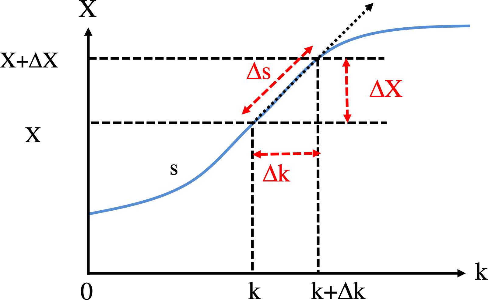

In [Part 2E](02e-bifurcation.qmd) we built the bifurcation diagram by *sampling*:
at each value of $k$ we located the steady states (the roots of $f(X, k) = 0$, or
the states an ODE relaxes onto), producing a cloud of points that we then
connected into a curve. That works, but it treats the diagram as a set of
independent points and depends on a post-hoc reordering step to make a curve out
of them.

This chapter takes the complementary view: the bifurcation set
$\{(k, X) : f(X, k) = 0\}$ is a *curve* in the $(k, X)$ plane, and we trace it
directly. Two families of methods do this. The **contour method** treats
$f(k, X)$ as a surface and extracts its zero-level contour, interpolating within a
grid to place the curve accurately. **Numerical continuation** starts from one
point on the curve and walks along it with a predictor–corrector step. These are
the general-purpose tools of bifurcation analysis, and they return the curve
already ordered.

## 2F.1 The model derivative

We use the same self-activating-gene model as in [Part 2E](02e-bifurcation.qmd),

\begin{equation}
\frac{dX}{dt} = f(X, k) = 10 + 45\frac{X^4}{X^4 + 200^4} - kX . \tag{1}
\end{equation}

Every method below evaluates $f(X, k)$, so we define it once in each language.
Because each chapter renders as an independent session, this repeats the
`derivs_k` used in [Part 2E](02e-bifurcation.qmd) rather than relying on it.

### R implementation {.impl}

```{r}
derivs_k <- function(X, k) 10 + 45 * X^4 / (X^4 + 200^4) - k * X
```

### Python implementation {.impl}

```{python}
import numpy as np
import matplotlib.pyplot as plt

def derivs_k(X, k):
    return 10 + 45 * X**4 / (X**4 + 200**4) - k * X
```

## 2F.2 Contour method

Write $z = f(k, X)$, a surface over the $(k, X)$ plane. The steady states are
exactly the points where this surface crosses zero, so the bifurcation curve is
the **zero-level contour** of $z$. Standard contour algorithms take $f$ on a grid
of $(k, X)$ and trace the level set $z = 0$; both R's `contour()` and Matplotlib's
`contour()` do this. The method is powerful and stable, and, unlike the sampling
methods of [Part 2E](02e-bifurcation.qmd), it returns the curve as connected, ordered line segments
rather than a point cloud. Its one weakness is that it can miss a branch if the
solution set is not connected. Here $f(X, k) = 0$ is a single connected S-shaped
curve, so one contour captures all of it.

::: {.callout-note title="Recipe 2F.2.1"}
**Objective.** Trace the bifurcation curve as a connected, ordered set of steady states.

**Model.** A self-activating gene: basal transcription plus an excitatory Hill function, minus linear degradation, `f(X, k) = g0 + g1*(X/Xth)^n/(1 + (X/Xth)^n) - k*X`, with k the control parameter.

**Method.** Treat `z = f(k, X)` as a surface over the (k, X) plane and take its zero-level contour on a grid.

**Test.** `g0 = 10, g1 = 45, Xth = 200, n = 4`, evaluated over a grid of (k, X).

**Verification.** The zero contour is the same S-shaped curve as in Part 2E, returned as connected line segments rather than a point cloud; one contour captures the whole connected curve.
:::

### R implementation {.impl}

```{r}
# evaluate f on a grid of (k, X), then draw its zero-level contour
k_all <- seq(0.1, 0.2, by = 0.001)
X_all <- seq(0, 600, by = 5)
z <- outer(k_all, X_all, function(k, X) derivs_k(X, k))   # z[i, j] = f(X_all[j], k_all[i])

contour(k_all, X_all, z, levels = 0, col = 2, drawlabels = FALSE,
        xlab = "k", ylab = "X")
```

### Python implementation {.impl}

```{python}
# evaluate f on a grid of (k, X), then draw its zero-level contour
k_all = np.arange(0.1, 0.2 + 0.001, 0.001)
X_all = np.arange(0, 600 + 5, 5)
K, Xg = np.meshgrid(k_all, X_all)          # grid of k and X
z = derivs_k(Xg, K)                         # f(X, k) at every grid point

plt.contour(k_all, X_all, z, levels=[0], colors="red")
plt.xlabel("k"); plt.ylabel("X")
plt.show()
```

The contour traces the whole S-curve as connected segments, already ordered by
the algorithm, with no separate reordering step. This ordered output is the main
practical advantage over the point-sampling methods, and it is what the
interpolation and continuation methods below build on.

## 2F.3 Bilinear interpolation

The built-in contour routines are black boxes. To see how contour extraction
works, we build a simple one from **bilinear interpolation**, the two-dimensional
analogue of linear interpolation. Inside a grid square with corners
$(x_1, y_1), (x_2, y_1), (x_1, y_2), (x_2, y_2)$ and corner values
$f_{ij} = f(x_i, y_j)$, a solution of $f(x, y) = 0$ exists whenever the four
corners are not all the same sign. We first interpolate linearly in $x$ along the
bottom and top edges,

\begin{equation}
\begin{cases}
f(x, y_1) = \dfrac{x_2 - x}{x_2 - x_1} f_{11} + \dfrac{x - x_1}{x_2 - x_1} f_{21} \\[2mm]
f(x, y_2) = \dfrac{x_2 - x}{x_2 - x_1} f_{12} + \dfrac{x - x_1}{x_2 - x_1} f_{22}
\end{cases} \tag{2}
\end{equation}

and then interpolate those linearly in $y$, giving the full bilinear surface

$$
\begin{aligned}
f(x, y) = {} & \frac{1}{(x_2 - x_1)(y_2 - y_1)}
\begin{pmatrix} x_2 - x & x - x_1 \end{pmatrix} \\
& \times \begin{pmatrix} f_{11} & f_{12} \\ f_{21} & f_{22} \end{pmatrix}
\begin{pmatrix} y_2 - y \\ y - y_1 \end{pmatrix} .
\end{aligned}
$$

Setting $f(x, y) = 0$ and solving for $y$ gives

\begin{equation}
y = \frac{f(x, y_1)\, y_2 - f(x, y_2)\, y_1}{f(x, y_1) - f(x, y_2)} , \tag{3}
\end{equation}

which has the same form as the false-position step of
[Part 2E](02e-bifurcation.qmd). To trace the contour we visit every grid square
whose corners differ in sign, sample $x$ across it, and read off the matching $y$
from Equations (2) and (3), keeping only points that land inside the square.

### R implementation {.impl}

```{r}
# bilinear contour in one grid square: sample x, solve f = 0 for y (Eqs 2-3)
# returns flattened x,y pairs where the z = 0 curve crosses the square, or NULL
contour_segment_bilinear <- function(x_all, y_all, z, ind_x, ind_y, npoints = 20) {
  f11 <- z[ind_x, ind_y];     f21 <- z[ind_x + 1, ind_y]
  f12 <- z[ind_x, ind_y + 1]; f22 <- z[ind_x + 1, ind_y + 1]
  if (length(unique(sign(c(f11, f21, f12, f22)))) == 1) return(NULL)  # all same sign: no crossing

  x1 <- x_all[ind_x]; x2 <- x_all[ind_x + 1]
  y1 <- y_all[ind_y]; y2 <- y_all[ind_y + 1]
  x_points <- seq(x1, x2, length.out = npoints)
  f_x_y1 <- ((x2 - x_points) * f11 + (x_points - x1) * f21) / (x2 - x1)   # Eq (2)
  f_x_y2 <- ((x2 - x_points) * f12 + (x_points - x1) * f22) / (x2 - x1)   # Eq (2)
  y_points <- (f_x_y1 * y2 - f_x_y2 * y1) / (f_x_y1 - f_x_y2)             # Eq (3)

  keep <- which((y_points - y1) * (y2 - y_points) > 0)   # keep y inside (y1, y2)
  if (length(keep) == 0) return(NULL)
  c(t(cbind(x_points[keep], y_points[keep])))
}
```

```{r}
# build f on the grid, then extract the zero contour square by square
k_all <- seq(0.1, 0.2, by = 0.001)
X_all <- seq(0, 600, by = 5)
z <- outer(k_all, X_all, function(k, X) derivs_k(X, k))   # z[i, j] = f(X_all[j], k_all[i])

segments <- list()
for (i in seq_len(length(k_all) - 1)) {
  for (j in seq_len(length(X_all) - 1)) {
    seg <- contour_segment_bilinear(k_all, X_all, z, i, j)
    if (length(seg) > 0) segments[[length(segments) + 1]] <- seg
  }
}
null_contour <- matrix(unlist(segments), ncol = 2, byrow = TRUE)

plot(null_contour[, 1], null_contour[, 2], pch = 20, cex = 0.3, col = 2,
     xlab = expression(k ~ (Minute^{-1})), ylab = "Xs (nM)",
     xlim = c(0.09, 0.21), ylim = c(0, 600))
```

### Python implementation {.impl}

```{python}
# bilinear contour in one grid square: sample x, solve f = 0 for y (Eqs 2-3)
# returns x,y pairs where the z = 0 curve crosses the square, or None
def contour_segment_bilinear(x_all, y_all, z, ind_x, ind_y, npoints=20):
    f11 = z[ind_x, ind_y];     f21 = z[ind_x + 1, ind_y]
    f12 = z[ind_x, ind_y + 1]; f22 = z[ind_x + 1, ind_y + 1]
    if len(np.unique(np.sign([f11, f21, f12, f22]))) == 1:   # all same sign: no crossing
        return None
    x1, x2 = x_all[ind_x], x_all[ind_x + 1]
    y1, y2 = y_all[ind_y], y_all[ind_y + 1]
    x_points = np.linspace(x1, x2, npoints)
    f_x_y1 = ((x2 - x_points) * f11 + (x_points - x1) * f21) / (x2 - x1)   # Eq (2)
    f_x_y2 = ((x2 - x_points) * f12 + (x_points - x1) * f22) / (x2 - x1)   # Eq (2)
    y_points = (f_x_y1 * y2 - f_x_y2 * y1) / (f_x_y1 - f_x_y2)             # Eq (3)

    keep = (y_points - y1) * (y2 - y_points) > 0                          # keep y inside (y1, y2)
    pts = np.column_stack((x_points[keep], y_points[keep]))
    return pts if pts.size else None
```

```{python}
# build f on the grid, then extract the zero contour square by square
k_all = np.arange(0.1, 0.2 + 0.001, 0.001)
X_all = np.arange(0, 600 + 5, 5)
K, Xg = np.meshgrid(k_all, X_all, indexing="ij")   # z[i, j] = f(X_all[j], k_all[i])
z = derivs_k(Xg, K)

segments = []
for i in range(len(k_all) - 1):
    for j in range(len(X_all) - 1):
        seg = contour_segment_bilinear(k_all, X_all, z, i, j)
        if seg is not None:
            segments.append(seg)
null_contour = np.vstack(segments)

plt.scatter(null_contour[:, 0], null_contour[:, 1], color="red", s=2)
plt.xlabel(r"$k$ (Minute$^{-1}$)"); plt.ylabel(r"$X_s$ (nM)")
plt.xlim(0.09, 0.21); plt.ylim(0, 600); plt.show()
```

The hand-built extractor recovers the same S-curve as the library contour
routine. Bilinear interpolation is cheap and widely used (in image processing,
for instance), but it treats $f$ as flat-sided within each square, so a coarse
grid shows visible facets. A smoother fit needs a higher-order scheme.

## 2F.4 Bicubic interpolation

**Bicubic interpolation** is that higher-order scheme. Instead of a flat-sided
fit, it models $f$ within each grid square as a bicubic polynomial

$$ f(x, y) = \sum_{i=0}^{3} \sum_{j=0}^{3} a_{ij}\, x^i y^j , $$

whose 16 coefficients $a_{ij}$ are fixed by 16 conditions at the four corners: the
four function values, the eight first derivatives ($\partial f / \partial x$ and
$\partial f / \partial y$), and the four mixed derivatives
$\partial^2 f / \partial x\, \partial y$. The fit is then continuous in both value
and slope across square boundaries, so the extracted contour comes out smooth
rather than faceted. We do not implement it here; the construction is detailed in
the "Higher Order for Smoothness: Bicubic Interpolation" section of *Numerical
Recipes* [@press2007numerical].

## 2F.5 Numerical continuation

The most general method, and the one used by professional bifurcation software, is
**numerical continuation** [@allgower1990continuation]. We want $X(k)$ satisfying
$f(X, k) = 0$ across a range of $k$. Differentiating that constraint implicitly,
$\frac{\partial f}{\partial X}\,dX + \frac{\partial f}{\partial k}\,dk = 0$, gives
the slope of the bifurcation curve,

\begin{equation}
\frac{dX}{dk} \equiv h(X, k) = -\frac{\partial f / \partial k}{\partial f / \partial X} . \tag{4}
\end{equation}

Continuation then alternates a **predictor** and a **corrector**. From a known
point $(k, X)$ on the curve, the predictor steps along the tangent,

\begin{equation}
\begin{cases}
k_{new} = k + \Delta k \\
X_{new} = X + \dfrac{dX}{dk}\,\Delta k
\end{cases} \tag{5}
\end{equation}

and the corrector pulls that guess back onto the curve. We correct with
**Newton's method**: to solve $f(X) = 0$ from a guess $X_0$, linearize
$f(X_0 + \Delta X) \approx f(X_0) + f'(X_0)\,\Delta X = 0$, giving

\begin{equation}
\Delta X = -\frac{f(X_0)}{f'(X_0)} , \qquad
X_{n+1} = X_n - \frac{f(X_n)}{f'(X_n)} , \tag{6}
\end{equation}

iterated until $|f| < \epsilon$. Unlike bisection, Newton is not bracketed: it
converges to whichever root is nearest the guess, so the initial value decides
which branch we land on. For our $f$ the derivatives it needs are
$\frac{\partial f}{\partial X} = \frac{180}{X}\frac{(X/200)^4}{(1 + (X/200)^4)^2} - k$
and $\frac{\partial f}{\partial k} = -X$.

::: {.callout-note title="Recipe 2F.5.1"}
**Objective.** Follow the bifurcation curve `X(k)` with a predictor-corrector method.

**Model.** A self-activating gene: basal transcription plus an excitatory Hill function, minus linear degradation, `f(X, k) = g0 + g1*(X/Xth)^n/(1 + (X/Xth)^n) - k*X`, with k the control parameter.

**Method.** Numerical continuation: from a known point on `f(X, k) = 0`, predict along the tangent `dX/dk = -(df/dk) / (df/dX)`, then correct back onto the curve with a root solve at the new k.

**Test.** `g0 = 10, g1 = 45, Xth = 200, n = 4`, continued across a range of k.

**Verification.** It follows a branch accurately away from folds but stalls at a fold, where `dX/dk` diverges because k is multivalued there.
:::

### R implementation {.impl}

```{r}
# Newton's method: solve f(X) = 0 from a guess; stop if X leaves X_range (Eq. 6)
dfdX <- function(X, k) 180 / X * (X/200)^4 / (1 + (X/200)^4)^2 - k   # df/dX

find_root_Newton <- function(X, func, dfunc, X_range, error = 1e-3, ...) {
  f <- func(X, ...)
  while (abs(f) > error) {
    X <- X - f / dfunc(X, ...)
    if ((X - X_range[1]) * (X - X_range[2]) > 0) break   # left the range: not converging
    f <- func(X, ...)
  }
  X
}

# from different guesses at k = 0.15, Newton finds different roots
for (g in list(c(500, 0.1), c(500, 0.15), c(100, 0.15), c(150, 0.15))) {
  root <- find_root_Newton(g[1], derivs_k, dfdX, c(0, 800), k = g[2])
  cat(sprintf("guess %3d, k = %.2f: root = %.1f\n", g[1], g[2], root))
}
```

```{r}
# march along the curve: tangent predictor (Eq. 5) + Newton corrector, stepping in k
dfdk <- function(X, k) -X   # df/dk

k_range <- c(0.1, 0.2); dk <- 0.001
results <- matrix(NA, nrow = (k_range[2] - k_range[1]) / dk + 1, ncol = 3)  # k, X, stability

k <- 0.1
X_new <- find_root_Newton(500, derivs_k, dfdX, c(0, 800), k = k)   # start on the high branch
cycle <- 1
results[cycle, ] <- c(k, X_new, if (dfdX(X_new, k) < 0) 1 else 2)

while (k < k_range[2]) {
  slope <- -dfdk(X_new, k) / dfdX(X_new, k)   # dX/dk from Equation (4); blows up at a fold
  k <- k + dk
  X_init <- X_new + dk * slope                # predictor, Equation (5)
  X_new <- find_root_Newton(X_init, derivs_k, dfdX, c(0, 800), k = k)   # Newton correction
  cycle <- cycle + 1
  results[cycle, ] <- c(k, X_new, if (!is.na(X_new) && dfdX(X_new, k) < 0) 1 else 2)
}
results <- results[1:cycle, ]

plot(results[, 1], results[, 2], pch = 1, cex = 0.3, col = results[, 3],
     xlab = expression(k ~ (Minute^{-1})), ylab = "Xs (nM)",
     xlim = c(0.09, 0.21), ylim = c(0, 600))
```

### Python implementation {.impl}

```{python}
# Newton's method: solve f(X) = 0 from a guess; stop if X leaves X_range (Eq. 6)
def dfdX(X, k):
    x_frac = (X / 200)**4
    return 180 / X * x_frac / (1 + x_frac)**2 - k

def find_root_Newton(X, func, dfunc, X_range, error=1e-3, **kwargs):
    f = func(X, **kwargs)
    while abs(f) > error:
        X = X - f / dfunc(X, **kwargs)
        if (X - X_range[0]) * (X - X_range[1]) > 0:   # left the range: not converging
            break
        f = func(X, **kwargs)
    return X

# from different guesses at k = 0.15, Newton finds different roots
for X0, k in [(500, 0.1), (500, 0.15), (100, 0.15), (150, 0.15)]:
    root = find_root_Newton(X0, derivs_k, dfdX, (0, 800), k=k)
    print(f"guess {X0:3d}, k = {k:.2f}: root = {root:.1f}")
```

```{python}
# march along the curve: tangent predictor (Eq. 5) + Newton corrector, stepping in k
def dfdk(X, k):
    return -X

k_range = (0.1, 0.2); dk = 0.001
k = 0.1
X_new = find_root_Newton(500, derivs_k, dfdX, (0, 800), k=k)   # start on the high branch
ks, Xs, stab = [k], [X_new], [1 if dfdX(X_new, k) < 0 else 2]

while k < k_range[1]:
    slope = -dfdk(X_new, k) / dfdX(X_new, k)   # dX/dk from Equation (4); blows up at a fold
    k += dk
    X_init = X_new + dk * slope                # predictor, Equation (5)
    X_new = find_root_Newton(X_init, derivs_k, dfdX, (0, 800), k=k)   # Newton correction
    ks.append(k); Xs.append(X_new); stab.append(1 if dfdX(X_new, k) < 0 else 2)

ks, Xs, stab = np.array(ks), np.array(Xs), np.array(stab)
plt.scatter(ks, Xs, s=3, c=np.where(stab == 1, "black", "red"))
plt.xlabel(r"$k$ (Minute$^{-1}$)"); plt.ylabel(r"$X_s$ (nM)")
plt.xlim(0.09, 0.21); plt.ylim(0, 600); plt.show()
```

Continuation traces the high stable branch cleanly from $k = 0.1$ down to the
upper turning point near $k = 0.168$. There the slope $dX/dk \to \infty$ (the
curve is vertical in the $(k, X)$ plane), the tangent predictor overshoots, and
Newton lands on the far low branch, which the sweep then follows. So stepping in
$k$ captures the two stable branches but jumps across the fold: it misses the
unstable middle branch and cannot turn the corner. It is also awkward that one
slope value corresponds to two travel directions along the curve. Arc-length
continuation, next, fixes both.

## 2F.6 Arc-length continuation

The trouble at the fold is that we parameterized the curve by $k$, which is
multivalued there. **Arc-length continuation** [@allgower1990continuation]
parameterizes instead by the arc length $s$ measured along the curve, seeking
$X(s)$ and $k(s)$.

{width=55% fig-align="center"}

A step of length $\Delta s$ along the curve splits into a $\Delta k$ and a
$\Delta X$ with $\Delta s^2 = \Delta k^2 + \Delta X^2$ and $\Delta X = h\,\Delta k$,
where $h(X, k) = dX/dk$ from Equation (4). Solving these together,

\begin{equation}
\begin{cases}
\Delta k = \pm \dfrac{1}{\sqrt{1 + h^2}}\,\Delta s \\[2mm]
\Delta X = h\,\Delta k
\end{cases} \tag{7}
\end{equation}

Now even at a fold, where $h \to \infty$, the steps stay bounded: $\Delta k \to 0$
and $\Delta X \to \pm\Delta s$, so the predictor moves almost vertically and rounds
the corner instead of overshooting. The $\pm$ sign is chosen to keep travelling in
the same direction as the previous step, and Newton corrects each predicted point
back onto the curve.

::: {.callout-note title="Recipe 2F.6.1"}
**Objective.** Trace the entire S-curve, through the folds, without stalling.

**Model.** A self-activating gene: basal transcription plus an excitatory Hill function, minus linear degradation, `f(X, k) = g0 + g1*(X/Xth)^n/(1 + (X/Xth)^n) - k*X`, with k the control parameter.

**Method.** Arc-length continuation: parameterize by arc length s instead of k, splitting each step into `dk` and `dX` with `ds^2 = dk^2 + dX^2` and `dX = h*dk` (h = dX/dk), so the step stays finite where `dX/dk` diverges.

**Test.** `g0 = 10, g1 = 45, Xth = 200, n = 4`, across the full bistable range.

**Verification.** The curve is traced smoothly through both folds, recovering the full S-shape (both stable branches and the unstable middle) where plain k-continuation stalled.
:::

### R implementation {.impl}

```{r}
# trace the whole curve in arc length s: each step splits into (dk, dX) by Eq (7)
k_range <- c(0.1, 0.2); ds <- 0.3; nmax <- 10000
results <- matrix(NA, nrow = nmax, ncol = 3)   # columns: k, X, stability

k <- 0.1
X_new <- find_root_Newton(500, derivs_k, dfdX, c(0, 800), k = k)   # start on the high branch
step_k_prev <- 1; step_X_prev <- 0             # initial travel direction: increasing k
cycle <- 1
results[cycle, ] <- c(k, X_new, if (dfdX(X_new, k) < 0) 1 else 2)

while ((k - k_range[1]) * (k - k_range[2]) <= 0 && cycle < nmax) {
  h <- -dfdk(X_new, k) / dfdX(X_new, k)         # dX/dk, Equation (4)
  step_k <- ds / sqrt(1 + h^2)                  # Equation (7); bounded even as h -> Inf
  step_X <- step_k * h
  if (step_k_prev * step_k + step_X_prev * step_X < 0) {   # keep the same travel direction
    step_k <- -step_k; step_X <- -step_X
  }
  step_k_prev <- step_k; step_X_prev <- step_X
  k <- k + step_k
  X_new <- find_root_Newton(X_new + step_X, derivs_k, dfdX, c(0, 800), k = k)   # predict + correct
  cycle <- cycle + 1
  results[cycle, ] <- c(k, X_new, if (!is.na(X_new) && dfdX(X_new, k) < 0) 1 else 2)
}
results <- na.omit(results)

plot(results[, 1], results[, 2], pch = 1, cex = 0.3, col = results[, 3],
     xlab = expression(k ~ (Minute^{-1})), ylab = "Xs (nM)",
     xlim = c(0.09, 0.21), ylim = c(0, 600))
legend("topright", inset = 0.02, legend = c("Stable", "Unstable"),
       col = 1:2, pch = 1, cex = 0.8)
```

### Python implementation {.impl}

```{python}
# trace the whole curve in arc length s: each step splits into (dk, dX) by Eq (7)
k_range = (0.1, 0.2); ds = 0.3; nmax = 10000

k = 0.1
X_new = find_root_Newton(500, derivs_k, dfdX, (0, 800), k=k)   # start on the high branch
step_k_prev, step_X_prev = 1.0, 0.0            # initial travel direction: increasing k
ks, Xs, stab = [k], [X_new], [1 if dfdX(X_new, k) < 0 else 2]

cycle = 1
while (k - k_range[0]) * (k - k_range[1]) <= 0 and cycle < nmax:
    h = -dfdk(X_new, k) / dfdX(X_new, k)        # dX/dk, Equation (4)
    step_k = ds / np.sqrt(1 + h**2)             # Equation (7); bounded even as h -> inf
    step_X = step_k * h
    if step_k_prev * step_k + step_X_prev * step_X < 0:   # keep the same travel direction
        step_k, step_X = -step_k, -step_X
    step_k_prev, step_X_prev = step_k, step_X
    k += step_k
    X_new = find_root_Newton(X_new + step_X, derivs_k, dfdX, (0, 800), k=k)   # predict + correct
    ks.append(k); Xs.append(X_new); stab.append(1 if dfdX(X_new, k) < 0 else 2)
    cycle += 1

ks, Xs, stab = np.array(ks), np.array(Xs), np.array(stab) == 1   # boolean stable mask
plt.scatter(ks[stab],  Xs[stab],  s=3, color="black", label="Stable")
plt.scatter(ks[~stab], Xs[~stab], s=3, color="red",   label="Unstable")
plt.xlabel(r"$k$ (Minute$^{-1}$)"); plt.ylabel(r"$X_s$ (nM)")
plt.xlim(0.09, 0.21); plt.ylim(0, 600)
plt.legend(loc="upper right", fontsize=8); plt.show()
```

This traces the entire S-curve in a single sweep, unstable middle branch included,
rounding both folds. Arc-length continuation (and its pseudo-arclength refinements)
is the engine behind bifurcation-analysis software. The Newton correction can still
struggle extremely close to a fold, where $f'(X) \approx 0$; higher-order
correctors such as Halley's method ease that case.
