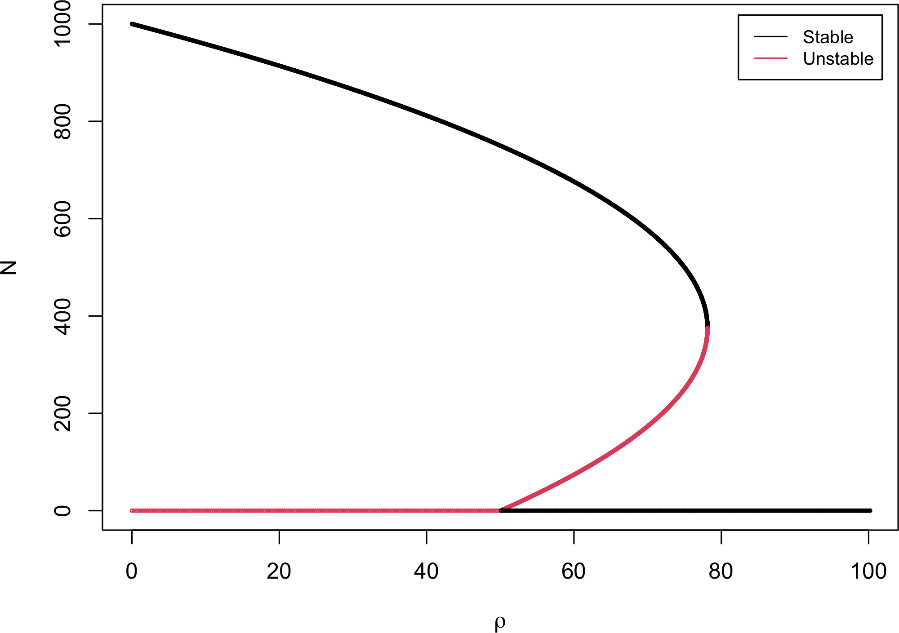

These exercises accompany Part 2. They build on the ODE integrators of
[Part 2B](02b-numerical-integration.qmd), the gene-circuit models of
[Part 2A](02a-modeling-gene-circuits.qmd), and the bifurcation methods of Parts
[2E](02e-bifurcation.qmd) and [2F](02f-bifurcation-curves.qmd). Work in whichever
language you prefer; the R and Python integrators from the earlier chapters carry
over.

## 2G.1 Adams-Bashforth method

The Adams-Bashforth method is a two-step scheme for integrating a single-variable
ODE for $N(t)$. Each iteration uses two known points, $(t_n, N_n)$ and
$(t_{n+1}, N_{n+1})$, to compute $(t_{n+2}, N_{n+2})$:

$$ N_{n+2} = N_{n+1} + \frac{3}{2} h\, f(t_{n+1}, N_{n+1}) - \frac{1}{2} h\, f(t_n, N_n) , $$

where $h = \Delta t$ is the step size. Starting from the initial condition $N_0$,
take one Euler step to obtain $N_1$, then apply the Adams-Bashforth formula
iteratively for $N_2, N_3, \dots$.

**(a)** Prove the Adams-Bashforth method and show that it is second-order (its
local error is $O(\Delta t^3)$). You will need Taylor expansion (of one- and
two-variable functions) and the total-derivative formula

$$ \frac{df(X, t)}{dt} = \frac{\partial f}{\partial t} + \frac{\partial f}{\partial X}\frac{dX}{dt} . $$

**(b)** Give pseudocode for the Adams-Bashforth method.

**(c)** Implement the Adams-Bashforth method. Use one of the ODE integrators from
[Part 2B](02b-numerical-integration.qmd) as a template, adapting it into a
function for this method.

**(d)** Use the exponential-growth model as a test case. Apply the method and
compare the simulation with the exact analytical solution. Varying the step size,
compute:

  (1) the root-mean-square deviation (RMSD) between the simulation and the exact
  solution, and

  (2) the CPU time for each step size (for example with `microbenchmark` in R or
  `timeit` in Python).

## 2G.2 Fourth-order Runge-Kutta

[Part 2B](02b-numerical-integration.qmd) (Section 2B.6) gives a more accurate
integrator, the fourth-order Runge-Kutta method (RK4). Prove the method and
determine its order of accuracy in terms of $O(\Delta t)$.

## 2G.3 Hysteresis

Consider a circuit with one self-activating gene,

$$ \frac{dX}{dt} = 10 + 45\frac{X^4}{X^4 + 200^4} - kX . $$

Here we explore **hysteresis**, where the system's state depends on its history.

**(1)** With an integrator of your choice (e.g. RK4), simulate the dynamics while
gradually increasing $k$ from 0.1 to 0.2 over a duration $t_{tot} = 1000$,
starting from the steady state at $k = 0.1$. Plot $X(t)$. *Hint:* use a derivative
function $f(X, t) = 10 + 45\frac{X^4}{X^4 + 200^4} - kX$ with
$k = 0.1 + 0.1\,t/t_{tot}$.

**(2)** Simulate the same circuit while gradually decreasing $k$ from 0.2 to 0.1
over $t_{tot} = 1000$, starting from the steady state at $k = 0.2$. Plot $X(t)$.
*Hint:* adapt the derivative function for uniformly decreasing $k$.

**(3)** Plot $X(k)$ for the two trajectories together with the bifurcation diagram
from [Part 2E](02e-bifurcation.qmd) or [Part 2F](02f-bifurcation-curves.qmd).
Briefly describe what you observe.

## 2G.4 Another bifurcation

Consider a gene-circuit model related to the one in
[Part 2E](02e-bifurcation.qmd),

$$ \frac{dX}{dt} = f(X, g) = 10 + g\frac{X^4}{X^4 + 200^4} - 0.15\,X , $$

where $g$ is the control parameter, ranging over $(0, 100)$. Plot the bifurcation
diagram of the steady-state $X$ as a function of $g$, using any method from
[Part 2E](02e-bifurcation.qmd) or [Part 2F](02f-bifurcation-curves.qmd).

## 2G.5 The Spruce Budworm model

The spruce budworm, an insect of the spruce-fir forests of the USA and Canada,
usually stays at low population levels, but intermittent surges cause severe
forest damage. In isolation its intrinsic growth follows the logistic model;
predation by birds adds a second term, giving

$$ \frac{dN}{dt} = rN\left(1 - \frac{N}{K}\right) - \frac{\rho N}{N + A} . $$

Use growth rate $r = 0.2$, carrying capacity $K = 1000$, and predation
half-saturation $A = 250$.

**(1) Model implementation.** Define a function for the derivative of the
Spruce Budworm model, taking the parameters $r$, $K$, $A$, $\rho$ as arguments
(and $t$, $N$ as inputs, so it works with the RK4 integrator from
[Part 2B](02b-numerical-integration.qmd), available in both R and Python).

**(2) Multistability.** Assess the multistability by sampling different initial
conditions $N(t=0)$ and simulating for a fixed duration $t_{total} = 100$. Explore
three cases: **(a)** $\rho = 40$, **(b)** $\rho = 70$, **(c)** $\rho = 100$. From
your simulations, conclude how many steady states there are and their stability.

**(3) Bifurcation diagram.** Explore the bifurcation diagram by varying the
predation parameter $\rho$ from 0 to 100. Plot the steady-state $N$ against $\rho$
and mark the stable and unstable branches. Aim for a diagram like the one below;
you may use any numerical method from Parts 2E and 2F.

{width=70% fig-align="center"}

**(4) Parameter-varying dynamics.** Now let $\rho$ oscillate in time as a
sinusoid rather than staying constant. The code below generates such a $\rho(t)$
signal (oscillation period 50, mean 60, amplitude 20).

### R implementation {.impl}

```{r}
rho_oscillation <- function(t, period, rho_mean, rho_amp) {
  rho_mean + rho_amp * sin(t / period)
}

period <- 50; rho_mean <- 60; rho_amp <- 20
t_all <- seq(0, 1000)
rho_all <- rho_oscillation(t_all, period, rho_mean, rho_amp)
plot(t_all, rho_all, type = "l", col = 2, xlab = "t", ylab = "rho")
```

### Python implementation {.impl}

```{python}
import numpy as np
import matplotlib.pyplot as plt

def rho_oscillation(t, period, rho_mean, rho_amp):
    return rho_mean + rho_amp * np.sin(t / period)

period, rho_mean, rho_amp = 50, 60, 20
t_all = np.arange(0, 1001)
rho_all = rho_oscillation(t_all, period, rho_mean, rho_amp)
plt.plot(t_all, rho_all, color="red")
plt.xlabel("t"); plt.ylabel("rho")
plt.show()
```

Now write a new derivative function that treats $\rho$ as this oscillatory
signal. Pick an initial population (e.g. $N_0 = 100$), vary the oscillation
period, and for each simulate the ODE for a long duration (e.g.
$t_{total} = 1000$). Explore how the dynamics change. *Hint:* in the derivative
function, first compute $\rho$ for the current $t$, then use it to evaluate the
derivative.
