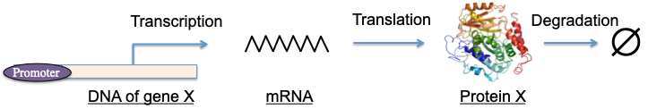
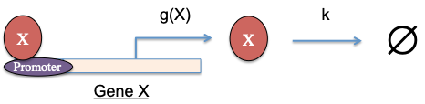

```{r setup, include=FALSE}
knitr::opts_chunk$set(echo = TRUE)
```

We will start to introduce numerical methods in the context of particular real-world applications. In each section, we will introduce the background of an application, available quantitative methods, and related numerical methods. For numerical analyses, the focus will be on (1) the theory, (2) their implementation in R, and (3) available R packages/libraries.

# Circuit of a constitutively expressed gene

Consider a gene, whose expression is independent of any regulator. The whole transcription process, including gene translation and protein degradation, can be described by the following diagram.

<center> {width=75%} </center>
<br/>

Here, the promoter of the gene $X$ does not play a role in this process. The symbol $\varnothing$ means “null”, *i.e.*, a protein $X$ is destroyed in the degradation step. Now, we consider a simplified model, in which the transcription and translation steps are described together by a single zero-order reaction with transcription rate $g$.

While the degradation step is described by a first-order reaction with degradation rate $k$. The corresponding chemical equation for this model is

\begin{equation}
\varnothing {\stackrel{g}{\rightarrow}} X {\stackrel{k}{\rightarrow}} \varnothing
\end{equation}

The rate equation of the level of gene $X$ is:

\begin{equation}
\frac{dX}{dt} = g - kX \tag{1}
\end{equation}

This is a typical ordinary differential equation (ODE). In math, the steady state of $X$, $X_s$, should satisfy the following condition:

\begin{equation}
\frac{dX}{dt} = 0
\end{equation}

Therefore,

\begin{equation}
X_s = \frac{g}{k} \tag{2}
\end{equation}

It is also possible to derive $X$ as the function of time, *i.e.*, $X(t)$, for the following initial condition of $X$:

\begin{equation}
X(t=0) = X_0
\end{equation}

To solve this, we define another variable $x$

\begin{equation}
x=X-X_s \tag{3}
\end{equation}

and replace $X$ with $x$ in equation (1). We have

\begin{equation}
\frac{dx}{dt} = - kx \tag{4}
\end{equation}

The solution of equation 4 is:

\begin{equation}
x(t) = c_1 e^{-kt} + c_2  \tag{5}
\end{equation}

$c_1$ and $c_2$ can be determined by the initial condition. From equations (2), (3) and (5), we get

\begin{equation}
X(t) = X_0 + (\frac{g}{k}-X_0) (1-e^{-kt})  \tag{6}
\end{equation}

Let us set $g$ = 50 nM per minute; $k$ = 0.1 per minute. For different initial conditions: $X$ = 300 , 400, 500, 600 , or 700 nM, the level of $X$ as the function of time is

```{r}
ode1 <- function(X0, t) {   # ode1 directly computes X(t)
  g = 50; k = 0.1
  return(X0 + (g/k - X0)*(1-exp(-k*t)))
}

t_all = seq(0,80,0.1)    # time points to plot
X0_all = seq(300,700,100)   # all initial conditions
my_col = seq_len(5) # default colors
my_label = paste0(X0_all, "nM") # generate legend labels based on initial conditions

plot(NULL, xlab="t (Minute)", ylab="X (nM)", xlim=c(0,80), ylim=c(250,750))  # plotting
for(i in seq_len(5)){
  lines(t_all, ode1(X0_all[i], t_all),  col=my_col[i])
}
legend("topright", inset=0.02, title="Initial conditions", legend = my_label,
       col=my_col, lty=1, cex=0.8)
```

In this example, the system has one stable steady state -- irrespective to the choice of the initial condition, the system will always reach to 500nM. In this simple example, analytical solutions can be easily obtained. However, in many other cases analytical solutions are either much harder to get or it is impossible. Instead, it is desirable to compute numerical solutions. We will illustrate numerical methods to integrate ODEs in Part 2B.

# Circuit with a self-activating gene

Now, consider a gene, whose expression is regulated by itself. This is because protein $X$ can bind to its own promoter and change its transcription rate to $g(X)$ as a function of $X$, as shown in the following figure.

<center> {width=60%} </center>
<br/>

Here, $X$ is an activator of itself, typically illustrated in the circuit diagram below.

<center>  </center>
<br/>

$g(X)$ can be described by

\begin{equation}
g(X) = g_0 + g_1 H^{ex}(X)  \tag{7}
\end{equation}

, where $g_0$ is the basal transcription rate (the lowest transcription rate), $g_0+g_1$ is the maximum transcription rate, $H^{ex}(X)$ is the excitatory Hill function with expression

\begin{equation}
H^{ex}(X) \equiv \frac{(X/X_0)^{n_X}}{1+(X/X_0)^{n_X}}  \tag{8}

\end{equation}

, $X_0$ is the threshold level of $X$ and $n^X$ is the Hill coefficient. $H^{ex}$ is nonlinear, with a minimum of 0 when $X=0$ and a maximum of 1 when $X\to\infty$. $H^{ex}$ is commonly used to describe protein interactions, transcription factor-DNA binding, *etc.*. The plot below shows the curves of the excitatory Hill function for different Hill coefficients. 

``` {r}
hill_ex <- function(X,X0,n) {
  a = (X/X0)**n
  return(a/(1+a))
}

X_all = seq(0,3,0.1)
n_all = seq_len(5)
my_col = seq_len(5) 
my_label = paste0(n_all) 

plot(NULL, xlab="X/X0", ylab="Excitatory Hill function", xlim=c(0,3), ylim=c(0,1.05))
for(i in seq_len(5)){
  lines(X_all,hill_ex(X_all,1, n_all[i]), col=my_col[i])
}
legend("bottomright", inset=0.02, title="Hill coefficient", legend = my_label,
       col=my_col, lty=1, cex=0.8)
```

The rate equation for a self-activation gene is:

\begin{equation}
\frac{dX}{dt} = g_0 + g_1H^{ex}(X) - kX \tag{9}
\end{equation}

Finding the analytical solution of Equation (9) is non-trivial. We will discuss its numerical solutions in Part 2C.

# Circuit with a self-inhibiting gene

A third example is a gene $X$, whose expression is inhibited by itself. 

<center>  </center>
<br/>

$g(X)$ can be described by

\begin{equation}
g(X) = g_0 + g_1 H^{inh}(X)  \tag{10}
\end{equation}

$H^{inh}(X)$ is the inhibitory Hill function with expression

\begin{equation}
H^{inh}(X) \equiv \frac{1}{1+(X/X_0)^{n_X}}  \tag{11}
\end{equation}

By definition, $H^{inh}(X) \equiv 1- H^{ex}(X)$.

The plot below shows the curves of the inhibitory Hill function for different Hill coefficients.

``` {r}
hill_inh <- function(X,X0,n) {
  a = (X/X0)**n
  return(1/(1+a))
}

plot(NULL, xlab="X/X0", ylab="Inhibitory Hill function", xlim=c(0,3), ylim=c(0,1.05))
for(i in seq_len(5)){
  lines(X_all,hill_inh(X_all,1, n_all[i]), col=my_col[i])
}
legend("topright", inset=0.02, title="Hill coefficient", legend = my_label,
       col=my_col, lty=1, cex=0.8)
```

In this case, the rate equation is

\begin{equation}
\frac{dX}{dt} = g_0 + g_1H^{inh}(X) - kX \tag{12}
\end{equation}

# Toggle switch circuit

Lastly, we show another gene circuit containing two transcription factors $X$ and $Y$.

<center>  </center>
<br/>

Here, $X$ is an inhibitor of gene $Y$, while $Y$ is an inhibitor of gene $X$. We consider the chemical rate equations of the system for the levels of $X$ and $Y$ as

\begin{equation}
\begin{cases} \frac{dX}{dt} = g_{X0} + g_{X1}\frac{1}{1+(Y/Y_0)^{n_Y}} - k_XX \\
              \frac{dY}{dt} = g_{Y0} + g_{Y1}\frac{1}{1+(X/X_0)^{n_X}} - k_YY \end{cases} \tag{13}
\end{equation}

In this case, the system is described by two coupled ordinary differential equations, the solutions to which are in the form of $X(t)$ and $Y(t)$. As there are two variables $X$ and $Y$, more sophisticated tools are required to understand this type of dynamical systems. We will discuss about it in Part 3. 
