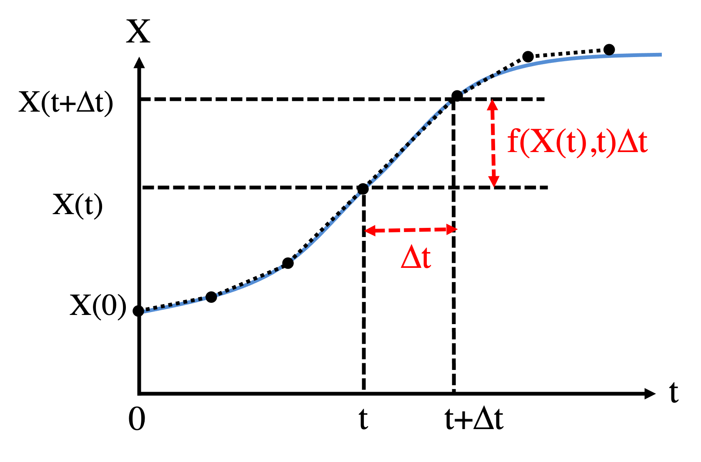
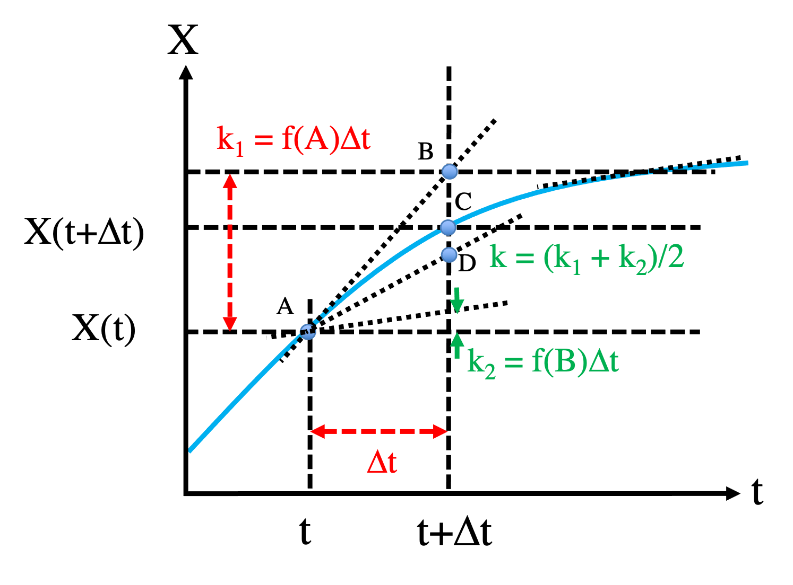

```{r setup, include=FALSE}
knitr::opts_chunk$set(echo = TRUE)
```

In this section, we will introduce numerical methods to solve ODEs in the context of the circuit systems described in the previous section. We will start on the circuit with a constitutively expressed gene:

\begin{equation}
\frac{dX}{dt} = f(x) \equiv g - kX \tag{1}
\end{equation}

# First-order approximation

The Euler method is a first-order method to numerically integrate ODEs. Given the $X$ value at time $t$, we can obtain $X$ value at the next time step $t+\Delta t$ by

\begin{equation}
X(t+\Delta t) = X(t) + f(x)\Delta t \tag{2}
\end{equation}

The plot below illustrates how the Euler method works.

<center>{width=400}</center>
<br>

Therefore, we can start from the initial condition $X(t = 0)$ and iteratively apply equation (2) to compute $X(t)$ for every time step. Here, $\Delta t$ is the time step size. The smaller the $\Delta t$ is, the more accurate the integration by equation (2) would be. However, smaller $\Delta t$ also means that it would take more iterations, thus longer time, to simulate $X$ for a fixed duration of time $t$.

Now, we will show how the Euler method works in R. 

```{r}
ode1 <- function(X0, t) {   # analytical solutions, see Part 2A
  g = 50; k = 0.1
  return(X0 + (g/k - X0)*(1-exp(-k*t)))
}
t_all = seq(0,80,0.1)    # time points to plot

dX <- function(t, X) { # define derivative function, equation (1)
  return(50 - 0.1*X)
}

# Euler_single is a generic function of Euler method for a single ODE 
Euler_single <- function(derivs, X0, t.total, dt){
  # derivs: the function of the derivatives 
  # X0: initial condition
  # t.total: total simulation time, assuming t starts from 0 at the beginning
  # dt: time step size 
  t_all = seq(0, t.total, by=dt)
  n_all = length(t_all)
  X_all = numeric(n_all)
  X_all[1] = X0
  for (i in 1:(n_all-1)) {
    X_all[i+1] = X_all[i] + dt * derivs(t_all[i],X_all[i])
  }
  return(cbind(t_all, X_all))   # the output is a matrix of t & X(t) for all time steps
}

results1 = Euler_single(dX, 300, 80, 1)
results2 = Euler_single(dX, 300, 80, 0.1)

plot(t_all, ode1(300, t_all), type = "l", col=2,
    xlab="t (Minute)", ylab="X (nM)", xlim=c(0,80), ylim=c(300,500)) 
lines(results1[,1], results1[,2],  col=3)
lines(results2[,1], results2[,2],  col=4)
legend("bottomright", inset=0.02, title="Time dynamics", 
       legend = c("Analytical", "Euler: dt=1", "Euler: dt=0.1"),
       col=2:4, lty=1, cex=0.8)

plot(t_all, ode1(300, t_all), type = "l", col=2,
    xlab="t (Minute)", ylab="X (nM)", xlim=c(10,14), ylim=c(425,450)) 
lines(results1[,1], results1[,2],  col=3)
lines(results2[,1], results2[,2],  col=4)
```

In this example, when time step size $\Delta t$ is 0.1, Euler method gives a very nice approximation to the analytical solution of $X(t)$. When $\Delta t$ is 1, there are some significant differences when $t$ is around 10. Here, the blue and red curves are very close to each other.

# Accuracy
Given a small $\Delta t$, we can express $X(t+\Delta t)$ by Taylor expansion

\begin{equation}
X(t+\Delta t) = X(t) + \frac{dX}{dt}\Delta t + O(\Delta t^2) \tag{3}
\end{equation}

Here, the term $O(\Delta t^2)$ summarizes the least significant term of the above expression, as $\Delta t \rightarrow 0$. In other word, it gives the error of the expansion. From equations (1) and (3), we will directly obtain the formula of Euler method in equation (2). Thus, the error of Euler method is at the level of $O(\Delta t^2)$. The same approach can also be applied to estimate the errors of different numerical methods.

# Code efficiency

There are existing packages, such as deSolve, to perform numerical integration in R. Below shows the implementation of the same system for two different time step sizes 1 and 0.1. The outcomes is exactly same as those from our own implementation above.

```{r}
library(deSolve)  # a general ode solver
dy_deSolve <- function(t, y, parms) { # modified derivative function for deSolve
  return(list(50 - 0.1*y))
}
t_all_3 = seq(0, 80, 1)
results3 = ode(y = 300, times = t_all_3, func = dy_deSolve, parms = NULL, method = "euler")
t_all_4 = seq(0, 80, 0.1)
results4 = ode(y = 300, times = t_all_4, func = dy_deSolve, parms = NULL, method = "euler")
plot(results3[,1], results3[,2], type = "l", col=2,
    xlab="t (Minute)", ylab="X (nM)", xlim=c(0,80), ylim=c(300,500)) 
lines(results4[,1], results4[,2],  col=3)

legend("bottomright", inset=0.02, title="Time dynamics", 
       legend = c("Euler by deSolve: dt=1", "Euler by deSolve: dt=0.1"),
       col=2:4, lty=1, cex=0.8)
```

We can also make a simple Fortran implementation of the same ODE problem as below. The function is provided in the file "extra/src/sub_ode_1g.f90". 

```
function derivs_1g(t, x)
  implicit none
  double precision :: derivs_1g
  double precision,intent(in) :: t, x
  double precision ::  g = (50.d0), k = (0.1d0)
  
  derivs_1g = g - k * x
  
end function derivs_1g

subroutine ode_1g_euler(x0,dt,nsteps,results)
  implicit none
  integer, intent(in) :: nsteps
  double precision, intent(in) :: x0, dt
  double precision, dimension(2, nsteps), intent(out) :: results
  double precision :: derivs_1g
  integer :: i, n
  double precision ::  t, x
  
  t = 0.d0
  x = x0
  do i = 1, nsteps
    t = t + dt
    x = x + derivs_1g(t, x) * dt
    results(1,i) = t
    results(2,i) = x
  enddo
  
end subroutine ode_1g_euler

```

The above Fortran function uses a simple iteration and no array/matrix during the integration. The matrix "results" is only used for outputs and plotting. If the detailed time trajectory is not required, I would recommend not saving (t, x) for every step, which will further improve the code. 
We compile the .f90 file with gfortran. 

```
gfortran -fpic -shared extra/src/sub_ode_1g.f90 -o extra/src/sub_ode_1g.so
```

Load the shared library, thus we can then use the Fortran function in R. As shown below, it works fine.

```{r}
dyn.load("extra/src/sub_ode_1g.so")
dt = 0.1
t_total = 80.0
X0 = 300.0
nsteps = as.integer(t_total/dt)
res = matrix(data = 0, nrow=2, ncol=nsteps)
results5 = .Fortran("ode_1g_euler",as.double(X0),as.double(dt), as.integer(nsteps), res)
a = rbind(c(0.,X0),t(results5[[4]]))
plot(a[,1], a[,2], type = "l", xlab="t (Minute)", ylab="X (nM)")
```

Now, let's compare the performance of the three approaches. We use the same system again, but reduce the time step size to 0.01. In many real applications, one may need to perform longer simulations, therefore larger t_total. The benchmark shows that our own code is slightly faster than the deSolve package. This could be because deSolve uses list to save the results in each step, which is slow in this case. In both our own code and deSolve, an array of time steps is generated in R as the input. The time steps array is repeatedly processed in R during the integration -- this can be extremely slow. The Fortran code is about one order of magnitude faster than the R codes. That's because: (1) the derivative function is hard coded in this example (deSolve can also take derivative functions from compiled languages, like C or Fortran; in this example, the derivative function is in R); (2) although a large result matrix is also created for the Fortran function, it is actually never used during the integration. But the matrix is only used to save the outcome; (3) Fortran program is compiled.

```{r}
library(microbenchmark)  # use microbenchmark library for timing
X0 = 300
dt = 0.01
t_total = 80.0
my_benchmark = microbenchmark(euler_ours = Euler_single(dX, X0, t_total, dt),
               euler_desolve = {t_all = seq(0,t_total,dt); ode(y = X0, times = t_all, func = dy_deSolve, parms = NULL, method = "euler")},
               euler_fortran = {nsteps = as.integer(t_total/dt); res = matrix(data=0, nrow=2, ncol=nsteps);outcomes = .Fortran("ode_1g_euler",as.double(X0),as.double(dt), as.integer(nsteps), res);rbind(c(0.,X0),t(outcomes[[4]]))},
               times = 10, unit = "s")  
microbenchmark:::autoplot.microbenchmark(my_benchmark)
```

# Second order approximation

In the Euler method, the derivative is approximated as a constant for the interval $t \rightarrow t+\Delta t$. It usually works well when $\Delta t$ is small and the derivative function is "steady". Otherwise, higher order approximation is required. 

Here, we introduce the second order Runge-Kutta method (also called Heun's method), as illustrated in the following Figure.

<center>{width=600}</center>
<br>

To integrate $f(X)$, we start from point A: $(X(t), t)$. When using the Euler method, we will get point B: $(X(t)+f(x,t)\Delta t, t+\Delta t)$ in the next time step. Apparently, B is still away from the actual point C on the $X(t)$ curve. To address this, we compute the derivative for point B: $f(X(t)+f(x,t)\Delta t, t+\Delta t)$ and then find the average of the two slopes. So finally, we will reach point D, which in many cases is closer to C than B. 

In math,

\begin{equation}
\begin{aligned}
k_1 &= f(X(t),t) \Delta t \\
X_B &= X(t) + k_1 \\
k_2 &= f(X_B, t + \Delta t) \Delta t \\
X(t+\Delta t) &= X(t) + \frac{k_1 + k_2}{2}
\end{aligned}
\end{equation}

We can show that the error of the algorithm is $O(\Delta t^3)$. By Taylor expansion, we have

\begin{equation}
\begin{aligned}
X(t + \Delta t) &= X(t) + \frac{X(t)}{dt}\Delta t + \frac{1}{2}\frac{d^2X(t)}{dt^2}\Delta t^2 + O(\Delta t^3)\\
&= X(t) + f(X,t)\Delta t+ \frac{1}{2}\frac{df(X,t)}{dt}\Delta t^2 + O(\Delta t^3)
\end{aligned} \tag{1}
\end{equation}

Because

\begin{equation}
\begin{aligned}
\frac{df}{dt} &= \frac{\partial f}{\partial t} + \frac{\partial f}{\partial X}\frac{dX}{dt} \\
&= \frac{\partial f}{\partial t} + f\frac{\partial f}{\partial X}
\end{aligned} \tag{2}
\end{equation}

And,

\begin{equation}
\begin{aligned}
k_2 &= f(X+f(X)\Delta t, t + \Delta t) \Delta t \\
&= f(X,t) \Delta t + \frac{\partial f(X,t)}{\partial X}f(X)\Delta t^2 + \frac{\partial f(X,t)}{\partial t}\Delta t^2 + O(\Delta t^3)
\end{aligned} \tag{3}
\end{equation}

From equations (1) - (3), we find

\begin{equation}
\begin{aligned}
\frac{k_1 + k_2}{2} &= f(X,t)\Delta t+ \frac{1}{2}\frac{df(X,t)}{dt}\Delta t^2 + O(\Delta t^3) \\
&= X(t + \Delta t) - X(t) + O(\Delta t^3)
\end{aligned}
\end{equation}

Below is the implementation of the second order Runge-Kutta algorithm (RK2) in R. 

```{r}
# 2nd order Runge-Kutta (RK2)
RK2 <- function(derivs, X0, t.total, dt){
  # derivs: the function of the derivatives 
  # X0: initial condition
  # t.total: total simulation time, assuming t starts from 0 at the beginning
  # dt: time step size 
  t_all = seq(0, t.total, by=dt)
  n_all = length(t_all)
  X_all = numeric(n_all)
  X_all[1] = X0
  for (i in 1:(n_all-1)) {
    k1 = dt * derivs(t_all[i],X_all[i])
    xb = X_all[i] + k1
    k2 = dt * derivs(t_all[i+1],xb)
    X_all[i+1] = X_all[i] + (k1+k2)/2
  }
  return(cbind(t_all, X_all))   # the output is a matrix of t & X(t) for all time steps
}
```

# Fourth order Runge-Kutta method (RK4)

A more commonly used numerical integrator is the fourth order Runge-Kutta (RK4). It has accuracy of the order of O(\Delta t^5). We give the method below, but leave the derivation and accuracy analysis as an exercise. 

\begin{equation}
\begin{aligned}
k_1 &= f(X,t) \Delta t \\
k_2 &= f(X + \frac{k_1}{2}, t + \frac{\Delta t}{2}) \Delta t \\
k_3 &= f(X + \frac{k_2}{2}, t + \frac{\Delta t}{2}) \Delta t \\
k_4 &= f(X + k_3, t + \Delta t) \Delta t \\
X(t+\Delta t) &= X(t) + \frac{k_1 + 2k_2 + 2k_3 + k_4}{6}
\end{aligned}
\end{equation}

```{r}
# 4th order Runge-Kutta (RK4)
RK4 <- function(derivs, X0, t.total, dt){
  # derivs: the function of the derivatives 
  # X0: initial condition
  # t.total: total simulation time, assuming t starts from 0 at the beginning
  # dt: time step size 
  t_all = seq(0, t.total, by=dt)
  n_all = length(t_all)
  X_all = numeric(n_all)
  X_all[1] = X0
  for (i in 1:(n_all-1)) {
    t_0= t_all[i]
    t_0.5 = t_0 + 0.5*dt
    t_1 = t_0 + dt
    k1 = dt * derivs(t_0,X_all[i])
    k2 = dt * derivs(t_0.5,X_all[i] + k1/2)
    k3 = dt * derivs(t_0.5,X_all[i] + k2/2)
    k4 = dt * derivs(t_1,X_all[i] + k3)
    X_all[i+1] = X_all[i] + (k1+2*k2+2*k3+k4)/6
  }
  return(cbind(t_all, X_all))   # the output is a matrix of t & X(t) for all time steps
}
```

Next, we numerically evaluate the errors of different numerical integrators for different time step sizes. We introduce a term called root mean square deviation (RMSD) to quantify the differences of $X(t)$ between the exact solutions and the simulations, or in math 

$$d_{RMSD}(X_1, X_2) = \sqrt{\frac{\sum_{i=1}^{n} [X_1(t_i)-X_2(t_i)]^2}{n}}$$

``` {r}
# Root Mean Square deviation (RMSD)
rmsd <- function(array1, array2) {
  num = length(array1)
  diff = array1 - array2
  return(sqrt(diff %*% diff/num))
}

# Comparison
dt_all = seq(0.1,1,0.1)
errors_Euler = array(0,dim=length(dt_all))
errors_RK2 = array(0,dim=length(dt_all))
errors_RK4 = array(0,dim=length(dt_all))

ind = 0
for(dt in dt_all){
  t_all = seq(0,80,dt)    # time points to compute
  
  results_ode = ode1(300,t_all) # ode1 is defined above -- exact solutions
  results_RK2 = RK2(dX, 300, 80, dt) # dX is defined above,  dX/dt = g - k * X
  results_RK4 = RK4(dX, 300, 80, dt) 
  results_Euler = Euler_single(dX, 300, 80, dt)   #Euler_single is defined above
  
  ind = ind + 1
  errors_RK2[ind] = rmsd(results_ode, results_RK2[,2])
  errors_RK4[ind] = rmsd(results_ode, results_RK4[,2])
  errors_Euler[ind] = rmsd(results_ode, results_Euler[,2])
  errors_RK2[ind];errors_Euler[ind]
}

plot(dt_all, errors_RK2, type = "p", col = 2, 
     log="y", xlab ="dt (Minute)", ylab = "RMSD", xlim = c(0,1), ylim = c(10**(-10), 10))
points(dt_all, errors_RK4, col = 3)
points(dt_all, errors_Euler, col = 4)

legend("bottomright", inset=0.02, title="Errors", 
       legend = c("RK2", "RK4", "Euler"),
       col=2:4, pch=1, cex=0.8)
```

The above comparison demonstrates that RK4 can be a few orders of magnitude more accurate than RK2, while RK2 is a few orders of magnitude more accurate than the Euler method. RK4 requires four derivative evaluations for each step; RK2 requires two; the Euler method just one. However, compared to the Euler method, RK4 or RK2 can use much larger time step size without sacrificing the accuracy, therefore more efficient overall. In the shared library ("extra/src/sub_ode_1g.so"), we also provide the Fortran functions for RK2 and RK4. 

```{r}
## compare RK4 from Fortran with RK4, RK2 and Euler implementations in R and the exact solution.
dt = 0.1
t_total = 80.0
X0 = 300.0
nsteps = as.integer(t_total/dt)
res = matrix(data = 0, nrow=2, ncol=nsteps)
results6 = .Fortran("ode_1g_rk4",as.double(X0),as.double(dt), as.integer(nsteps), res)
a = rbind(c(0.,X0),t(results6[[4]]))
results7 = RK4(dX, 300, 80, 0.1) 
results8 = RK2(dX, 300, 80, 0.1) 
results9 = Euler_single(dX, 300, 80, 0.1)
results10 = ode1(300,seq(0,t_total,dt)) # exact solutions
rmsd(a[,2], results7[,2])  # Compare RK4 in Fortran with RK4 in R
rmsd(a[,2], results8[,2])  # Compare RK4 in Fortran with RK2 in R
rmsd(a[,2], results9[,2])  # Compare RK4 in Fortran with Euler in R
rmsd(a[,2], results10)  # Compare RK4 in Fortran with the exact solution
```