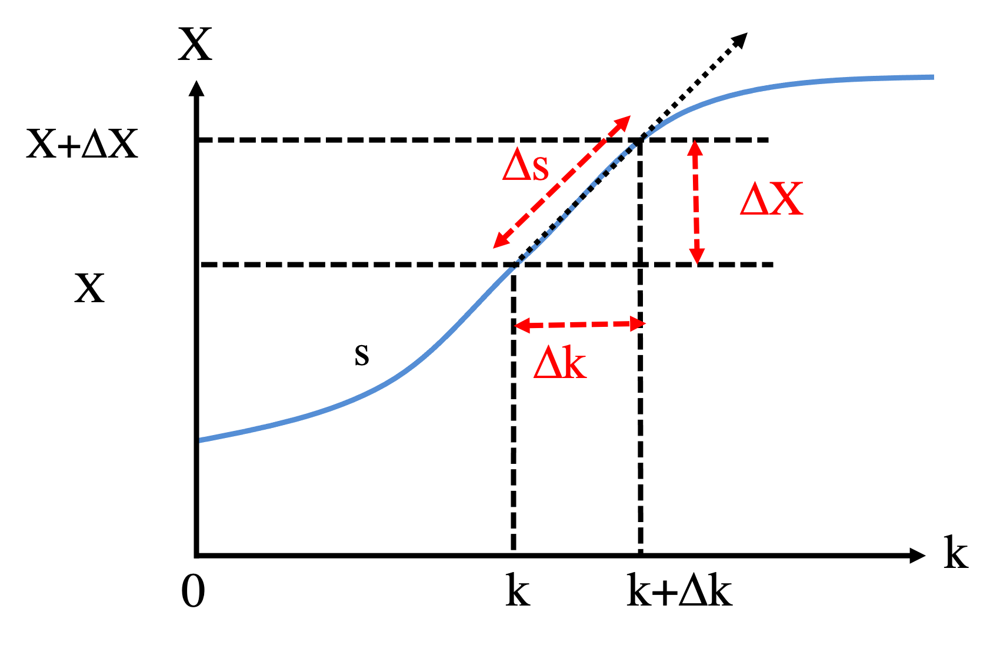

```{r setup, include=FALSE}
knitr::opts_chunk$set(echo = TRUE)
```


# Intro
Let us continue our discussion on the circuit of one self-activating gene (Equations 7 - 8 in Part 2A). When we vary the values of $k$, as we learned from Part 2C, the circuit can have either one steady state (monostable) or three steady states (bistable as there are two stable states). To get a more complete picture of the system, we consider $k$ as a control parameter, and plot the curve of steady states $X_s$ as the function of $k$. This is called 1-dimensional bifurcation diagram. Let us discuss how we obtain such as curve numerically. We consider the following rate equation with $X$ as the state variable and $k$ as the control parameter.

\begin{equation}
\frac{dX}{dt} = f(X,k) = 10 + 45\frac{X^4}{X^4+200^4} - kX \tag{1}
\end{equation}

``` {r}
derivs_k <- function(X, k) {
  return(10 + 45 * (1- 1/(1+(X/200)**4)) - k*X)
}
```

# Direct method: find all roots
The most straightforward way is to uniformly sample $k$ values and, for each $k$, identify all roots $X_s$ for $f(X,k)=0$. The following shows an implementation of such method using an R package rootSolve. We also check stability of steady states according to $\frac{df}{dX}$. It works very well for this example. However, it may fail in some situations, as finding all roots for a nonlinear function s not guaranteed. Compared to other methods, this method should be slower but more stable.

``` {r}
library(rootSolve)
dx = 0.1  # used to estimate the derivatives of f(X) near the steady states
k_all = as.list(seq(0.1,0.2, by = 0.001))    # k to sample
results = lapply(k_all, function(k) {     # use lapply, instead of for loop
  roots = uniroot.all(derivs_k, k = k, interval = c(0, 800)) # find all roots 
  return(cbind(rep(k, each=length(roots)),  # result matrix: k
               roots,    # roots
               -sign(derivs_k(X = roots+dx, k = k))))   # 1: stable; 2: unstable
})
results = do.call(rbind, results)   # rbind all result matrices for all ks

plot(results[,1], results[,2], type = "p", pch = 1, cex = 0.3, col= (3 - results[,3])/2,
    xlab=parse(text="k (Minute^{-1})"), ylab="Xs (nM)", xlim=c(0.09, 0.21), ylim=c(0,600)) 
legend("topright", inset=0.02, legend = c("Stable", "Unstable"), col=1:2, lty=1, cex=0.8)
```

The bifurcation curve clearly shows how the dynamical behavior of the circuit changes with respect to the changes in $k$. There are two turning points of the bifurcation curve. The first one is at around $k = 0.125$, where one of the stable steady states and the unstable steady state has very close $X$ values. The second one is at around $k = 0.170$. These two points are called bifurcation points. The system is monostable when $k$ is smaller than the $k$ value of the first bifurcation point. In this regime, the $X$ steady state level is relatively high. When $k$ is between the $k$ vlaues of the two bifurcation points, the system is bistable, with two stable steady states of both high and low $X$ levels. When $k$ is higher than the $k$ value of the second bifurcation point, the system becomes monostable again, with one stable steady state of relatively low $X$ level. This type of bifurcation is called saddle-node bifurcation.

# Method 2: Get bifurcation curve by simulations
The second method does not require to solve all roots of $f(X,k)$. Instead, we will utilize the properties of steady states to map all steady states for different $k$. We will start with $k = 0.1$ and simulate the ODE using a random initial condition. Once we reach the steady state, we will recrod $k$ and $X$. Then, we will increase $k$ by a small step $\Delta k$ and simulate the ODE again with the previous steady state as the initial condition. We will repeat the process until we reach a bifurcation point. This can be determined when the new steady state $X_s$ is very different (compared to previous changes) or nonexistent (that could happen when we compute the unstable state, see below) from the steady state of the previous $k$. At this point, we will start another cycle by decreasing $k$ instead. To reach the unstable steady state, we will simulate a modified ODE:

$$ \frac{dX}{dt} = -f(X,k) \tag{2}$$
This trick allows us to obtain the unstable steady state from ODE simulations, as the unstable state becomes stable state using equation (2). We will repeat the same procedure, until we reach the maximum $k = 0.2$. Below shows the implementation.

``` {r}
derivs_k_deSolve <- function(t, X, k) {   # the derivative function should be in the deSolve format
  return(list(10 + 45 * (1- 1/(1+(X/200)**4)) - k*X))
}
derivs_k_deSolve_minus <- function(t, X, k) {   #  dX/dt = - f(X)
  return(list(-(10 + 45 * (1- 1/(1+(X/200)**4)) - k*X)))
}

search_bifurcation <- function(para_start, para_range, init, d_para, forward = TRUE, if_stable = TRUE) {
  
  if(forward){
    para_all = seq(para_start, para_range[2], by = d_para)
  } else {
    para_all = seq(para_start, para_range[1], by = -d_para)
  }
  
  if(if_stable) {
    df <- function(t, X, k) derivs_k_deSolve(t, X, k)
  }else {
    df <- function(t, X, k) derivs_k_deSolve_minus(t, X, k)
  }
  
  #### two model parameters for this example
  gap = 100.0     # the stop criterion for bifurcation point: when Delta X changes more than gap when k increases a little, the system undergo catastrophe.
  t_max = 1000.0   # max simulation time
  
  results = matrix(NA, nrow = length(para_all), ncol = 2)
  X_init = init
  ind = 0
  for (k in para_all) {
    X_new = runsteady(y=X_init, time = c(0, t_max), func=df, parms=k)$y 
    if((ind != 0) & (abs(X_new - X_init) > gap)){
      break
    }else{
      ind = ind + 1
      results[ind,] = c(k, X_new)
      X_init = X_new
    }
  }
  return(na.omit(results))
}

### below we search for the three segments of bifurcation curve. This can be further automated. 
dk = 0.001
k_range = c(0.1, 0.2)
results1 = search_bifurcation(0.1, k_range, 0, dk, T, T)
k_next = tail(results1,1)[1]
X_init_next = tail(results1,1)[2]
results2 = search_bifurcation(k_next, k_range, X_init_next , dk, F, F)
k_next = tail(results2,1)[1]
X_init_next = tail(results2,1)[2]
results3 = search_bifurcation(k_next, k_range, X_init_next , dk, T, T)

plot(NULL, xlab=parse(text="k (Minute^{-1})"), ylab="Xs (nM)", xlim=c(0.09, 0.21), ylim=c(0,600))
points(results1[,1], results1[,2], pch = 1, cex = 0.3, col = 1)
points(results3[,1], results3[,2], pch = 1, cex = 0.3, col = 1)
points(results2[,1], results2[,2], pch = 1, cex = 0.3, col = 2)
legend("topright", inset=0.02, legend = c("Stable", "Unstable"), col=1:2, lty=1, cex=0.8)
```

The implementation is quite tedious but illustrates well the concept behind it. It can potentially find all solutions. However, like many numerical methods, it is challenging to devise a robust function to find bifurcation diagrams for a generic system. In particular, the choice of the numerical parameters (gap & t_max) would affect the performance of the method. (Try to adjust these parameters, and evaluate the outcomes.)

# Method 3: numerical continuation

The most widely used and generally applicable method is numerical continuation. Our goal is to find $X(k)$ to satisfy 

$$ f(X, k) = 0 $$
Take partial derivatives with respect to $X$ and $k$, we get

$$ \frac{\partial f}{\partial X}\Delta X + \frac{\partial f}{\partial k}\Delta k = 0 $$
Thus,

$$ \frac{dX}{dk} \equiv h(X,k) = -\frac{\frac{\partial f}{\partial k}}{\frac{\partial f}{\partial X}} \tag{2}$$
The expression is defined as a function h, which will be used later. Therefore, starting from a steady state $X$ for a specific $k$, we can obtain the slop of the bifurcation curve $\frac{dX}{dk}$ from equation (2). This allows us to find the initial guess of the next ($k$, $X$) point. 

\begin{equation}
\begin{cases} k_{new} = k + \Delta k \\
              X_{new} = X +  \frac{dX}{dk}\Delta k  \end{cases} \tag{3}
\end{equation}

We can then use a correction method, such as Newton's method, to find the nearby solution. For Netwon's method, we solve $f(X) = 0$ starting from an initial guess at $X_0$. Let us denote the solution $X = X_S$,

$$f(X_0 + \Delta X) = f(X_0) + f'(X_0)\Delta X = 0$$

Thus,

$$\Delta X = - \frac{f(X_0)}{f'(X_0)} \tag{4}$$
Numerically, we perform the following calculation iteratively:

$$ X_{n+1} = X_n - \frac{f(X_n)}{f'(X_n)} $$
, until $|f(X_{n+1})|<\epsilon$, where $\epsilon$ is a small constant. Below shows the implementation of Newton's method for the current system. It will be used as the correction method for numerical continuation.


``` {r}
dfdX <- function(X, k){    
    x_frac = (X/200)**4
    return( 180 /X * x_frac/(1+x_frac)**2 - k)
}

find_root_Newton <- function(X, func, dfunc, parms, X_range, error = 10^-3) {
  while(abs(func(X, parms)) > error){
    f = func(X, parms)
    X = X - f/dfunc(X, parms)
    if((X-X_range[1])*(X-X_range[2]) > 0) break;  # a check to avoid infinite loop, no debug steps are provided here for simplification
  }
  return(X)
}

find_root_Newton(500, derivs_k, dfdX, 0.1, c(0, 800))   # monostable, one root
find_root_Newton(500, derivs_k, dfdX, 0.15, c(0, 800))   # bistable, first root near 500
find_root_Newton(100, derivs_k, dfdX, 0.15, c(0, 800))  # another root near 100
find_root_Newton(150, derivs_k, dfdX, 0.15, c(0, 800))  # the last root (unstable) near 150
```

Now, we implement the numerical continuation method by uniformly varying $k$. 
``` {r}
# partial derivatives of f, see equation (1) for the expression of f 
dfdk <- function(X, k) return(-X)
#dfdX see the above code block

X_init = 0
k_range = c(0.1, 0.2)
dk = 0.001
nmax_cycle = (k_range[2] - k_range[1])/dk + 1

results = matrix(NA, nrow = nmax_cycle, ncol = 3)
cycle = 1
k = 0.1
X_new = runsteady(y=X_init,func=derivs_k_deSolve, parms=k)$y  # initial X from ODE simulation
results[cycle,] = c(k, X_new, -sign(dfdX(X_new, k)))
while((k - k_range[1]) * (k - k_range[2]) <= 0) {   # check if k is in the range of [k_min, k_max]
  slope = -dfdk(X_new, k)/dfdX(X_new, k)  # directly compute the slope of the bifurcation curve
  # in this implementation, slope can be infinity near a bifurcation point
  k = k + dk
  X_init = X_new + dk * slope
  
  X_new = find_root_Newton(X=X_init, func=derivs_k, dfunc=dfdX, parms=k, X_range = c(0, 800)) # root from Newton's method
#  X_new = runsteady(y=X_init,func=derivs_k_deSolve, parms=k)$y  # an alternative way: root from ODE simulation
  cycle = cycle + 1

  results[cycle,] = c(k, X_new, -sign(dfdX(X_new, k)))
}

plot(NULL, xlab=parse(text="k (Minute^{-1})"), ylab="Xs (nM)", xlim=c(0.09, 0.21), ylim=c(0,600))
points(results[,1], results[,2], pch = 1, cex = 0.3, col = 1)
legend("topright", inset=0.02, legend = c("Stable", "Unstable"), col=1:2, lty=1, cex=0.8)
```

We can see that the algorithm works very well until it reaches to a bifurcation point, where the slope is infinity. It is also a little bit cumbersome to control the direction to move (the same slope can corresponds to two different directions). Thus, we only get a part of the bifurcation curve. 

To improve the method, we describe the bifurcation curve as the function of arc length $s$, instead of the control parameter $k$. Previously we aim to find $X(k)$, but here we will find $X(s)$ and $k(s)$.

<center> {width=50%} </center>
<br/>

\begin{equation}
  \Delta s^2 = \Delta k^2 + \Delta X^2 \\
  \Delta X = h \Delta k
\end{equation}

Therefore, we get


\begin{equation}
\begin{cases} \Delta k = \pm \frac{1}{\sqrt{1 + h^2}} \Delta s \\
              \Delta X = h \Delta k \end{cases} \tag{5}
\end{equation}

,where $h(X,k) = \frac{dX}{dk}$ can be computed according to equation (2). In this case, even when $h$ is infinity, $\Delta k$ and $\Delta X$ are small enough. The choice of $\pm$ in equation (5) would depend on which direction we want to go. Here, we set $(\Delta k, \Delta X)$ to be in the same direction as that in the previous step.

``` {r}
X_init = 0
k_range = c(0.1, 0.2)
ds = 0.3    # step size for the arc length
nmax_cycle = 10000

results = matrix(NA, nrow = nmax_cycle, ncol = 3)
cycle = 1
k = 0.1
step_k_previous = 1   # initial step_k is positive
step_X_previous = 0
X_new = runsteady(y=X_init,func=derivs_k_deSolve, parms=k)$y  # initial X from ODE simulation
results[cycle,] = c(k, X_new, -sign(dfdX(X_new, k)))
while(((k - k_range[1]) * (k - k_range[2]) <= 0) & (cycle < nmax_cycle)) {
  h = -dfdk(X_new, k)/dfdX(X_new, k)  
  
  step_k = ds/sqrt(1+h**2)
  step_X = step_k*h
  
  if(step_k_previous * step_k + step_X_previous * step_X < 0) {  # the direction of change should be the same along the search
    step_k = - step_k
    step_X = - step_X
  }
  step_k_previous = step_k
  step_X_previous = step_X
  
  k = k + step_k
  X_init = X_new + step_X
  
 X_new = find_root_Newton(X=X_init, func=derivs_k, dfunc=dfdX, parms=k, X_range = c(0, 800)) # root from Newton's method
  
  cycle = cycle + 1
  results[cycle,] = c(k, X_new, -sign(dfdX(X_new, k)))
}
results = na.omit(results)

plot(NULL, xlab=parse(text="k (Minute^{-1})"), ylab="Xs (nM)", xlim=c(0.09, 0.21), ylim=c(0,600))
points(results[,1], results[,2], pch = 1, cex = 0.3, col = (3-results[,3])/2)
legend("topright", inset=0.02, legend = c("Stable", "Unstable"), col=1:2, lty=1, cex=0.8)

```

The above implementation works great in this example. However, it may suffer from the divergent issue of Newton's method when the system is near a bifurcation point. In such cases, $f'(X)$ is close to zero. There are methods to alleviate this issue, *.e.g.*, [Halley's method](https://en.wikipedia.org/wiki/Halley%27s_method).

