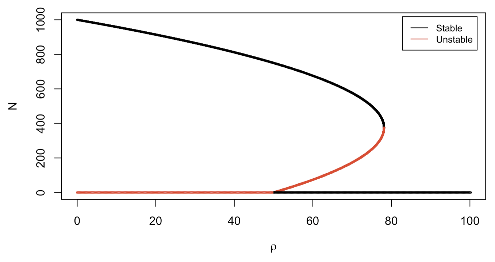

```{r setup, include=FALSE}
knitr::opts_chunk$set(echo = TRUE)
```

# 1. Adams-Bashforth Method

The Adams-Bashforth Method is a two-step technique designed for the integration of a single-variable Ordinary Differential Equation (ODE) of $N(t)$. At each iteration, the method requires knowledge of two data points, represented as ($t_n$, $N_n$) and ($t_{n+1}$, $N_{n+1}$), to compute ($t_{n+2}$, $N_{n+2}$).

The iterative formula of the Adams-Bashforth Method is expressed as follows:

\begin{equation}
N_{n+2} = N_{n+1} + \frac{3}{2}hf(t_{n+1}, N_{n+1}) - \frac{1}{2}hf(t_n, N_n) 
\end{equation}

$h = \Delta t$ is the time step size. Starting from the initial condition $N_0$, we initiate the process by employing the Euler method for a single step to obtain the next point $N_1$. Subsequently, the Adams-Bashforth method is applied iteratively to compute $N_2$, $N_3$, *etc*.

**(a)** Proof the Adams-Bashforth method and show that it is second order (,which means that its accuracy is at $O(\Delta t^3)$. You will need to use Taylor expansion (for a one-variable function and a two-variable function) and the formula of a total derivative:

$$\frac{df(X,t)}{dt} = \frac{\partial f}{\partial t} + \frac{\partial f}{\partial X}\frac{dX}{dt} $$
**(b)** Provide a pseudocode for the Adams-Bashforth method.

**(c)** Implement the Adams-Bashforth method. Utilize an existing ODE integrator from numericalR as a template, modifying the code to define a function for the Adams-Bashforth method.

**(d)** Employ the exponential growth model as an example. Apply the Adams-Bashforth method and compare the ODE simulation with the exact solution obtained through analytical calculation. To assess performance, vary time step sizes and compute:

  (1). The Root Mean Square Deviation (RMSD) between the simulation and the exact solution.
  
  (2). The CPU time cost for the method for different time step sizes, for instance, utilizing microbenchmark in R or timeit in Python)
  
# 2. Fourth order Runge-Kutta 

In part 2B Equation (8), we show a more accurate numerical integrator of ODEs: the fourth order Runge-Kutta method, or RK4. Please proof the method and calculate its accuracy in terms of $O(\Delta t)$

# 3. Hysteresis

Consider a gene circuit with one self-activating gene, described by the following ODE. 

$$\frac{dX}{dt} = 10 + 45\frac{X^4}{X^4+200^4} - kX$$

In this problem, we will explore a phenomenon called hysteresis, where the system's behavior depends on its history.

**(1)** Simulate, with an ODE integrator of your choice (*e.g.*, RK4), the gene expression dynamics of the circuit by gradually increasing $k$ from 0.1 to 0.2 for a duration of $t_{tot} = 1000$, starting from the steady state when $k = 0.1$. Plot X(t). *Hint:* to simulate the circuit with uniformly increasing $k$, you can define the derivative function $f(X, t) =  10 + 45\frac{X^4}{X^4+200^4} - kX$, where $k = 0.1 + 0.1*t/t_{tot}$. 

**(2)** Simulate the gene expression dynamics of the same circuit by gradually decreasing $k$ from 0.2 to 0.1 for a duration of $t_{tot} = 1000$, starting from the steady state when $k = 0.2$. Plot X(t). *Hint:* think what to do for the simulation with uniformly decreasing $k$.

**(3)** Plot $X(k)$ for the above two time trajectories together with the bifurcation diagram obtained from Part 02E. Briefly describe your observations.

# 4. Another bifurcation 

We consider a gene circuit model related to the one discussed in Part 02E, described by the following ODE.

\begin{equation}
\frac{dX}{dt} = f(X,g) = 10 + g\frac{X^4}{X^4+200^4} - 0.15X 
\end{equation}

Here, $g$ is the control parameter in the range of (0, 100). Plot the bifurcation diagram of the steady-state $X$ as the function of the control parameter $g$. 

# 5. The Spruce Budworm model 

The spruce budworm, an insect inhabiting spruce-fir forests in the USA and Canada, typically maintains low population levels. However, there are intermittent surges in budworm populations that inflict significant damage on the forests. If we consider the intrinsic growth of budworm populations in isolation, they adhere to the logistic growth model. An additional factor in the dynamics of budworm involves predation by birds. Consequently, we can characterize the dynamics of the budworm using the following equation.

$$ \frac{dN}{dt} = rN(1-\frac{N}{K}) - \frac{\rho N}{N+A}$$
We choose the following parameters: growth rate $r = 0.2$, carrying capability $K=1000$, and half saturation population of predation $A = 250$. Explore the bifurcation diagram of the spruce budworm population ($N$) by varying the predation parameter $\rho$. From the bifurcation plot, identify regions of stability, bifurcation points, and the emergence of different population dynamics. 

Hint: see if you can obtain this following bifurcation diagram.

<center> {width=70%} </center>
<br/>
