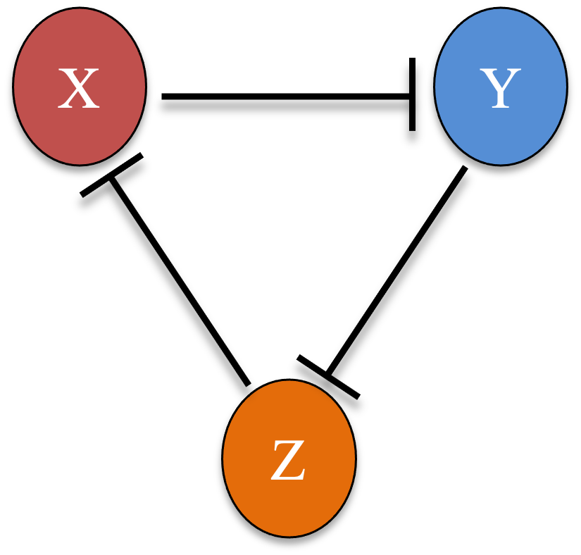

The phase-plane tools of Part 3 extend naturally to circuits with more than two
genes. This chapter works through four systems of growing size: a two-gene
negative-feedback loop that spirals, the two-gene toggle switch, a three-gene
repressilator that oscillates on a limit cycle, and a fifty-species ecological
model. The same generic RK4 integrator handles all of them; only the derivative
function changes.

## 3H.1 RK4 for any number of components

The `RK4_generic` routine from [Part 3A](03a-nullclines.qmd) already works for any
number of variables: it only requires that the derivative function return a vector
the same length as the state `X0`. Nothing about the integrator itself is
two-dimensional.

### R implementation {.impl}

```{r}
# generic multi-variable RK4 (same as Part 3A)
RK4_generic <- function(derivs, X0, t.total, dt, ...) {
  t_all <- seq(0, t.total, by = dt); n_all <- length(t_all)
  X_all <- matrix(0, n_all, length(X0)); X_all[1, ] <- X0
  for (i in 1:(n_all - 1)) {
    t0 <- t_all[i]
    k1 <- dt * derivs(t0,          X_all[i, ],          ...)
    k2 <- dt * derivs(t0 + dt / 2, X_all[i, ] + k1 / 2, ...)
    k3 <- dt * derivs(t0 + dt / 2, X_all[i, ] + k2 / 2, ...)
    k4 <- dt * derivs(t0 + dt,     X_all[i, ] + k3,     ...)
    X_all[i + 1, ] <- X_all[i, ] + (k1 + 2 * k2 + 2 * k3 + k4) / 6
  }
  cbind(t_all, X_all)
}
```

### Python implementation {.impl}

```{python}
import numpy as np
import matplotlib.pyplot as plt

# generic multi-variable RK4 (same as Part 3A)
def RK4_generic(derivs, X0, t_total, dt, **kw):
    t_all = np.arange(0, t_total + dt, dt); n = len(t_all)
    X_all = np.zeros((n, len(X0))); X_all[0] = X0
    for i in range(n - 1):
        t0 = t_all[i]
        k1 = dt * np.array(derivs(t0,          X_all[i],          **kw))
        k2 = dt * np.array(derivs(t0 + dt / 2, X_all[i] + k1 / 2, **kw))
        k3 = dt * np.array(derivs(t0 + dt / 2, X_all[i] + k2 / 2, **kw))
        k4 = dt * np.array(derivs(t0 + dt,     X_all[i] + k3,     **kw))
        X_all[i + 1] = X_all[i] + (k1 + 2 * k2 + 2 * k3 + k4) / 6
    return np.column_stack((t_all, X_all))
```

## 3H.2 A two-gene negative-feedback loop

Here $X$ activates $Y$ and $Y$ represses $X$, a negative-feedback loop.

{width=30% fig-align="center"}

After nondimensionalization the dynamics are

\begin{equation}
\begin{cases}
\dfrac{dx}{dt} = \dfrac{g}{1 + y^3} - x \\[2mm]
\dfrac{dy}{dt} = \dfrac{h x^3}{1 + x^3} - y
\end{cases} \tag{1}
\end{equation}

with maximum production rates $g$ and $h$. We set $g = h = 10$. Drawing the unit
vector field and overlaying trajectories from ten random starts shows every
trajectory spiraling inward to a single steady state: the negative feedback
produces damped oscillations.

### R implementation {.impl}

```{r}
#| fig-width: 5
#| fig-height: 5
#| out-width: "55%"
#| message: false
library(ggplot2)
derivs_neg <- function(t, Xs, g, h) {
  x <- Xs[1]; y <- Xs[2]
  c(g / (1 + y^3) - x, h * x^3 / (1 + x^3) - y)
}

g <- 10; h <- 10
grid <- expand.grid(X = seq(0, 3, 0.3), Y = seq(0, 5, 0.5))
vfu <- t(apply(grid, 1, function(Xs) {
  v <- derivs_neg(0, Xs, g, h); c(Xs, v / sqrt(sum(v^2)))
}))
vfu <- as.data.frame(vfu); colnames(vfu) <- c("X", "Y", "dX", "dY")
p1 <- ggplot(vfu, aes(X, Y)) +
  geom_segment(aes(xend = X + 0.2 * dX, yend = Y + 0.2 * dY),
               arrow = arrow(length = unit(0.05, "in")))
p1
```

```{r}
#| fig-width: 5
#| fig-height: 5
#| out-width: "55%"
set.seed(77)
X_init_all <- matrix(runif(20, 0, 2), ncol = 2)   # 10 random initial conditions
for (i in seq_len(nrow(X_init_all))) {
  r <- as.data.frame(RK4_generic(derivs_neg, X_init_all[i, ], 100, 0.01, g = g, h = h))
  colnames(r) <- c("t", "X", "Y")
  p1 <- p1 + geom_path(data = r, aes(X, Y), colour = i + 1, linewidth = 1)
}
p1
```

### Python implementation {.impl}

```{python}
#| fig-width: 5
#| fig-height: 5
#| out-width: "55%"
def derivs_neg(t, Xs, g, h):
    x, y = Xs
    return [g / (1 + y**3) - x, h * x**3 / (1 + x**3) - y]

g, h = 10, 10
X_ax = np.arange(0, 3.1, 0.3); Y_ax = np.arange(0, 5.1, 0.5)
grid = np.array(np.meshgrid(X_ax, Y_ax)).T.reshape(-1, 2)
for X, Y in grid:
    v = np.array(derivs_neg(0, (X, Y), g, h)); v = 0.2 * v / np.sqrt(v @ v)
    plt.arrow(X, Y, v[0], v[1], head_width=0.06, ec="black")
plt.xlabel("X"); plt.ylabel("Y")
plt.xlim(0, 3); plt.ylim(0, 5); plt.show()
```

```{python}
#| fig-width: 5
#| fig-height: 5
#| out-width: "55%"
for X, Y in grid:                                 # redraw the vector field
    v = np.array(derivs_neg(0, (X, Y), g, h)); v = 0.2 * v / np.sqrt(v @ v)
    plt.arrow(X, Y, v[0], v[1], head_width=0.06, ec="black")

np.random.seed(77)
for X0 in np.random.uniform(0, 2, (10, 2)):       # 10 random initial conditions
    r = RK4_generic(derivs_neg, X0, 100, 0.01, g=g, h=h)
    plt.plot(r[:, 1], r[:, 2], lw=1)
plt.xlabel("X"); plt.ylabel("Y")
plt.xlim(0, 3); plt.ylim(0, 5); plt.show()
```

## 3H.3 A reusable phase-plane function

The two steps just used, drawing the unit vector field and overlaying a few
simulated trajectories, recur for every 2D system, so it pays to package them into
one function. The routine below takes a derivative function and plotting ranges
and returns the combined phase portrait; extra parameters are forwarded to the
derivative function.

### R implementation {.impl}

```{r}
#| message: false
plot_phase_plane <- function(func, xrange, yrange, ngrids = 11, vscale = 1,
                             rseed = 77, nsim = 5, xrange_init, yrange_init,
                             dt = 0.01, t.total = 100, linewidth = 1, ...) {
  X_all <- seq(xrange[1], xrange[2], length.out = ngrids)
  Y_all <- seq(yrange[1], yrange[2], length.out = ngrids)
  vfu <- t(apply(expand.grid(X = X_all, Y = Y_all), 1, function(Xs) {
    v <- func(0, Xs, ...); c(Xs, v / sqrt(sum(v^2)))
  }))
  vfu <- as.data.frame(vfu); colnames(vfu) <- c("X", "Y", "dX", "dY")
  p <- ggplot(vfu, aes(X, Y)) +
    geom_segment(aes(xend = X + vscale * dX, yend = Y + vscale * dY),
                 arrow = arrow(length = unit(0.05, "in"))) +
    coord_fixed(xlim = xrange, ylim = yrange)

  set.seed(rseed)
  X_init_all <- cbind(runif(nsim, xrange_init[1], xrange_init[2]),
                      runif(nsim, yrange_init[1], yrange_init[2]))
  for (i in seq_len(nsim)) {
    r <- as.data.frame(RK4_generic(func, X_init_all[i, ], t.total, dt, ...))
    colnames(r) <- c("t", "X", "Y")
    p <- p + geom_path(data = r, aes(X, Y), colour = i + 1, linewidth = linewidth)
  }
  p
}
```

### Python implementation {.impl}

```{python}
def plot_phase_plane(func, xrange, yrange, ngrids=11, vscale=1, rseed=77, nsim=5,
                     xrange_init=(0, 1), yrange_init=(0, 1), dt=0.01, t_total=100, **kw):
    X_ax = np.linspace(xrange[0], xrange[1], ngrids)
    Y_ax = np.linspace(yrange[0], yrange[1], ngrids)
    grid = np.array(np.meshgrid(X_ax, Y_ax)).T.reshape(-1, 2)
    head = (xrange[1] - xrange[0]) / 80
    for X, Y in grid:
        v = np.array(func(0, (X, Y), **kw)); v = vscale * v / np.sqrt(v @ v)
        plt.arrow(X, Y, v[0], v[1], head_width=head, ec="black")

    np.random.seed(rseed)
    for _ in range(nsim):
        X0 = [np.random.uniform(*xrange_init), np.random.uniform(*yrange_init)]
        r = RK4_generic(func, X0, t_total, dt, **kw)
        plt.plot(r[:, 1], r[:, 2], lw=1)
    plt.gca().set_aspect("equal"); plt.xlabel("X"); plt.ylabel("Y")
    plt.xlim(xrange); plt.ylim(yrange); plt.show()
```

## 3H.4 The toggle switch (double-negative feedback)

The toggle switch of [Part 3A](03a-nullclines.qmd) has $X$ and $Y$ repressing each
other, a double-negative loop.

{width=38% fig-align="center"}

Its nondimensionalized form is

\begin{equation}
\begin{cases}
\dfrac{dx}{dt} = \dfrac{g}{1 + y^3} - x \\[2mm]
\dfrac{dy}{dt} = \dfrac{h}{1 + x^3} - y
\end{cases} \tag{2}
\end{equation}

With $g = h = 5$, the reusable function draws the whole phase portrait in one
call. The trajectories separate into two basins and settle on the two stable
states, the bistability we analyzed before.

### R implementation {.impl}

```{r}
#| fig-width: 5
#| fig-height: 5
#| out-width: "55%"
#| message: false
derivs_ts <- function(t, Xs, g, h) {
  x <- Xs[1]; y <- Xs[2]
  c(g / (1 + y^3) - x, h / (1 + x^3) - y)
}
plot_phase_plane(derivs_ts, xrange = c(0, 6), yrange = c(0, 6), ngrids = 11,
                 vscale = 0.3, nsim = 10, xrange_init = c(0, 5), yrange_init = c(0, 5),
                 g = 5, h = 5)
```

### Python implementation {.impl}

```{python}
#| fig-width: 5
#| fig-height: 5
#| out-width: "55%"
def derivs_ts(t, Xs, g, h):
    x, y = Xs
    return [g / (1 + y**3) - x, h / (1 + x**3) - y]

plot_phase_plane(derivs_ts, (0, 6), (0, 6), ngrids=11, vscale=0.3, nsim=10,
                 xrange_init=(0, 5), yrange_init=(0, 5), g=5, h=5)
```

## 3H.5 A three-gene repressilator

A repressilator is a ring of three repressions: $X$ represses $Y$, $Y$ represses
$Z$, and $Z$ represses $X$ [@elowitz2000repressilator].

{width=28% fig-align="center"}

\begin{equation}
\begin{cases}
\dfrac{dx}{dt} = \dfrac{g}{1 + z^3} - x \\[2mm]
\dfrac{dy}{dt} = \dfrac{h}{1 + x^3} - y \\[2mm]
\dfrac{dz}{dt} = \dfrac{l}{1 + y^3} - z
\end{cases} \tag{3}
\end{equation}

This is a three-variable system, so we project it onto the $(X, Y)$ plane. For the
background vector field we compute $(dX/dt, dY/dt)$ at each grid point assuming
$Z$ is at its quasi-steady state $dZ/dt = 0$, i.e. $z = l/(1 + y^3)$. The
trajectories, in contrast, are simulated with the full three-variable system and
then projected. With $g = h = l = 5$ the trajectories converge to a closed loop, a
**limit cycle**: the repressilator is a genetic oscillator.

### R implementation {.impl}

```{r}
#| fig-width: 5
#| fig-height: 5
#| out-width: "55%"
#| message: false
# full 3-variable repressilator
derivs_rep <- function(t, Xs, g) {
  x <- Xs[1]; y <- Xs[2]; z <- Xs[3]
  c(g[1] / (1 + z^3) - x, g[2] / (1 + x^3) - y, g[3] / (1 + y^3) - z)
}
# projection to (X, Y) with Z at quasi-steady state (dZ/dt = 0)
derivs_rep_xy <- function(t, Xs, g) {
  x <- Xs[1]; y <- Xs[2]; z <- g[3] / (1 + y^3)
  c(g[1] / (1 + z^3) - x, g[2] / (1 + x^3) - y)
}

g <- c(5, 5, 5)
grid <- expand.grid(X = seq(0, 4, 0.4), Y = seq(0, 4, 0.4))
vfu <- t(apply(grid, 1, function(Xs) {
  v <- derivs_rep_xy(0, Xs, g); c(Xs, v / sqrt(sum(v^2)))
}))
vfu <- as.data.frame(vfu); colnames(vfu) <- c("X", "Y", "dX", "dY")
p1 <- ggplot(vfu, aes(X, Y)) +
  geom_segment(aes(xend = X + 0.3 * dX, yend = Y + 0.3 * dY),
               arrow = arrow(length = unit(0.05, "in"))) +
  coord_fixed()

set.seed(71)
X_init_all <- matrix(runif(12, 0, 4), ncol = 3)   # 4 random 3D initial conditions
for (i in seq_len(nrow(X_init_all))) {
  r <- as.data.frame(RK4_generic(derivs_rep, X_init_all[i, ], 50, 0.01, g = g))
  colnames(r) <- c("t", "X", "Y", "Z")
  p1 <- p1 + geom_path(data = r, aes(X, Y), colour = i + 1, linewidth = 0.5)
}
p1
```

### Python implementation {.impl}

```{python}
#| fig-width: 5
#| fig-height: 5
#| out-width: "55%"
# full 3-variable repressilator
def derivs_rep(t, Xs, g):
    x, y, z = Xs
    return [g[0] / (1 + z**3) - x, g[1] / (1 + x**3) - y, g[2] / (1 + y**3) - z]
# projection to (X, Y) with Z at quasi-steady state (dZ/dt = 0)
def derivs_rep_xy(t, Xs, g):
    x, y = Xs; z = g[2] / (1 + y**3)
    return [g[0] / (1 + z**3) - x, g[1] / (1 + x**3) - y]

g = np.array([5, 5, 5])
X_ax = np.arange(0, 4.1, 0.4); Y_ax = np.arange(0, 4.1, 0.4)
grid = np.array(np.meshgrid(X_ax, Y_ax)).T.reshape(-1, 2)
for X, Y in grid:
    v = np.array(derivs_rep_xy(0, (X, Y), g)); v = 0.3 * v / np.sqrt(v @ v)
    plt.arrow(X, Y, v[0], v[1], head_width=0.05, ec="black")

np.random.seed(71)
for X0 in np.random.uniform(0, 4, (4, 3)):        # 4 random 3D initial conditions
    r = RK4_generic(derivs_rep, X0, 50, 0.01, g=g)
    plt.plot(r[:, 1], r[:, 2], lw=0.5)
plt.gca().set_aspect("equal"); plt.xlabel("X"); plt.ylabel("Y")
plt.xlim(0, 4); plt.ylim(0, 4); plt.show()
```

## 3H.6 A many-component system

Nothing limits the integrator to a handful of variables. As a large example we
take a generalized Lotka-Volterra model of $S$ interacting bacterial species,
following @hu2022emergent,

$$ \frac{dN_i}{dt} = N_i\Big(1 - \sum_{j=1}^{S} a_{ij} N_j\Big) + D , $$

where $N_i$ is the abundance of species $i$, $a_{ij}$ is the inhibition of $i$ by
$j$, and $D = 10^{-6}$ is a small dispersal (immigration) rate. The self-terms are
$a_{ii} = 1$, and the off-diagonal $a_{ij}$ are drawn uniformly from $(0, 2a)$,
where $a$ is the mean interaction strength. Sweeping $a$ moves the community
between qualitatively different regimes: at weak interaction it settles to stable
coexistence, and at strong interaction it never settles, fluctuating persistently.

### R implementation {.impl}

```{r}
#| warning: false
derivs_many <- function(t, Xs, A, D) Xs - Xs * (A %*% Xs) + D

sim <- function(S, a, D, t.total = 1000) {
  A <- matrix(runif(S * S, 0, 2 * a), nrow = S); diag(A) <- 1
  X0 <- rep(0.1, S)
  results <- RK4_generic(derivs_many, X0, t.total, 0.01, A = A, D = D)
  plot(NULL, xlab = "t", ylab = "N", xlim = c(1, t.total), ylim = c(1e-6, 1), log = "xy")
  for (i in seq_len(S)) lines(results[, 1], results[, i + 1], col = i)
}

set.seed(3)
S <- 50; D <- 1e-6
sim(S, a = 0.08, D)   # weak interaction: stable coexistence
```

```{r}
#| warning: false
sim(S, a = 0.16, D)   # intermediate interaction
```

```{r}
#| warning: false
sim(S, a = 0.64, D)   # strong interaction: persistent fluctuations
```

### Python implementation {.impl}

```{python}
#| warning: false
def derivs_many(t, Xs, A, D):
    return Xs - Xs * (A @ Xs) + D

def sim(S, a, D, t_total=1000):
    A = np.random.uniform(0, 2 * a, (S, S)); np.fill_diagonal(A, 1)
    X0 = np.full(S, 0.1)
    results = RK4_generic(derivs_many, X0, t_total, 0.01, A=A, D=D)
    for i in range(S):
        plt.plot(results[:, 0], results[:, i + 1])
    plt.xscale("log"); plt.yscale("log"); plt.xlabel("t"); plt.ylabel("N")
    plt.xlim(1, t_total); plt.ylim(1e-6, 1); plt.show()

np.random.seed(3)
S, D = 50, 1e-6
sim(S, a=0.08, D=D)   # weak interaction: stable coexistence
```

```{python}
#| warning: false
sim(S, a=0.16, D=D)   # intermediate interaction
```

```{python}
#| warning: false
sim(S, a=0.64, D=D)   # strong interaction: persistent fluctuations
```

The three runs illustrate the "emergent phases" of @hu2022emergent: as the mean
interaction strength grows, a diverse community that would otherwise settle into a
fixed composition instead keeps rearranging, with species abundances rising and
falling indefinitely. The R and Python runs use independent random interaction
matrices, so the individual traces differ, but the qualitative shift from stable
coexistence to persistent fluctuations is the same.
