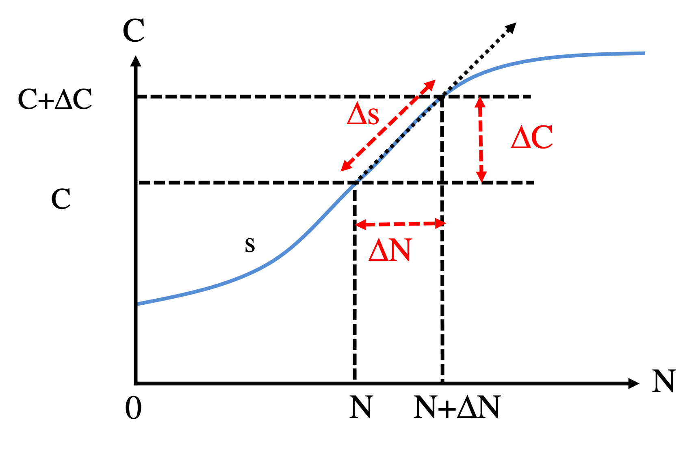

```{r setup, include=FALSE}
knitr::opts_chunk$set(echo = TRUE)
```

In this section, we will illustrate the use of the theory of nonlinear dynamical systems and phase plane analysis to model bacterial growth in a lab environment. The system is described by the classic chemostat model.

# Chemostat model

Here, we choose to start with the dimensionless version of the model:

\begin{equation}
\begin{cases} \frac{dN}{dt} = f(N,C) = \alpha_1 (\frac{C}{C+1}) N - N \\
              \frac{dC}{dt} = g(N,C) = -(\frac{C}{C+1}) N - C + \alpha_2  \tag{1} \end{cases}
\end{equation}

To find the steady states of the model, we set:

\begin{equation}
\begin{cases} \frac{dN}{dt} = 0 \\
              \frac{dC}{dt} = 0 \end{cases}
\end{equation}

We can find the there are two steady states

$$\bar{X_1} = (0, \alpha_2)$$

and

$$\bar{X_2} = (\alpha_1(\alpha_2 - \frac{1}{\alpha_1 - 1}), \frac{1}{\alpha_1 - 1}) \tag {2}$$
Here, to ensure that both $\bar{X_1}$ and $\bar{X_2}$ have positive coordinates, we need $\alpha_1 > 1$ and $\alpha_2 >  \frac{1}{\alpha_1 - 1}$.

# ODE simulation

We first define the derivative function. Here, we allow $\alpha_1$ and $\alpha_2$ as two explicit parameters.

``` {r}
derivs_chemostat <- function(t, Xs, alpha1, alpha2) { # derivatives of the dimensionless chemostat model
  N = Xs[1]
  C = Xs[2]
  mm_kinetics = N * C/(1+C)
  dNdt = alpha1 * mm_kinetics - N 
  dCdt = -mm_kinetics - C + alpha2
  return(c(dNdt, dCdt))
}
```

In this case, we will use the RK4 integrator to simulate the ODEs defined by Equation (1). 

```{r}
# 4th order Runge-Kutta (RK4) for a generic multi-variable system, see Part 3A
RK4_generic <- function(derivs, X0, t.total, dt, ...){
  # derivs: the function of the derivatives 
  # X0: initial condition, a vector of multiple variables
  # t.total: total simulation time, assuming t starts from 0 at the beginning
  # dt: time step size 
  t_all = seq(0, t.total, by=dt)
  n_all = length(t_all)
  nx = length(X0)
  X_all = matrix(0, nrow = n_all, ncol = nx)
  X_all[1,] =  X0
  for (i in 1:(n_all-1)) {
    t_0= t_all[i]
    t_0.5 = t_0 + 0.5*dt
    t_1 = t_0 + dt
    k1 = dt * derivs(t_0,X_all[i,],...)
    k2 = dt * derivs(t_0.5,X_all[i,] + k1/2,...)
    k3 = dt * derivs(t_0.5,X_all[i,] + k2/2,...)
    k4 = dt * derivs(t_1,X_all[i,] + k3,...)
    X_all[i+1,] = X_all[i,] + (k1+2*k2+2*k3+k4)/6
  }
  return(cbind(t_all, X_all))   # the output is a matrix of t & X(t) for all time steps
}
```

We need to specify the values of $\alpha_1$ and $\alpha_2$ to proceed. Here, we pick $\alpha_1 = 2$ and $\alpha_2 = 5$.

If we start the simulation from the initial condition ${X(t = 0)} = (0, 0)$, 

``` {r}
alpha1 = 2.0
alpha2 = 5.0
X0_1 = c(0., 0)  # start from N = 0, C = 0, 
results_chemostat_1 = RK4_generic(derivs = derivs_chemostat, X0 = X0_1, t.total = 20, dt = 0.01, alpha1, alpha2)
plot(results_chemostat_1[,1], results_chemostat_1[,2], type = "l", col=2,
    xlab="t", ylab="Levels", xlim=c(0,20), ylim=c(0,10))
lines(results_chemostat_1[,1], results_chemostat_1[,3], type = "l", col=3)

legend("topleft", inset=0.02, 
       legend = c("N", "C"),
       col=2:3, lty=1, cex=0.8)
```

We found the system reaches to the first steady state $\bar{X_1}$. From the plot, $\bar{X_1} = (0, 5)$.

Now, if we start the simulation from the initial condition ${X(t = 0)} = (0.01, 0)$, 

``` {r}
X0_2 = c(0.01, 0)  # start from small N, C = 0, 
results_chemostat_2 = RK4_generic(derivs = derivs_chemostat, X0 = X0_2, t.total = 20, dt = 0.01, alpha1, alpha2)
plot(results_chemostat_2[,1], results_chemostat_2[,2], type = "l", col=2,
    xlab="t", ylab="Levels", xlim=c(0,20), ylim=c(0,10))
lines(results_chemostat_2[,1], results_chemostat_2[,3], type = "l", col=3)

legend("topleft", inset=0.02, 
       legend = c("N", "C"),
       col=2:3, lty=1, cex=0.8)
```

Even with a small positive value of $N(t = 0)$, we find the system now reaches to the second steady state $\bar{X_2}$. From the plot, $\bar{X_2} = (8, 1)$. 

* **Q1.** Now, repeat the simulations for the initial conditions **(a)** ${X(t = 0)} = \bar{X_1} = (0, 5)$; **(b)** ${X(t = 0)} = (0.01, 5)$, which is slightly away in $N$ from the steady state $\bar{X_1}$; and **(c)** ${X(t = 0)} = (0, 5.01)$, which is slightly away in $C$ from the steady state $\bar{X_1}$.

* **Q2.** Check the dependency of the steady states with respect to different values of $\alpha_1$ and $\alpha_2$, and show that the steady state $\bar{X_2}$ follows the expression of Equation (2).

Now, we can also visualize the time trajectories in the phase plane of $N$ (x-axis) and $C$ (y-axis). 

``` {r, fig.width = 5, fig.height = 5}
plot(NULL, xlab="N", ylab="C", xlim=c(0,10), ylim=c(0,10)) # define the plot without plotting anything here
lines(results_chemostat_1[,2], results_chemostat_1[,3], col = 2) # Plot N in the x-axis, C in the y-axis
lines(results_chemostat_2[,2], results_chemostat_2[,3], col = 3)
legend("topleft", inset=0.02, 
       legend = c("Trajectory 1", "Trajectory 2"),
       col=2:3, lty=1, cex=0.8)
``` 
 
In the above plot, we show the time trajectory starting from (0, 0) (Trajectory 1, colored in red) and the one starting from (0.01, 0) (Trajectory 2, colored in green). In the first case, the system reaches to the first steady state $\bar{X_1}$; while in the second case, the system initially approaches to some space nearby $\bar{X_1}$ but then moves awway from it and ends up at the second steady state $\bar{X_2}$.

# Vector field

Now, we will plot the vector field of the system in the phase plane. In the vector filed, we show arrows for points in the phase plane to represent the direction of changes.

\begin{equation}
\begin{cases} V_N = \frac{dN}{dt}  \\
              V_C = \frac{dC}{dt} \end{cases}
\end{equation}

``` {r,fig.width = 5, fig.height = 5}
library(ggplot2)

N_all = seq(0, 15, by=0.5)   # all N grids
C_all = seq(0, 10, by=0.5)   # all C grids
NC_all = expand.grid(N_all, C_all)   # all combinations of N and C

results = t(apply(NC_all, MARGIN=1, function(Xs) {return(c(Xs, derivs_chemostat(0, Xs, alpha1, alpha2)))})) # generate all vector field data
colnames(results) = c("N", "C", "dN", "dC")

ggplot(data=as.data.frame(results), aes(x=N, y=C)) + 
  geom_segment(aes(xend=N+0.1*dN, yend=C+0.1*dC), arrow = arrow(length = unit(0.05,"in")))

```

We can choose to plot the unit vectors of the vector field to highlight the directions. 

``` {r,fig.width = 5, fig.height = 5}
library(ggplot2)

N_all = seq(0, 15, by=0.5)   # all N grids
C_all = seq(0, 10, by=0.5)   # all C grids
NC_all = expand.grid(N_all, C_all)   # all combinations of N and C

results_unit = t(apply(NC_all, MARGIN=1, function(Xs) {
  v = derivs_chemostat(0, Xs, alpha1, alpha2)
  v_norm = v / sqrt(v[1]**2 + v[2]**2)
  return(c(Xs, v_norm))})) # generate all vector field data 
colnames(results_unit) = c("N", "C", "dN", "dC")

p1 = ggplot(data=as.data.frame(results_unit), aes(x=N, y=C)) + 
  geom_segment(aes(xend=N+0.3*dN, yend=C+0.3*dC), arrow = arrow(length = unit(0.05,"in")))
p1
```

Also, we can show time trajectories and the vector field simultaneously. Here, we show the second trajectory.

``` {r,fig.width = 6, fig.height = 5}
colnames(results_chemostat_2) = c("t", "N", "C")
p1 +
   geom_path(data = as.data.frame(results_chemostat_2), aes(x=N, y=C, colour = "Traj 2"), size=1) 
```

Now, let us randomly pick 10 different initial conditions in the range of (0, 10) for both $N$ and $C$, and plot the simulated trajectories altogether in the phase plane. 

``` {r,fig.width = 6, fig.height = 5}
set.seed(27)   # set the seed for the random number generator, change the seed or remove this line to generate different random initial conditions
X_init_all = array(runif(20, 0, 10), dim = c(10,2)) # generate 10 random initial conditions

t.total = 20
dt  = 0.01

plot(NULL, xlab="t", ylab="Levels", xlim=c(0,20), ylim=c(0,15)) 
for(i in seq_len(nrow(X_init_all))){
  results = RK4_generic(derivs_chemostat, X_init_all[i,], t.total, dt, alpha1, alpha2)
  lines(results[,1], results[,2], col = 2)
  lines(results[,1], results[,3], col = 3)
}
legend("topright", inset=0.02, legend = c("N", "C"),
       col=2:3, lty=1, cex=0.8)
```

``` {r,fig.width = 5, fig.height = 5}
t.total = 20
dt  = 0.01
p2 = p1
for(i in seq_len(nrow(X_init_all))){
  results = RK4_generic(derivs_chemostat, X_init_all[i,], t.total, dt, alpha1, alpha2)
  colnames(results) = c("t", "N", "C")
  p2 = p2 + geom_path(data = as.data.frame(results), aes(x=N, y=C), colour = i, size=1)  # note geom_line() does not work here
}
p2
```

* **Q3.** If we define $Z(t) = N(t) + \alpha_1 C(t) - \alpha_1 \alpha_2$, show that $Z(t) = Z(t = 0) e^{-t}$. Show that $Z(N, C)=0$ corresponds to the line connecting $\bar{X_1}$ and $\bar{X_2}$. Use simulations to evaluate this relationship. This provides a proof that $\bar{X_2}$ is the global attractor of the chemostat model.

# Nullclines

A nullcline corresponds to the steady state condition of one ODE. Thus, there are two nullclines: (1) the N-nullcline satisfying $\frac{dN}{dt} = 0$ and (2) the C-nullcline satisfying $\frac{dC}{dt} = 0$. In the following, we show how to numerically obtain nullclines in different ways.

#### Separation of variables

From Equation (1), we find the N-nullcline satisfies

$$  \alpha_1 (\frac{C}{C+1}) N - N = 0$$
Thus, the N-nullcline has two parts: (1) the line $N(C) = 0$; (2) the line $C(N) = \frac{1}{\alpha_1 - 1}$. Numerically, there is not much difference to treat $N$ as the function of $C$ or $C$ as the function of $N$. We usually would convert lines into a series of 2D points, just like how we obtain the line for time trajectories. Thus, we would represent a nullcline as a matrix of (N, C) points. 

``` {r}
N_all = seq(0, 15, by=0.1)   # all N grids
C_all = seq(0, 10, by=0.1)   # all C grids

nullcline_N_part1 <- function(C_all) {
  num_C = length(C_all)
  part1 = cbind(numeric(num_C), C_all)  # get N = 0, use C grids
  colnames(part1) = c("N", "C")
  return(part1)
}

nullcline_N_part2 <- function(N_all, alpha1) {
  num_N = length(N_all)
  part2 = cbind(N_all, rep(1/(alpha1-1), each = num_N))  # get C = 1/(alpha_1 - 1), use N grids
  colnames(part2) = c("N", "C")
  return(part2)
}

null1_1 = nullcline_N_part1(C_all)
null1_2 = nullcline_N_part2(N_all, alpha1)
```

Similarly, we find the C-nullcline satisfies

$$   -(\frac{C}{C+1}) N - C + \alpha_2 = 0$$
By separation of variables, it is more convenient to obtain $N(C)$:

$$ N(C) = -1-C + \frac{\alpha_2}{C} + \alpha_2 $$

```{r}
nullcline_C <- function(C_all, alpha2) { # get all N values from C grids
  num_C = length(C_all)
  N_all = -1-C_all + alpha2/C_all + alpha2
  part3 = cbind(N_all, C_all) 
  colnames(part3) = c("N", "C")
  return(part3)
}
null2 = nullcline_C(C_all, alpha2)
p1 +
  geom_path(data = as.data.frame(null1_1), aes(x=N, y=C, colour = "dN/dt=0"), size=1) + 
  geom_path(data = as.data.frame(null1_2), aes(x=N, y=C, colour = "dN/dt=0"), size=1) + 
  geom_path(data = as.data.frame(null2), aes(x=N, y=C, colour = "dC/dt=0"), size=1) 
```

The phase plane plot looks "ugly", as the C-nullcline is outside of the defined range. We will trim the C-nullcline and plot it again.

``` {r,fig.width = 6, fig.height = 5}
## We can remove points outside of the N C ranges
ind_keep = which(null2[,1] > -0.5 & null2[,1] < 15.5)     # "loose" the criteria of the boundary to ensure intersections of line segments
null2_keep = null2[ind_keep,]

p1 +
  geom_path(data = as.data.frame(null1_1), aes(x=N, y=C, colour = "dN/dt=0"), size=1) + 
  geom_path(data = as.data.frame(null1_2), aes(x=N, y=C, colour = "dN/dt=0"), size=1) + 
  geom_path(data = as.data.frame(null2_keep), aes(x=N, y=C, colour = "dC/dt=0"), size=1) 

``` 

### Direct method: find all roots

An alternative way to compute a nullcline is by a root finding algorithm. We will compute C-nullcline, which satisfies 

$$g(N, C) = 0$$
We can uniformly sample $N$ values and, for each $N$, identify all roots $C$ for $g(N,C)=0$. The following shows an implementation of such method using an R package rootSolve. It works very well here and in many other situations, even for cases where there are multiple solutions.  However, it may fail in some cases, as finding all roots for a nonlinear function s not guaranteed. Compared to other methods, this method should be slower but more stable.

``` {r,fig.width = 6, fig.height = 5}
library(rootSolve)
derivs_g <- function(N, C, alpha2) { # g(N, C) for C derivative function
  mm_kinetics = N * C/(1+C)
  return( -mm_kinetics - C + alpha2)
}

N_all_list = as.list(seq(0, 15, by=0.1))
results = lapply(N_all_list, function(N) {     # use lapply, instead of for loop
  roots = uniroot.all(derivs_g, N = N, alpha2 = alpha2, interval = c(0, 10)) # find all roots 
  return(cbind(rep(N, each=length(roots)), roots))  # result matrix:  N, C for all roots
})
null2_ver2 = do.call(rbind, results)   # rbind all result matrices for all ks
colnames(null2_ver2) = c("N", "C")

p1 +
  geom_path(data = as.data.frame(null2_ver2), aes(x=N, y=C, colour = "dC/dt=0"), size=1) 

```

* **Q4.** Write a script to implement another way to find C-nullcline: 
(1) We uniformly sample $N$ values and, for each $N$.
(2) We let the system to start from a point ($N$, 0). 
(3) We define a one-variable ODE $\frac{dC}{dt} = g(N, C)$. Here, $N$ is considered as a fixed parameter. 
(4) Now, we simulate the ODE starting from the initial condition ($N$, 0) until it reaches to the steady state $C$ from the simulation. i
(5) We repeat (1) - (4) iteratively to find all ($N$, $C$) values. 

What is the difference between the root finding algorithm and the method using ODE simulation? Which one is more generally applicable?

* **Q5.** Yet, another numerical method to find C-nullcline: 
(1) We start from $(N = 0, C = 0)$.
(2) We define a one-variable ODE $\frac{dC}{dt} = g(N, C)$. Here, $N$ is considered as a fixed parameter. 
(3) We simulate the ODE starting from the predefined initial condition and fix $N$, until the system reaches to the steady state $C$.  
(4) Record $(N, C)$, and make a small change in $N \rightarrow N + \Delta N$. Set $(N + \Delta N, C)$ as the new initial condition.  
(5) We repeat (3) - (4) iteratively, until $N$ reaches to the maximum value (*e.g.*, 15 here). Now, we have found all ($N$, $C$) values

### Contour method

Nullclines can also be obtained by the contour analysis. We will compute C-nullcline, which satisfies 

$$g(N, C) = 0$$
We consider $Z = g(N,C)$ and construct a landscape of a plane of $N$ and $C$, with $Z$ as the height. The nullcline would be the contour line when $Z=0$. This can be easily done with the *contour* function in base R or other plotting packages, such as *geom_contour* from *ggplot2*. In this approach, $Z$ values for all 2D grid points are required to compute the contour. This can be computational intensive when high resolution grid points are needed. The contour method is usually robust, as long as the $Z$ values are smooth enough for interpolation.

``` {r,fig.width = 5, fig.height = 5}
N_all = seq(0, 15, by=0.1)   # all N grids
C_all = seq(0, 10, by=0.1)   # all C grids
nN = length(N_all)
nC = length(C_all)
NC_all = expand.grid(N_all, C_all)   # all combinations of N and C

results = t(apply(NC_all, MARGIN=1, function(Xs) {return(c(Xs, derivs_chemostat(0, Xs, alpha1, alpha2)))})) # generate all vector field data
z_N = array(results[,3], dim = c(nN, nC))
z_C = array(results[,4], dim = c(nN, nC))

contour(N_all, C_all, z_N, levels = 0, col = 2, xlab = "N", ylab = "C", drawlabels = F)
contour(N_all, C_all, z_C, levels = 0, col = 3, add = TRUE, drawlabels = F)
```

The contour algorithm works well to compute the C-nullcline. But only obtain a part of the N-nullcline. In many cases, we assume a nullcline to be a line, instead of two connecting lines (in the case of the N-nullcline).

### Numerical continuation

The most widely used and generally applicable method is numerical continuation. Our goal is to find $C(N)$ to satisfy 

$$ g(N, C) = 0 $$
Take partial derivatives with respect to $N$ and $C$, we get

$$ \frac{\partial g}{\partial N}dN + \frac{\partial g}{\partial C}dC = dg = 0 $$
Thus,

$$ \frac{dC}{dN} \equiv h(N,C) = -\frac{\frac{\partial g}{\partial N}}{\frac{\partial g}{\partial C}} \tag{3}$$
The expression is defined as a function h, which will be used later. Therefore, starting from a steady state ($N$, $C$), we can obtain the slope of the nullcline $\frac{dC}{dN}$ from equation (3). This allows us to find the initial guess of the next ($N$, $C$) point. 

\begin{equation}
\begin{cases} N_{new} = N + \Delta N \\
              C_{new} = C +  \frac{dC}{dN}\Delta N  \end{cases} \tag{4}
\end{equation}

Here shows the implementation of the numerical continuation to compute the C-nullcline.

``` {r,fig.width = 6, fig.height = 5}
# partial derivatives of g
dgdN <- function(N, C, alpha2) return(-C/(1+C))
dgdC <- function(N, C, alpha2) return(-N/(C+1)**2 - 1)

dN = 0.1
nmax_cycle = 15/dN + 1

null2_ver3 = matrix(NA, nrow = nmax_cycle, ncol = 2)
colnames(null2_ver3) = c("N", "C")
## the starting point
cycle = 1
N = 0
C = alpha2
null2_ver3[cycle,] = c(N, C)

while(cycle < nmax_cycle) {   # check if reaching maximum number of cycles
  slope = -dgdN(N, C, alpha2)/dgdC(N, C, alpha2)  # directly compute the slope of the nullcline
  N = N + dN
  C = C + dN * slope
  
  ## you may need a correction method right here to refine (N, C)
  
  cycle = cycle + 1
  null2_ver3[cycle,] = c(N, C)
}

p1 +
  geom_line(data = as.data.frame(null2_ver3), aes(x=N, y=C, colour = "dC/dt=0"), size=1) 

```

In many situations, we also need a correction method, such as Newton's method, to correct the numerical errors when computing the steady states ( solution). For Newton's method, we solve $f(X) = 0$ starting from an initial guess at $X_0$. 

$$f(X_0 + \Delta X) = f(X_0) + f'(X_0)\Delta X = 0$$

Thus,

$$\Delta X = - \frac{f(X_0)}{f'(X_0)}$$
Numerically, we perform the following calculation iteratively:

$$ X_{n+1} = X_n - \frac{f(X_n)}{f'(X_n)} $$
, until $|f(X_{n+1})|<\epsilon$, where $\epsilon$ is a small constant.

This algorithm usually works very well until it reaches to a point, where the slope approaches infinity. It is also a little bit cumbersome to control the direction to move (the same slope can corresponds to two different directions). To improve the method, we describe the nullcline as the function of arc length $s$, instead of the variable $N$. Previously we aim to find $C(N)$, but here we will find $N(s)$ and $C(s)$.

<center> {width=50%} </center>
<br/>

\begin{equation}
  \Delta s^2 = \Delta N^2 + \Delta C^2 \\
  \Delta C = h \Delta N
\end{equation}

Therefore, we get

\begin{equation}
\begin{cases} \Delta N = \pm \frac{1}{\sqrt{1 + h^2}} \Delta s \\
              \Delta C = h \Delta N \end{cases} \tag{5}
\end{equation}

,where $h(N,C) = \frac{dC}{dN}$, which can be obtained by Equation (3). In this case, even when $h$ is infinity, $\Delta N$ and $\Delta C$ are small enough. The choice of $\pm$ in Equation (5) would depend on which direction we want to go. Here, we set $(\Delta N, \Delta C)$ to be in the same direction as that in the previous step.

* **Q6.** See if you can implement the arc length method for numerical continuation.

# Steady states

Now with the two nullclines, we can find all steady states of the whole system by the intersections of the two curves. We will discuss the numerical methods to identify all steady states and the way to determine their stability.

### Find line intersections

We consider two curves $A$ and $B$, each of which is specified by a series of 2D vectors, *i.e.*, $(\mathbf{A_1}, \mathbf{A_2}, ...,\mathbf{A_n}, \mathbf{A_{n+1}}, ...)$ for $A$ and  $(\mathbf{B_1}, \mathbf{B_2}, ...,\mathbf{B_n}, \mathbf{B_{n+1}}, ...)$ for $B$. Here, $\mathbf{A_n}$ represents the coordinates of the nth point along the curve $A$, *i.e.*, $(X(A_n), Y(A_n))$. The data frames null1_cont and null2_cont obtained in Part 3A are examples of the two curves. Now, we consider the four points $\mathbf{A_n}$, $\mathbf{A_{n+1}}$, $\mathbf{B_n}$ and $\mathbf{B_{n+1}}$, as shown in the figure below. The curve between two consecutive points can be approximated as a straight line. We will numerically evaluate (1) whether an intersection is formed by the two segments and if so (2) the coordinate of the intersection.

<center> {width=70%} </center>
<br/>

The figure shows two situations in which the two lines intersect (left) or not (right). Any point $\mathbf{C}$ along the line ($\mathbf{A_n}$, $\mathbf{A_{n+1}}$) can be written as 

$$ \mathbf{C} = \mathbf{A_n} + \alpha (\mathbf{A_{n+1}} - \mathbf{A_n}) \tag{6}  $$
When $0 \leq\alpha\leq 1$, $\mathbf{C}$ is between $\mathbf{A_n}$ and $\mathbf{A_{n+1}}$. Otherwise, $\mathbf{C}$ is outside of the two points.

If the point $\mathbf{C}$ is also along the line ($\mathbf{B_n}$, $\mathbf{B_{n+1}}$). We get

$$ \mathbf{C} = \mathbf{B_n} + \beta (\mathbf{B_{n+1}} - \mathbf{B_n}) \tag{7}  $$
From Equations (6) and (7), we have

$$  \alpha (\mathbf{A_{n+1}} - \mathbf{A_n}) - \beta (\mathbf{B_{n+1}} - \mathbf{B_n})  = \mathbf{B_n} - \mathbf{A_n} \tag{8} $$
Equation (8) has two variables $\alpha$ and $\beta$ and two equations. Thus, $\alpha$ and $\beta$ can be determined as below.

For a 2-D vector $\mathbf{V} = (V_X, V_Y)$, a perpendicular vector would be $\mathbf{V_{\perp}} = (\frac{1}{V_X}, -\frac{1}{V_Y})$. That is because

$$\mathbf{V} \cdot \mathbf{V_{\perp}} = 0$$
An easy way to solve $\alpha$ in Equation (8) is to perform the dot product operation to the vector perpendicular to $\mathbf{B_{n+1}} - \mathbf{B_n}$ to both sides of the equation. The vector, denoted as $\mathbf{V_{B\perp}}$ here, can be expressed as 

$$\mathbf{V_{B\perp}} = (\frac{1}{X_{B_{n+1}} - X_{B_n}}, -\frac{1}{Y_{B_{n+1}} - Y_{B_n}})$$
With the dot product operation, we have

$$ \alpha (\frac{X_{A_{n+1}} - X_{A_n}}{X_{B_{n+1}} - X_{B_n}} - \frac{Y_{A_{n+1}} - Y_{A_n}}{Y_{B_{n+1}} - Y_{B_n}}) =  (\frac{X_{B_n} - X_{A_n}}{X_{B_{n+1}} - X_{B_n}} - \frac{Y_{B_n} - Y_{A_n}}{Y_{B_{n+1}} - Y_{B_n}})$$

We then multiple both hand sides with $(X_{B_{n+1}} - X_{B_n})(Y_{B_{n+1}} - Y_{B_n})$ and get

$$\alpha = \frac{(X_{B_n} - X_{A_n})(Y_{B_{n+1}} - Y_{B_n}) - (Y_{B_n} - Y_{A_n})(X_{B_{n+1}} - X_{B_n}) }{(X_{A_{n+1}} - X_{A_n})(Y_{B_{n+1}} - Y_{B_n}) - (Y_{A_{n+1}} - Y_{A_n})(X_{B_{n+1}} - X_{B_n}) } \tag {9}$$
Similarly, we get

$$\beta = \frac{(X_{B_n} - X_{A_n})(Y_{A_{n+1}} - Y_{A_n}) - (Y_{B_n} - Y_{A_n})(X_{A_{n+1}} - X_{A_n}) }{(X_{A_{n+1}} - X_{A_n})(Y_{B_{n+1}} - Y_{B_n}) - (Y_{A_{n+1}} - Y_{A_n})(X_{B_{n+1}} - X_{B_n}) } \tag {10}$$
The intersection $C$ can be then calculated from either Equation (6) or (7).

``` {r}
find_intersection <- function(lineA, lineB, nA, nB) {
  dAX = lineA[nA+1,1] - lineA[nA,1]
  dAY = lineA[nA+1,2] - lineA[nA,2]
  
  dBX = lineB[nB+1,1] - lineB[nB,1]
  dBY = lineB[nB+1,2] - lineB[nB,2]
  
  dABX = lineB[nB,1] - lineA[nA, 1]
  dABY = lineB[nB,2] - lineA[nA, 2]
  
  d = dAX * dBY - dAY * dBX
  
  alpha = (dABX * dBY - dABY*dBX)/d
  beta = (dABX * dAY - dABY*dAX)/d
  
  if((alpha*(1-alpha) >= 0) &
     (beta*(1-beta) >= 0)) {   # check whether there is an intersection in between
    intersection = c((1-alpha)*lineA[nA,1] + alpha *lineA[nA+1,1], 
                    (1-alpha)*lineA[nA,2] + alpha *lineA[nA+1,2],1)
    # 1st and 2nd elements: X & Y
    # 3rd element: 1 means found, 0 means not found
  }
  else{
    intersection = c(alpha,beta,0)
  }
  names(intersection) = c(colnames(lineA), "intersect")
  return(intersection)
}

# test example with three points in each line. They intersect by the first segments.
lineA = array(c(0,1,2,0,0,0), c(3,2)) 
lineB = array(c(0.5,0.5,0.5,1,-1,-3), c(3,2))
colnames(lineA) = c("X", "Y")
colnames(lineB) = c("X", "Y")

ggplot() + geom_point(data = as.data.frame(lineA), aes(x=X, y=Y)) +
  geom_point(data = as.data.frame(lineB), aes(x=X, y=Y)) +
  geom_path(data = as.data.frame(lineA), aes(x=X, y=Y), colour = 1, size=1) +
  geom_path(data = as.data.frame(lineB), aes(x=X, y=Y), colour = 2, size=1) 

find_intersection(lineA, lineB, 1, 1) # 1st segment of line A & 1st segment of line B
find_intersection(lineA, lineB, 1, 2) # 1st segment of line A & 2nd segment of line B
find_intersection(lineA, lineB, 2, 2) # 2nd segment of line A & 2nd segment of line B
```

We can then find all intersections by running the find_intersection function through all possible line segments, as shown in the code below.

``` {r}
find_intersection_all <- function(lineA, lineB) {
  lineA_ind = seq_len(nrow(lineA)-1) 
  lineB_ind = seq_len(nrow(lineB)-1) 
  lines_all = expand.grid(lineA_ind, lineB_ind)   # all combinations
  results = apply(lines_all, MARGIN = 1, function(inds) {
    return(find_intersection(lineA, lineB, inds[1], inds[2]))})
  return(t(results[1:2,which(results[3,] == 1)])) # sub-setting the matrix, keep intersections only 
}

ss_all1 = find_intersection_all(null1_1, null2_keep)
ss_all1
ss_all2 = find_intersection_all(null1_2, null2_keep)
ss_all2

```

* **Q7** Why we found each steady state four times?

This approach works fine. However, it is very slow, as it has to go through all pairs of line segments. To address this issue, we can search along of the first nullcline $\frac{dN}{dt}=0$, and check for sign flipping of $\frac{dC}{dt}$ between two consecutive points. Similarly, we can search along the second nullcline $\frac{dC}{dt}=0$, and check for sign flipping of $\frac{dN}{dt}$ between two consecutive points. Once we find those cases, we then identify the intersection value for any of the combinations. 

``` {r}
find_intersection_all_fast <- function(lineA, lineB, dxdt, dydt) {
  small = 10^-3    # small is used to allow some tolerance of numerical errors in detecting sign flipping
  lineA_ind = which(dydt * c(dydt[-1],NA)<=small)  # find sign flipping between two consecutive points
  lineB_ind = which(dxdt * c(dxdt[-1],NA)<=small) 
  
  lines_all = expand.grid(lineA_ind, lineB_ind)   # all combinations of the above
  results = apply(lines_all, MARGIN = 1, function(inds) {
    return(find_intersection(lineA, lineB, inds[1], inds[2]))})
  return(t(results[1:2,which(results[3,] == 1)]))
}

# #dN/dt along the nullcline dC/dt = 0
dNdt_C_null = apply(null2_keep, MARGIN = 1, function(Xs) {
  d = derivs_chemostat(0, Xs,alpha1,alpha2)
  return(d[1])})
#dC/dt along the nullcline dN/dt = 0 first part (N = 0)
dCdt_N_null1 = apply(null1_1, MARGIN = 1, function(Xs) {
  d = derivs_chemostat(0, Xs,alpha1,alpha2)
  return(d[2])})
 #dC/dt along the nullcline dN/dt = 0 second part (C = 1/(alpha1 - 1))
dCdt_N_null2 = apply(null1_2, MARGIN = 1, function(Xs) {
  d = derivs_chemostat(0, Xs,alpha1,alpha2)
  return(d[2])})

ss_all1 = find_intersection_all_fast(null1_1, null2_keep, dNdt_C_null, dCdt_N_null1)
ss_all1

ss_all2 = find_intersection_all_fast(null1_2, null2_keep, dNdt_C_null, dCdt_N_null2)
ss_all2

## all unique steady states
ss_all = rbind(unique(ss_all1, MARGIN = 1), unique(ss_all2, MARGIN = 1))
ss_all
```

The above two methods give the same results. But the second method is way faster.

### Stability of steady states

We will now explore the stability of the identified steady states.

Consider a system following

\begin{equation}
\begin{cases} \frac{dX}{dt} = f_X(X,Y) \\
              \frac{dY}{dt} = f_Y(X,Y) \end{cases}
\end{equation}

It is at a steady state $(X_s, Y_s)$ with small perturbations, $X = X_s + \Delta X$ and $Y = Y_s + \Delta Y$. By Taylor expansion and $f_X(X_s, Y_s) = 0$, $f_Y(X_s, Y_s) = 0$, we get

\def\A{
\begin{pmatrix}
      \Delta X \\
      \Delta Y 
\end {pmatrix}}

\def\B{
\begin{pmatrix}
      \frac{\partial f_X}{\partial X} & \frac{\partial f_X}{\partial Y} \\
      \frac{\partial f_Y}{\partial X} & \frac{\partial f_Y}{\partial Y}
\end {pmatrix}}

\def\C{
\begin{pmatrix}
      \delta x \\
      \delta y 
\end {pmatrix}}

\begin{equation}
\frac{d}{dt} \A = \B \A  \tag{11}
\end{equation}

The matrix 

\begin{equation}
\mathbf{J} = \B
\end{equation}

is the Jacobian matrix that we have discussed previously.

We now set $\Delta X(t) = \delta x e^{\lambda t}$, where $\delta x$ and $\lambda$ are two constants. Similarly, $\Delta Y(t) = \delta y e^{\lambda t}$. Together with Equation (11), we have

\begin{equation}
\lambda\C = \mathbf{J} \C \tag{12}
\end{equation}

This is a typical eigenvalue problem. The solutions of $\lambda$ are the eigenvalues. 

The stability of a steady state can be determined by the eigenvalues according to following table. Note that the eigenvalues of a Jacobian matrix are not necessarily real numbers. 

| Conditions | Stability |
|-------|---------|
| $\lambda_1 < 0$ & $\lambda_2 < 0$ | Stable |
| $\lambda_1 \geq 0$ &  $\lambda_2 \geq 0$ | Unstable |
| $\lambda_1 \lambda_2 < 0$ | Saddle point |
| $Re(\lambda_1) < 0$ & $Re(\lambda_2) < 0$ | Stable spiral |
| $Re(\lambda_1) \geq 0$ & $Re(\lambda_2) \geq 0$ | Unstable spiral |

Now, we implement this calculation. Instead of using the analytical forms of the Jacobian matrix, we will estimate it numerically from the rate equations.

```{r}
# A generic function to check stability for a 2D ODE sytem
stability_2D <- function(derivs, ss, ...) { # ss is a vector of steady state values X_S, Y_S
  delta = 0.001
  f_current = derivs(0,ss, ...)   # f(x,y) this is computed, just in case it is not exactly 0
  f_plus_dx = derivs(0,ss + c(delta,0), ...) # f(x+dx, y)
  f_plus_dy = derivs(0,ss + c(0, delta), ...) # f(x, y+dx)
  
  # finite difference to approximate Jacobian
  dfxdx = (f_plus_dx[1] - f_current[1])/delta
  dfxdy = (f_plus_dy[1] - f_current[1])/delta
  dfydx = (f_plus_dx[2] - f_current[2])/delta
  dfydy = (f_plus_dy[2] - f_current[2])/delta
  
  jacobian = array(c(dfxdx, dfydx, dfxdy, dfydy), c(2,2))
  lambda = eigen(jacobian)$values
  if(class(lambda[1]) == "complex") {
    if(Re(lambda[1]) < 0){
      stability = 4   # stable spiral
    }else{
      stability = 5   # unstable spiral
    }
  }
  else{
    if((lambda[1] < 0) & (lambda[2] <0)){
      stability = 1   # stable 
    }else if((lambda[1] >= 0) & (lambda[2] >= 0)){
      stability = 2   # unstable 
    }else{
      stability = 3   # saddle
    }
  }
  return(stability)
}

ss_with_stability =  t(apply(ss_all, MARGIN = 1, function(ss) {
                          return(c(ss,stability_2D(derivs = derivs_chemostat, ss = ss,
                                                   alpha1, alpha2)))}))
colnames(ss_with_stability) = c("N", "C", "Stability")
ss_with_stability
```

In the chemostat model, $\bar{X_2}$ is stable and $\bar{X_1}$ is a saddle point.
