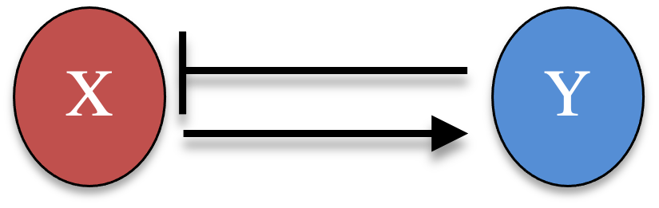
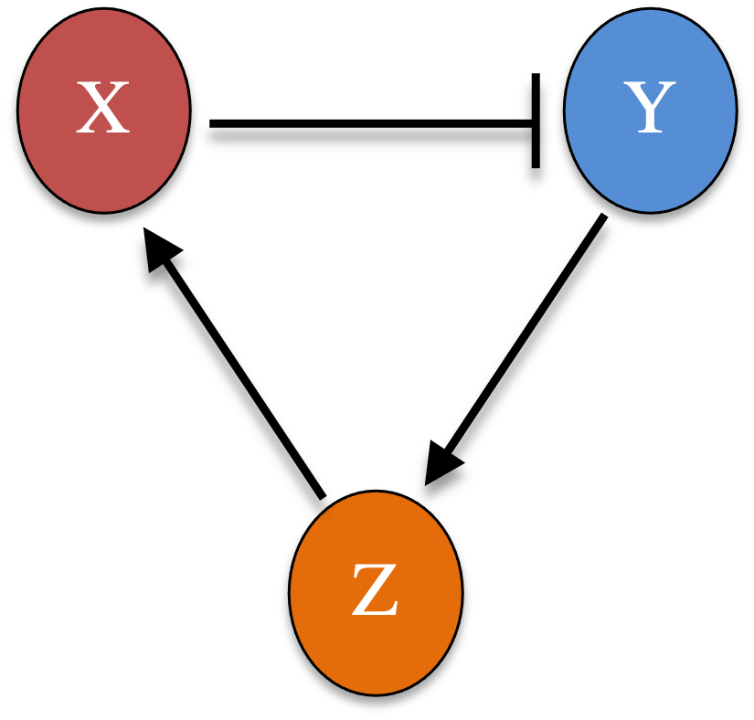
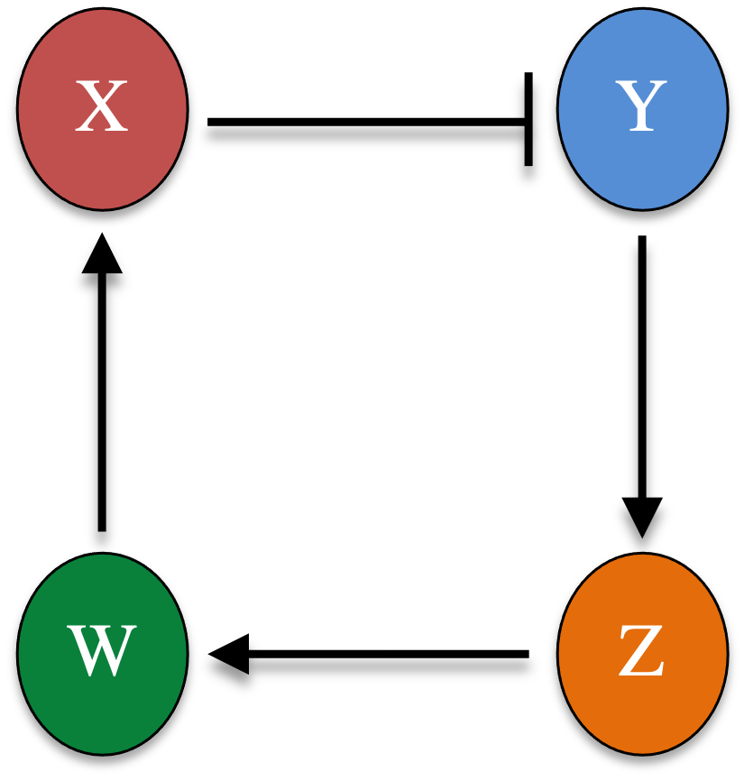

A time delay often stands in for a chain of intermediate steps left out of a model. A delayed edge from gene $A$ to gene $B$ can instead be written as an explicit intermediate node $C$ with edges $A \to C \to B$: the time it takes to build up $C$ becomes the lag. This chapter makes that idea concrete by comparing a delayed two-node negative-feedback loop with longer, undelayed feedback loops, and finding that they behave alike. We integrate ODEs with a second-order Heun scheme and DDEs with its delay version from [Part 4B](04b-modeling-time-delays.qmd).

## 4C.1 A two-node negative-feedback loop

Consider two genes where $X$ activates $Y$ and $Y$ represses $X$, a negative-feedback loop.

{width=30% fig-align="center"}

After nondimensionalization,

\begin{equation}
\begin{cases}
\dfrac{dx}{dt} = \dfrac{g}{1 + y^3} - x \\[2mm]
\dfrac{dy}{dt} = \dfrac{h\,x^3}{1 + x^3} - y
\end{cases} \tag{1}
\end{equation}

with maximum production rates $g$ and $h$. With $g = h = 10$ and no delay, the loop relaxes to a stable steady state.

::: {.callout-note title="Recipe 4C.1.1"}
**Objective.** Simulate a two-gene negative-feedback loop without any delay, as a baseline.

**Model.** A nondimensional two-node loop where X activates Y and Y represses X (Hill coefficient 3, unit degradation), `dx/dt = g/(1 + y^3) - x`, `dy/dt = h*x^3/(1 + x^3) - y`.

**Method.** The generic multi-variable Heun integrator (ordinary, no delay).

**Test.** `g = 10`, `h = 10`; initial (x, y) = (1, 1); `dt = 0.01`, to t = 10.

**Show.** A time-series plot of x and y relaxing to a steady state.

**Verification.** With no delay the loop simply relaxes to a stable steady state, with no oscillation.
:::

### R implementation {.impl}

```{r}
# generic multi-variable Heun ODE integrator
ODE_Heun_generic <- function(derivs, X0, t.total, dt, ...) {
  t_all <- seq(0, t.total, by = dt); nt <- length(t_all)
  X_all <- matrix(0, nt, length(X0)); X_all[1, ] <- X0
  for (i in 1:(nt - 1)) {
    k1 <- dt * derivs(t_all[i], X_all[i, ], ...)
    k2 <- dt * derivs(t_all[i + 1], X_all[i, ] + k1, ...)
    X_all[i + 1, ] <- X_all[i, ] + (k1 + k2) / 2
  }
  cbind(t_all, X_all)
}

derivs_neg <- function(t, Xs, g, h) {
  x <- Xs[1]; y <- Xs[2]
  c(g / (1 + y^3) - x, h * x^3 / (1 + x^3) - y)
}

res <- ODE_Heun_generic(derivs_neg, c(1, 1), 10, 0.01, g = 10, h = 10)
plot(res[, 1], res[, 2], type = "l", col = 2, xlab = "t", ylab = "Levels",
     xlim = c(0, 10), ylim = c(0, 5))
lines(res[, 1], res[, 3], col = 3)
legend("topleft", inset = 0.02, legend = c("x", "y"), col = c(2, 3), lty = 1, cex = 0.8)
```

### Python implementation {.impl}

```{python}
import numpy as np
import matplotlib.pyplot as plt

# generic multi-variable Heun ODE integrator
def ODE_Heun_generic(derivs, X0, t_total, dt, **kw):
    t_all = np.arange(0, t_total + dt, dt); nt = len(t_all)
    X_all = np.zeros((nt, len(X0))); X_all[0] = X0
    for i in range(nt - 1):
        k1 = dt * np.array(derivs(t_all[i], X_all[i], **kw))
        k2 = dt * np.array(derivs(t_all[i + 1], X_all[i] + k1, **kw))
        X_all[i + 1] = X_all[i] + (k1 + k2) / 2
    return np.column_stack((t_all, X_all))

def derivs_neg(t, Xs, g, h):
    x, y = Xs
    return np.array([g / (1 + y**3) - x, h * x**3 / (1 + x**3) - y])

res = ODE_Heun_generic(derivs_neg, [1, 1], 10, 0.01, g=10, h=10)
plt.plot(res[:, 0], res[:, 1], color="red",   label="x")
plt.plot(res[:, 0], res[:, 2], color="green", label="y")
plt.xlabel("t"); plt.ylabel("Levels"); plt.xlim(0, 10); plt.ylim(0, 5)
plt.legend(loc="upper left"); plt.show()
```

## 4C.2 The same loop with a time delay

Now suppose the repression of $X$ by $Y$ acts with a delay $\tau$ (the time to make and act through $Y$),

\begin{equation}
\begin{cases}
\dfrac{dx}{dt} = \dfrac{g}{1 + y(t - \tau)^3} - x \\[2mm]
\dfrac{dy}{dt} = \dfrac{h\,x^3}{1 + x^3} - y
\end{cases} \tag{2}
\end{equation}

with constant history $x(t) = x_0$, $y(t) = y_0$ for $t \leq 0$. With $\tau = 2$ the stable steady state gives way to a sustained oscillation.

::: {.callout-note title="Recipe 4C.2.1"}
**Objective.** Add a delay to the two-node loop's repression and see it destabilize.

**Model.** The same two-node loop as 4C.1, but the repression of X by Y acts after a delay, `dx/dt = g/(1 + y(t-tau)^3) - x`, `dy/dt = h*x^3/(1 + x^3) - y`.

**Method.** The generic multi-variable Heun integrator for delay differential equations.

**Test.** `g = 10`, `h = 10`, `tau = 2`; constant history (x, y) = (1, 1); `dt = 0.01`, to t = 30.

**Show.** A time-series plot of x and y oscillating once the delay is added.

**Verification.** The delay destabilizes the steady state that was stable without it, giving a sustained oscillation.
:::

### R implementation {.impl}

```{r}
# Heun DDE integrator for a generic multi-variable system (same as Part 4B)
DDE_Heun_generic <- function(derivs, X0, t.total, dt, tau, ...) {
  t_all <- seq(-tau, t.total, by = dt); nt <- length(t_all)
  X_all <- matrix(0, nt, length(X0))
  n_delay <- as.integer(tau / dt)
  for (i in 1:(n_delay + 1)) X_all[i, ] <- X0
  for (i in (n_delay + 1):(nt - 1)) {
    k1 <- dt * derivs(t_all[i], X_all[i, ], X_all[i - n_delay, ], ...)
    X_all[i + 1, ] <- X_all[i, ] + k1
    k2 <- dt * derivs(t_all[i + 1], X_all[i + 1, ], X_all[i + 1 - n_delay, ], ...)
    X_all[i + 1, ] <- X_all[i, ] + (k1 + k2) / 2
  }
  cbind(t_all, X_all)
}

# repression of X uses y at the earlier time (y_old)
derivs_neg_dde <- function(t, Xs, Xs_old, g, h) {
  x <- Xs[1]; y <- Xs[2]; y_old <- Xs_old[2]
  c(g / (1 + y_old^3) - x, h * x^3 / (1 + x^3) - y)
}

res <- DDE_Heun_generic(derivs_neg_dde, c(1, 1), 30, 0.01, tau = 2, g = 10, h = 10)
plot(res[, 1], res[, 2], type = "l", col = 2, xlab = "t", ylab = "Levels",
     xlim = c(-2, 30), ylim = c(0, 10))
lines(res[, 1], res[, 3], col = 3)
legend("topleft", inset = 0.02, legend = c("x", "y"), col = c(2, 3), lty = 1, cex = 0.8)
```

### Python implementation {.impl}

```{python}
# Heun DDE integrator for a generic multi-variable system (same as Part 4B)
def DDE_Heun_generic(derivs, X0, t_total, dt, tau, **kw):
    t_all = np.arange(-tau, t_total + dt, dt); nt = len(t_all)
    X_all = np.zeros((nt, len(X0)))
    n_delay = int(tau / dt)
    X_all[0:n_delay + 1] = X0
    for i in range(n_delay, nt - 1):
        k1 = dt * np.array(derivs(t_all[i], X_all[i], X_all[i - n_delay], **kw))
        X_all[i + 1] = X_all[i] + k1
        k2 = dt * np.array(derivs(t_all[i + 1], X_all[i + 1], X_all[i + 1 - n_delay], **kw))
        X_all[i + 1] = X_all[i] + (k1 + k2) / 2
    return np.column_stack((t_all, X_all))

# repression of X uses y at the earlier time (y_old)
def derivs_neg_dde(t, Xs, Xs_old, g, h):
    x, y = Xs; y_old = Xs_old[1]
    return np.array([g / (1 + y_old**3) - x, h * x**3 / (1 + x**3) - y])

res = DDE_Heun_generic(derivs_neg_dde, [1, 1], 30, 0.01, 2, g=10, h=10)
plt.plot(res[:, 0], res[:, 1], color="red",   label="x")
plt.plot(res[:, 0], res[:, 2], color="green", label="y")
plt.xlabel("t"); plt.ylabel("Levels"); plt.xlim(-2, 30); plt.ylim(0, 10)
plt.legend(loc="upper left"); plt.show()
```

## 4C.3 Trading the delay for intermediate nodes

Instead of a delay, we can lengthen the loop with real intermediate genes. A three-node ring, $X \to Y \to Z \dashv X$ (two activations and one repression, so the feedback is still negative), is

\begin{equation}
\begin{cases}
\dfrac{dx}{dt} = \dfrac{g}{1 + z^3} - x \\[2mm]
\dfrac{dy}{dt} = \dfrac{h\,x^3}{1 + x^3} - y \\[2mm]
\dfrac{dz}{dt} = \dfrac{l\,y^3}{1 + y^3} - z
\end{cases} \tag{3}
\end{equation}

{width=26% fig-align="center"}

With $g = h = l = 10$ and no delay at all, the three-node loop already oscillates, though with a shorter period than the delayed two-node loop. Adding a fourth node ($X \to Y \to Z \to W \dashv X$) lengthens the period further and brings the dynamics closer to the $\tau = 2$ delayed case:

\begin{equation}
\begin{cases}
\dfrac{dx}{dt} = \dfrac{g}{1 + w^3} - x, \quad
\dfrac{dy}{dt} = \dfrac{h\,x^3}{1 + x^3} - y \\[2mm]
\dfrac{dz}{dt} = \dfrac{l\,y^3}{1 + y^3} - z, \quad
\dfrac{dw}{dt} = \dfrac{m\,z^3}{1 + z^3} - w
\end{cases} \tag{4}
\end{equation}

{width=24% fig-align="center"}

A time delay and a chain of intermediate reactions are thus two ways to model the same lag.

::: {.callout-note title="Recipe 4C.3.1"}
**Objective.** Show that a chain of intermediate genes can stand in for a delay in producing oscillations.

**Model.** Undelayed repression rings that replace the delay with explicit intermediate genes. Three-node ring (X activates Y activates Z, Z represses X): `dx/dt = g/(1 + z^3) - x`, `dy/dt = h*x^3/(1 + x^3) - y`, `dz/dt = l*y^3/(1 + y^3) - z`. Four-node ring: the same chain with a fourth gene W between Z and X, `dx/dt = g/(1 + w^3) - x`, ..., `dw/dt = m*z^3/(1 + z^3) - w`. Every edge is a Hill interaction (coefficient 3) with unit degradation.

**Method.** The generic multi-variable Heun integrator (ordinary, no delay).

**Test.** All maximal rates equal to 10 (`g = h = l = 10`, and `m = 10` for four nodes); initial state all ones; `dt = 0.01`, to t = 30.

**Show.** Time-series plots of the three- and four-node rings, showing the oscillation and its lengthening period.

**Verification.** The three-node ring already oscillates without any delay; adding a fourth node lengthens the period, approaching the delayed two-node loop, so a delay and a chain of intermediate reactions capture the same lag.
:::

### R implementation {.impl}

```{r}
# three-node negative-feedback ring (g is a length-3 vector of production rates)
derivs_neg_3node <- function(t, Xs, g) {
  x <- Xs[1]; y <- Xs[2]; z <- Xs[3]
  c(g[1] / (1 + z^3) - x, g[2] * x^3 / (1 + x^3) - y, g[3] * y^3 / (1 + y^3) - z)
}
res3 <- ODE_Heun_generic(derivs_neg_3node, rep(1, 3), 30, 0.01, g = rep(10, 3))
plot(res3[, 1], res3[, 2], type = "l", col = 2, xlab = "t", ylab = "Levels",
     xlim = c(0, 30), ylim = c(0, 5))
lines(res3[, 1], res3[, 3], col = 3)
legend("topleft", inset = 0.02, legend = c("x", "y"), col = c(2, 3), lty = 1, cex = 0.8)
```

```{r}
# four-node negative-feedback ring
derivs_neg_4node <- function(t, Xs, g) {
  x <- Xs[1]; y <- Xs[2]; z <- Xs[3]; w <- Xs[4]
  c(g[1] / (1 + w^3) - x, g[2] * x^3 / (1 + x^3) - y,
    g[3] * y^3 / (1 + y^3) - z, g[4] * z^3 / (1 + z^3) - w)
}
res4 <- ODE_Heun_generic(derivs_neg_4node, rep(1, 4), 30, 0.01, g = rep(10, 4))
plot(res4[, 1], res4[, 2], type = "l", col = 2, xlab = "t", ylab = "Levels",
     xlim = c(0, 30), ylim = c(0, 5))
lines(res4[, 1], res4[, 3], col = 3)
legend("topleft", inset = 0.02, legend = c("x", "y"), col = c(2, 3), lty = 1, cex = 0.8)
```

### Python implementation {.impl}

```{python}
# three-node negative-feedback ring (g is a length-3 vector of production rates)
def derivs_neg_3node(t, Xs, g):
    x, y, z = Xs
    return np.array([g[0] / (1 + z**3) - x, g[1] * x**3 / (1 + x**3) - y,
                     g[2] * y**3 / (1 + y**3) - z])
res3 = ODE_Heun_generic(derivs_neg_3node, [1, 1, 1], 30, 0.01, g=np.full(3, 10))
plt.plot(res3[:, 0], res3[:, 1], color="red",   label="x")
plt.plot(res3[:, 0], res3[:, 2], color="green", label="y")
plt.xlabel("t"); plt.ylabel("Levels"); plt.xlim(0, 30); plt.ylim(0, 5)
plt.legend(loc="upper left"); plt.show()
```

```{python}
# four-node negative-feedback ring
def derivs_neg_4node(t, Xs, g):
    x, y, z, w = Xs
    return np.array([g[0] / (1 + w**3) - x, g[1] * x**3 / (1 + x**3) - y,
                     g[2] * y**3 / (1 + y**3) - z, g[3] * z**3 / (1 + z**3) - w])
res4 = ODE_Heun_generic(derivs_neg_4node, [1, 1, 1, 1], 30, 0.01, g=np.full(4, 10))
plt.plot(res4[:, 0], res4[:, 1], color="red",   label="x")
plt.plot(res4[:, 0], res4[:, 2], color="green", label="y")
plt.xlabel("t"); plt.ylabel("Levels"); plt.xlim(0, 30); plt.ylim(0, 5)
plt.legend(loc="upper left"); plt.show()
```
