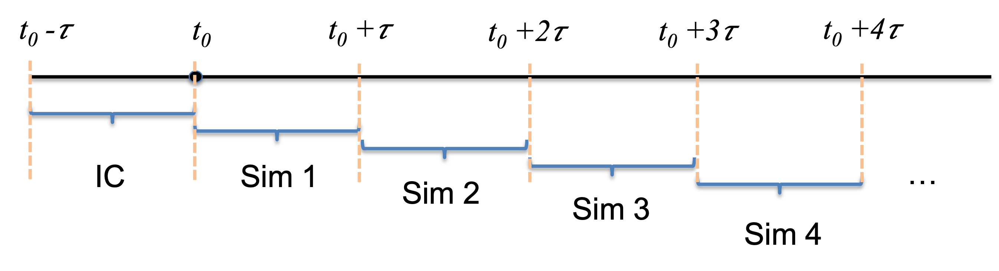

## 4D.1 A bifurcation diagram in the delay

Take the self-inhibiting gene of [Part 4B](04b-modeling-time-delays.qmd), whose product represses its own transcription after a delay $\tau$,

$$ \frac{dX}{dt} = g_0 + g_1\frac{1}{1 + (X(t - \tau)/X_{th})^n} - k X(t) , \tag{1} $$

where $g_0 + g_1$ is the maximum transcription rate, $g_0$ the leakage rate, $X_{th}$ the Hill threshold, $n$ the Hill coefficient, and $k$ the degradation rate.

{width=68px fig-align="center"}

Build a bifurcation diagram with the delay $\tau$ as the control parameter. For each $\tau$, integrate long enough for the circuit to reach either a steady state or a stable oscillation, then plot the maximum and minimum of $X(t)$ over the late-time trajectory against $\tau$. The diagram should show where the delay turns the steady state into a sustained oscillation.

## 4D.2 The method of steps

The integrators of [Part 4A](04a-delayed-differential-equations.qmd) stored the entire trajectory so that $N(t - \tau)$ was always available. The **method of steps** avoids that cost by splitting the simulation into consecutive windows of length $\tau$ [@bellman1963differential]. Starting from the history $N(t)$ on $[t_0 - \tau, t_0]$, one short integration gives $N(t)$ on $[t_0, t_0 + \tau]$; that window becomes the history for the next, giving $[t_0 + \tau, t_0 + 2\tau]$, and so on. Only one window of the trajectory needs to be held at a time.

{width=70% fig-align="center"}

**(a)** Write a function that performs one window: it takes the trajectory from the previous window (or the initial history, for the first window) and returns the trajectory over the next interval of length $\tau$, using Heun's method as the DDE integrator.

**(b)** Write a function that runs a full simulation by calling **(a)** repeatedly.

**(c)** Test it on the delay logistic model of [Part 4B](04b-modeling-time-delays.qmd) and check that the method of steps reproduces the trajectories from the store-everything integrator.

## 4D.3 More on negative-feedback loops

[Part 4C](04c-indirect-interactions.qmd) showed that a delayed two-node loop and longer undelayed loops (three or four nodes) can produce similar oscillations. Turn that comparison around, using the delayed two-node model (Equation (2) of [Part 4C](04c-indirect-interactions.qmd)).

**(a)** Find a delay $\tau$ (and, if needed, other parameters) for which the delayed two-node loop oscillates like the **three-node** loop.

**(b)** Do the same so that it matches the **four-node** loop.
