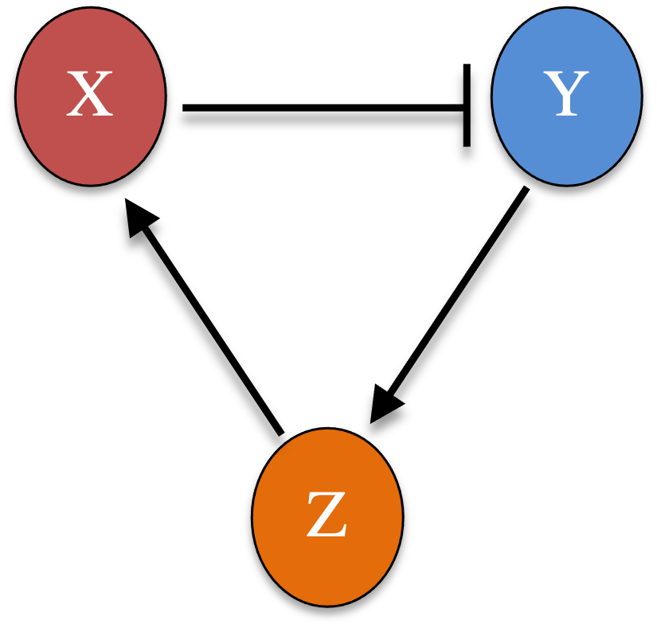
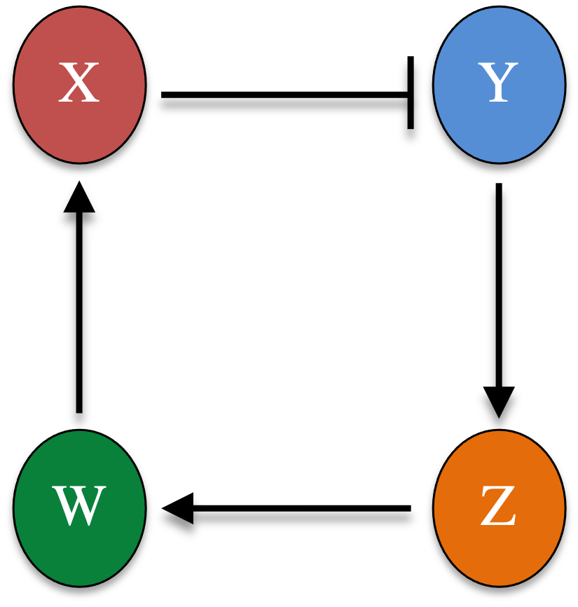

```{r setup, include=FALSE}
knitr::opts_chunk$set(echo = TRUE)
```

A delay system can sometimes be converted to an ODE system when introducing intermediate steps for the reactions with delays. For example, for a time delay from gene A regulating gene B, we can add another intermediate node C and new edges from A to C and C to B.

In the following, we will discuss an example of such delay systems. The modeling analysis utilizes the Heun method to integrate both ODEs and DDEs.

```{r}
# 2nd order ODE integrator: Heun method
ODE_Heun_generic <- function(derivs, X0, t.total, dt, ...){
  # derivs: the function of the derivatives 
  # X0: initial condition
  # t.total: total simulation time, assuming t starts from 0 at the beginning
  # dt: time step size 
  t_all = seq(0, t.total, by=dt)
  nt_all = length(t_all)
  nx = length(X0)
  X_all = matrix(0, nrow = nt_all, ncol = nx)
  X_all[1,] = X0
  for (i in 1:(nt_all-1)) {
    k1 = dt * derivs(t_all[i],X_all[i,], ...)
    xb = X_all[i,] + k1
    k2 = dt * derivs(t_all[i+1],xb, ...)
    X_all[i+1,] = X_all[i,] + (k1+k2)/2
  }
  return(cbind(t_all, X_all))   # the output is a matrix of t & X(t) for all time steps
}

# Heun's method for DDEs with a constant time delay (for a generic multi-variable system)
DDE_Heun_generic <- function(derivs, X0, t.total, dt, tau, ...){
  # derivs: the function of the derivatives 
  # X0: initial condition (vector)
  # t.total: total simulation time
  # dt: time step size 
  # tau: a constant time delay 
  # (this illustrate will not work for cases using multiple time delays)
  t_all = seq(-tau, t.total, by=dt)   # save data for all previous time points too
  nt_all = length(t_all)
  nx = length(X0)
  X_all = matrix(0, nrow = nt_all, ncol = nx)
  
  n_delay = as.integer(tau/dt) # number of delay time steps
  for (i in 1:(n_delay + 1)){
    X_all[i,] = X0   # a constant initial condition between t in [-tau, 0]
  }
  
  for (i in (n_delay+1):(nt_all-1)) {
    k1 = dt * derivs(t_all[i],X_all[i,],X_all[i-n_delay,],...)
    X_all[i+1,] = X_all[i,] + k1   # X_all_i+1 is first assigned here, so that the function works for tau = 0
    k2 = dt * derivs(t_all[i+1],X_all[i+1,], X_all[i+1-n_delay,],...)
    X_all[i+1,] = X_all[i,] + (k1+k2)/2
  }
  return(cbind(t_all, X_all))   # the output is a matrix of t & X(t) for all time steps
}
```

# Two-node negative feedback loop 

<center> {width=20%} </center>

Let's consider a two-node negative feedback loop gene circuit in which $X$ activates $Y$, and $Y$ represses $X$. The gene expression dynamics of this circuit can be modeled by a set of ODEs

\begin{equation}
\begin{cases} \frac{dx(t)}{dt} = \frac{g}{1+ y(t)^3} - x(t) \\
              \frac{dy(t)}{dt} = \frac{hx(t)^3}{1+ x(t)^3} - y(t) \end{cases} \tag{1}
\end{equation}

where $x$ and $y$ are the levels of $X$ and $Y$, respectively. $g$ and $h$ are the maximal production rates of $X$ and $Y$, respectively. Nondimensionalization has been applied here to reduce the other parameters. 

We set $g = h = 10$. For an initial condition (1, 1),

``` {r}
derivs_neg <- function(t, Xs, g, h) { 
  x = Xs[1]
  y = Xs[2]
  dxdt = g/(1+ y**3) - x
  dydt = h*x**3/(1+x**3) - y
  return(c(dxdt, dydt))
}

results_1 = ODE_Heun_generic(derivs = derivs_neg, X0 = c(1,1), t.total = 10, dt = 0.01, g = 10, h = 10)

plot(results_1[,1], results_1[,2], xlab="t", ylab="Levels", xlim=c(0,10), ylim=c(0,5), type = "l", col=2)
lines(results_1[,1], results_1[,3], col = 3)
legend("topleft", inset=0.02, legend = c("x", "y"), col=c(2,3),lty=1, cex=0.8)
```

The system reaches to a stable steady state.

# Two-node negative feedback circuit with time delays

Now if we consider that the transcriptional inhibition from $Y$ to $X$ occurs with a time delay $\tau$. The delay differential equation (DDE) of the circuit is

\begin{equation}
\begin{cases} \frac{dx(t)}{dt} = \frac{g}{1+ y(t-\tau)^3} - x(t) \\
              \frac{dy(t)}{dt} = \frac{hx(t)^3}{1+ x(t)^3} - y(t) \end{cases} \tag{2}
\end{equation}

We use constant initial condition, where $x(t - \tau) = x_0$ and $y(t -\tau) = y_0$ for $t \le \tau$.

```{r}
derivs_neg_dde <- function(t, Xs, Xs_old, g, h) { 
  x = Xs[1]
  y = Xs[2]
  y_old = Xs_old[2]
  dxdt = g/(1+ y_old**3) - x
  dydt = h*x**3/(1+x**3) - y
  return(c(dxdt, dydt))
}

results_2 = DDE_Heun_generic(derivs = derivs_neg_dde, X0 = c(1,1), t.total = 30, dt = 0.01, tau  = 2, g = 10, h = 10)
plot(results_2[,1], results_2[,2], xlab="t", ylab="Levels", xlim=c(-2,30), ylim=c(0,10), type = "l", col=2)
lines(results_2[,1], results_2[,3], col = 3)
legend("topleft", inset=0.02, legend = c("x", "y"), col=c(2,3),lty=1, cex=0.8)
```

# A negative feedback loop with more intermediate nodes

Now we add an additional node to the circuit, $X$ activates $Y$, and $Y$ represses $X$. The gene expression dynamics of this circuit can be modelled by a set of ODEs

\begin{equation}
\begin{cases} \frac{dx(t)}{dt} = \frac{g}{1+ z(t)^3} - x(t) \\
              \frac{dy(t)}{dt} = \frac{hx(t)^3}{1+ x(t)^3} - y(t) \\
              \frac{dz(t)}{dt} = \frac{ly(t)^3}{1+ y(t)^3} - z(t) \\ \end{cases} \tag{3}
\end{equation}

where $x$, $y$, and $z$ are the levels of $X$, $Y$, and $Z$, respectively. $g$, $h$, $l$ are the maximal production rates of $X$, $Y$, $Z$, respectively.

<center> {width=20%} </center>

We set $g = h = l = 10$. For an initial condition (1, 1, 1),

``` {r}
derivs_neg_3node <- function(t, Xs, g) { 
  x = Xs[1]
  y = Xs[2]
  z = Xs[3]
  dxdt = g[1]/(1+ z**3) - x
  dydt = g[2]*x**3/(1+x**3) - y
  dzdt = g[3]*y**3/(1+y**3) - z
  return(c(dxdt, dydt, dzdt))
}

results_3 = ODE_Heun_generic(derivs = derivs_neg_3node, X0 = rep(1,3), t.total = 30, dt = 0.01, g = rep(10,3))

plot(results_3[,1], results_3[,2], xlab="t", ylab="Levels", xlim=c(0,30), ylim=c(0,5), type = "l", col=2)
lines(results_3[,1], results_3[,3], col = 3)
legend("topleft", inset=0.02, legend = c("x", "y"), col=c(2,3),lty=1, cex=0.8)
```

Now the system can generate an oscillatory dynamics without time delays. However, the period of the oscillation is much smaller. If we add another node in the negative feedback loop, we would observe much closer dynamics as the two-node circuit with time delays $\tau = 2$.

\begin{equation}
\begin{cases} \frac{dx(t)}{dt} = \frac{g}{1+ w(t)^3} - x(t) \\
              \frac{dy(t)}{dt} = \frac{hx(t)^3}{1+ x(t)^3} - y(t) \\
              \frac{dz(t)}{dt} = \frac{ly(t)^3}{1+ y(t)^3} - z(t) \\
              \frac{dw(t)}{dt} = \frac{mz(t)^3}{1+ z(t)^3} - w(t) \\ \end{cases} \tag{4}
\end{equation}

<center> {width=20%} </center>

``` {r}
derivs_neg_4node <- function(t, Xs, g) { 
  x = Xs[1]
  y = Xs[2]
  z = Xs[3]
  w = Xs[4]
  dxdt = g[1]/(1+ w**3) - x
  dydt = g[2]*x**3/(1+x**3) - y
  dzdt = g[3]*y**3/(1+y**3) - z
  dwdt = g[4]*z**3/(1+z**3) - w
  return(c(dxdt, dydt, dzdt, dwdt))
}

results_4 = ODE_Heun_generic(derivs = derivs_neg_4node, X0 = rep(1,4), t.total = 30, dt = 0.01, g = rep(10, 4))
plot(results_4[,1], results_4[,2], xlab="t", ylab="Levels", xlim=c(0,30), ylim=c(0,5), type = "l", col=2)
lines(results_4[,1], results_4[,3], col = 3)
legend("topleft", inset=0.02, legend = c("x", "y"), col=c(2,3),lty=1, cex=0.8)
```