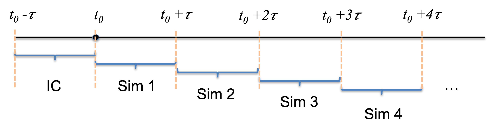

```{r setup, include=FALSE}
knitr::opts_chunk$set(echo = TRUE)
```

# 1. Bifurcation diagram exploration considering time delay

Consider a single-gene circuit with self-inhibition, where gene expression dynamics are delineated by a delay differential equation (DDE):

$$ \frac{dX(t)}{dt} = g_0 + g_1\frac{1}{1+ (X(t-\tau)/X_{th})^n} - kX(t)$$
$g_0 + g_1$ represents the maximum transcriptional rate, $g_0$ is the leakage transcriptional rate, $X_{th}$ is the Hill threshold level of $X$, $n$ is the Hill coefficient, and $k$ is the degradation rate. The constant $\tau$ represents a constant time delay inherent in transcriptional regulation (check NumericalR Part 4B).

<center> {width=10%} </center>

Write a script to plot a bifurcation diagram, where the circuit dynamics vary concerning the time delay$\tau$ acting as the control parameter. For each $\tau$, simulate the circuit adequately to reach either a stable steady state or, if oscillatory dynamics emerge, stable oscillations. Plot the maximum and minimum $X$ of the stable trajectory $X(t)$ concerning the control parameter $\tau$.

# 2. Method of steps

We will use the method of steps to simulate Delay Differential Equations (DDEs). This technique involves breaking down the entire simulation into consecutive short simulations of duration $\tau$. Starting from the initial condition $N(t)$ for $t \in [t_0-\tau,t_0]$, we execute a shortt simulation to compute $N(t)$ for $t \in [t_0, t_0 + \tau]$. Subsequently, we repeat this process to calculate $N(t)$ for $t \in [t_0+\tau, t_0+2\tau]$, and continue iterating until the end of the simulation. At each iteration, only a short-time trajectory needs to be stored.

<center> {width=70%} </center>

To implement the method of steps:

**(a)** Define a function to perform an iteration of short DDE simulation. This function will take the time trajectory from the previous iteration (or the initial condition for the first iteration) as input and generate the time trajectory for the current iteration. Use Heun's method as the DDE integrator in this implementation.

**(b)** Develop a function to conduct a complete DDE simulation using the method of steps. This function will iteratively call the function defined in **(a)**.

**(c)** Test the algorithm using the logistic growth model with time delays (refer to the examples in numericalR 04B). Compare the results obtained from the method of steps with those obtained from a standard DDE numerical solver and check whether you are able to obtain the same outcomes.

# 3. More on the negative feedback loops

In Part 4C, we examined a few negative feedback loops. The loop with either three nodes (Figure 2) or four nodes (Figure 3) can generate oscillatory dynamics. 

**(a)** Find a set of parameters for Equation (2) in Part 4C, so that the system generates similar dynamics as those for the loop with three nodes.

**(b)** Find a set of parameters for Equation (2) in Part 4C, so that the system generates similar dynamics as those for the loop with four nodes.
