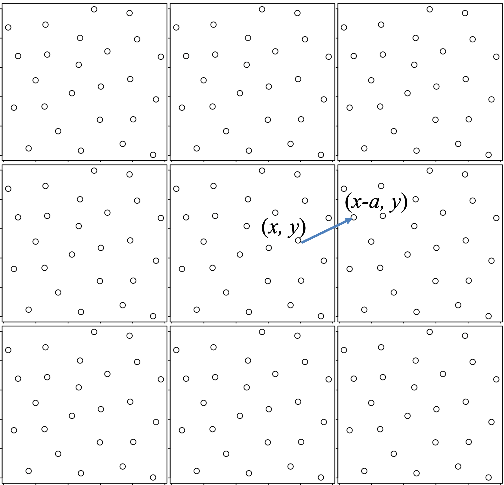
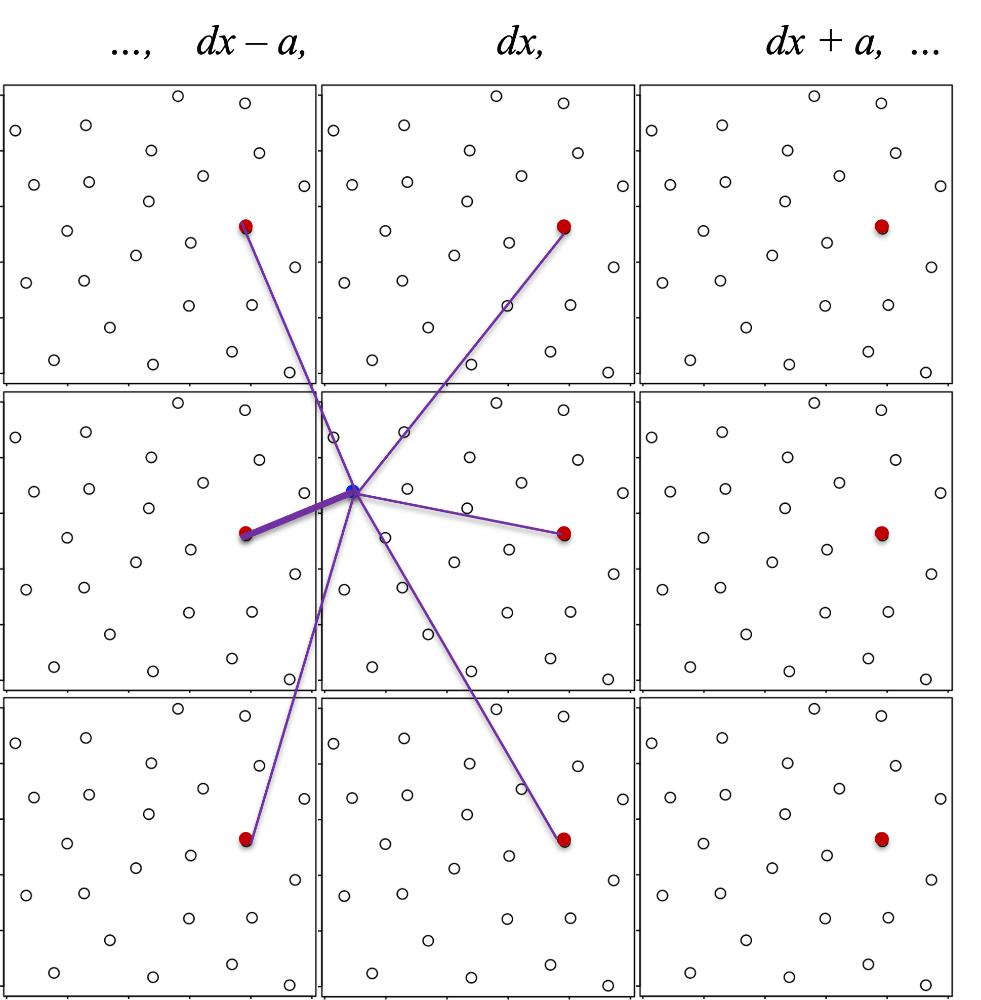
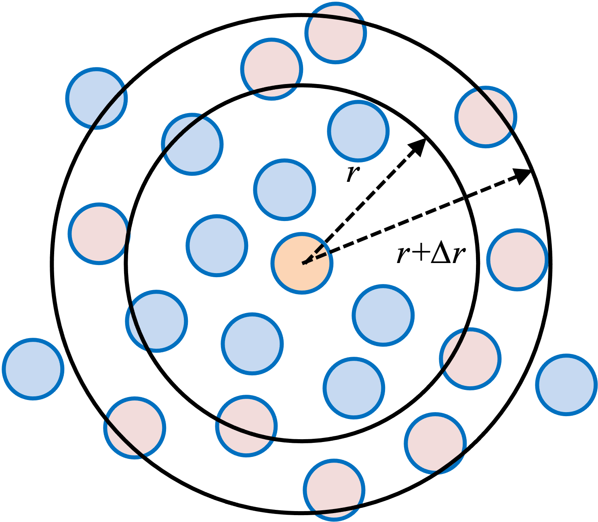

We now scale up from a handful of bodies to a small box of many identical
particles, the setting of a real molecular dynamics simulation. The particles
interact through the Lennard-Jones potential, the box uses periodic boundaries to
mimic a much larger system, and from the trajectory we compute the radial
distribution function, a standard structural fingerprint of a liquid
[@allen2017computer]. Throughout we use the generalized
[velocity Verlet integrator](05b-orbital-motion.qmd) from the previous chapter.

The system is $N_\text{tot} = 25$ identical particles of unit mass in a square box
of side $a = 6.25$, started from an evenly spaced grid.

## 5C.1 The Lennard-Jones interaction

Any two particles a distance $r$ apart interact through the force

$$ F(r) = \frac{1}{r^{13}} - \frac{1}{r^{7}} , \tag{1} $$

which is the force derived from the Lennard-Jones (LJ) potential
[@lennardjones1924], the classic model of the interaction between neutral atoms.
The force is repulsive ($F > 0$) for $r < 1$ and attractive ($F < 0$) for $r > 1$,
crossing zero at the equilibrium separation $r = 1$. Its potential energy is
$E(r) = \tfrac{1}{12} r^{-12} - \tfrac{1}{6} r^{-6}$, with a minimum at $r = 1$.

### R implementation {.impl}

```{r}
#| fig-width: 5
#| fig-height: 5
#| out-width: "55%"
# initial configuration: 25 particles on an evenly spaced grid
ntot <- 25; a <- 6.25
grid_pts <- seq(0, 5, by = 1.25)
xy0 <- as.matrix(expand.grid(x = grid_pts, y = grid_pts))   # grid_x varies fastest
par(pty = "s")
plot(xy0[,1], xy0[,2], pch = 19, xlab = "X", ylab = "Y",
     xlim = c(0, a), ylim = c(0, a), asp = 1)
```

```{r}
# Lennard-Jones force and potential
force <- function(r){
  r6 <- r^6
  return((1/r6/r6 - 1/r6) / r)   # F(r) = 1/r^13 - 1/r^7
}
E_LJ <- function(r){
  r6 <- r^6
  return(1/(12*r6*r6) - 1/(6*r6))
}

r_all <- seq(0.01, 4, by = 0.01)
plot(r_all, force(r_all), type = "l", xlab = "r", ylab = "F", xlim = c(0,4), ylim = c(-0.5,1))
abline(h = 0, lty = 3, col = 2)
```

```{r}
plot(r_all, E_LJ(r_all), type = "l", xlab = "r", ylab = "LJ potential", xlim = c(0,4), ylim = c(-1,2))
abline(h = 0, lty = 3, col = 2)
```

### Python implementation {.impl}

```{python}
#| fig-width: 5
#| fig-height: 5
#| out-width: "55%"
import numpy as np
import matplotlib.pyplot as plt

# initial configuration: 25 particles on an evenly spaced grid
ntot = 25; a = 6.25
grid_pts = np.arange(0, 5.01, 1.25)
# build the grid in the same order as R's expand.grid (grid_x varies fastest)
xy0 = np.array([(gx, gy) for gy in grid_pts for gx in grid_pts])
plt.plot(xy0[:,0], xy0[:,1], "o", ms=8, linestyle="")
plt.gca().set_aspect("equal")
plt.xlabel("X"); plt.ylabel("Y"); plt.xlim(0, a); plt.ylim(0, a); plt.show()
```

```{python}
# Lennard-Jones force and potential
def force(r):
    r6 = r**6
    return (1/r6/r6 - 1/r6) / r   # F(r) = 1/r^13 - 1/r^7

def E_LJ(r):
    r6 = r**6
    return 1/(12*r6*r6) - 1/(6*r6)

r_all = np.arange(0.01, 4.0, 0.01)
plt.plot(r_all, force(r_all), color="black")
plt.axhline(0, ls=":", color="red")
plt.xlabel("r"); plt.ylabel("F"); plt.xlim(0,4); plt.ylim(-0.5,1); plt.show()
```

```{python}
plt.plot(r_all, E_LJ(r_all), color="black")
plt.axhline(0, ls=":", color="red")
plt.xlabel("r"); plt.ylabel("LJ potential"); plt.xlim(0,4); plt.ylim(-1,2); plt.show()
```

## 5C.2 Periodic boundaries and the minimum image convention

To model a bulk system with only a few particles, we wrap the box with *periodic
boundary conditions*: a particle that leaves one side re-enters from the opposite
side. A coordinate is folded back into $[0, a)$ by subtracting the largest
multiple of $a$ below it.

{width=42% fig-align="center"}

Because each particle now stands for an infinite lattice of periodic images, a
pair of particles has infinitely many separations. The *minimum image convention*
keeps only the nearest one: shift each coordinate difference by the nearest
multiple of $a$ before measuring the distance.

{width=42% fig-align="center"}

### R implementation {.impl}

```{r}
# fold a position back into the box [0, a)
x <- c(-5.5, 4.2); a <- 2
xnew <- x - floor(x / a) * a   # floor: largest integer below x/a
x; xnew
```

```{r}
# nearest-image distance between two particles
xi <- c(0.7, 1.9); xj <- c(1.8, 1.2); a <- 2
dx <- xj - xi
r1 <- sqrt(sum(dx^2))            # direct distance
dx <- dx - round(dx / a) * a     # round: nearest integer -> nearest image
r_min <- sqrt(sum(dx^2))         # minimum-image distance
r1; r_min
```

### Python implementation {.impl}

```{python}
# fold a position back into the box [0, a)
x = np.array([-5.5, 4.2]); a = 2
xnew = x - np.floor(x / a) * a   # floor: largest integer below x/a
print("x   =", x)
print("xnew =", xnew)
```

```{python}
# nearest-image distance between two particles
xi = np.array([0.7, 1.9]); xj = np.array([1.8, 1.2]); a = 2
dx = xj - xi
r1 = np.sqrt(np.sum(dx**2))          # direct distance
dx = dx - np.round(dx / a) * a       # round: nearest integer -> nearest image
r_min = np.sqrt(np.sum(dx**2))       # minimum-image distance
print("r1    =", r1)
print("r_min =", r_min)
```

The velocities are never wrapped; only positions are folded back into the box.

## 5C.3 Computing the total force

The force that particle $j$ exerts on particle $i$ points along their
minimum-image separation, with the sign and magnitude set by the LJ force
$F(r_{ij})$,

$$
f_x(j \rightarrow i) = F(r_{ij}) \frac{x_i - x_j}{r_{ij}} , \qquad
f_y(j \rightarrow i) = F(r_{ij}) \frac{y_i - y_j}{r_{ij}} , \tag{2}
$$

where $r_{ij} = \sqrt{(x_i - x_j)^2 + (y_i - y_j)^2}$ is the minimum-image
distance. The total force on particle $i$ sums the pairwise contributions from
every other particle. We store all coordinates in one length-$2N_\text{tot}$
vector, ordered $(x_1, y_1, x_2, y_2, \ldots)$, and use Newton's third law
($f_{j \rightarrow i} = -f_{i \rightarrow j}$) so each pair is evaluated once.

### R implementation {.impl}

```{r}
# force from particle j on particle i (minimum image)
force_j2i <- function(i, j, x_all, a){
  xi <- x_all[2*i-1]; yi <- x_all[2*i]
  xj <- x_all[2*j-1]; yj <- x_all[2*j]
  dx <- xi - xj; dx <- dx - round(dx/a)*a
  dy <- yi - yj; dy <- dy - round(dy/a)*a
  rij <- sqrt(dx^2 + dy^2)
  fij <- force(rij)
  return(c(fij*dx/rij, fij*dy/rij))
}

# total force on every particle (length 2*Ntot)
force_all <- function(t, x_all, a){
  Ntot <- length(x_all)/2
  f <- numeric(2*Ntot)
  for (i in 1:(Ntot-1)) {
    for (j in (i+1):Ntot) {
      fij <- force_j2i(i, j, x_all, a)
      f[(2*i-1):(2*i)] <- f[(2*i-1):(2*i)] + fij
      f[(2*j-1):(2*j)] <- f[(2*j-1):(2*j)] - fij
    }
  }
  return(f)
}
```

### Python implementation {.impl}

```{python}
# force from particle j on particle i (minimum image); i, j are 1-based
def force_j2i(i, j, x_all, a):
    xi, yi = x_all[2*i-2], x_all[2*i-1]
    xj, yj = x_all[2*j-2], x_all[2*j-1]
    dx = xi - xj; dx -= np.round(dx/a)*a
    dy = yi - yj; dy -= np.round(dy/a)*a
    rij = np.sqrt(dx**2 + dy**2)
    fij = force(rij)
    return np.array([fij*dx/rij, fij*dy/rij])

# total force on every particle (length 2*Ntot)
def force_all(t, x_all, a):
    Ntot = len(x_all)//2
    f = np.zeros(2*Ntot)
    for i in range(1, Ntot):
        for j in range(i+1, Ntot+1):
            fij = force_j2i(i, j, x_all, a)
            f[2*i-2:2*i] += fij
            f[2*j-2:2*j] -= fij
    return f
```

## 5C.4 Velocity Verlet with periodic boundaries

Each particle obeys Newton's equation with the summed LJ force,

$$ m_i \frac{d^2 x_i}{dt^2} = \sum_{j \neq i} f_x(j \rightarrow i) , \tag{3} $$

and likewise for $y_i$, with all masses $m_i = 1$. We reuse velocity Verlet, but
after each position update we fold every coordinate back into the box.

### R implementation {.impl}

```{r}
# fold all coordinates back into the box
bc_periodic <- function(x_all, a) x_all - floor(x_all/a) * a

# velocity Verlet with a periodic-boundary correction each step
velocity_verlet_bc <- function(f, t0, x0, v0, t.total, dt, ...){
  t_all <- seq(t0, t.total, by = dt); nt_all <- length(t_all); nx <- length(x0)
  x_all <- matrix(0, nt_all, nx); v_all <- matrix(0, nt_all, nx)
  x_all[1,] <- x0; v_all[1,] <- v0
  for (i in 1:(nt_all-1)) {
    v_half     <- v_all[i,] + 0.5 * dt * f(t_all[i], x_all[i,], ...)
    x_all[i+1,] <- x_all[i,] + dt * v_half
    v_all[i+1,] <- v_half + 0.5 * dt * f(t_all[i+1], x_all[i+1,], ...)
    x_all[i+1,] <- bc_periodic(x_all[i+1,], ...)
  }
  return(cbind(t_all, x_all, v_all))
}
```

### Python implementation {.impl}

```{python}
# fold all coordinates back into the box
def bc_periodic(x_all, a):
    return x_all - np.floor(x_all/a) * a

# velocity Verlet with a periodic-boundary correction each step
def velocity_verlet_bc(f, t0, x0, v0, t_total, dt, **kwargs):
    t_all = np.arange(t0, t_total + dt, dt); nt_all = len(t_all); nx = len(x0)
    x_all = np.zeros((nt_all, nx)); v_all = np.zeros((nt_all, nx))
    x_all[0,:] = x0; v_all[0,:] = v0
    for i in range(1, nt_all):
        v_half = v_all[i-1,:] + 0.5 * dt * f(t_all[i-1], x_all[i-1,:], **kwargs)
        x_all[i,:] = x_all[i-1,:] + dt * v_half
        v_all[i,:] = v_half + 0.5 * dt * f(t_all[i], x_all[i,:], **kwargs)
        x_all[i,:] = bc_periodic(x_all[i,:], **kwargs)
    return np.column_stack((t_all, x_all, v_all))
```

## 5C.5 Simulating the box

We start every particle on the grid and give them small initial velocities.
Rather than the random velocities one might use, we assign a fixed, evenly spread
pattern (a golden-ratio sequence over the interval $(-0.05, 0.05)$) so both
languages start from exactly the same initial condition and the setup is fully
reproducible. A short warm-up run to $t = 10$ lets the ordered grid relax; a
longer run to $t = 100$ (time step $dt = 0.01$) then brings the system to a
disordered, liquid-like state. We plot the configuration at the end of each stage.

### R implementation {.impl}

```{r}
#| fig-width: 5
#| fig-height: 5
#| out-width: "55%"
# simulation parameters (the demos above reused `a` for a small illustrative box)
ntot <- 25; a <- 6.25
# grid positions (same order as the first figure) and deterministic velocities
x0 <- as.vector(t(as.matrix(expand.grid(x = grid_pts, y = grid_pts))))
k <- 1:(2*ntot); phi <- 0.6180339887498949           # golden-ratio spacing
v0 <- 0.1 * ((k * phi) %% 1) - 0.05                   # spread over (-0.05, 0.05)

# warm-up run to t = 10
res_init <- velocity_verlet_bc(force_all, 0, x0, v0, t.total = 10, dt = 0.01, a = a)
last <- res_init[nrow(res_init), ]
x0 <- last[2:(2*ntot+1)]; v0 <- last[(2*ntot+2):(4*ntot+1)]
xy <- matrix(x0, ncol = 2, byrow = TRUE)
par(pty = "s")
plot(xy[,1], xy[,2], pch = 19, xlab = "X", ylab = "Y", xlim = c(0,a), ylim = c(0,a), asp = 1)
```

```{r}
#| fig-width: 5
#| fig-height: 5
#| out-width: "55%"
# longer run to t = 100
res_final <- velocity_verlet_bc(force_all, 0, x0, v0, t.total = 100, dt = 0.01, a = a)
x_f <- res_final[nrow(res_final), 2:(2*ntot+1)]
xy_f <- matrix(x_f, ncol = 2, byrow = TRUE)
par(pty = "s")
plot(xy_f[,1], xy_f[,2], pch = 19, xlab = "X", ylab = "Y", xlim = c(0,a), ylim = c(0,a), asp = 1)
```

### Python implementation {.impl}

```{python}
#| fig-width: 5
#| fig-height: 5
#| out-width: "55%"
# simulation parameters (the demos above reused `a` for a small illustrative box)
ntot = 25; a = 6.25
# grid positions (same order as R) and deterministic velocities
x0 = np.array([(gx, gy) for gy in grid_pts for gx in grid_pts]).flatten()
k = np.arange(1, 2*ntot+1); phi = 0.6180339887498949   # golden-ratio spacing
v0 = 0.1 * ((k * phi) % 1) - 0.05                       # spread over (-0.05, 0.05)

# warm-up run to t = 10
res_init = velocity_verlet_bc(force_all, 0, x0, v0, t_total=10, dt=0.01, a=a)
last = res_init[-1]
x0 = last[1:2*ntot+1]; v0 = last[2*ntot+1:]
xy = x0.reshape(-1, 2)
plt.plot(xy[:,0], xy[:,1], "o", ms=8, linestyle="")
plt.gca().set_aspect("equal")
plt.xlabel("X"); plt.ylabel("Y"); plt.xlim(0,a); plt.ylim(0,a); plt.show()
```

```{python}
#| fig-width: 5
#| fig-height: 5
#| out-width: "55%"
# longer run to t = 100
res_final = velocity_verlet_bc(force_all, 0, x0, v0, t_total=100, dt=0.01, a=a)
x_f = res_final[-1, 1:2*ntot+1]
xy_f = x_f.reshape(-1, 2)
plt.plot(xy_f[:,0], xy_f[:,1], "o", ms=8, linestyle="")
plt.gca().set_aspect("equal")
plt.xlabel("X"); plt.ylabel("Y"); plt.xlim(0,a); plt.ylim(0,a); plt.show()
```

The particles start on the regular grid, and by the end of the long run they have
spread into an irregular, disordered arrangement, the signature of a liquid. This
many-body system is chaotic, so the exact final configuration is exquisitely
sensitive to rounding and differs between the R and Python runs (and from one
machine to another) even though both begin from the same initial condition.
Structural averages such as the radial distribution function below are
reproducible, however, which is what we actually care about.

## 5C.6 Animating the simulation

As in [Part 5B](05b-orbital-motion.qmd), the run is much easier to read as an
animation than as a pair of snapshots. The code below renders the box simulation
to a GIF; as before it is shown to run locally rather than executed at build time.

### R implementation {.impl}

```r
library(ggplot2)
library(gganimate)
library(gifski)

# subsample the trajectory into discrete frames. transition_manual draws each
# frame as-is, with no interpolation, so a particle that wraps around a periodic
# edge does not streak across the box (transition_time would tween and streak it).
step <- 50
sub <- res_final[seq(1, nrow(res_final), by = step), ]
ind_x <- seq(2, 2*ntot, by = 2)      # columns holding x coordinates
ind_y <- seq(3, 2*ntot+1, by = 2)    # columns holding y coordinates
df <- data.frame(
  frame = rep(seq_len(nrow(sub)), ntot),
  tlab  = rep(sprintf("%.1f", sub[,1]), ntot),
  x = as.vector(sub[, ind_x]),
  y = as.vector(sub[, ind_y]),
  particle = as.character(rep(1:ntot, each = nrow(sub)))
)

p <- ggplot(df, aes(x = x, y = y, colour = particle)) +
  geom_point(size = 6, alpha = 0.7, show.legend = FALSE) +
  coord_fixed(xlim = c(0, a), ylim = c(0, a)) +   # square plot box (x and y are equivalent)
  labs(x = "x", y = "y")
anim <- p + transition_manual(frame) +
  labs(title = "t = {df$tlab[df$frame == as.integer(current_frame)][1]}")
anim <- animate(anim, nframes = nrow(sub), fps = 20,
                width = 480, height = 480, renderer = gifski_renderer())
anim_save("md.gif", animation = anim)
```

### Python implementation {.impl}

```python
from matplotlib.animation import FuncAnimation

ind_x = np.arange(1, 2*ntot, 2)      # columns holding x coordinates
ind_y = np.arange(2, 2*ntot+1, 2)    # columns holding y coordinates
step = 50
frames = range(0, res_final.shape[0], step)

fig, ax = plt.subplots(figsize=(5, 5))       # square figure
ax.set_xlim(0, a); ax.set_ylim(0, a); ax.set_aspect("equal")   # square plot box
ax.set_xlabel("x"); ax.set_ylabel("y")
scat = ax.scatter(res_final[0, ind_x], res_final[0, ind_y], s=80, alpha=0.7)

def update(i):
    scat.set_offsets(np.column_stack([res_final[i, ind_x], res_final[i, ind_y]]))
    ax.set_title(f"t = {res_final[i, 0]:.1f}")
    return scat,

anim = FuncAnimation(fig, update, frames=frames, interval=50)
anim.save("md.gif", writer="pillow", fps=20)
```

The code produces an animation of the particle dynamics.

::: {.content-visible when-format="html"}
{width=55% fig-align="center"}
:::

## 5C.7 Radial distribution function

The radial distribution function $g(r)$ summarizes the structure of the fluid: it
is the probability of finding a particle a distance $r$ from a reference particle,
relative to the uniform (ideal-gas) expectation,

$$ g(r) = \frac{\langle \rho(r) \rangle}{\rho_0} = \frac{\langle \Delta N(r) \rangle}{2\pi r \, \Delta r \, \rho_0} , \tag{4} $$

where $\rho_0 = N_\text{tot} / a^2$ is the mean density and $\langle \Delta N(r) \rangle$
is the average count of particles in a shell of radius $r$ and thickness $\Delta r$
around a reference particle, averaged over all particles and all time steps.

{width=42% fig-align="center"}

We bin pairwise minimum-image distances up to $r = a/2$ (beyond that, a shell no
longer fits inside the periodic box) with $\Delta r = 0.05$, normalizing each bin
by its shell area and the mean density.

### R implementation {.impl}

```{r}
cal_rdf <- function(ntot, results, a, dr){
  nt_all <- nrow(results)
  r_all <- seq(dr, a/2, by = dr); nr <- length(r_all)
  counts <- numeric(nr)
  for (nt in 1:nt_all) {
    x_all <- results[nt, 2:(2*ntot+1)]
    for (i in 1:ntot) {
      for (j in 1:ntot) {
        if (i != j) {
          dx <- x_all[2*i-1] - x_all[2*j-1]; dx <- dx - round(dx/a)*a
          dy <- x_all[2*i]   - x_all[2*j];   dy <- dy - round(dy/a)*a
          rij <- sqrt(dx^2 + dy^2)
          ind <- ceiling(rij/dr)
          if (ind <= nr) counts[ind] <- counts[ind] + 1
        }
      }
    }
  }
  r_mean <- r_all - 0.5*dr
  rho <- counts / nt_all / ntot / (2*pi*dr*r_mean)
  return(list(r = r_mean, rdf = rho / (ntot/a^2)))
}

rdf <- cal_rdf(ntot, res_final, a, dr = 0.05)
plot(rdf$r, rdf$rdf, type = "l", col = 2, xlab = "r", ylab = "g(r)")
```

### Python implementation {.impl}

```{python}
def cal_rdf(ntot, results, a, dr):
    nt_all = results.shape[0]
    r_all = np.arange(dr, a/2, dr); nr = len(r_all)
    counts = np.zeros(nr)
    for nt in range(nt_all):
        x_all = results[nt, 1:2*ntot+1:2]
        y_all = results[nt, 2:2*ntot+1:2]
        for i in range(ntot):
            for j in range(ntot):
                if i != j:
                    dx = x_all[i] - x_all[j]; dx -= np.round(dx/a)*a
                    dy = y_all[i] - y_all[j]; dy -= np.round(dy/a)*a
                    rij = np.sqrt(dx**2 + dy**2)
                    ind = int(np.ceil(rij/dr))
                    if ind <= nr:
                        counts[ind-1] += 1
    r_mean = r_all - 0.5*dr
    rho = counts / (nt_all * ntot * 2*np.pi*dr*r_mean)
    return r_mean, rho / (ntot/a**2)

r_mean, rdf = cal_rdf(ntot, res_final, a, dr=0.05)
plt.plot(r_mean, rdf, color="red")
plt.xlabel("r"); plt.ylabel("g(r)"); plt.show()
```

The RDF has the shape typical of a liquid. It is near zero below $r \approx 0.8$,
where the strong LJ repulsion forbids close approach, then rises to a sharp first
peak near $r = 1$, the first coordination shell at the LJ equilibrium separation.
A weaker second peak near $r = 2$ marks the second shell, and at larger $r$ the
function settles toward $1$, the hallmark of short-range order with long-range
disorder.

Two caveats. This is a two-dimensional system; the same machinery extends to three
dimensions for more realistic models, where some properties differ. And for a
clear illustration we used a large time step and a short run; quantitatively
reliable results need a smaller step and a much longer simulation.
