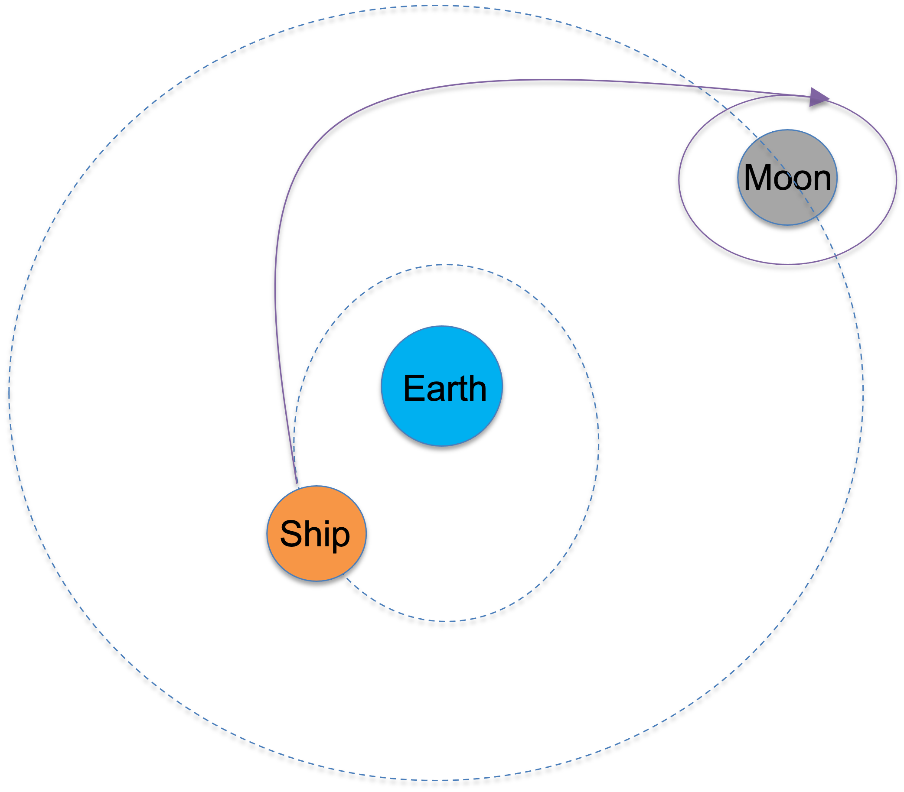
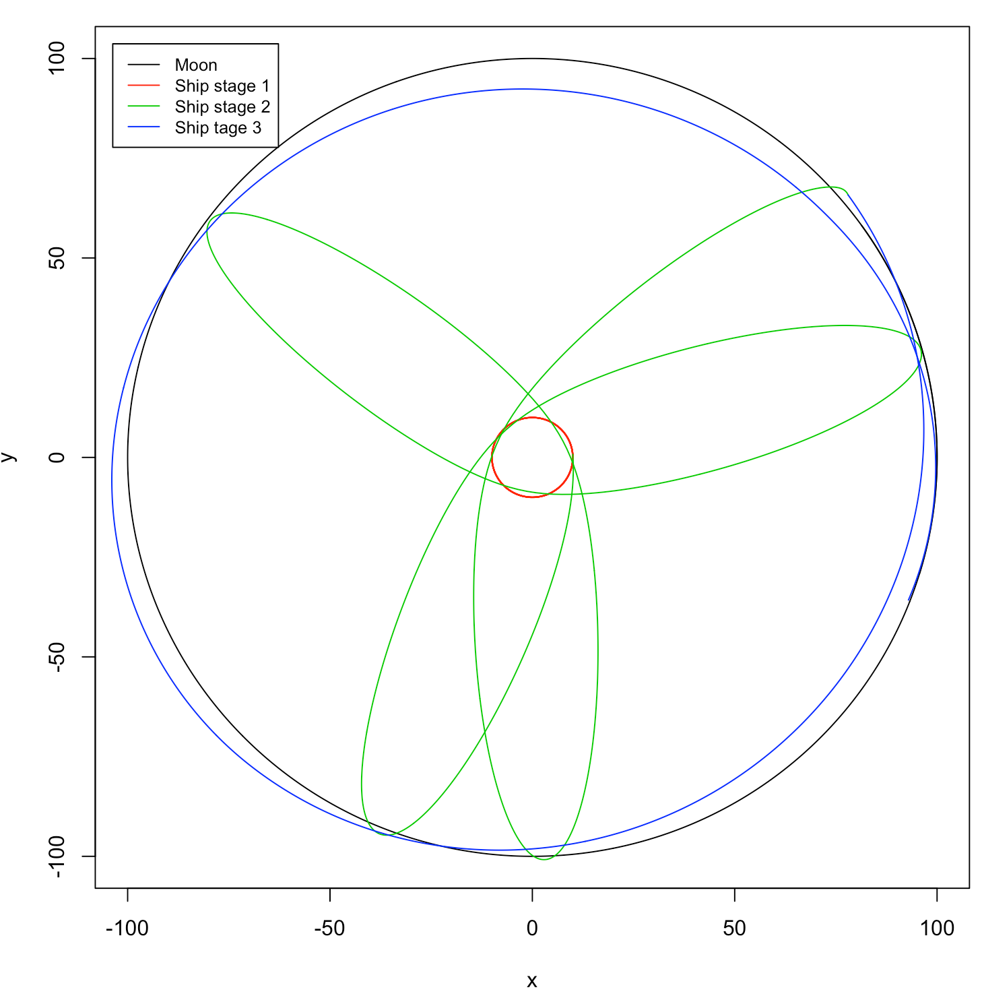
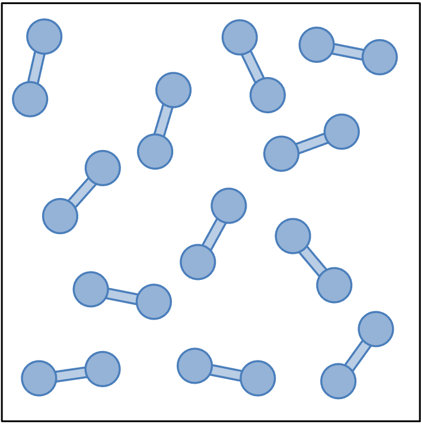
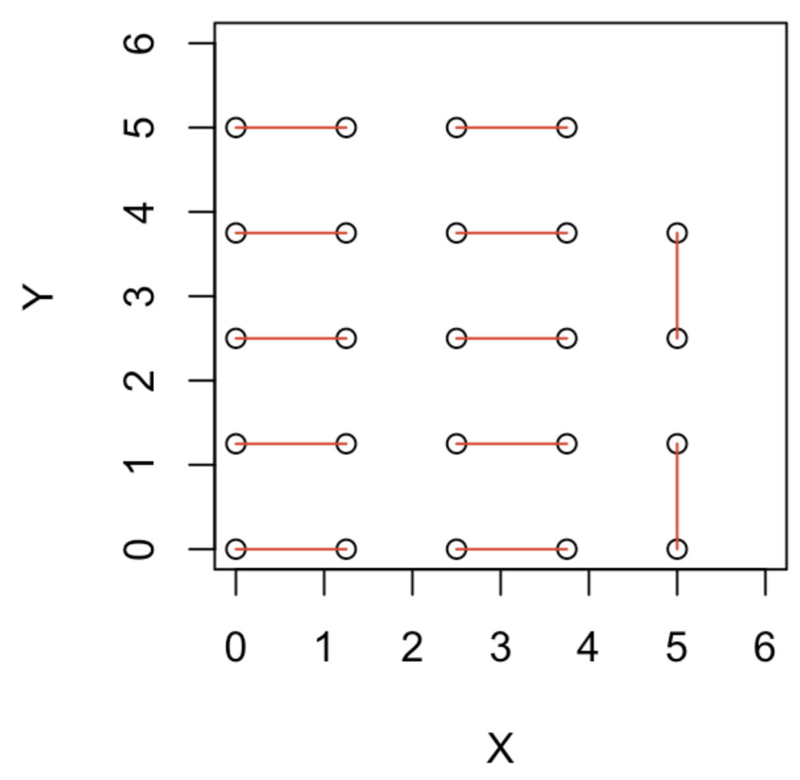

## 5D.1 The Artemis program

The goal is to fly a spaceship from the Earth to the Moon. We model two moving
bodies in the plane: a spaceship of negligible mass (say $10^{-16}$; the exact
value does not matter) and the Moon of mass $1$. The Earth is much heavier
(mass $100$), so we keep it fixed at the origin rather than treating it as a
moving particle. As in [Part 5B](05b-orbital-motion.qmd), the gravitational force
between two bodies is

$$ F(r) = \frac{G m_1 m_2}{r} , \tag{1} $$

with $G = 1$, $m_1$ and $m_2$ the two masses, and $r$ their separation. Any
integrator will do, though velocity Verlet is recommended.

{width=45% fig-align="center"}

**(a)** Write the functions that set up the Earth-Moon-spaceship simulation. The
system has two moving particles and four coordinates. The spaceship feels the
gravity of both the Earth and the Moon, while the Moon feels only the Earth (the
spaceship is far too light to move it).

**(b)** Find initial conditions for which the Moon travels on a wide orbit and the
spaceship on a tighter orbit around the Earth. The early trajectory need not be
perfectly stable.

**(c)** Give the spaceship an instantaneous boost, a change in the magnitude and
direction of its velocity, at one or more chosen times. Find a scenario in which
the spaceship eventually transfers into an orbit around the Moon. It is enough to
make it linger near the Moon for a while. An example of the Moon and spaceship
trajectories is shown below.

{width=55% fig-align="center"}

## 5D.2 A box of two-atom molecules

Consider $N_\text{tot} = 12$ identical molecules in a two-dimensional square box of
side $a = 6.25$. Each molecule is a pair of atoms joined by an elastic bond. The
system is governed by the potential

$$ U = \sum_{ij} \left( \frac{1}{12\, r_{ij}^{12}} - \frac{1}{6\, r_{ij}^{6}} \right) + \sum_{ij \in \text{bond}} \frac{1}{2} k (r_{ij} - l_\text{bond})^2 . \tag{2} $$

The first sum is the Lennard-Jones potential between every pair of atoms; the
second is the harmonic bond energy within each molecule. Use periodic boundary
conditions, atom mass $m_i = 1$, bond length $l_\text{bond} = 1.5$, and bond
stiffness $k = 10$.

{width=30% fig-align="center"}

**(a)** Design a suitable initial condition. Place the atoms so that each bond
starts near its rest length $l_\text{bond}$. It helps to give the two atoms of a
molecule consecutive indices (atoms 1 and 2 for molecule 1, atoms 3 and 4 for
molecule 2, and so on), each with an $x$ and a $y$ coordinate. The configuration
below is one example; other arrangements are fine.

{width=35% fig-align="center"}

**(b)** Write a function that computes the total force on each atom. It adds the
Lennard-Jones force between every pair of atoms and the harmonic bond force
between the two atoms of each molecule, applying the minimum image convention for
the periodic box.

**(c)** Write a velocity Verlet simulation of the box of $N_\text{tot} = 12$
molecules that respects the periodic boundaries.

**(d)** Run the simulation long enough to compute the two-dimensional radial
distribution function. [Part 5C](05c-box-of-particles.qmd) shows how to run such a
box simulation and compute $g(r)$ for 25 single-atom particles; adapt that
machinery to the two-atom molecules here.
