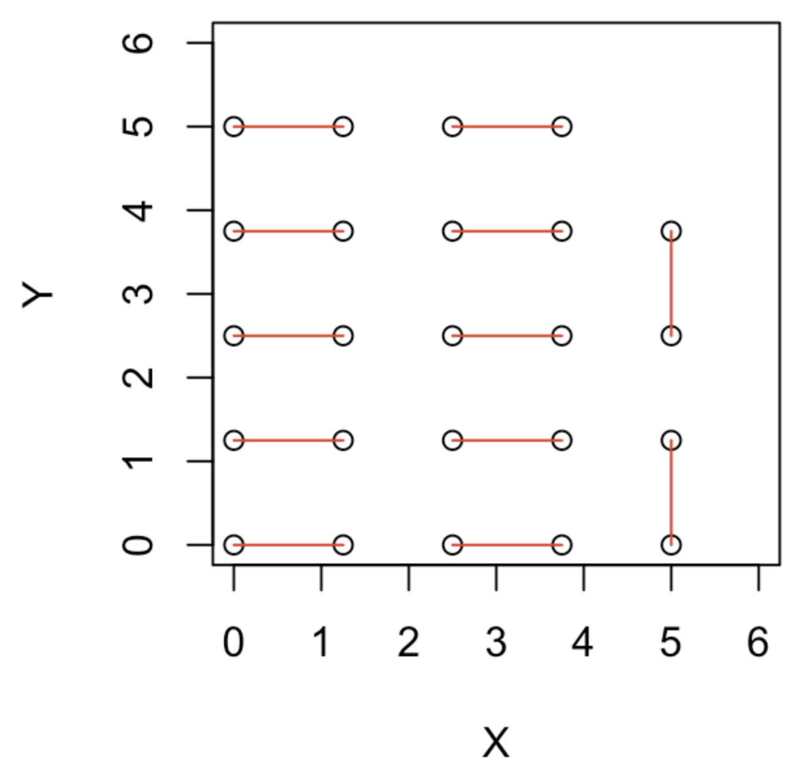

```{r setup, include=FALSE}
knitr::opts_chunk$set(echo = TRUE)
```

# 1. The Artemis program

We will perform a simulation to send a spaceship from the Earth to the Moon. In the simulation, we will model only two particles,a spaceship of tiny mass (*e.g.*, $10^{-16}$, the actual number doesn't matter) and the Moon of mass 1. Since the Earth is much heavier (mass 100), we consider the Earth as a fixed particle at the origin (there is no need to model the Earth explicitly as a particle). We will use the same two-dimensional description of the universe as described in Part 5B, where the gravitational force follows

$$ F(r) = \frac{Gm_1m_2}{r}. \tag{1}$$
$G$ is constant set to 1. $m_1$ and $m_2$ are the mass of the two particles involved in the gravitational force. $r$ is the distance between the two particles. Any integrator is fine to use, but the Velocity Verlet method is recommended.

<center> {width=40%} </center>

**(a)** Write scripts/functions to set up the simulation for the Earth/Moon/spaceship system.

Hints: The system contains 2 particles and 4 variables. The spaceship senses the gravitational force from both the Earth and the Moon, while the Moon only senses the gravitational force from the Earth as the mass of the spaceship is too small. 

**(b)** Find a condition where the Moon travels in a larger orbit and the spaceship travels in a smaller orbit around the Earth. 

Hint: The initial time trajectory does not need to be restrictively stable.

**(c)** Now we can give the spaceship an instantaneous "boost" or "decrease" by changing its velocity (magnitude and direction) at particular time point (or multiple speed changes at different time points). Find a scenario in your simulation that the spaceship would eventually transfer to an orbit around the Moon.

Hint: you just need to make the spaceship travel nearby the Moon for a while. An example of the Moon and spaceship trajectories is shown below.

<center> {width=50%} </center> 

# 2. Simulation of a box of two-atom molecules

Consider a system comprising $N_{tot} = 12$ identical molecules within a two-dimensional square box of dimensions $a = 6.25$. Each molecule consists of two atoms connected by an elastic bond, as depicted in Figure 3.

<center> {width=30%} </center> 

The system is governed by the following molecular potential:

$$U = \sum_{ij}{(\frac{1}{12r_{ij}^{12}} - \frac{1}{6r_{ij}^6})} + \sum_{ij \in bond}{\frac{1}{2}k(r_{ij}-l_{bond})^2} \tag{2} $$ 
The first term represents the Lennard-Jones potential between any two atoms, while the second term denotes the harmonic potential of the elastic bond for each molecule. The simulation accounts for periodic boundary conditions. Additionally, each atom has a mass of $m_i = 1$, a bond length of $l_{\text{bond}} = 1.5$, and a harmonic constant of $k = 10$.

**(a)** Designing a suitable initial condition. 

A suitable initial condition involves positioning atoms such that the initial bond lengths are close to $l_{\text{bond}}$. It's advantageous to label atoms in the same molecule with consecutive indices, e.g., atoms 1 and 2 for molecule 1, atoms 3 and 4 for molecule 2, and so forth. Each atom requires modeling for both $x$ and $y$ positions. The provided initial condition (Figure 4) offers an example, but alternative configurations are permissible.

<center> {width=30%} </center> 

**(b)** Computing total forces for each atom.

A function is necessary to compute the total force acting on each atom. This computation involves evaluating the Lennard-Jones force between any two atoms and the harmonic force between atoms within the same molecule. The implementation must adhere to periodic boundary conditions, necessitating the incorporation of the minimum image convention.

**(c)** Dynamics simulation using the velocity Verlet method

A code segment is required to perform a dynamics simulation of the box containing the $N_{\text{total}}=12$ molecules utilizing the velocity Verlet method. This simulation must account for periodic boundary conditions.

**(d)** Simulating the system and computing the 2D Radial Distribution Function (RDF)

The system should be simulated over a sufficiently extended period to compute the 2D radial distribution function. NumericalR 05C illustrated how to perform MD simulations involving a box containing 25 identical particles.

