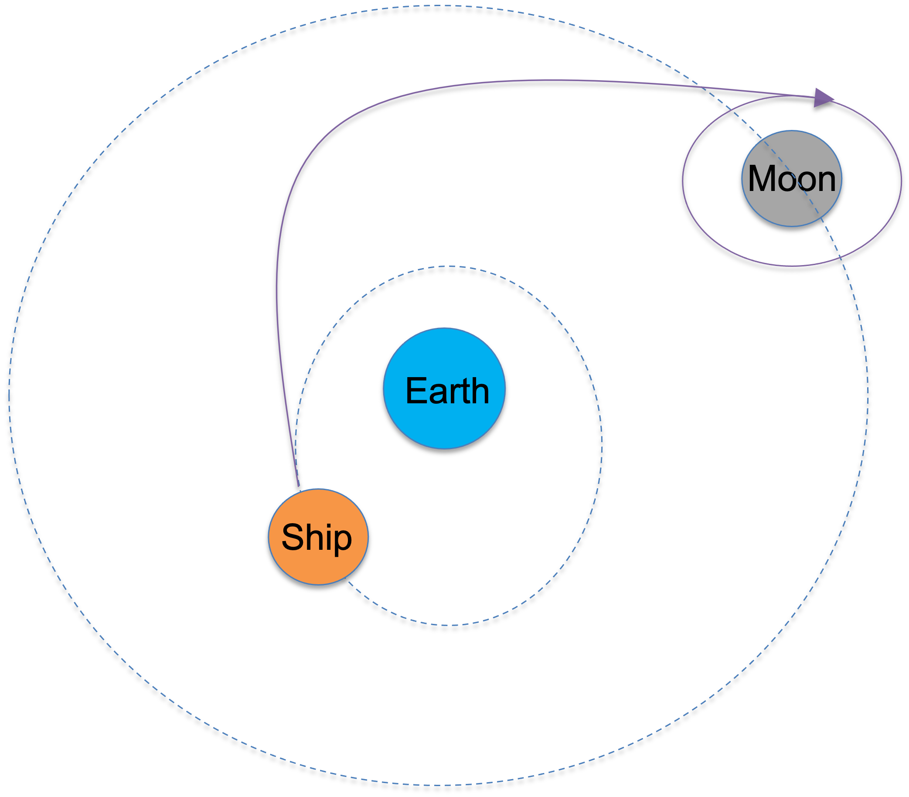
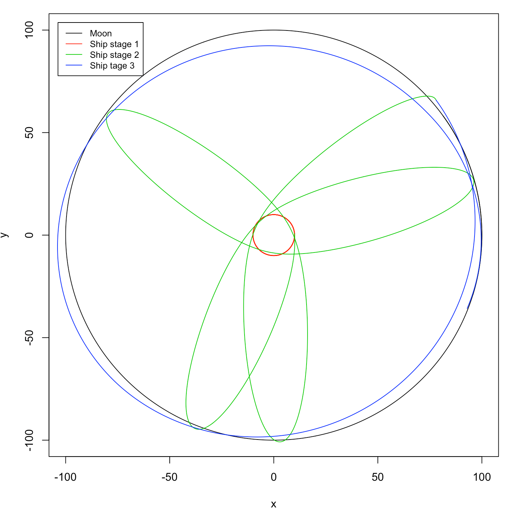
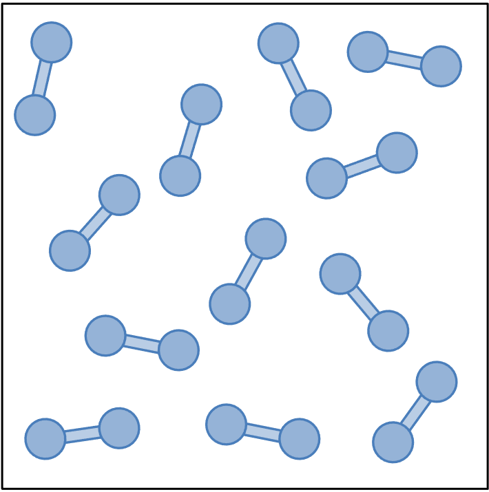

```{r setup, include=FALSE}
knitr::opts_chunk$set(echo = TRUE)
```

# 1. The Artemis program

We will perform a simulation to send a spaceship from the Earth to the Moon. In the simulation, we will model only two particles,a spaceship of tiny mass (*e.g.*, $10^{-16}$, the actual number doesn't matter) and the Moon of mass 1. Since the Earth is much heavier (mass 100), we consider the Earth as a fixed particle at the origin (there is no need to model the Earth explicitly as a particle). We will use the same two-dimensional description of the universe as described in Part 5B, where the gravitational force follows

$$ F(r) = \frac{Gm_1m_2}{r}. \tag{1}$$
$G$ is constant set to 1. $m_1$ and $m_2$ are the mass of the two particles involved in the gravitational force. $r$ is the distance between the two particles. Any integrator is fine to use, but the Velocity Verlet method is recommended.

<center> {width=40%} </center>

**(a)** Write scripts/functions to set up the simulation for the Earth/Moon/spaceship system.

Hints: The system contains 2 particles and 4 variables. The spaceship senses the gravitational force from both the Earth and the Moon, while the Moon only senses the gravitational force from the Earth as the mass of the spaceship is too small. 

**(b)** Find a condition where the Moon travels in a larger orbit and the spaceship travels in a smaller orbit around the Earth. 

Hint: The initial time trajectory does not need to be restrictively stable.

**(c)** Now we can give the spaceship an instantaneous "boost" or "decrease" by changing its velocity (magnitude and direction) at particular time point (or multiple speed changes at different time points). Find a scenario in your simulation that the spaceship would eventually transfer to an orbit around the Moon.

Hint: you just need to make the spaceship travel nearby the Moon for a while. An example of the Moon and spaceship trajectories is shown below.

<center> {width=50%} </center> 

# 2. Simulation of a box of two-atom molecules

We consider $N_{tot} = 15$ identical molecules in a two-dimensional square box of size $a = 6$. Each molecule consists of two atoms connected by an elastic bond. Figure 3 illustrates such a system.

<center> {width=30%} </center> 

We consider the following molecular potential

$$U = \sum_{ij}{(\frac{12}{r_{ij}^{12}} - \frac{6}{r_{ij}^6})} + \sum_{bond}{\frac{1}{2}kl_{bond}^2} \tag{2} $$ 
The first term is the Lennard Jones potential between any two atoms. The second term is the harmonic potential of the elastic bond for each molecule. We consider the periodic boundary condition. 

**(1)** Write a function to compute the total force for each atom.

**(2)** Write a code to perform a dynamics simulation of the box of the $N_{total}=15$ molecules using the velocity Verlet method. We consider the mass of each atom $m_i = 1$ (thus can be omitted), and $l_bond = 1$.

**(3)** Simulate the system for a sufficiently long time and compute the radial distribution function. 
