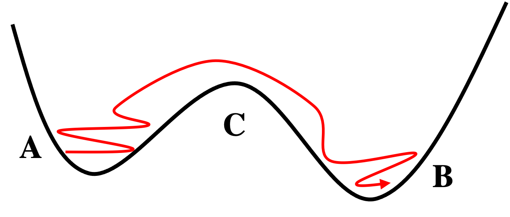

We now apply the SDE methods to the
[toggle switch](../02-odes/02a-modeling-gene-circuits.qmd), the mutually
repressing two-gene circuit whose deterministic phase plane we studied in
[Part 3](../03-phase-plane/03a-nullclines.qmd).
With gene-expression noise added, each rate equation gains a noise term and the
circuit becomes a two-variable SDE,

$$
\begin{cases}
\dfrac{dX}{dt} = g_{X0} + g_{X1}\dfrac{1}{1 + (Y/Y_0)^{n_Y}} - k_X X + s_X(X, Y)\,\eta_X(t) \\[2mm]
\dfrac{dY}{dt} = g_{Y0} + g_{Y1}\dfrac{1}{1 + (X/X_0)^{n_X}} - k_Y Y + s_Y(X, Y)\,\eta_Y(t)
\end{cases} \tag{1}
$$

We use constant noise, $s_X = s_Y = b$, so the Euler-Maruyama method applies. The
state is a vector $(X, Y)$, and the drift and noise functions return length-two
vectors.

## 6D.1 A toggle switch with noise

::: {.callout-note title="Recipe 6D.1.1"}
**Objective.** Simulate a two-gene toggle switch with noise and watch it hop between states.

**Model.** A toggle-switch SDE with mutual repression and constant additive noise, `dX = [gX0 + gX1/(1 + (Y/Y0)^nY) - kX*X]*dt + b*dW_X`, `dY = [gY0 + gY1/(1 + (X/X0)^nX) - kY*Y]*dt + b*dW_Y`, with X and Y kept non-negative.

**Method.** The Euler-Maruyama method for a two-variable SDE.

**Test.** `g0 = 10, g1 = 40, X0 = Y0 = 100, n = 4, k = 0.1` for both genes; noise `b = 20`; initial (X, Y) = (50, 200), to t = 1000, `dt = 0.01`; seed 3.

**Show.** A time-series plot of X and Y and a phase-plane plot, showing hops between the two states.

**Verification.** The switch is bistable (low-X/high-Y and high-X/low-Y states), and noise drives transitions where the trajectory hops between them, swapping which gene is highly expressed.
:::

### R implementation {.impl}

```{r}
hill_inh <- function(X, X0, n) 1 / (1 + (X/X0)^n)

# toggle-switch drift: input c(X, Y), output c(dX/dt, dY/dt)
f_ts <- function(t, X, b) {
  c(10 + 40 * hill_inh(X[2], 100, 4) - 0.1 * X[1],
    10 + 40 * hill_inh(X[1], 100, 4) - 0.1 * X[2])
}
noise_ts <- function(t, X, b) b            # constant noise c(s_X, s_Y)

# Euler-Maruyama for a 2D SDE (positions kept non-negative)
SDE_Euler_2D <- function(derivs_2D, noise_2D, X0, t.total, dt, ...){
  t_all <- seq(0, t.total, by = dt); n_all <- length(t_all)
  X_all <- matrix(0, nrow = n_all, ncol = 2); X_all[1,] <- X0
  dW_all <- array(rnorm(2*n_all, mean = 0, sd = sqrt(dt)), c(n_all, 2))
  for (i in 1:(n_all - 1)) {
    X <- X_all[i,] + dt * derivs_2D(t_all[i], X_all[i,], ...) + dW_all[i,] * noise_2D(t_all[i], X_all[i,], ...)
    X_all[i+1,] <- pmax(0, X)              # X, Y cannot go negative
  }
  return(cbind(t_all, X_all))
}

set.seed(3)
results <- SDE_Euler_2D(f_ts, noise_ts, X0 = c(50, 200), t.total = 1000, dt = 0.01, b = c(20, 20))

plot(NULL, xlab = "t", ylab = "Levels", xlim = c(0, 1000), ylim = c(0, 600))
lines(results[,1], results[,2], col = 2); lines(results[,1], results[,3], col = 3)
legend("topright", inset = 0.02, legend = c("X", "Y"), col = 2:3, lty = 1, cex = 0.8)
```

```{r}
#| fig-width: 5
#| fig-height: 5
#| out-width: "58%"
par(pty = "s")
plot(results[,2], results[,3], type = "l", lwd = 0.3, col = 1,
     xlab = "X", ylab = "Y", xlim = c(0, 500), ylim = c(0, 500), asp = 1)
```

### Python implementation {.impl}

```{python}
import numpy as np
import matplotlib.pyplot as plt

def hill_inh(X, X0, n):
    return 1 / (1 + (X/X0)**n)

# toggle-switch drift: input [X, Y], output [dX/dt, dY/dt]
def f_ts(t, X, b):
    return np.array([10 + 40 * hill_inh(X[1], 100, 4) - 0.1 * X[0],
                     10 + 40 * hill_inh(X[0], 100, 4) - 0.1 * X[1]])
def noise_ts(t, X, b):
    return b                                 # constant noise [s_X, s_Y]

# Euler-Maruyama for a 2D SDE (positions kept non-negative)
def SDE_Euler_2D(derivs_2D, noise_2D, X0, t_total, dt, **kwargs):
    t_all = np.arange(0, t_total + dt, dt); n_all = len(t_all)
    X_all = np.zeros((n_all, 2)); X_all[0] = X0
    dW_all = np.random.normal(0, np.sqrt(dt), size=(n_all, 2))
    for i in range(n_all - 1):
        X = X_all[i] + dt * derivs_2D(t_all[i], X_all[i], **kwargs) + dW_all[i] * noise_2D(t_all[i], X_all[i], **kwargs)
        X_all[i+1] = np.maximum(0, X)         # X, Y cannot go negative
    return np.column_stack((t_all, X_all))

np.random.seed(3)
results = SDE_Euler_2D(f_ts, noise_ts, X0=np.array([50, 200]), t_total=1000, dt=0.01, b=np.array([20, 20]))

plt.xlabel("t"); plt.ylabel("Levels"); plt.xlim(0, 1000); plt.ylim(0, 600)
plt.plot(results[:, 0], results[:, 1], color="red",   label="X")
plt.plot(results[:, 0], results[:, 2], color="green", label="Y")
plt.legend(loc="upper right"); plt.show()
```

```{python}
#| fig-width: 5
#| fig-height: 5
#| out-width: "58%"
plt.plot(results[:, 1], results[:, 2], color="black", linewidth=0.3)
plt.gca().set_aspect("equal")
plt.xlabel("X"); plt.ylabel("Y"); plt.xlim(0, 500); plt.ylim(0, 500); plt.show()
```

Like the self-activating gene, the toggle switch is bistable, here with a low-$X$
high-$Y$ state and a high-$X$ low-$Y$ state. The noise drives *state transitions*:
the trajectory hops between the two, swapping which gene is highly expressed, as
both the time series and the phase-plane view make clear.

## 6D.2 Counting state transitions

A useful statistic of such a bistable system is the *transition rate*, the number
of state transitions per unit time. By analogy, the circuit is a particle in a
double-well potential: a transition from basin A to basin B requires crossing the
barrier at C.

{width=55% fig-align="center"}

To count transitions from a trajectory we need a rule for which state the system
is in. We split the phase plane along the [separatrix](../03-phase-plane/03f-separatrix.qmd)
$Y = X$ (with constant noise this line is unchanged), then fit an ellipse to the
cloud of points on each side by eigen-decomposing its covariance matrix. A point
is assigned to a state only when it lies inside that state's ellipse; if it lies
outside both, the state is left unchanged, and a transition is recorded when the
system enters the opposite ellipse.

::: {.callout-note title="Recipe 6D.2.1"}
**Objective.** Count how often the noisy toggle switch jumps between its two states.

**Model.** The same toggle-switch SDE and trajectory as 6D.1 (seed 3, `b = 20`, `dt = 0.01`, to t = 1000).

**Method.** Counting transitions by fitting an ellipse to each state's cloud (from the covariance eigen-decomposition), assigning a point to a state when it lies inside that ellipse, and detecting a transition from the change in assigned state.

**Test.** The 6D.1 trajectory, with each state's ellipse axes enlarged by a factor of 1.5, splitting the plane along Y = X.

**Show.** The phase plane with the two fitted state ellipses, and the count and step of each detected transition.

**Verification.** The crude counter over-counts: a single boundary-jitter event registers as a cluster of transitions within a few steps, motivating a more robust statistic.
:::

### R implementation {.impl}

```{r}
#| fig-width: 5
#| fig-height: 5
#| out-width: "58%"
# fit an ellipse to a cloud of points via the covariance eigen-decomposition
set_ellipse <- function(mydata, factor = 1) {
  eig <- eigen(cov(mydata))
  list(mean = colMeans(mydata), axis = sqrt(eig$values) * factor, vec = eig$vectors)
}
get_ellipse_line <- function(e) {
  t <- seq(0, 2*pi, 0.01)
  pts <- cbind(e$axis[1]*cos(t), e$axis[2]*sin(t)) %*% t(e$vec)
  t(replicate(length(t), e$mean)) + pts
}

ell1 <- set_ellipse(results[results[,2] <  results[,3], 2:3], 1.5)   # state 1: X < Y
ell2 <- set_ellipse(results[results[,2] >= results[,3], 2:3], 1.5)   # state 2: X >= Y

par(pty = "s")
plot(results[,2], results[,3], type = "l", lwd = 0.3, col = 1,
     xlab = "X", ylab = "Y", xlim = c(0, 500), ylim = c(0, 500), asp = 1)
lines(get_ellipse_line(ell1), lwd = 2, col = 2)
lines(get_ellipse_line(ell2), lwd = 2, col = 3)
```

```{r}
# is a point inside an ellipse? (project onto its axes and compare)
within_ellipse <- function(X, e) {
  v <- X - e$mean
  abs(v %*% e$vec[,1]) <= e$axis[1] && abs(v %*% e$vec[,2]) <= e$axis[2]
}
get_state <- function(X, e1, e2) {
  if (within_ellipse(X, e1)) return(1)
  if (within_ellipse(X, e2)) return(2)
  return(NULL)                        # outside both: keep previous state
}

# state sequence over the trajectory, then the steps where transitions are detected
state_all <- unlist(apply(results[, 2:3], 1, function(X) get_state(X, ell1, ell2)))
which(diff(state_all) ==  1)    # steps of state 1 -> 2 transitions
which(diff(state_all) == -1)    # steps of state 2 -> 1 transitions
```

### Python implementation {.impl}

```{python}
#| fig-width: 5
#| fig-height: 5
#| out-width: "58%"
# fit an ellipse to a cloud of points via the covariance eigen-decomposition
def set_ellipse(mydata, factor=1):
    vals, vecs = np.linalg.eigh(np.cov(mydata, rowvar=False))
    return {"mean": mydata.mean(axis=0), "axis": np.sqrt(vals) * factor, "vec": vecs}

def get_ellipse_line(e):
    t = np.arange(0, 2*np.pi, 0.01)
    pts = np.column_stack([e["axis"][0]*np.cos(t), e["axis"][1]*np.sin(t)]) @ e["vec"].T
    return e["mean"] + pts

XY = results[:, 1:3]
ell1 = set_ellipse(XY[XY[:, 0] <  XY[:, 1]], 1.5)   # state 1: X < Y
ell2 = set_ellipse(XY[XY[:, 0] >= XY[:, 1]], 1.5)   # state 2: X >= Y

plt.plot(XY[:, 0], XY[:, 1], color="black", linewidth=0.3)
for e, c in [(ell1, "red"), (ell2, "green")]:
    line = get_ellipse_line(e); plt.plot(line[:, 0], line[:, 1], color=c, linewidth=2)
plt.gca().set_aspect("equal")
plt.xlabel("X"); plt.ylabel("Y"); plt.xlim(0, 500); plt.ylim(0, 500); plt.show()
```

```{python}
# is a point inside an ellipse? (project onto its axes and compare)
def within_ellipse(X, e):
    v = X - e["mean"]
    return abs(v @ e["vec"][:, 0]) <= e["axis"][0] and abs(v @ e["vec"][:, 1]) <= e["axis"][1]

def get_state(X, e1, e2):
    if within_ellipse(X, e1): return 1
    if within_ellipse(X, e2): return 2
    return None                          # outside both: keep previous state

states = np.array([s for s in (get_state(X, ell1, ell2) for X in XY) if s is not None])
d = np.diff(states)
print("1->2 at steps:", np.where(d ==  1)[0])   # steps of state 1 -> 2 transitions
print("2->1 at steps:", np.where(d == -1)[0])   # steps of state 2 -> 1 transitions
```

The ellipses capture most of each state's cloud (the factor of 1.5 enlarges the
axes to do so). Printing the step at which each transition is detected, rather than
just the total, exposes why the count is unreliable: several of them fall within a
few steps of one another, a $1 \to 2$ immediately followed by a $2 \to 1$ and
another $1 \to 2$. These are not separate events but a single trajectory jittering
back and forth across the boundary before it settles, with each wobble counted as a
transition. That over-counting, together with the slowness of the point-by-point R
loop, is why we turn to a more robust statistic.

## 6D.3 Mean first passage time

A more robust route to the rate is the *mean first passage time* (MFPT) $\tau$,
the average time to first reach the separatrix from a state
[@gardiner2009stochastic]. The transition rate follows from

$$ \kappa = \frac{1}{2\tau} . \tag{2} $$

The factor of two is because, on reaching the separatrix, the system is equally
likely to complete the transition or fall back, so the mean waiting time for a
full transition is $2\tau$. The algorithm records the current state, simulates
until the trajectory crosses to the other side, logs the passage time, waits a
fixed relaxation time, and repeats; averaging the passage times gives $\tau$.

Because this needs long simulations, we implement it in compiled Fortran, in
`sub_sde_2g.f90`. Its random numbers come from a
Park-Miller (Lehmer) generator [@park1988random] for uniform draws, converted to
Gaussian draws by the Marsaglia polar method [@box1958note]. The source is
compiled to a shared library,

```sh
gfortran -fpic -shared 06-stochastic/src/sub_sde_2g.f90 -o 06-stochastic/src/sub_sde_2g.so
```

which both languages then call: R through `.Fortran`, Python through `ctypes`. The
routine `sde_simulation(iseed, t_total, kappa, nrun)` returns the two transition
rates and the numbers of transitions counted.

::: {.callout-note title="Recipe 6D.3.1"}
**Objective.** Measure the transition rate of the noisy toggle switch from its mean first-passage time.

**Model.** The same two-variable toggle-switch SDE (`g0 = 10, g1 = 40`, threshold 100, `k = 0.1`, `n = 4` per gene, noise `b = 20`), implemented in compiled Fortran.

**Method.** The mean first-passage time: simulate until the trajectory crosses the separatrix, record the passage time, relax, and repeat, then take the rate `kappa = 1/(2*tau)` from the mean time tau.

**Test.** The compiled Fortran routine called from both R (`.Fortran`) and Python (`ctypes`); seed 11, total time `1e5`, `dt = 0.01`, relaxation time 100.

**Show.** The transition rates from R and from Python (identical for the same seed).

**Verification.** Both languages call the identical compiled routine with the same seed and return identical rates, showing the numerics live in the shared library; a longer total time gives more accurate rates.
:::

### R implementation {.impl}

```{r}
dyn.load("06-stochastic/src/sub_sde_2g.so")
out <- .Fortran("sde_simulation", as.integer(11), as.double(1e5),
                as.double(c(0, 0)), as.integer(c(0, 0)))
cat("transition rates (1->2, 2->1):", out[[3]], "\n")
cat("transitions counted:", out[[4]], "\n")
```

### Python implementation {.impl}

```{python}
import ctypes
lib = ctypes.CDLL("06-stochastic/src/sub_sde_2g.so")
seed = ctypes.c_int(11); t_total = ctypes.c_double(1e5)
kappa = (ctypes.c_double * 2)(); nrun = (ctypes.c_int * 2)()
lib.sde_simulation_(ctypes.byref(seed), ctypes.byref(t_total), kappa, nrun)   # same .so as R
print("transition rates (1->2, 2->1):", list(kappa))
print("transitions counted:", list(nrun))
```

In contrast to the crude counter above, both calls run the very same compiled
routine with the same seed, so they return bit-for-bit identical rates, a clean
demonstration that the numerics live in the shared library rather than in either
host language. For accurate rates the simulation
time should be pushed from $10^5$ toward $10^7$, or many runs combined in
parallel. For more complex circuits, though, finding the separatrix and deciding
the current state from $(X, Y)$ becomes much harder.
