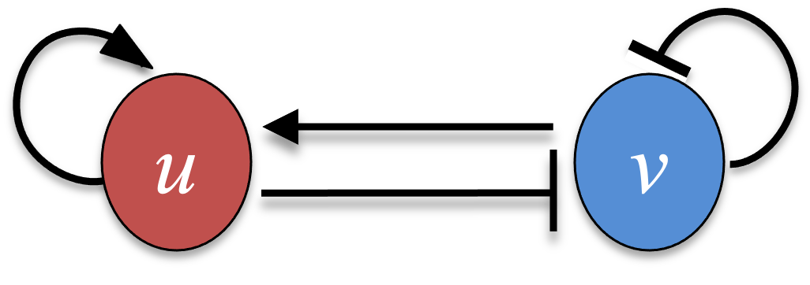
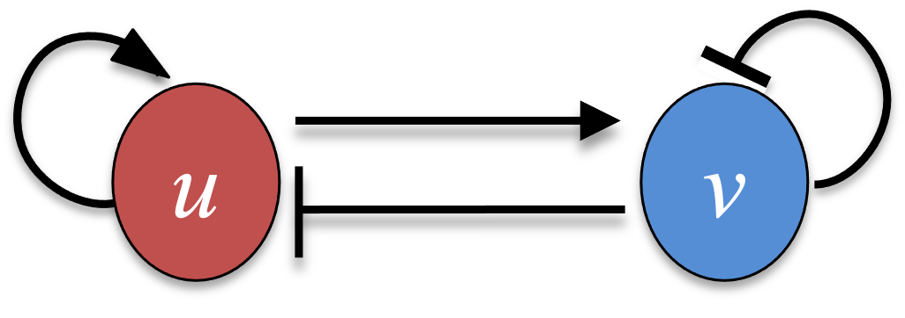

The diffusion equation of [Part 7A](07a-modeling-diffusion.qmd) and the single reaction-diffusion equation of [Part 7B](07b-reaction-diffusion.qmd) each followed one field in space. Many biological patterns instead arise from *two* interacting species that diffuse at different rates. For a two-component system of $u$ and $v$, the reaction-diffusion equations are

$$
\begin{aligned}
\frac{\partial u(X,t)}{\partial t} &= f(u,v,t) + D_u \frac{\partial^2 u(X,t)}{\partial X^2} , \\
\frac{\partial v(X,t)}{\partial t} &= g(u,v,t) + D_v \frac{\partial^2 v(X,t)}{\partial X^2} ,
\end{aligned} \tag{1}
$$

where $f$ and $g$ are the reaction terms and $D_u$, $D_v$ the two diffusion constants.

## 7C.1 A multi-component PDE integrator

We generalize the explicit finite-difference integrator of Part 7A to any number of components $n$. Writing $u_{k,i}^n$ for component $k$ at grid point $X_i$ and time step $n$, each component updates with its own reaction term and its own diffusion constant,

$$ u_{k,i}^{n+1} = u_{k,i}^n + f_k(\mathbf{u}_i^n)\,\Delta t + D_k \frac{\Delta t}{\Delta X^2}\left( u_{k,i+1}^n + u_{k,i-1}^n - 2 u_{k,i}^n \right) . \tag{2} $$

Here we use a *periodic* boundary condition, wrapping the grid so that the point past the right edge is the left edge and vice versa: for grid points $X_i$ with $i = 1, 2, \dots, n_\text{grid}$, we set $X_0 = X_{n_\text{grid}}$ and $X_{n_\text{grid}+1} = X_1$. This is the boundary anticipated in Part 7A; it suits a pattern that should tile space without an artificial edge.

::: {.callout-note title="Recipe 7C.1.1"}
**Objective.** Build a reaction-diffusion integrator for any number of coupled components.

**Model.** A generic n-component 1D reaction-diffusion system, `du_k/dt = f_k(u) + D_k*d2u_k/dX2`, with a reaction term per component and its own diffusion constant.

**Method.** A vectorized explicit forward-time centered-space integrator for multiple components, with periodic (wrap-around) boundaries.

**Test.** The generic solver `pde_fd_reaction_diffusion_multi(derivs, n, ngrid, dX, dt, D, ...)`, with D a length-n vector and the initial state an (n, ngrid) matrix.

**Show.** All components advanced together on the wrap-around grid (exercised in 7C.2).

**Verification.** The solver advances all components together on a wrap-around grid; from random initial perturbations, R and Python give patterns of the same wavelength at different positions.
:::

### R implementation {.impl}

```{r}
# finite-difference step for a generic multi-component reaction-diffusion system,
# periodic boundary condition
pde_fd_reaction_diffusion_multi <- function(derivs, n, ngrid, dX, dt, D, t0, t.total, p0, ...) {
  # derivs: reaction term, returns the vector (f, g, ...) at one grid point
  # n: number of components; D: vector of n diffusion constants
  # p0: initial condition, a matrix of (n, ngrid)
  t_all <- seq(t0, t.total, by = dt); nt_all <- length(t_all)
  factor <- D / dX^2 * dt
  p <- p0
  for (i in seq_len(nt_all - 1)) {
    p_plus  <- cbind(p[, -1], p[, 1])                 # P(X + dX), wraps at the right edge
    p_minus <- cbind(p[, ngrid], p[, 1:(ngrid - 1)])  # P(X - dX), wraps at the left edge
    f <- apply(p, 2, function(X) derivs(t_all[i], X, ...))  # reaction term at every grid point
    p <- p + f * dt + factor * (p_plus + p_minus - 2 * p)
  }
  return(p)
}
```

### Python implementation {.impl}

```{python}
import numpy as np
import matplotlib.pyplot as plt

# finite-difference step for a generic multi-component reaction-diffusion system,
# periodic boundary condition
def pde_fd_reaction_diffusion_multi(derivs, n, ngrid, dX, dt, D, t0, t_total, p0, **kwargs):
    # derivs: reaction term, returns the vector (f, g, ...) at one grid point
    # n: number of components; D: vector of n diffusion constants
    # p0: initial condition, an array of shape (n, ngrid)
    t_all = np.arange(t0, t_total + dt, dt); nt_all = len(t_all)
    factor = D / dX**2 * dt
    p = p0.copy()
    for i in range(nt_all - 1):
        p_plus  = np.roll(p, -1, axis=1)              # P(X + dX), wraps at the right edge
        p_minus = np.roll(p,  1, axis=1)              # P(X - dX), wraps at the left edge
        f = np.array([derivs(t_all[i], p[:, j], **kwargs) for j in range(ngrid)]).T
        p = p + f * dt + factor[:, None] * (p_plus + p_minus - 2 * p)
    return p
```

R shifts the grid with `cbind` and Python with `numpy.roll`; both wrap the array, which is exactly the periodic boundary. Because the initial condition is a small *random* perturbation of a uniform state, the R and Python runs start from different noise and so settle into patterns with the same wavelength but different peak positions.

## 7C.2 Turing instability

A two-component system may have a steady state that is stable when the two species are well mixed, yet becomes *unstable* once diffusion is allowed to act in space. The growing spatial modes then organize into a stationary pattern. Alan Turing predicted this diffusion-driven instability [@turing1952chemical], and it is now known as the Turing instability. Two broad classes of two-component systems produce it: the substrate-depletion model and the activator-inhibitor model. We illustrate both with the Gierer-Meinhardt model of biological pattern formation [@gierer1972theory].

In the substrate-depletion model, Equation (1) takes $D_u = d$, $D_v = 1$, and

$$
\begin{aligned}
f(u,v,t) &= u^2 v - u , \\
g(u,v,t) &= \mu (1 - u^2 v) ,
\end{aligned} \tag{3}
$$

so that $v$ acts as a substrate that activates $u$, while $u$ in turn depletes $v$.

{width=40% fig-align="center"}

The model has two parameters, $d$ and $\mu$. With a fast-diffusing substrate (small $d$) and a large $\mu$, the uniform state loses stability and a pattern forms. We run the integrator in successive blocks of time and plot the $u$ and $v$ profiles after each, starting from a nearly uniform state $u = v \approx 1$.

::: {.callout-note title="Recipe 7C.2.1"}
**Objective.** Reproduce Turing pattern formation and its two failure modes in a substrate-depletion model.

**Model.** The Gierer-Meinhardt substrate-depletion model, `f(u, v) = u^2*v - u`, `g(u, v) = mu*(1 - u^2*v)`, with the substrate v diffusing fast (`Dv = 1`) and u slow (`Du = d`).

**Method.** The multi-component finite-difference reaction-diffusion integrator (from 7C.1), run in successive time blocks.

**Test.** Domain length 20, `dX = 0.2`, `dt = 0.01`; nearly uniform initial `u = v = 1` with +-0.1 noise (seed 10); a pattern-forming case (`d = 0.1`, `mu = 1.5`), a case with close diffusion constants (`d = 0.8`), and an oscillating case (`d = 0.3`, `mu = 0.9`, initial `u = 2`).

**Show.** Plots of u(X) at successive times for each case: a stationary pattern, a flat state, and a uniform oscillation.

**Verification.** The same model gives three outcomes set by the diffusion ratio and mu: a stationary periodic Turing pattern, a homogeneous steady state, and a spatially uniform temporal oscillation.
:::

### R implementation {.impl}

```{r}
#| fig-width: 9
#| fig-height: 5.5
#| out-width: "95%"
#| rmar: false
turing_asdm <- function(t, p, mu) {
  u <- p[1]; v <- p[2]; u2v <- u * u * v
  c(u2v - u, mu * (1 - u2v))
}

run_turing <- function(derivs, D, mu, u0, ngrid, dX, dt, t.total_iter, nplot, ylim) {
  par(mfrow = c(2, 3), mar = c(4, 4, 2, 1))
  X_all <- (0:(ngrid - 1)) * dX
  u_now <- u0
  for (i in 0:(nplot - 1)) {
    if (i > 0)
      u_now <- pde_fd_reaction_diffusion_multi(derivs, n = 2, ngrid, dX, dt, D,
                                               t0 = 0, t.total = t.total_iter, p0 = u_now, mu = mu)
    plot(X_all, u_now[1, ], type = "l", col = "blue", xlab = "X", ylab = "u or v",
         xlim = c(0, 20), ylim = ylim, main = paste0("t = ", i * t.total_iter))
    lines(X_all, u_now[2, ], col = "red")
    legend("topright", inset = 0.02, legend = c("u", "v"),
           col = c("blue", "red"), lty = 1, cex = 0.8)
  }
}

set.seed(10)
l <- 20; dX <- 0.2; dt <- 0.01
ngrid <- as.integer(l / dX) + 1
u0 <- matrix(1 + runif(2 * ngrid, -0.1, 0.1), nrow = 2, ncol = ngrid)
run_turing(turing_asdm, D = c(0.1, 1), mu = 1.5, u0, ngrid, dX, dt,
           t.total_iter = 20, nplot = 6, ylim = c(0, 3))
```

### Python implementation {.impl}

```{python}
#| fig-width: 9
#| fig-height: 5.5
#| out-width: "95%"
def turing_asdm(t, p, mu):
    u, v = p[0], p[1]; u2v = u * u * v
    return np.array([u2v - u, mu * (1 - u2v)])

def run_turing(derivs, D, mu, u0, ngrid, dX, dt, t_total_iter, nplot, ylim):
    X_all = np.arange(0, ngrid) * dX
    fig, axs = plt.subplots(2, 3, figsize=(9, 5.5))
    u_now = u0.copy()
    for k, ax in enumerate(axs.flat):
        if k >= nplot:
            ax.axis("off"); continue
        if k > 0:
            u_now = pde_fd_reaction_diffusion_multi(derivs, 2, ngrid, dX, dt, D,
                                                    0, t_total_iter, u_now, mu=mu)
        ax.plot(X_all, u_now[0], "b-", label="u")
        ax.plot(X_all, u_now[1], "r-", label="v")
        ax.set(xlabel="X", ylabel="u or v", xlim=(0, 20), ylim=ylim,
               title=f"t = {k * t_total_iter}")
        ax.legend(loc="upper right")
    plt.tight_layout(); plt.show()

np.random.seed(10)
l = 20; dX = 0.2; dt = 0.01
ngrid = int(l / dX) + 1
u0 = 1 + np.random.uniform(-0.1, 0.1, (2, ngrid))
run_turing(turing_asdm, np.array([0.1, 1]), 1.5, u0, ngrid, dX, dt,
           t_total_iter=20, nplot=6, ylim=(0, 3))
```

The uniform state breaks up into a periodic array of peaks in $u$ and $v$: a Turing pattern. The peak spacing is set by the fastest-growing unstable mode, so both languages produce the same wavelength even though their random starts place the peaks differently.

When the two diffusion constants are close, the mechanism fails. With $d = 0.8$ (so $D_u$ and $D_v$ differ little) the perturbations decay and the system returns to a homogeneous state.

### R implementation {.impl}

```{r}
#| fig-width: 9
#| fig-height: 5.5
#| out-width: "95%"
#| rmar: false
set.seed(10)
u0 <- matrix(1 + runif(2 * ngrid, -0.1, 0.1), nrow = 2, ncol = ngrid)
run_turing(turing_asdm, D = c(0.8, 1), mu = 1.5, u0, ngrid, dX, dt,
           t.total_iter = 20, nplot = 6, ylim = c(0, 2))
```

### Python implementation {.impl}

```{python}
#| fig-width: 9
#| fig-height: 5.5
#| out-width: "95%"
np.random.seed(10)
u0 = 1 + np.random.uniform(-0.1, 0.1, (2, ngrid))
run_turing(turing_asdm, np.array([0.8, 1]), 1.5, u0, ngrid, dX, dt,
           t_total_iter=20, nplot=6, ylim=(0, 2))
```

A different failure mode appears at $d = 0.3$, $\mu = 0.9$: the system oscillates in *time* while staying uniform in *space*. Every grid point moves together, so each snapshot is flat, but the common level rises and falls.

### R implementation {.impl}

```{r}
#| fig-width: 9
#| fig-height: 5.5
#| out-width: "95%"
#| rmar: false
set.seed(10)
u0 <- matrix(2 + runif(2 * ngrid, -0.1, 0.1), nrow = 2, ncol = ngrid)
run_turing(turing_asdm, D = c(0.3, 1), mu = 0.9, u0, ngrid, dX, dt,
           t.total_iter = 1, nplot = 6, ylim = c(0, 5))
```

### Python implementation {.impl}

```{python}
#| fig-width: 9
#| fig-height: 5.5
#| out-width: "95%"
np.random.seed(10)
u0 = 2 + np.random.uniform(-0.1, 0.1, (2, ngrid))
run_turing(turing_asdm, np.array([0.3, 1]), 0.9, u0, ngrid, dX, dt,
           t_total_iter=1, nplot=6, ylim=(0, 5))
```

To see the oscillation, we track $u$ and $v$ at the middle grid point over a longer run. They trace out a sustained limit cycle rather than settling to a fixed level.

### R implementation {.impl}

```{r}
set.seed(10)
u0 <- matrix(2 + runif(2 * ngrid, -0.1, 0.1), nrow = 2, ncol = ngrid)
niter <- 100; mid <- ngrid %/% 2 + 1
traj <- matrix(0, nrow = niter + 1, ncol = 3)
traj[1, ] <- c(0, u0[, mid])
u_now <- u0
for (i in 1:niter) {
  u_now <- pde_fd_reaction_diffusion_multi(turing_asdm, n = 2, ngrid, dX, dt, D = c(0.3, 1),
                                           t0 = 0, t.total = 1, p0 = u_now, mu = 0.9)
  traj[i + 1, ] <- c(i, u_now[, mid])
}
plot(traj[, 1], traj[, 2], type = "l", col = "blue", xlab = "t", ylab = "u or v", ylim = c(0, 3))
lines(traj[, 1], traj[, 3], col = "red")
legend("topright", inset = 0.02, legend = c("u", "v"), col = c("blue", "red"), lty = 1, cex = 0.8)
```

### Python implementation {.impl}

```{python}
np.random.seed(10)
u0 = 2 + np.random.uniform(-0.1, 0.1, (2, ngrid))
niter = 100; mid = ngrid // 2
traj = np.zeros((niter + 1, 3))
traj[0] = [0, *u0[:, mid]]
u_now = u0.copy()
for i in range(1, niter + 1):
    u_now = pde_fd_reaction_diffusion_multi(turing_asdm, 2, ngrid, dX, dt, np.array([0.3, 1]),
                                            0, 1, u_now, mu=0.9)
    traj[i] = [i, *u_now[:, mid]]
plt.plot(traj[:, 0], traj[:, 1], color="blue", label="u")
plt.plot(traj[:, 0], traj[:, 2], color="red", label="v")
plt.xlabel("t"); plt.ylabel("u or v"); plt.ylim(0, 3)
plt.legend(loc="upper right"); plt.show()
```

The same two-component model thus supports three qualitatively different outcomes, selected by the diffusion ratio $d$ and the parameter $\mu$: a stationary Turing pattern, a homogeneous steady state, and a spatially uniform temporal oscillation.

## 7C.3 An activator-inhibitor model

A second route to a Turing pattern is the activator-inhibitor model. Equation (1) again takes $D_u = d$, $D_v = 1$, now with

$$
\begin{aligned}
f(u,v,t) &= u^2 / v - u , \\
g(u,v,t) &= \mu (u^2 - v) ,
\end{aligned} \tag{4}
$$

where $u$ is a self-enhancing activator that also drives the inhibitor $v$, while $v$ suppresses $u$. As before, the inhibitor diffuses much faster than the activator, the "local self-enhancement, long-range inhibition" that underlies Gierer-Meinhardt patterning [@gierer1972theory].

{width=40% fig-align="center"}

With $d = 0.1$ and $\mu = 1.5$ the model again forms a Turing pattern, but here $u$ and $v$ peak together in space rather than out of phase.

::: {.callout-note title="Recipe 7C.3.1"}
**Objective.** Form a Turing pattern from an activator-inhibitor model and contrast it with substrate depletion.

**Model.** The Gierer-Meinhardt activator-inhibitor model, `f(u, v) = u^2/v - u`, `g(u, v) = mu*(u^2 - v)`, with `Du = d` slow and `Dv = 1` fast (local self-enhancement, long-range inhibition).

**Method.** The multi-component finite-difference reaction-diffusion integrator (from 7C.1), run in successive time blocks.

**Test.** Domain length 20, `dX = 0.2`, `dt = 0.01`, `d = 0.1`, `mu = 1.5`; nearly uniform initial `u = v = 1` with +-0.1 noise (seed 10).

**Show.** A plot of u(X) and v(X) forming a stationary periodic pattern, peaking together.

**Verification.** It forms a stationary periodic Turing pattern, but with u and v peaking together rather than out of phase as in the substrate-depletion case.
:::

### R implementation {.impl}

```{r}
#| fig-width: 9
#| fig-height: 5.5
#| out-width: "95%"
#| rmar: false
turing_aim <- function(t, p, mu) {
  u <- p[1]; v <- p[2]
  c(u^2 / v - u, mu * u^2 - v)
}

set.seed(10)
u0 <- matrix(1 + runif(2 * ngrid, -0.1, 0.1), nrow = 2, ncol = ngrid)
run_turing(turing_aim, D = c(0.1, 1), mu = 1.5, u0, ngrid, dX, dt,
           t.total_iter = 5, nplot = 6, ylim = c(0, 2))
```

### Python implementation {.impl}

```{python}
#| fig-width: 9
#| fig-height: 5.5
#| out-width: "95%"
def turing_aim(t, p, mu):
    u, v = p[0], p[1]
    return np.array([u**2 / v - u, mu * u**2 - v])

np.random.seed(10)
u0 = 1 + np.random.uniform(-0.1, 0.1, (2, ngrid))
run_turing(turing_aim, np.array([0.1, 1]), 1.5, u0, ngrid, dX, dt,
           t_total_iter=5, nplot=6, ylim=(0, 2))
```

Both Gierer-Meinhardt variants generate stationary periodic patterns from an almost uniform start, the hallmark of the Turing instability: a difference in diffusion rates destabilizes a state that would be stable without diffusion.
