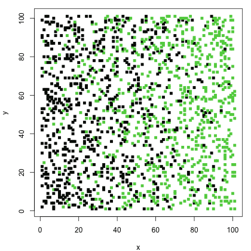
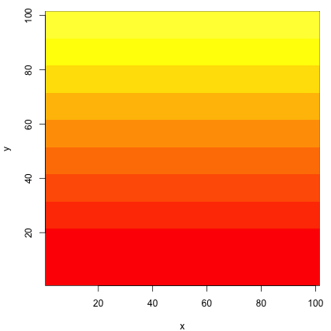

The finite-difference machinery of [Part 7A](07a-modeling-diffusion.qmd) also drives
a very different kind of model, in which a continuous chemical field is coupled to
discrete, excitable cells. The social amoeba *Dictyostelium discoideum* aggregates
by relaying pulses of cyclic AMP (cAMP), and the relayed pulses organize into
rotating spiral waves. Here we reproduce that pattern with the model of Kessler and
Levine [@kessler1993pattern], who represent the cells as discrete excitable entities
(they call them *bions*) sitting on a lattice through which cAMP diffuses.

The model has two coupled parts. The cAMP concentration $c(X, Y, t)$ is a single
continuous field on a two-dimensional lattice, and it obeys a reaction-diffusion
equation,

$$ \frac{\partial c}{\partial t} = a^2 \left( \frac{\partial^2 c}{\partial X^2} + \frac{\partial^2 c}{\partial Y^2} \right) - k c + s(X, Y, t) , \tag{1} $$

where $a$ is the lattice spacing, $k$ the cAMP degradation rate, and $s$ the cAMP
secreted by cells. On top of this field sit the cells, placed at random lattice
points with density $\rho$. Each cell is an excitable element that cycles through
three states:

- **inactive** (state 1): the resting state; the cell waits here until the local
  cAMP rises above a threshold $c_T$;
- **excited** (state 2): once $c > c_T$, the cell fires, secreting cAMP at rate
  $\Delta c / t_e$ for a fixed excitation time $t_e$;
- **refractory** (state 3): after firing, the cell cannot respond for a recovery
  time $t_r$, after which it returns to inactive.

The firing cells are the source term $s$ in Equation (1), so an excited cell raises
the cAMP of its neighbors, which can push them over threshold in turn. This relay is
what propagates a wave.

We discretize Equation (1) exactly as in Part 7A, but now in two dimensions. With
lattice spacing $a = \Delta X = 1$, the centered second difference gives the
five-point Laplacian,

$$ \nabla^2 c \approx c_{i+1,j} + c_{i-1,j} + c_{i,j+1} + c_{i,j-1} - 4 c_{i,j} , \tag{2} $$

and we impose a *no-flux* (Neumann) boundary by copying each edge value from its
inward neighbor, so that no cAMP leaves the domain.

## 7D.1 Model setup

We place `ncell` cells at random on an $n \times n$ lattice and give cAMP an initial
linear gradient (from 0 to 2, mean 1) across the lattice in one direction. The
fraction of cells that start in the refractory state rises linearly in the
*perpendicular* direction. This offset between the chemical gradient and the
refractory gradient breaks the symmetry and seeds a single rotating spiral rather
than concentric target waves.

### R implementation {.impl}

```{r}
# place cells at random lattice points; set the initial cAMP gradient and cell states
init_cells <- function(n, ncell, p, t_r) {
  ind <- sort(sample(n * n, ncell))                # random linear grid indices
  ind_x <- (ind - 1) %% n + 1                      # grid coordinates of each cell
  ind_y <- (ind - 1) %/% n + 1
  con <- matrix(seq(0, 2, length.out = n), n, n, byrow = TRUE)   # linear cAMP gradient
  states <- rep(1L, ncell); clocks <- numeric(ncell)
  refr <- runif(ncell) < ind_x / n * p             # seed refractory cells along one axis
  states[refr] <- 3L; clocks[refr] <- t_r
  list(states = states, ind_x = ind_x, ind_y = ind_y, con = con, clocks = clocks)
}

# model parameters
n <- 101; rho <- 0.15; con_t <- 1; dc <- 300; k <- 0.5
t_e <- 2; t_r <- 20; p <- 1; t_total <- 150; dt <- 0.01; nframe <- 151
heat <- heat.colors(11); brk <- c(seq(0, 2, 0.2), 100)   # yellow = high cAMP, red = low

set.seed(1)
ncell <- as.integer(n * n * rho)
dat <- init_cells(n, ncell, p, t_r)
```

```{r}
#| fig-width: 9
#| fig-height: 4.8
#| out-width: "95%"
#| rmar: false
par(mfrow = c(1, 2), pty = "s", mar = c(4, 4, 2, 1))
# cells (black = inactive, green = refractory) and the initial cAMP gradient
plot(dat$ind_x, dat$ind_y, col = dat$states, pch = 15, cex = 0.6,
     xlab = "x", ylab = "y", main = "cell states")
image(1:n, 1:n, dat$con, col = heat, breaks = brk, xlab = "x", ylab = "y", main = "cAMP")
```

### Python implementation {.impl}

```{python}
import numpy as np
import matplotlib.pyplot as plt
from matplotlib.colors import ListedColormap, BoundaryNorm

# discrete heat palette matching R's heat.colors(11): red (low) to yellow (high)
HEAT = ["#FF0000", "#FF2000", "#FF4000", "#FF6000", "#FF8000", "#FF9F00",
        "#FFBF00", "#FFDF00", "#FFFF00", "#FFFF40", "#FFFFBF"]
BRK = list(np.arange(0, 2.01, 0.2)) + [100]
CMAP = ListedColormap(HEAT); NORM = BoundaryNorm(BRK, CMAP.N)
COL = np.array(["black", "red", "green"])         # inactive, excited, refractory

# place cells at random lattice points; set the initial cAMP gradient and cell states
def init_cells(n, ncell, p, t_r, rng):
    ind = np.sort(rng.choice(n * n, ncell, replace=False))    # random linear grid indices
    ind_x = ind % n; ind_y = ind // n                         # grid coordinates of each cell
    con = np.tile(np.linspace(0, 2, n), (n, 1))               # linear cAMP gradient
    states = np.ones(ncell, dtype=int); clocks = np.zeros(ncell)
    refr = rng.random(ncell) < ind_x / n * p                  # seed refractory cells along one axis
    states[refr] = 3; clocks[refr] = t_r
    return dict(states=states, ind_x=ind_x, ind_y=ind_y, con=con, clocks=clocks)

# model parameters
n = 101; rho = 0.15; con_t = 1; dc = 300; k = 0.5
t_e = 2; t_r = 20; p = 1; t_total = 150; dt = 0.01; nframe = 151

rng = np.random.default_rng(1)
ncell = int(n * n * rho)
dat = init_cells(n, ncell, p, t_r, rng)
```

```{python}
#| fig-width: 9
#| fig-height: 4.8
#| out-width: "95%"
fig, ax = plt.subplots(1, 2, figsize=(9, 4.8))
# cells (black = inactive, green = refractory) and the initial cAMP gradient
ax[0].scatter(dat["ind_x"], dat["ind_y"], c=COL[dat["states"] - 1], s=6, marker="s")
ax[0].set(xlabel="x", ylabel="y", title="cell states", aspect="equal")
ax[1].imshow(dat["con"].T, origin="lower", cmap=CMAP, norm=NORM, aspect="equal")
ax[1].set(xlabel="x", ylabel="y", title="cAMP")
plt.tight_layout(); plt.show()
```

The left panel shows the cells, colored black for inactive and green for refractory
(no cell is excited yet); the right panel shows the smooth initial cAMP gradient.
Because R and Python draw independent random cell placements, the two starting
configurations differ in detail while sharing the same statistics.

## 7D.2 Simulation

Each time step does two things: it advances every cell through the state machine
described above, then updates the cAMP field with one explicit finite-difference
step of Equation (1), adding the secreted cAMP at the location of every excited
cell. We write the cell update as vectorized operations over all cells at once,
which keeps the R and Python versions identical in structure and fast enough to run
the full simulation inline.

### R implementation {.impl}

```{r}
# advance all cells one step through the inactive -> excited -> refractory cycle
update_states <- function(dat, con_t, t_e, t_r, dt) {
  s <- dat$states; clk <- dat$clocks
  con_cell <- dat$con[cbind(dat$ind_x, dat$ind_y)]   # local cAMP at each cell
  fire    <- s == 1L & con_cell >= con_t             # inactive -> excited (over threshold)
  ex_done <- s == 2L & clk < dt                      # excited -> refractory (excitation over)
  rf_done <- s == 3L & clk < dt                      # refractory -> inactive (recovered)
  tick    <- (s == 2L | s == 3L) & clk >= dt         # otherwise keep counting down
  clk[tick] <- clk[tick] - dt
  s[fire] <- 2L;    clk[fire] <- t_e
  s[ex_done] <- 3L; clk[ex_done] <- t_r
  s[rf_done] <- 1L; clk[rf_done] <- 0
  dat$states <- s; dat$clocks <- clk
  dat
}

# run the coupled cell + cAMP model, saving nframe snapshots
dicty_modeling <- function(dat, n, con_t, dc, k, t_e, t_r, t_total, dt, nframe) {
  nt <- as.integer(t_total / dt); rate_c <- dc / t_e
  save_every <- as.integer(nt / (nframe - 1)); ncell <- length(dat$states)
  states_all <- matrix(0L, nframe, ncell)
  con_all <- array(0, c(nframe, n, n))
  states_all[1, ] <- dat$states; con_all[1, , ] <- dat$con
  l <- 1
  for (step in seq_len(nt)) {
    dat <- update_states(dat, con_t, t_e, t_r, dt)
    con <- dat$con
    c_xp <- rbind(con[-1, ], con[n, ]); c_xm <- rbind(con[1, ], con[-n, ])   # no-flux BC
    c_yp <- cbind(con[, -1], con[, n]); c_ym <- cbind(con[, 1], con[, -n])
    dcdt <- (c_xp + c_xm + c_yp + c_ym - 4 * con) - k * con          # diffusion - degradation
    ex <- dat$states == 2L                                           # excited cells secrete cAMP
    if (any(ex)) dcdt[cbind(dat$ind_x[ex], dat$ind_y[ex])] <-
        dcdt[cbind(dat$ind_x[ex], dat$ind_y[ex])] + rate_c
    dat$con <- con + dcdt * dt
    if (step %% save_every == 0) {
      l <- l + 1; states_all[l, ] <- dat$states; con_all[l, , ] <- dat$con
    }
  }
  list(states = states_all, con = con_all, ind_x = dat$ind_x, ind_y = dat$ind_y)
}

res <- dicty_modeling(dat, n, con_t, dc, k, t_e, t_r, t_total, dt, nframe)
```

```{r}
#| fig-width: 9
#| fig-height: 4.8
#| out-width: "95%"
#| rmar: false
par(mfrow = c(1, 2), pty = "s", mar = c(4, 4, 2, 1))
frame <- 80                                          # a snapshot partway through
plot(res$ind_x, res$ind_y, col = res$states[frame, ], pch = 15, cex = 0.6,
     xlab = "x", ylab = "y", main = "cell states")
image(1:n, 1:n, res$con[frame, , ], col = heat, breaks = brk,
      xlab = "x", ylab = "y", main = "cAMP")
```

### Python implementation {.impl}

```{python}
# advance all cells one step through the inactive -> excited -> refractory cycle
def update_states(dat, con_t, t_e, t_r, dt):
    s = dat["states"]; clk = dat["clocks"]
    con_cell = dat["con"][dat["ind_x"], dat["ind_y"]]   # local cAMP at each cell
    fire    = (s == 1) & (con_cell >= con_t)            # inactive -> excited (over threshold)
    ex_done = (s == 2) & (clk < dt)                     # excited -> refractory (excitation over)
    rf_done = (s == 3) & (clk < dt)                     # refractory -> inactive (recovered)
    tick    = ((s == 2) | (s == 3)) & (clk >= dt)       # otherwise keep counting down
    clk[tick] -= dt
    s[fire] = 2;    clk[fire] = t_e
    s[ex_done] = 3; clk[ex_done] = t_r
    s[rf_done] = 1; clk[rf_done] = 0
    return dat

# run the coupled cell + cAMP model, saving nframe snapshots
def dicty_modeling(dat, n, con_t, dc, k, t_e, t_r, t_total, dt, nframe):
    nt = int(t_total / dt); rate_c = dc / t_e
    save_every = nt // (nframe - 1); ncell = len(dat["states"])
    states_all = np.zeros((nframe, ncell), dtype=int)
    con_all = np.zeros((nframe, n, n))
    states_all[0] = dat["states"]; con_all[0] = dat["con"]
    l = 0
    for step in range(1, nt + 1):
        dat = update_states(dat, con_t, t_e, t_r, dt)
        con = dat["con"]
        c_xp = np.vstack([con[1:], con[-1:]]); c_xm = np.vstack([con[:1], con[:-1]])   # no-flux BC
        c_yp = np.hstack([con[:, 1:], con[:, -1:]]); c_ym = np.hstack([con[:, :1], con[:, :-1]])
        dcdt = (c_xp + c_xm + c_yp + c_ym - 4 * con) - k * con         # diffusion - degradation
        ex = dat["states"] == 2                                        # excited cells secrete cAMP
        np.add.at(dcdt, (dat["ind_x"][ex], dat["ind_y"][ex]), rate_c)
        dat["con"] = con + dcdt * dt
        if step % save_every == 0:
            l += 1; states_all[l] = dat["states"]; con_all[l] = dat["con"]
    return dict(states=states_all, con=con_all, ind_x=dat["ind_x"], ind_y=dat["ind_y"])

res = dicty_modeling(dat, n, con_t, dc, k, t_e, t_r, t_total, dt, nframe)
```

```{python}
#| fig-width: 9
#| fig-height: 4.8
#| out-width: "95%"
fig, ax = plt.subplots(1, 2, figsize=(9, 4.8))
frame = 79                                           # a snapshot partway through
ax[0].scatter(res["ind_x"], res["ind_y"], c=COL[res["states"][frame] - 1], s=6, marker="s")
ax[0].set(xlabel="x", ylabel="y", title="cell states", aspect="equal")
ax[1].imshow(res["con"][frame].T, origin="lower", cmap=CMAP, norm=NORM, aspect="equal")
ax[1].set(xlabel="x", ylabel="y", title="cAMP")
plt.tight_layout(); plt.show()
```

Partway through the run, both the cells and the cAMP field have organized into a
rotating spiral. In the cAMP panel the bright band (high cAMP) is the wave crest; in
the cell panel the excited cells (red) sit on that crest, trailed by a band of
refractory cells (green), with inactive cells (black) waiting ahead of the front.
The spiral rotates around the point where the chemical and refractory gradients
cross. As before, R and Python evolve independent random realizations, so each
produces its own spiral of the same character rather than an identical picture.

## 7D.3 Animation

A single snapshot only hints at the dynamics. To watch the spiral rotate, we render
every saved frame to a PNG and assemble the frames into an animated GIF. In R we use
`magick` (the same ImageMagick tool used elsewhere in the book), and in Python
`matplotlib.animation`. The animation code below is shown as a listing you can run;
the resulting GIFs are pre-generated and embedded so the book does not rebuild them
on every render.

### R implementation {.impl}

```r
library(magick)

# cell-state animation
for (i in seq_len(nframe)) {
  png(sprintf("state_%04d.png", i), width = 480, height = 480)
  par(mar = c(4, 4, 1, 1))
  plot(res$ind_x, res$ind_y, col = res$states[i, ], pch = 15, cex = 1,
       xlab = "x", ylab = "y")
  dev.off()
}
image_read(Sys.glob("state_*.png")) |> image_animate(fps = 10, optimize = TRUE) |>
  image_write("images/07D/dicty_states.gif")
file.remove(Sys.glob("state_*.png"))

# cAMP concentration animation
for (i in seq_len(nframe)) {
  png(sprintf("con_%04d.png", i), width = 480, height = 480)
  par(mar = c(4, 4, 1, 1))
  image(1:n, 1:n, res$con[i, , ], col = heat, breaks = brk, xlab = "x", ylab = "y")
  dev.off()
}
image_read(Sys.glob("con_*.png")) |> image_animate(fps = 10, optimize = TRUE) |>
  image_write("images/07D/dicty_con.gif")
file.remove(Sys.glob("con_*.png"))
```

### Python implementation {.impl}

```python
from matplotlib.animation import FuncAnimation, PillowWriter
frames = range(0, nframe, 2)

# cell-state animation
fig, ax = plt.subplots(figsize=(4.8, 4.8))
sc = ax.scatter(res["ind_x"], res["ind_y"], c=COL[res["states"][0] - 1], s=14, marker="s")
ax.set(xlabel="x", ylabel="y")
def frame_states(i):
    sc.set_color(COL[res["states"][i] - 1]); return (sc,)
anim = FuncAnimation(fig, frame_states, frames=frames, blit=True)
anim.save("images/07D/dicty_states.gif", writer=PillowWriter(fps=10))

# cAMP concentration animation
fig, ax = plt.subplots(figsize=(4.8, 4.8))
im = ax.imshow(res["con"][0].T, origin="lower", cmap=CMAP, norm=NORM, aspect="equal")
ax.set(xlabel="x", ylabel="y")
def frame_con(i):
    im.set_data(res["con"][i].T); return (im,)
anim = FuncAnimation(fig, frame_con, frames=frames, blit=True)
anim.save("images/07D/dicty_con.gif", writer=PillowWriter(fps=10))
```

::: {.content-visible when-format="html:js"}
The cell-state animation shows the excitation wave sweeping around the spiral core.
Black: inactive; red: excited; green: refractory.

{width=60% fig-align="center"}

The cAMP animation shows the corresponding chemical spiral. Yellow: high
concentration; red: low.

{width=60% fig-align="center"}
:::

::: {.content-visible unless-format="html:js"}
The animated spiral waves are available in the online HTML edition of this book; the
snapshots in Section 7D.2 show one frame of each.
:::

The two views tell the same story from different angles. The cAMP spiral is the
chemical signal, and the cell-state spiral is the population responding to it: each
cell fires as the wave arrives, then falls refractory and recovers just in time for
the next pass. This self-sustaining relay is how *Dictyostelium* coordinates
aggregation across thousands of cells with only local chemical signaling.
