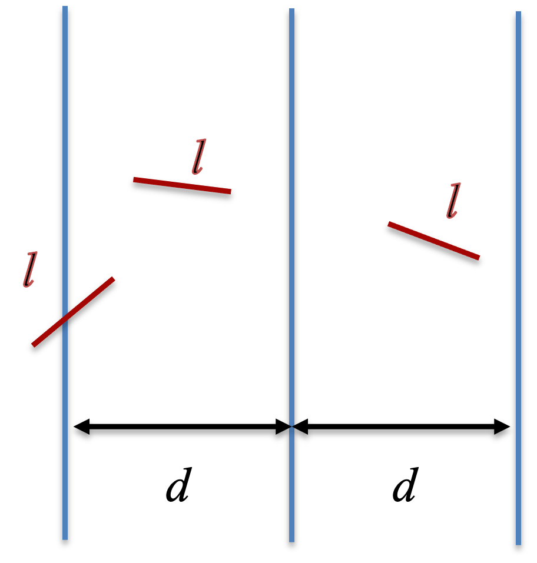

Monte Carlo methods are numerical algorithms built on random sampling [@metropolis1949monte]. Instead of solving a problem exactly, we draw many random samples and let the law of large numbers do the work: an average over the samples approaches the quantity we want as the sample size grows. This chapter introduces the idea through a few simple examples, estimating $\pi$ two different ways and computing integrals by sampling.

## 8A.1 Estimating π from the area of a circle

A classic Monte Carlo exercise estimates $\pi$ from areas. Draw points uniformly in the square $-1 \le x, y \le 1$ and count the fraction that land inside the unit circle centered at the origin. That fraction $P$ is the ratio of the circle's area to the square's area,

$$ P = \frac{\pi r^2}{(2r)^2} = \frac{\pi}{4} , \tag{1} $$

so we can estimate $\pi$ as

$$ \pi = 4 P . \tag{2} $$

::: {.callout-note title="Recipe 8A.1.1"}
**Objective.** Estimate pi by Monte Carlo sampling of a circle's area.

**Model.** The fraction of uniform points in the square [-1, 1]^2 that fall inside the unit circle is `pi/4`, so `pi = 4*P`.

**Method.** Monte Carlo estimation of pi by area sampling (the fraction of uniform points inside the unit circle, times four).

**Test.** Uniform points in [-1, 1]^2; a single estimate at `n = 1e4` and a convergence run to `n = 1e5`; seed 1.

**Show.** The running estimate of pi versus sample count, and a scatter of the sampled points in and out of the circle.

**Verification.** The estimate is noticeably off at n = 1e4 but settles near pi by n = 1e5, showing the slow 1/sqrt(n) Monte Carlo convergence.
:::

### R implementation {.impl}

```{r}
# fraction of random points inside the unit circle, times 4
mc_pi <- function(n) {
  xy <- matrix(runif(2 * n, -1, 1), ncol = 2)
  incircle <- rowSums(xy^2) <= 1
  sum(incircle) / n * 4
}
set.seed(1)
mc_pi(10^4)
```

```{r}
# running estimate as the sample size grows (cumulative fraction)
mc_pi_sample <- function(n) {
  xy <- matrix(runif(2 * n, -1, 1), ncol = 2)
  incircle <- rowSums(xy^2) <= 1
  cumsum(incircle) / (1:n) * 4
}
n <- 10^5
plot(1:n, mc_pi_sample(n), type = "l", xlab = "n", ylab = "Estimation", log = "x")
abline(h = pi, col = 2, lty = 3)
```

```{r}
#| fig-width: 5
#| fig-height: 5
#| out-width: "55%"
# the sampled points, colored by whether they fall inside the circle
library(ggplot2)
n <- 10^4
xy <- matrix(runif(2 * n, -1, 1), ncol = 2)
incircle <- rowSums(xy^2) <= 1
mc_data <- data.frame(x = xy[, 1], y = xy[, 2], incircle = incircle)
ggplot(mc_data, aes(x, y, col = incircle)) + geom_point(size = 0.3) + coord_fixed()
```

### Python implementation {.impl}

```{python}
import numpy as np
import matplotlib.pyplot as plt

# fraction of random points inside the unit circle, times 4
def mc_pi(n):
    xy = np.random.uniform(-1, 1, size=(n, 2))
    incircle = np.sum(xy**2, axis=1) <= 1
    return np.sum(incircle) / n * 4

np.random.seed(1)
print(mc_pi(10**4))
```

```{python}
# running estimate as the sample size grows (cumulative fraction)
def mc_pi_sample(n):
    xy = np.random.uniform(-1, 1, size=(n, 2))
    incircle = np.sum(xy**2, axis=1) <= 1
    return np.cumsum(incircle) / np.arange(1, n + 1) * 4

n = 10**5
plt.plot(np.arange(1, n + 1), mc_pi_sample(n))
plt.axhline(np.pi, color="red", linestyle=":")
plt.xscale("log"); plt.xlabel("n"); plt.ylabel("Estimation"); plt.show()
```

```{python}
#| fig-width: 5
#| fig-height: 5
#| out-width: "55%"
# the sampled points, colored by whether they fall inside the circle
np.random.seed(1)
n = 10**4
xy = np.random.uniform(-1, 1, size=(n, 2))
incircle = np.sum(xy**2, axis=1) <= 1
plt.figure(figsize=(5, 5))
plt.scatter(xy[:, 0], xy[:, 1], c=incircle, cmap="viridis", s=3)
plt.gca().set_aspect("equal")
plt.xlabel("x"); plt.ylabel("y"); plt.show()
```

With $n = 10^4$ samples the estimate is close but noticeably off; by $n \sim 10^5$ it settles near the true value. The running-estimate plot shows the slow convergence typical of Monte Carlo methods: the error shrinks only as $1/\sqrt{n}$, so each extra digit of accuracy costs a hundredfold more samples. Because R and Python draw from different random streams, their estimates differ slightly while following the same trend.

## 8A.2 Estimating π: Buffon's needle

A second, very different route to $\pi$ is Buffon's needle problem [@buffon1777essai]. Drop a needle of length $l$ onto a floor ruled with parallel lines a distance $d$ apart. As long as $l < d$, the probability that the needle crosses a line is

$$ P = \frac{2 l}{\pi d} , \tag{3} $$

so measuring $P$ gives an estimate of $\pi$,

$$ \pi = \frac{2 l}{P d} . \tag{4} $$

{width=30% fig-align="center"}

To simulate one drop, we place vertical lines at $x = 0$ and $x = d$ and sample the $x$ coordinate $x_1$ of one end of the needle uniformly in $(0, d)$. We then need a uniformly random *direction*. Sampling a point $(x_2, y_2)$ in the square and keeping it only if it falls inside the unit circle (rejecting otherwise) gives a direction $(x_2, y_2)/\sqrt{x_2^2 + y_2^2}$ that is uniform in angle. The other end of the needle then has

$$ x_3 = x_1 + l \frac{x_2}{\sqrt{x_2^2 + y_2^2}} , \tag{5} $$

and the needle crosses a line when $x_3$ falls outside $(0, d)$, that is when

$$ x_3 (d - x_3) \le 0 . \tag{6} $$

::: {.callout-note title="Recipe 8A.2.1"}
**Objective.** Estimate pi with Buffon's needle experiment.

**Model.** Dropping a needle of length l on a floor ruled with lines a distance d apart (l < d) crosses a line with probability `2*l/(pi*d)`, so `pi = 2*l/(P*d)`.

**Method.** Buffon's needle Monte Carlo estimation of pi, using rejection sampling for a uniform random needle direction.

**Test.** Line spacing `d = 1`, needle lengths `l = 0.2, 0.4, ..., 1.4`; `n = 1e4` then `n = 1e5` drops; seed 1.

**Show.** The estimate of pi for each needle length, versus sample count.

**Verification.** At n = 1e4 the estimate wanders around pi (and breaks for l > d), and n = 1e5 tightens it.
:::

### R implementation {.impl}

```{r}
# one needle drop: TRUE if it crosses a line
needle_drop <- function(d, l) {
  x1 <- runif(1, 0, d)                 # one end of the needle
  repeat {                             # rejection sampling for a uniform direction
    x2 <- runif(2, -1, 1)
    r2 <- x2[1]^2 + x2[2]^2
    if (r2 <= 1) break
  }
  x3 <- x1 + x2[1] / sqrt(r2) * l      # the other end
  x3 * (d - x3) <= 0
}

# crossing probability from n drops
buffon <- function(n, d, l) mean(replicate(n, needle_drop(d, l)))

set.seed(1)
d <- 1; l <- seq(0.2, 1.4, by = 0.2)
p <- sapply(l, function(len) buffon(10^4, d, len))
plot(l, 2 / p * l / d, type = "b", xlab = "l", ylab = "Estimation", main = "n = 10^4")
abline(h = pi, col = 2, lty = 3)
```

```{r}
set.seed(1)
p <- sapply(l, function(len) buffon(10^5, d, len))
plot(l, 2 / p * l / d, type = "b", xlab = "l", ylab = "Estimation", main = "n = 10^5")
abline(h = pi, col = 2, lty = 3)
```

### Python implementation {.impl}

```{python}
# one needle drop: True if it crosses a line
def needle_drop(d, l):
    x1 = np.random.uniform(0, d)             # one end of the needle
    while True:                              # rejection sampling for a uniform direction
        x2 = np.random.uniform(-1, 1, size=2)
        r2 = np.sum(x2**2)
        if r2 <= 1:
            break
    x3 = x1 + x2[0] / np.sqrt(r2) * l        # the other end
    return x3 * (d - x3) <= 0

# crossing probability from n drops
def buffon(n, d, l):
    return np.mean([needle_drop(d, l) for _ in range(n)])

np.random.seed(1)
d = 1; l = np.arange(0.2, 1.5, 0.2)
p = np.array([buffon(10**4, d, length) for length in l])
plt.plot(l, 2 / p * l / d, "o-"); plt.axhline(np.pi, color="red", linestyle=":")
plt.xlabel("l"); plt.ylabel("Estimation"); plt.title("n = 10^4"); plt.show()
```

```{python}
np.random.seed(1)
p = np.array([buffon(10**5, d, length) for length in l])
plt.plot(l, 2 / p * l / d, "o-"); plt.axhline(np.pi, color="red", linestyle=":")
plt.xlabel("l"); plt.ylabel("Estimation"); plt.title("n = 10^5"); plt.show()
```

At $n = 10^4$ the estimate still wanders around $\pi$, and it worsens for $l > d$, where Equations (3) and (4) no longer hold. Raising the count to $n = 10^5$ tightens it considerably. Buffon's needle is an intuitive estimator but a slow one. The rejection step matters: sampling the direction directly from a uniform angle would be simpler, but drawing $(x_2, y_2)$ in the square without rejecting the corners would bias the angle away from uniform and spoil the estimate.

## 8A.3 Monte Carlo integration

Monte Carlo sampling also evaluates integrals. As a reference, the ordinary *midpoint rule* splits $[x_1, x_2]$ into $n$ equal intervals and sums the integrand at the interval midpoints,

$$ I = \int_{x_1}^{x_2} f(x)\, dx \approx \sum_{i=1}^n f(m_i)\, \Delta x . \tag{7} $$

We test it on $f(x) = e^{-x^2}$, whose integral from 0 to $\infty$ is known exactly,

$$ I = \int_0^{\infty} e^{-x^2}\, dx = \frac{\sqrt{\pi}}{2} , \tag{8} $$

approximating it over $x_1 = 0$ to $x_2 = 3$. The Monte Carlo version instead draws $x$ uniformly in $(x_1, x_2)$ and averages,

$$ I \approx \frac{x_2 - x_1}{n} \sum_{i=1}^n f(x_i) , \tag{9} $$

where the prefactor $(x_2 - x_1)/n$ plays the role of $\Delta x$.

::: {.callout-note title="Recipe 8A.3.1"}
**Objective.** Integrate a function by Monte Carlo sampling and compare it to a deterministic rule.

**Model.** The integral of `f(x) = exp(-x^2)`; the reference is the midpoint rule, and the exact value over [0, inf) is `sqrt(pi)/2`.

**Method.** Monte Carlo integration by uniform sampling, `I = (x2 - x1)/n * sum f(x_i)`, alongside the deterministic midpoint rule.

**Test.** Interval [0, 3]; midpoint rule at `n = 1000`, Monte Carlo at `n = 1e4`; seed 1.

**Show.** The midpoint-rule and Monte Carlo estimates against `sqrt(pi)/2`.

**Verification.** Both land near `sqrt(pi)/2 = 0.886`; the midpoint rule is more accurate for this smooth 1D integrand, but Monte Carlo's error is dimension-independent.
:::

### R implementation {.impl}

```{r}
# deterministic midpoint rule
midpoint <- function(f, x1, x2, n) {
  dx <- (x2 - x1) / n
  mid <- seq(x1 + dx / 2, x2 - dx / 2, by = dx)
  sum(f(mid)) * dx
}
f1 <- function(x) exp(-x^2)
midpoint(f1, 0, 3, 1000)
```

```{r}
#| fig-width: 9
#| fig-height: 4
#| out-width: "92%"
#| rmar: false
# where uniform random samples land under the curve, for n = 10 and n = 100
par(mfrow = c(1, 2), mar = c(4, 4, 2, 1))
xall <- seq(0, 3, by = 0.01)
for (n in c(10, 100)) {
  set.seed(1)
  plot(xall, f1(xall), type = "l", xlab = "x", ylab = "f", main = paste("n =", n))
  for (x in runif(n, 0, 3)) segments(x, 0, x, f1(x), col = 2)
}
```

```{r}
# Monte Carlo integration by uniform sampling
mc_integration <- function(f, x1, x2, n) {
  x <- runif(n, x1, x2)
  sum(f(x)) * (x2 - x1) / n
}
set.seed(1)
mc_integration(f1, 0, 3, 10^4)
```

### Python implementation {.impl}

```{python}
# deterministic midpoint rule
def midpoint(f, x1, x2, n):
    dx = (x2 - x1) / n
    mid = np.arange(x1 + dx / 2, x2, dx)
    return np.sum(f(mid)) * dx

def f1(x):
    return np.exp(-x**2)
print(midpoint(f1, 0, 3, 1000))
```

```{python}
#| fig-width: 9
#| fig-height: 4
#| out-width: "92%"
# where uniform random samples land under the curve, for n = 10 and n = 100
xall = np.arange(0, 3, 0.01)
fig, axs = plt.subplots(1, 2, figsize=(9, 4))
for ax, n in zip(axs, (10, 100)):
    np.random.seed(1)
    ax.plot(xall, f1(xall), color="blue")
    for x in np.random.uniform(0, 3, n):
        ax.plot([x, x], [0, f1(x)], color="red")
    ax.set(xlabel="x", ylabel="f", title=f"n = {n}")
plt.tight_layout(); plt.show()
```

```{python}
# Monte Carlo integration by uniform sampling
def mc_integration(f, x1, x2, n):
    x = np.random.uniform(x1, x2, n)
    return np.sum(f(x)) * (x2 - x1) / n

np.random.seed(1)
print(mc_integration(f1, 0, 3, 10**4))
```

Both estimates land near $\sqrt{\pi}/2 \approx 0.886$. The midpoint rule is more accurate for a smooth one-dimensional integrand like this one, but Monte Carlo integration has a decisive advantage in high dimensions, where its $1/\sqrt{n}$ error is independent of the number of dimensions while grid-based rules become prohibitive.

## 8A.4 Importance sampling

Nothing forces the samples to be uniform. We can draw $x$ from any distribution $p(x)$ by rewriting the integral as

$$ I = \int_{x_1}^{x_2} f(x)\, dx = \int_{x_1}^{x_2} \frac{f(x)}{p(x)}\, p(x)\, dx , \tag{10} $$

and estimating it by sampling from $p$,

$$ I \approx \frac{1}{n} \sum_{i=1}^n \frac{f(x_i)}{p(x_i)} . \tag{11} $$

This is *importance sampling* [@robert2004monte]. Choosing a $p(x)$ that is large where $f(x)$ is large concentrates the samples where they matter and improves convergence. For $f(x) = e^{-x^2}$ we sample from the exponential density $p(x) = e^{-x}$ on $[0, \infty)$, drawing $x$ by the inverse-transform method ($x = -\ln u$ with $u$ uniform). This lets us cover a much wider range of $x$ than uniform sampling would afford.

::: {.callout-note title="Recipe 8A.4.1"}
**Objective.** Reduce the variance of a Monte Carlo integral with importance sampling.

**Model.** The same integral of `f(x) = exp(-x^2)`, rewritten as `I = integral of f(x)/p(x) * p(x) dx` and estimated by the mean of `f(x_i)/p(x_i)` with `x_i` drawn from p.

**Method.** Monte Carlo importance sampling with an exponential density `p(x) = exp(-x)` (drawn by inverse transform), compared against uniform Monte Carlo.

**Test.** Range [0, 100], `n = 1e4`, 100 replicates each of importance and uniform sampling; seed 1.

**Show.** Box plots of the importance-sampling versus uniform estimates over many replicates.

**Verification.** Over the wide range, uniform sampling scatters badly by wasting points where f is negligible, while importance sampling concentrates points where f is large and converges with far less variance.
:::

### R implementation {.impl}

```{r}
#| fig-width: 4.5
#| fig-height: 4
#| out-width: "55%"
# samples now cluster at small x, where f is largest
set.seed(1)
xall <- seq(0, 3, by = 0.01)
u <- runif(100, exp(-3), exp(0))
x_exp <- -log(u)
plot(xall, f1(xall), type = "l", xlab = "x", ylab = "f", main = "n = 100")
for (x in x_exp) segments(x, 0, x, f1(x), col = 2)
```

```{r}
# importance sampling with p(x) = exp(-x)
mc_integration_importance_exp <- function(f, x1, x2, n) {
  u <- runif(n, exp(-x2), exp(-x1))
  x <- -log(u)                          # exponential samples
  sum(f(x) / exp(-x)) / n               # f(x) / p(x), averaged
}
set.seed(1)
mc_integration_importance_exp(f1, 0, 100, 10^4)
```

```{r}
# importance sampling converges far faster over a wide range
set.seed(1)
imp <- replicate(100, mc_integration_importance_exp(f1, 0, 100, 10^4))
uni <- replicate(100, mc_integration(f1, 0, 100, 10^4))
boxplot(data.frame(mc_importance = imp, mc = uni))
abline(h = sqrt(pi) / 2, col = 2, lty = 3)
```

### Python implementation {.impl}

```{python}
#| fig-width: 4.5
#| fig-height: 4
#| out-width: "55%"
# samples now cluster at small x, where f is largest
np.random.seed(1)
xall = np.arange(0, 3, 0.01)
u = np.random.uniform(np.exp(-3), np.exp(0), 100)
x_exp = -np.log(u)
plt.plot(xall, f1(xall), color="blue")
for x in x_exp:
    plt.plot([x, x], [0, f1(x)], color="red")
plt.xlabel("x"); plt.ylabel("f"); plt.title("n = 100"); plt.show()
```

```{python}
# importance sampling with p(x) = exp(-x)
def mc_integration_importance_exp(f, x1, x2, n):
    u = np.random.uniform(np.exp(-x2), np.exp(-x1), n)
    x = -np.log(u)                        # exponential samples
    return np.sum(f(x) / np.exp(-x)) / n  # f(x) / p(x), averaged

np.random.seed(1)
print(mc_integration_importance_exp(f1, 0, 100, 10**4))
```

```{python}
# importance sampling converges far faster over a wide range
np.random.seed(1)
imp = [mc_integration_importance_exp(f1, 0, 100, 10**4) for _ in range(100)]
uni = [mc_integration(f1, 0, 100, 10**4) for _ in range(100)]
plt.boxplot([imp, uni], tick_labels=["MC importance", "MC"])
plt.axhline(np.sqrt(np.pi) / 2, color="red", linestyle=":"); plt.show()
```

Over the wide range $x \in (0, 100)$, uniform sampling wastes almost all of its points where $f$ is negligible, so its estimate is badly scattered. Importance sampling puts the points where $f$ is large and converges to $\sqrt{\pi}/2$ with far less variance, as the boxplots show.

::: {.callout-note title="Practice Q1"}
The Monte Carlo error falls off as $1/\sqrt{n}$. Design an experiment to confirm this scaling: estimate one of the integrals above many times at each of several sample sizes $n$, compute the standard deviation of the estimates at each $n$, and check that it decreases like $n^{-1/2}$ (for example, that a log-log plot of the error against $n$ has slope $-1/2$).
:::
