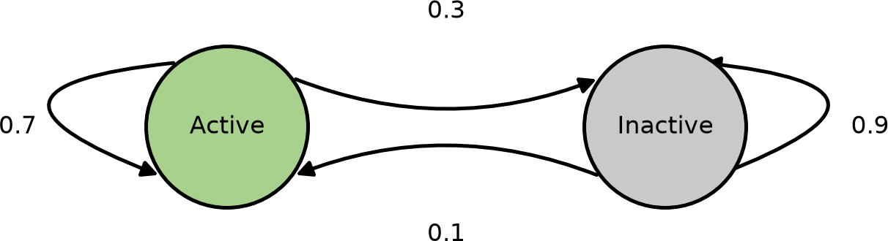
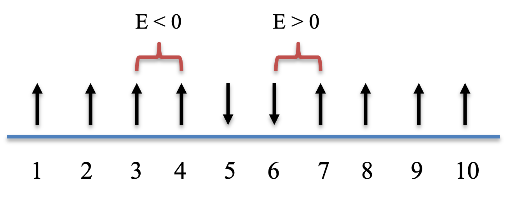

A *Markov chain* is a stochastic process in which the probability of the next state
depends only on the current state, not on the earlier history. The random walk of
[Part 6B](../06-stochastic/06b-brownian-motion.qmd) is one example: each step chooses
a direction based only on where the walker is now. This chapter builds from Markov
chains to the *Metropolis-Hastings algorithm*, a Markov chain Monte Carlo (MCMC)
method that samples an arbitrary probability distribution by constructing a Markov
chain whose stationary distribution is the one we want.

## 8B.1 A Markov chain: a bursting gene

Many genes are transcribed in *bursts*: the promoter switches between an active state,
where it produces mRNA, and an inactive state, where it is silent, and it can dwell in
each for a while before switching [@golding2005realtime]. We model the promoter as a
two-state Markov chain, "active" and "inactive", where each step either keeps the
current state or switches it, with fixed probabilities that depend only on the current
state. The state diagram shows the transition probabilities.

{width=60% fig-align="center"}

The dynamics are captured by a *transition matrix* $T$, whose entry in row $i$,
column $j$ is the probability of moving from state $i$ to state $j$. Each row sums to
1, since the chain must go somewhere. To simulate the chain, at each step we draw a
uniform random number and use it to pick the next state from the current row of $T$.

::: {.callout-note title="Recipe 8B.1.1"}
**Objective.** Simulate a two-state promoter as a Markov chain and find its long-run state fractions.

**Model.** A two-state promoter Markov chain with transition matrix `T = [[0.7, 0.3], [0.1, 0.9]]` (rows from active, from inactive), so the active state leaves with probability 0.3 and the inactive with 0.1.

**Method.** Direct simulation of a two-state Markov chain (draw a uniform, pick the next state from the current row of T).

**Test.** The transition matrix above, starting active, `1e4` steps; seed 1.

**Verification.** The trajectory bursts (short active spells, long silent stretches), and the running fractions converge to about 25% active and 75% inactive.
:::

### R implementation {.impl}

```{r}
# simulate the promoter Markov chain; states 1 = active, 2 = inactive
markov_gene <- function(x0, nstep) {
  transit <- matrix(c(0.7, 0.3, 0.1, 0.9), nrow = 2, byrow = TRUE)  # rows sum to 1
  x <- numeric(nstep + 1); x[1] <- x0
  for (i in 1:nstep) {
    x[i + 1] <- if (runif(1) < transit[x[i], 1]) 1 else 2
  }
  x
}

set.seed(1)
nstep <- 10^4
results_gene <- markov_gene(x0 = 1, nstep = nstep)
plot(0:1000, results_gene[1:1001], type = "l", col = 2, xlab = "Step", ylab = "State",
     yaxt = "n", ylim = c(0.7, 2.3))
axis(side = 2, at = c(1, 2), labels = c("Active", "Inactive"))
```

```{r}
# running fraction of time spent in each state
p_active   <- cumsum(results_gene == 1) / seq_along(results_gene)
p_inactive <- cumsum(results_gene == 2) / seq_along(results_gene)
plot(seq_along(results_gene), p_active, type = "l", col = 2, xlab = "Step",
     ylab = "Probability", ylim = c(0, 1))
lines(seq_along(results_gene), p_inactive, col = 4)
legend("right", c("Active", "Inactive"), col = c(2, 4), lty = 1)
c(tail(p_active, 1), tail(p_inactive, 1))
```

### Python implementation {.impl}

```{python}
import numpy as np
import matplotlib.pyplot as plt

# simulate the promoter Markov chain; states 0 = active, 1 = inactive (0-based indexing)
def markov_gene(x0, nstep):
    transit = np.array([[0.7, 0.3], [0.1, 0.9]])           # rows sum to 1
    x = np.zeros(nstep + 1, dtype=int); x[0] = x0
    for i in range(nstep):
        x[i + 1] = 0 if np.random.uniform() < transit[x[i], 0] else 1
    return x

np.random.seed(1)
nstep = 10**4
results_gene = markov_gene(x0=0, nstep=nstep)
plt.plot(range(1001), results_gene[:1001], "r-")
plt.yticks([0, 1], ["Active", "Inactive"]); plt.ylim(-0.3, 1.3)
plt.xlabel("Step"); plt.ylabel("State"); plt.show()
```

```{python}
# running fraction of time spent in each state
steps = np.arange(1, len(results_gene) + 1)
p_active   = np.cumsum(results_gene == 0) / steps
p_inactive = np.cumsum(results_gene == 1) / steps
plt.plot(steps, p_active, "r-", label="Active")
plt.plot(steps, p_inactive, "b-", label="Inactive")
plt.xlabel("Step"); plt.ylabel("Probability"); plt.ylim(0, 1); plt.legend(); plt.show()
print(p_active[-1], p_inactive[-1])
```

The trajectory shows the bursting pattern: short spells in the active state separated
by longer silent stretches, because the inactive state is stickier (it switches away
only with probability 0.1 per step). The running fractions converge to a stable
distribution, roughly 25% active and 75% inactive. (R labels the states 1 and 2,
Python 0 and 1, to match each language's array indexing; the model is identical.)

## 8B.2 The steady-state distribution

There is a faster way to find those long-run probabilities than simulating a long
trajectory. If $p_i$ is the row vector of state probabilities at step $i$, then one
step of the chain updates it by a matrix multiplication with the transition matrix,

$$ p_{i+1} = p_i T . \tag{1} $$

Iterating from any starting distribution converges to a fixed vector $p_{ss}$, the
*steady-state* (or stationary) distribution.

### R implementation {.impl}

```{r}
# propagate the probability distribution instead of a single trajectory
markov_gene_prob <- function(p0, nstep) {
  transit <- matrix(c(0.7, 0.3, 0.1, 0.9), nrow = 2, byrow = TRUE)
  p <- matrix(0, nrow = nstep + 1, ncol = 2); p[1, ] <- p0
  for (i in 1:nstep) p[i + 1, ] <- p[i, ] %*% transit
  p
}

nstep <- 100
prob_gene <- markov_gene_prob(p0 = c(1, 0), nstep = nstep)
p_ss <- prob_gene[nstep + 1, ]
plot(0:nstep, prob_gene[, 1], type = "l", col = 2, xlab = "Step",
     ylab = "Probability", ylim = c(0, 1))
lines(0:nstep, prob_gene[, 2], col = 4)
legend("right", c("Active", "Inactive"), col = c(2, 4), lty = 1)
p_ss
```

### Python implementation {.impl}

```{python}
# propagate the probability distribution instead of a single trajectory
def markov_gene_prob(p0, nstep):
    transit = np.array([[0.7, 0.3], [0.1, 0.9]])
    p = np.zeros((nstep + 1, 2)); p[0] = p0
    for i in range(nstep):
        p[i + 1] = p[i] @ transit
    return p

nstep = 100
prob_gene = markov_gene_prob(np.array([1, 0]), nstep)
p_ss = prob_gene[-1]
plt.plot(range(nstep + 1), prob_gene[:, 0], "r-", label="Active")
plt.plot(range(nstep + 1), prob_gene[:, 1], "b-", label="Inactive")
plt.xlabel("Step"); plt.ylabel("Probability"); plt.ylim(0, 1); plt.legend(); plt.show()
print(p_ss)
```

Starting from a fully active promoter, $p_i$ settles within a few steps to $p_{ss}
\approx (0.25, 0.75)$, matching the fractions from the long simulation. A Markov chain
has a
unique steady-state distribution when it is *ergodic*, meaning it is both

- **irreducible**: every state is reachable from every other state, and
- **aperiodic**: it does not return to a state only at fixed regular intervals.

Ergodicity is the key requirement that makes Markov chain Monte Carlo work.

## 8B.3 The Metropolis-Hastings algorithm

Markov chain Monte Carlo turns this idea around. Instead of reading off the
stationary distribution of a *given* chain, we are handed a target distribution
$P(x)$ and asked to *build* a chain whose stationary distribution is $P$. The
Metropolis-Hastings algorithm [@metropolis1953equation; @hastings1970monte;
@robert2004monte] does exactly that, and it needs only the ability to evaluate $P(x)$
up to a constant.

The construction relies on *detailed balance*, a stronger condition than mere
stationarity:

$$ T(x \rightarrow x')\, P(x) = T(x' \rightarrow x)\, P(x') . \tag{2} $$

Summing over $x'$ recovers the stationarity condition,

$$ \sum_{x'} T(x \rightarrow x')\, P(x) = \sum_{x'} T(x' \rightarrow x)\, P(x') , \tag{3} $$

so any chain satisfying detailed balance has $P$ as a stationary distribution.
Metropolis-Hastings builds such a chain in two steps. From the current state $x$, we
first *propose* a move to $x'$ drawn from a proposal distribution
$g(x \rightarrow x')$. We then *accept* the move with probability

$$ a = \min\left(1, \frac{P(x')\, g(x' \rightarrow x)}{P(x)\, g(x \rightarrow x')}\right) , \tag{4} $$

setting the next state to $x'$ if accepted and keeping $x$ otherwise. This acceptance
rule guarantees detailed balance regardless of the proposal $g$.

To see it in action, we resample the bursting-gene model. This time we ignore the
true transition matrix and only use the steady-state distribution $p_{ss}$ as the
target. With a symmetric proposal that always suggests the other state,
$g(1 \rightarrow 2) = g(2 \rightarrow 1) = 1$, the acceptance probability simplifies
to

$$ a = \min\left(1, \frac{P(x')}{P(x)}\right) . \tag{5} $$

::: {.callout-note title="Recipe 8B.3.1"}
**Objective.** Sample a target distribution with Metropolis-Hastings and confirm it reproduces the target.

**Model.** The two-state bursting-gene promoter of 8B.1, now specified only by its stationary distribution `p_ss = (0.25, 0.75)` as the target `P(x)`.

**Method.** The Metropolis-Hastings algorithm with a symmetric two-state proposal (always propose the other state), so acceptance is `a = min(1, P(x')/P(x))`.

**Test.** Target `p_ss = (0.25, 0.75)`, starting active, `1e4` steps; seed 1.

**Verification.** The sampler has a different transition matrix from the original chain yet reproduces the same stationary distribution, showing that many chains can share one stationary distribution.
:::

### R implementation {.impl}

```{r}
# sample the promoter states by Metropolis-Hastings using only p_ss as the target
metropolis_gene <- function(x0, p_ss, nstep) {
  x <- numeric(nstep + 1); x[1] <- x0
  for (i in 1:nstep) {
    xnew <- 3 - x[i]                         # propose the other state (1 <-> 2)
    a <- min(1, p_ss[xnew] / p_ss[x[i]])     # acceptance probability
    x[i + 1] <- if (runif(1) < a) xnew else x[i]
  }
  x
}

set.seed(1)
nstep <- 10^4
results_gene2 <- metropolis_gene(x0 = 1, p_ss = p_ss, nstep = nstep)
p_active2   <- cumsum(results_gene2 == 1) / seq_along(results_gene2)
p_inactive2 <- cumsum(results_gene2 == 2) / seq_along(results_gene2)
plot(seq_along(results_gene2), p_active2, type = "l", col = 2, xlab = "Step",
     ylab = "Probability", ylim = c(0, 1))
lines(seq_along(results_gene2), p_inactive2, col = 4)
legend("right", c("Active", "Inactive"), col = c(2, 4), lty = 1)
```

```{r}
# recover the empirical transition matrix from each trajectory
cal_transit <- function(x_all) {
  n <- length(unique(x_all))
  transit <- matrix(0, n, n)
  for (i in seq_len(length(x_all) - 1)) transit[x_all[i], x_all[i + 1]] <-
      transit[x_all[i], x_all[i + 1]] + 1
  transit / rowSums(transit)
}
cal_transit(results_gene)    # the original Markov chain
cal_transit(results_gene2)   # the Metropolis sampler
```

### Python implementation {.impl}

```{python}
# sample the promoter states by Metropolis-Hastings using only p_ss as the target
def metropolis_gene(x0, p_ss, nstep):
    x = np.zeros(nstep + 1, dtype=int); x[0] = x0
    for i in range(nstep):
        xnew = 1 - x[i]                          # propose the other state (0 <-> 1)
        a = min(1, p_ss[xnew] / p_ss[x[i]])      # acceptance probability
        x[i + 1] = xnew if np.random.uniform() < a else x[i]
    return x

np.random.seed(1)
nstep = 10**4
results_gene2 = metropolis_gene(x0=0, p_ss=p_ss, nstep=nstep)
steps = np.arange(1, len(results_gene2) + 1)
p_active2   = np.cumsum(results_gene2 == 0) / steps
p_inactive2 = np.cumsum(results_gene2 == 1) / steps
plt.plot(steps, p_active2, "r-", label="Active")
plt.plot(steps, p_inactive2, "b-", label="Inactive")
plt.xlabel("Step"); plt.ylabel("Probability"); plt.ylim(0, 1); plt.legend(); plt.show()
```

```{python}
# recover the empirical transition matrix from each trajectory
def cal_transit(x_all):
    n = len(np.unique(x_all))
    transit = np.zeros((n, n))
    for i in range(len(x_all) - 1):
        transit[x_all[i], x_all[i + 1]] += 1
    return transit / transit.sum(axis=1, keepdims=True)

print(cal_transit(results_gene))    # the original Markov chain
print(cal_transit(results_gene2))   # the Metropolis sampler
```

The Metropolis sampler visits the two states with a very different transition pattern
from the original chain (its recovered transition matrix is not the same), yet it
reproduces the same stationary distribution. That is the point of MCMC: many different
chains can share one stationary distribution, and we are free to pick a convenient one.

## 8B.4 Sampling a Gaussian distribution

Metropolis-Hastings really shines on continuous distributions. We sample
$P(x) \propto e^{-x^2}$ (a Gaussian with variance $1/2$). Starting at $x = 0$, each
step proposes $x' = x + dx$ with $dx$ drawn uniformly from $(-dx_\text{max},
dx_\text{max})$. This proposal is symmetric, $g(x \rightarrow x') = g(x' \rightarrow
x)$, so the acceptance probability is

$$ a = \min\left(1, \frac{P(x')}{P(x)}\right) = \min\left(1, e^{-x'^2 + x^2}\right) . \tag{6} $$

The step size $dx_\text{max}$ is a tuning knob. We try several values and compare the
sampled histogram with the true density.

::: {.callout-note title="Recipe 8B.4.1"}
**Objective.** Sample a continuous Gaussian with Metropolis-Hastings and see how the step size affects the result.

**Model.** A continuous target `P(x) proportional to exp(-x^2)`, a Gaussian of variance 1/2.

**Method.** The Metropolis-Hastings algorithm with a uniform random-walk proposal `x' = x + Uniform(-dx_max, dx_max)` and acceptance `a = min(1, exp(-x'^2 + x^2))`.

**Test.** Start at x = 0, `1e4` steps, proposal widths `dx_max = 0.1, 0.5, 2, 10`; seed 1.

**Verification.** The sampled histogram matches the true Gaussian best at an intermediate dx_max (about 50% acceptance); too-small steps barely explore and too-large steps mostly reject.
:::

### R implementation {.impl}

```{r}
#| fig-width: 8
#| fig-height: 6
#| out-width: "92%"
#| rmar: false
# Metropolis sampling of a Gaussian, with a tunable proposal step size
metropolis_exp <- function(nstep, dx_max) {
  x <- numeric(nstep + 1); num_accept <- 0
  for (i in 1:nstep) {
    xnew <- x[i] + runif(1, -dx_max, dx_max)
    a <- min(1, exp(-xnew^2 + x[i]^2))
    if (runif(1) < a) { x[i + 1] <- xnew; num_accept <- num_accept + 1 }
    else x[i + 1] <- x[i]
  }
  cat("dx_max =", dx_max, " acceptance rate =", num_accept / nstep, "\n")
  x
}

set.seed(1)
nstep <- 10^4
x_curve <- seq(-3, 3, by = 0.1); breaks <- seq(-5, 5, by = 0.1)
par(mfrow = c(2, 2), mar = c(4, 4, 2, 1))
for (dx_max in c(0.1, 0.5, 2.0, 10.0)) {
  res <- metropolis_exp(nstep, dx_max)
  hist(res, freq = FALSE, breaks = breaks, main = paste("dx_max =", dx_max), xlab = "x")
  lines(x_curve, dnorm(x_curve, 0, sqrt(0.5)), col = 2)
}
```

### Python implementation {.impl}

```{python}
#| fig-width: 8
#| fig-height: 6
#| out-width: "92%"
# Metropolis sampling of a Gaussian, with a tunable proposal step size
def metropolis_exp(nstep, dx_max):
    x = np.zeros(nstep + 1); num_accept = 0
    for i in range(nstep):
        xnew = x[i] + np.random.uniform(-dx_max, dx_max)
        a = min(1, np.exp(-xnew**2 + x[i]**2))
        if np.random.uniform() < a:
            x[i + 1] = xnew; num_accept += 1
        else:
            x[i + 1] = x[i]
    print(f"dx_max = {dx_max}  acceptance rate = {num_accept / nstep}")
    return x

np.random.seed(1)
nstep = 10**4
x_curve = np.arange(-3, 3, 0.1); breaks = np.arange(-5, 5, 0.1)
fig, axs = plt.subplots(2, 2, figsize=(8, 6))
for ax, dx_max in zip(axs.flat, (0.1, 0.5, 2.0, 10.0)):
    res = metropolis_exp(nstep, dx_max)
    ax.hist(res, density=True, bins=breaks, ec="black")
    ax.plot(x_curve, np.exp(-x_curve**2) / np.sqrt(np.pi), color="red")
    ax.set(title=f"dx_max = {dx_max}", xlabel="x")
plt.tight_layout(); plt.show()
```

The step size trades off two effects. A small $dx_\text{max}$ is almost always
accepted but moves slowly and barely explores the distribution; a large one proposes
big jumps that are usually rejected, so the chain sticks in place. Both extremes
sample poorly. The best histograms here come from an intermediate step with an
acceptance rate near 50%. This tuning matters little for a one-dimensional Gaussian we
could sample directly, but it becomes essential for the complex systems where MCMC is
the only practical option.

## 8B.5 The 1D Ising model

The Ising model is a classic model of ferromagnetism [@ising1925beitrag] and a
standard testbed for Monte Carlo methods. We place $n$ spins on a line; each spin
$s_i$ is either $+1$ (up) or $-1$ (down). Neighboring spins interact, and the total
energy is

$$ E = -\sum_{i=1}^{n-1} J s_i s_{i+1} . \tag{7} $$

With $J > 0$, aligned neighbors lower the energy (favored) and opposed neighbors raise
it (disfavored).

{width=60% fig-align="center"}

At a fixed temperature $T$, the equilibrium probability of a configuration follows the
*Boltzmann distribution*

$$ p \propto e^{-E / (kT)} , \tag{8} $$

where we set the Boltzmann constant $k = 1$ and absorb it into a rescaled $T$. We
sample configurations with Metropolis-Hastings, proposing a move by flipping one
randomly chosen spin. The proposal is symmetric, so the move is accepted with

$$ a = \min\left(1, \frac{P(x')}{P(x)}\right) = \min\left(1, e^{-(E_{x'} - E_x) / T}\right) . \tag{9} $$

::: {.callout-note title="Recipe 8B.5.1"}
**Objective.** Sample the 1D Ising model with Metropolis Monte Carlo.

**Model.** A 1D Ising chain of n spins `s_i = +-1` with open ends, energy `E = -J*sum s_i*s_{i+1}`, sampled from the Boltzmann distribution `p proportional to exp(-E/T)`.

**Method.** The Metropolis-Hastings algorithm with single-spin-flip proposals and acceptance `a = min(1, exp(-(E' - E)/T))`.

**Test.** `n = 10` spins, `J = 1`, temperature `T = 1`, 1000 steps, random initial spins; seed 1.

**Verification.** At T = 1 the sampler moves between the minimum-energy aligned configuration (`E = -9`) and higher-energy ones, with about 20% acceptance.
:::

### R implementation {.impl}

```{r}
# total energy of a spin configuration (open boundary)
e_ising <- function(J, x) {
  x_shift <- c(x[-1], 0)
  -sum(x * x_shift) * J
}

# Metropolis sampling of the Ising model at temperature temp
metropolis_ising_1st <- function(nstep, n, J, temp) {
  x <- matrix(0, nstep + 1, n); e <- numeric(nstep + 1)
  x[1, ] <- sample(c(-1, 1), n, replace = TRUE)     # random initial spins
  e[1] <- e_ising(J, x[1, ])
  num_accept <- 0
  for (i in 1:nstep) {
    k <- sample(n, 1)                               # pick a spin to flip
    xnew <- x[i, ]; xnew[k] <- -xnew[k]
    enew <- e_ising(J, xnew)
    a <- min(1, exp(-(enew - e[i]) / temp))
    if (runif(1) < a) { x[i + 1, ] <- xnew; e[i + 1] <- enew; num_accept <- num_accept + 1 }
    else { x[i + 1, ] <- x[i, ]; e[i + 1] <- e[i] }
  }
  cat("acceptance rate =", num_accept / nstep, "\n")
  list(x = x, e = e)
}

set.seed(1)
nstep <- 10^3
res_ising <- metropolis_ising_1st(nstep, n = 10, J = 1, temp = 1)
plot(0:nstep, res_ising$e, type = "l", col = 2, xlab = "Step", ylab = "Total energy")
```

### Python implementation {.impl}

```{python}
# total energy of a spin configuration (open boundary)
def e_ising(J, x):
    x_shift = np.concatenate((x[1:], [0]))
    return -np.sum(x * x_shift) * J

# Metropolis sampling of the Ising model at temperature temp
def metropolis_ising_1st(nstep, n, J, temp):
    x = np.zeros((nstep + 1, n), dtype=int); e = np.zeros(nstep + 1)
    x[0] = np.random.choice([-1, 1], size=n)          # random initial spins
    e[0] = e_ising(J, x[0])
    num_accept = 0
    for i in range(nstep):
        k = np.random.randint(n)                      # pick a spin to flip
        xnew = x[i].copy(); xnew[k] *= -1
        enew = e_ising(J, xnew)
        a = min(1, np.exp(-(enew - e[i]) / temp))
        if np.random.uniform() < a:
            x[i + 1] = xnew; e[i + 1] = enew; num_accept += 1
        else:
            x[i + 1] = x[i]; e[i + 1] = e[i]
    print("acceptance rate =", num_accept / nstep)
    return {"x": x, "e": e}

np.random.seed(1)
nstep = 10**3
res_ising = metropolis_ising_1st(nstep, n=10, J=1, temp=1)
plt.plot(range(nstep + 1), res_ising["e"], "r-")
plt.xlabel("Step"); plt.ylabel("Total energy"); plt.show()
```

At $T = 1$ the sampler moves between the minimum-energy configuration ($E = -9$ for
ten aligned spins) and higher-energy ones, with an acceptance rate around 20%.

## 8B.6 A more efficient implementation

Two changes speed up the Ising sampler. First, because the interaction is local,
flipping spin $i$ changes only the one or two energy terms it touches, so we compute
the energy difference directly instead of re-summing the whole chain,

$$ \Delta E = \begin{cases}
  2 J s_1 s_2 & i = 1 \\
  2 J s_{n-1} s_n & i = n \\
  2 J s_i (s_{i-1} + s_{i+1}) & \text{otherwise}
\end{cases} , \tag{10} $$

where the $s_i$ are the current spins before the flip. Second, when $\Delta E < 0$ the
move is always accepted, so we can skip evaluating the exponential in that case.

### R implementation {.impl}

```{r}
# energy change from flipping spin i, using only the affected terms
de_ising <- function(J, x, n, i) {
  if (i == 1) 2 * J * x[1] * x[2]
  else if (i == n) 2 * J * x[n - 1] * x[n]
  else 2 * J * x[i] * (x[i - 1] + x[i + 1])
}

# check dE against the full recomputation
set.seed(1)
n <- 10; J <- 1
x <- sample(c(-1, 1), n, replace = TRUE); e0 <- e_ising(J, x)
for (i in 1:n) {
  x1 <- x; x1[i] <- -x1[i]
  cat(i, e_ising(J, x1) - e0, de_ising(J, x, n, i), "\n")
}
```

```{r}
# improved Ising sampler: incremental energy, skip exp when dE < 0
metropolis_ising <- function(nstep, n, J, temp) {
  x <- matrix(0, nstep + 1, n); e <- numeric(nstep + 1)
  x[1, ] <- sample(c(-1, 1), n, replace = TRUE)
  e[1] <- e_ising(J, x[1, ]); num_accept <- 0
  for (i in 1:nstep) {
    k <- sample(n, 1)
    de <- de_ising(J, x[i, ], n, k)
    if (de < 0 || runif(1) < exp(-de / temp)) {
      x[i + 1, ] <- x[i, ]; x[i + 1, k] <- -x[i + 1, k]
      e[i + 1] <- e[i] + de; num_accept <- num_accept + 1
    } else { x[i + 1, ] <- x[i, ]; e[i + 1] <- e[i] }
  }
  cat("acceptance rate =", num_accept / nstep, "\n")
  list(x = x, e = e)
}

# plot the energy and the number of up-spins on twin axes
plot_ising <- function(res, nstep) {
  num_1 <- rowSums(res$x == 1)
  par(mar = c(5, 5, 2, 5))
  plot(0:nstep, res$e, type = "l", col = 2, xlab = "Step", ylab = "Total energy")
  par(new = TRUE)
  plot(0:nstep, num_1, type = "l", col = 4, lty = 2, axes = FALSE, xlab = "", ylab = "")
  axis(side = 4); mtext("# of +1 spins", side = 4, line = 3)
  legend("topright", c("Total energy", "# of +1 spins"), col = c(2, 4), lty = c(1, 2), cex = 0.7)
}

set.seed(1)
nstep <- 3 * 10^3
res_ising <- metropolis_ising(nstep, n = 10, J = 1, temp = 1)
cat("mean energy:", mean(res_ising$e), "\n")
plot_ising(res_ising, nstep)
```

### Python implementation {.impl}

```{python}
# energy change from flipping spin i, using only the affected terms
def de_ising(J, x, n, i):
    if i == 0:
        return 2 * J * x[0] * x[1]
    elif i == n - 1:
        return 2 * J * x[n - 1] * x[n - 2]
    else:
        return 2 * J * x[i] * (x[i - 1] + x[i + 1])

# check dE against the full recomputation
np.random.seed(1)
n = 10; J = 1
x = np.random.choice([-1, 1], size=n); e0 = e_ising(J, x)
for i in range(n):
    x1 = x.copy(); x1[i] *= -1
    print(i + 1, e_ising(J, x1) - e0, de_ising(J, x, n, i))
```

```{python}
# improved Ising sampler: incremental energy, skip exp when dE < 0
def metropolis_ising(nstep, n, J, temp):
    x = np.zeros((nstep + 1, n), dtype=int); e = np.zeros(nstep + 1)
    x[0] = np.random.choice([-1, 1], size=n)
    e[0] = e_ising(J, x[0]); num_accept = 0
    for i in range(nstep):
        k = np.random.randint(n)
        de = de_ising(J, x[i], n, k)
        if de < 0 or np.random.uniform() < np.exp(-de / temp):
            x[i + 1] = x[i]; x[i + 1, k] *= -1
            e[i + 1] = e[i] + de; num_accept += 1
        else:
            x[i + 1] = x[i]; e[i + 1] = e[i]
    print("acceptance rate =", num_accept / nstep)
    return {"x": x, "e": e}

# plot the energy and the number of up-spins on twin axes
def plot_ising(res, nstep):
    num_1 = np.sum(res["x"] == 1, axis=1)
    fig, ax1 = plt.subplots()
    ax1.plot(range(nstep + 1), res["e"], "r-", label="Total energy")
    ax1.set_xlabel("Step"); ax1.set_ylabel("Total energy", color="red")
    ax2 = ax1.twinx()
    ax2.plot(range(nstep + 1), num_1, "b--", label="# of +1 spins")
    ax2.set_ylabel("# of +1 spins", color="blue")
    plt.show()

np.random.seed(1)
nstep = 3 * 10**3
res_ising = metropolis_ising(nstep, n=10, J=1, temp=1)
print("mean energy:", np.mean(res_ising["e"]))
plot_ising(res_ising, nstep)
```

The number of up-spins (blue) reveals two ground states of energy $E = -9$: all spins
up (ten up-spins) and all spins down (zero up-spins). At $T = 1$ the chain samples
configurations across a range of energies and crosses between the two ground states.
The mean energy over the run is an *ensemble average*, which for an equilibrium system
equals the long-time average once enough samples are collected.

Temperature controls how freely the chain explores. At a low temperature the
uphill moves in Equation (9) become rare, so the chain stays near a ground state; at a
high temperature almost every flip is accepted, so it wanders among high-energy,
disordered configurations and rarely visits a ground state.

### R implementation {.impl}

```{r}
set.seed(1)
res_low <- metropolis_ising(3 * 10^3, n = 10, J = 1, temp = 0.3)
cat("mean energy:", mean(res_low$e), "\n")
plot_ising(res_low, 3 * 10^3)
```

```{r}
set.seed(2)
res_high <- metropolis_ising(10^3, n = 10, J = 1, temp = 3)
cat("mean energy:", mean(res_high$e), "\n")
plot_ising(res_high, 10^3)
```

### Python implementation {.impl}

```{python}
np.random.seed(1)
res_low = metropolis_ising(3 * 10**3, n=10, J=1, temp=0.3)
print("mean energy:", np.mean(res_low["e"]))
plot_ising(res_low, 3 * 10**3)
```

```{python}
np.random.seed(2)
res_high = metropolis_ising(10**3, n=10, J=1, temp=3)
print("mean energy:", np.mean(res_high["e"]))
plot_ising(res_high, 10**3)
```

At $T = 0.3$ the sampler locks onto one ground state (here all up-spins) and rarely
leaves it. At $T = 3$ it almost never reaches a ground state and instead samples
mostly intermediate energies. The mean energy rises with temperature, tracing out the
thermal behavior of the model.

::: {.callout-note title="Practice Q1"}
Explore how the Ising sampler depends on its parameters. How does the acceptance rate
of `metropolis_ising` change as the temperature $T$ increases or decreases, and as the
interaction strength $J$ changes? Run the sampler from several random initial
conditions at a low temperature: do you always end up in the same ground state?
:::
