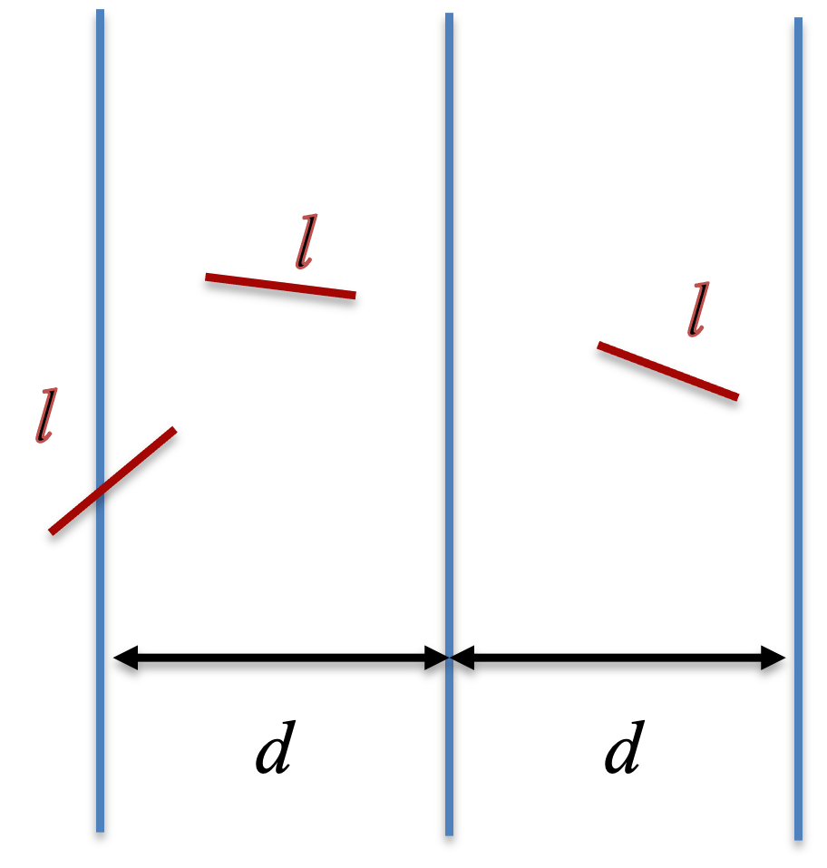

```{r setup, include=FALSE}
knitr::opts_chunk$set(echo = TRUE)
```

Monte Carlo methods are widely used numerical algorithms based on random sampling. Here, we illustrate its usages in a few simple examples. 

# Estimating $\pi$

A classic example of Monte Carlo method is to estimate $\pi$. Here, we show two different approaches.

### Estimating the area of a circle

In the first approach, we randomly sample many points evenly in a 2D square, ranging from (-1, 1) for both $x$ and $y$ coordinates. We compute the fraction of points in the circle of center (0,0) and radius 1. We know from geometry that this fraction $P$ equals to the ratio of the area of the circle and the area of the square. Thus,

$$P = \frac{\pi r^2}{(2r)^2} = \frac{\pi}{4} \tag{1}.$$
So, we can estimate $\pi$ by

$$\pi = 4P \tag{2}.$$

Here is the implementation of the Monte Carlo method. (Q: think why it works)

```{r}
mc_pi <- function(n){
  rng_xy = matrix(runif(n = 2*n, min = -1, max = 1), ncol = 2)
  incircle = apply(rng_xy, 1, function(xy) return(xy[1]**2 + xy[2]**2 <= 1))
  return(sum(incircle)/n*4)
}
set.seed(1)
mc_pi(10^4)
```

When the total number of sampling $n = 10^4$, the estimation slightly deviates from the actual value. We can write a script to systematically evaluate the estimation for a series of $n$. (see how the function *cumsum* is used here)

```{r}
mc_pi_sample <- function(n){
  # n: number of points
  rng_xy = matrix(runif(n = 2*n, min = -1, max = 1), ncol = 2)
  incircle = apply(rng_xy, 1, function(xy) return(xy[1]**2 + xy[2]**2 <= 1))
  return(cumsum(incircle)/c(1:n)*4)
}
n = 10^5
plot(c(1:n), mc_pi_sample(n), type = 'l', xlab = "n", ylab = "Estimation", log = "x")
abline(h=pi, col = 2, lty = 3 )
```

When $n \sim 10^5$, the estimation becomes good. We can visualize how the Monte Carlo method samples points inside the circle of radius 1. 

``` {r,fig.width = 6.5, fig.height = 5}
library(ggplot2)
n = 10^4
rng_xy = matrix(runif(n = 2*n, min = -1, max = 1), ncol = 2)
incircle = apply(rng_xy, 1, function(xy) return(xy[1]**2 + xy[2]**2 <= 1))
mc_data = data.frame(x= rng_xy[,1], y = rng_xy[,2], incircle = incircle)
ggplot(mc_data, aes(x = x, y = y, col = incircle)) + geom_point(size=0.3)
```

### Buffon's needle problem

<center> {width=20%} </center>
<br/>

For verticle strips of even width $d$ and needles of length $l$, the probability for a needle to cross the strips

$$P = \frac{2l}{\pi d} \tag{3}$$
, as long as $l < d$. Thus, we can estimate $\pi$ by

$$\pi = \frac{2l}{Pd} \tag{4}.$$
We can compute the probably $P$ by random sampling. In the implementation below, we consider a 2D space with $x$ and $y$ coordinates, where stripes are presented at two vertical lines $x=0$ and $x=d$.  We first sample the $x$ coordinate of the one end of the needle uniformly from $(0, d)$, $x_1$. Then, we sample another two random numbers from a uniform distribution from (-1, 1) to represents the coordindate ($x_2$, $y_2$) of a new point. If the point is outside the circle of radius 1 and center (0, 0), we reject and re-sample the point again. Once, we obtain a point within the circle, we calculate the direction of the needle from the one end to the other by a unit vector $(\frac{x_2}{\sqrt{x_2^2+y_2^2}}, \frac{y_2}{\sqrt{x_2^2+y_2^2}})$.

Thus, the $x$ coordinate of the other end of the needle, $x_3$, would be 

$$ x_3 = x_1 + l\frac{x_2}{\sqrt{x_2^2+y_2^2}} \tag{5}$$
Finally, we check whether $x_3$ is outside the range of $(0, d)$, *i.e.*, the needle would cross the strips, when

$x_3(d - x_3) \le 0 \tag{6}$

Below shows the code to implement this Monte Carlo method.

```{r}
buffon <- function(n, d, l) {
  # n: number of needles
  # d: width of strips
  # l: length of needles
  if_across = replicate(n, needle_drop(d,l))
  return(sum(if_across)/n)
}

needle_drop <- function(d, l){
  # d: width of strips
  # l: length of needles
  x1 = runif(n = 1, min = 0, max = d)  # x coordinate for the one end of a needle
  repeat{
    x2 = runif(n = 2, min = -1, max = 1)
    r2 = x2[1]**2 + x2[2]**2
    if(r2 <= 1)break
  }
  x1 = x1 + x2[1]/sqrt(r2)*l  # update the x coordinate for the other end of the needle
  return(x1*(d-x1) <= 0)
}

set.seed(1)
d = 1
l = seq(0.2, 1.4, by = 0.2)
p = sapply(l, function(X) return(buffon(n = 10^4, d = d, l = X)))
pi_est = 2/p*l/d

plot(l, pi_est, type = 'b', xlab = "l", ylab = "Estimation", main = "n = 10^4")
abline(h=pi, col = 2, lty = 3 )
```

As shown above, when we sample $n=10^4$ times, the estimation of $\pi$ by the Monte Carlo method still deviate from the actual value. When $l >d$, the Equations (3-4) become invalid, therefore even more deviations. When the total number of sampling $n = 10^5$, the estimation of $\pi$ is more accurate. The Monte Carlo simulations based on the Buffon's needle problem is intuitive, but slow to compute in this illustration. 

```{r}
set.seed(1)
d = 1
l = seq(0.2, 1.4, by = 0.2)
p = sapply(l, function(X) return(buffon(n = 10^5, d = d, l = X)))
pi_est = 2/p*l/d

plot(l, pi_est, type = 'b', xlab = "l", ylab = "Estimation", main = "n = 10^5")
abline(h=pi, col = 2, lty = 3 )
```

It is worth noting that the rejection step is important. Otherwise, the unit direction of the needle is not sampled uniformly in the angle space. Readers can try a version without the rejection method, to see how the estimation is affected.

# Integration

Numerical integration can be achieved by Monte Carlo methods using random numbers. 

### Function integration

To integrate a function $f(x)$, we can use the midpoint rule 

$$I = \int_{x_1}^{x_2}{f(x)dx} = \sum_{i = 1}^n f(m_i)\Delta x \tag{7},$$

where $m_i$ are the midpoint of $i^{th}$ interval of $x$. For example, we consider $f(x) = e^{-x^2}$.The analytical solution of the integration from 0 to $\infty$ is: 

$$I = \int_0^{\infty}{e^{-x^2}dx} = \frac{\sqrt{\pi}}{2}\tag{8}.$$
We can numerically estimate the integration from the lower and upper limits $x_1 = 0$ and $x_2 = 3$.

```{r}
midpoint <- function(f,x1,x2,n){
  #f: f(x) function
  #x1: x lower bound
  #x2: x upper bound
  #n: n intervals
  
  dx = (x2 - x1)/n
  dx_half = dx/2
  mid = seq(x1+dx_half, x2-dx_half, by = dx)
  f_mid = f1(mid)
#  f_mid = sapply(mid, f1)  ## this is another way
  return(sum(f_mid)*dx)
}

f1 <- function(x) return(exp(-x**2))

midpoint(f = f1, x1 = 0, x2 = 3, n = 1000)
```

We can also use Monte Carlo simulation, by randomly sampling $x$ from a uniform distribution in $(x_1, x_2)$ and; for each $x$, we evaluate $f(x)$.

$$I = \frac{x_2 - x_1}{n}\sum_{i=1}^{n}f(x_i)  \tag{9},$$

where the factor $\frac{x_2 - x_1}{n}$ is essentially $\Delta x$.

Below illustrates random sampling for ten times and 100 times, respectively.

``` {r,fig.width = 4.5, fig.height = 4}
set.seed(1)
xall = seq(0, 3, by = 0.01)
f_all = f1(xall)
rng = runif(n = 10, min = 0, max = 3)
plot(xall, f_all, type = "l", col = 1, xlab = "x", ylab = "f", main = "n = 10")
for(x in rng){
  segments(x, 0, x, f1(x), col = 2)
}
```
``` {r,fig.width = 4.5, fig.height = 4}
set.seed(1)
xall = seq(0, 3, by = 0.01)
f_all = f1(xall)
rng = runif(n = 100, min = 0, max = 3)
plot(xall, f_all, type = "l", col = 1, xlab = "x", ylab = "f", main = "n = 100")
for(x in rng){
  segments(x, 0, x, f1(x), col = 2)
}
```

Numerical integration using random sampling:

```{r}
mc_integration <- function(f,x1,x2,n){
  #f: f(x) function
  #x1: x lower bound
  #x2: x upper bound
  #n: n sampling
  
  rng = runif(n = n, min = x1, max = x2)
  f_random = f1(rng)
  dx = (x2 - x1)/n 
#  f_random = sapply(rng, f1)  ## this is another way
  return(sum(f_random)*dx)
}

set.seed(1)
mc_integration(f = f1, x1 = 0, x2 = 3, n = 10^4)
```

Q: how to estimate the accuracy and convergence of the MC methods?

### Importance sampling algorithm

$x$ can also be sampled from any distribution $p(x)$. Because

$$I = \int_{x_1}^{x_2}{f(x)dx} = \int_{x_1}^{x_2}{\frac{f(x)}{p(x)}p(x)dx} \tag{10},$$

we can use Monte Carlo method to sample $x$ from the distribution $p(x)$, then we perform numerical integration as follows.

$$I = \frac{1}{n} \sum_{i=1}^{n}\frac{f(x_i)}{p(x_i)} \tag{11}.$$

This is called importance sampling. Here, for $x$ values where $f(x)$ are very small, sampling $x$ less from these values would be desired for a better convergence. Thus, one can choose $p(x)$ for a more efficient sampling.

In the following implementation, we sample $x$ from $(x_1, x_2)$ in an exponential distribution $p(x) = e^{-x}$. We can choose much larger range of $x$ in the importance sampling.

Below illustrates the importance sampling using an exponential distribution.

``` {r,fig.width = 4.5, fig.height = 4}
set.seed(1)
xall = seq(0, 3, by = 0.01)
f_all = f1(xall)
rng = runif(100, exp(-3), exp(-0))
rng_exp = -log(rng) # exponential distribution
plot(xall, f_all, type = "l", col = 1, xlab = "x", ylab = "f", main = "n = 100")
for(x in rng_exp){
  segments(x, 0, x, f1(x), col = 2)
}
```

Numerical integration using importance sampling:

```{r}
mc_integration_importance_exp <- function(f,x1,x2,n){
  #f: f(x) function
  #x1: x lower bound
  #x2: x upper bound
  #n: n sampling
  rng = runif(n, exp(-x2), exp(-x1))
  rng_exp = -log(rng) # exponential distribution
  f_random = f1(rng_exp)/exp(-rng_exp)
#  f_random = sapply(rng, f1)  ## this is another way
  return(sum(f_random)/n)
}

mc_integration_importance_exp(f = f1, x1 = 0, x2 = 100, n = 10^4)
```

Compared to the previous MC method using the same $x$ ranges, the importance sampling resutls converge to the right answer ($\sqrt{\pi}/2$) much faster.

```{r}
output1_100 = replicate(100, mc_integration_importance_exp(f = f1, x1 = 0, x2 = 100, n = 10^4))
output2_100 = replicate(100, mc_integration(f = f1, x1 = 0, x2 = 100, n = 10^4))

results = data.frame(mc_importance = output1_100, mc = output2_100)
boxplot(results)
abline(h = sqrt(pi)/2, col = 2, lty = 3)
```
