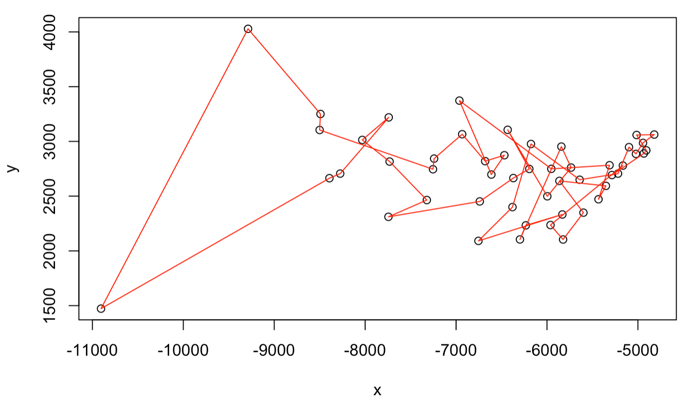
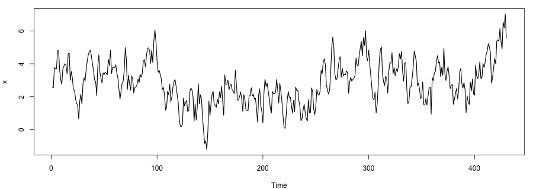

## 9D.1 Parameter fitting of a dynamics model

Consider a single self-activating gene whose expression level $X$ follows the rate equation

$$ \frac{dX}{dt} = f(X) = g_0 + g_1 \frac{X^n}{X^n + X_0^n} - k X . \tag{1} $$

The five parameters lie in the ranges $g_0 \in (0, 10)$, $g_1 \in (10, 100)$, $X_0 \in (1, 1000)$, $n \in (1, 6)$, and $k \in (0.1, 1)$. The system is known to have three steady states, at $X = 50$, $200$, and $400$. Use *simulated annealing* ([Part 9A](09a-mcmc-optimization.qmd)) to find a parameter set consistent with these observations. The self-activating gene model is the one introduced in [Part 2A](../02-odes/02a-modeling-gene-circuits.qmd).

Hint: at a steady state $f(X) = 0$. Define a scoring function that measures how far $f(X)$ departs from zero at all three required steady-state levels (for example, the sum of $f(X)^2$ over the three values), and minimize it by simulated annealing. Keep every parameter inside its allowed range during the search.

## 9D.2 The traveling salesman problem

To distribute a vaccine efficiently, we want the shortest route that visits each of $N = 50$ cities once and returns to the distribution center (the first city). The file `us50.txt` gives the city coordinates. An example (non-optimal) route is shown below.

```r
us50 <- read.table("us50.txt", col.names = c("x", "y"))
plot(us50$x, us50$y, xlab = "x", ylab = "y")
```

{width=75% fig-align="center"}

Design an MCMC-based method, such as simulated annealing ([Part 9A](09a-mcmc-optimization.qmd)), to find a short route. This is the same problem solved exactly for a small case in [Part 9B](09b-dynamic-programming.qmd) and heuristically with a genetic algorithm in [Part 9C](09c-genetic-algorithm.qmd).

**(a)** Compute the matrix of pairwise distances between all cities.

**(b)** Define a scoring function $E(z)$ that returns the total length of the route visiting the cities in the order given by the index vector $z$, including the leg back from the last city to the first. Use the precomputed distance matrix from (a) to keep it fast.

**(c)** Design two local move sets to propose new orderings, chosen with equal probability:

1. pick two cities $a < b$ and *reverse* the path segment between them (if $a = 1$ and $b = N$, use $b = N - 1$ instead);
2. pick two cities $a < b$ (again avoiding $a = 1$, $b = N$ together) and *cut out* the segment between them, then reinsert it at a random position among the remaining cities.

Run simulated annealing (or another MCMC optimizer) with these moves to find a short route.

**(d)** Report your best route length and plot the route on the city map.

Hint: use `sample` to draw the initial order and the random cities $a$ and $b$, and `append` to reinsert a segment at a chosen position.

## 9D.3 Optimal time-series segmentation by dynamic programming

Dynamic programming ([Part 9B](09b-dynamic-programming.qmd)) also solves a common signal-processing task: splitting a noisy time series into $K$ piecewise-constant segments. Given a series $x = (x_1, \dots, x_N)$, partition the indices $\{1, \dots, N\}$ into $K$ consecutive segments,

$$ [1, b_1],\ [b_1 + 1, b_2],\ \dots,\ [b_{K-1} + 1, N] , $$

so that each segment is summarized by its mean and the total reconstruction error is minimized. For a segment from $i$ to $j$, the sum of squared errors is

$$ \mathrm{SSE}(i, j) = \sum_{t=i}^{j} (x_t - \bar{x}_{i:j})^2 , \qquad
\bar{x}_{i:j} = \frac{1}{j - i + 1} \sum_{t=i}^{j} x_t . $$

The goal is to choose the breakpoints $B$ that minimize the total error,

$$ \min_{B}\ \sum_{s=1}^{K} \mathrm{SSE}(b_{s-1} + 1, b_s) , \qquad b_0 = 0,\ b_K = N . $$

Let $DP[k][j]$ be the minimum cost of segmenting the first $j$ points into $k$ segments. It obeys the recursion

$$ DP[k][j] = \min_{i \in \{k-1, \dots, j-1\}} \left( DP[k-1][i] + \mathrm{SSE}(i + 1, j) \right) . $$

**(a)** Explain how the method works: how does the recursion break the problem into subproblems, what is the rationale behind the recurrence, and how do you recover the optimal breakpoints once the table is filled?

**(b)** Implement the algorithm in R or Python. (Precomputing $\mathrm{SSE}(i, j)$ for all $i, j$, or the prefix sums of $x$ and $x^2$, keeps it efficient.)

**(c)** Test it on the provided series `timeseries.csv`, shown below. Run it with $K = 4$, report the estimated breakpoints, and plot the series together with the fitted piecewise-constant segments.

```r
df <- read.csv("timeseries.csv")
plot(df$time, df$value, xlab = "Time", ylab = "x", type = "l", lwd = 2)
```

{width=90% fig-align="center"}
