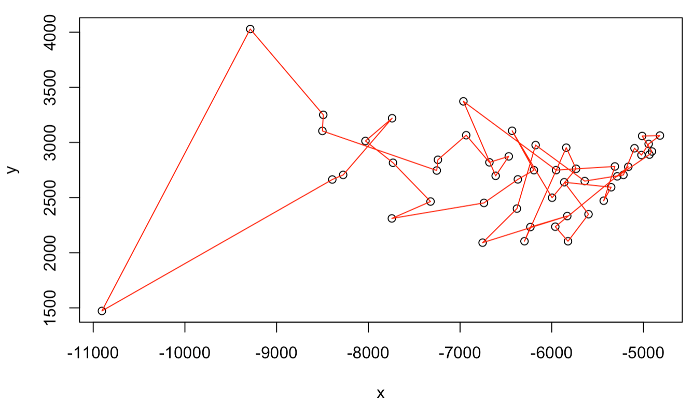

```{r setup, include=FALSE}
knitr::opts_chunk$set(echo = TRUE)
```

# 1. Parameter fitting of a dynamics model

We consider a circuit of one gene with self-activation, whose gene expression level can be described by the following chemical rate equation

$$\frac{dX}{dt} = f(X) = g_0 + g_1\frac{X^n}{X^n+X_0^n} - kX. \tag{2}$$

Here, there are five parameters, whose values are from the following ranges. $g_0$: (0, 10), $g_1$: (10, 100), $X_0$: (1, 1000), $n$: (1, 6), and $k$: (0.1, 1). We also know that the system has three steady states with $X$ levels: 50, 200, 400. 

Apply simulated annealing to find a set of parameters that best describes this system.  

Hint: For a steady state, $f(X) = 0$. To find a system with three specific steady states, you can define a scoring function to quantify how $f(X)$ deviates from zero for all steady-state leves of $X$. And then you can use simulated annealing to minimize the scoring function. Make sure that all parameters are within the specified ranges.

# 2. Travelling salesman problem

To effectively deal with the COVID-19 pandemics, it is crucial to design an optimal way to distribute vaccines. Consider there are $N=50$ cities represented by the $x$ and $y$ coordinates in 2D. Our goal is to find the shortest route that travels each city exactly once and then return to the distribution center (the first city). Use the provided data "us50.txt" to obtain the coordinates of the cities. 

```{r}
us50 = read.table(file = "./extra/data/09/us50.txt")
colnames(us50) = c("x", "y")
plot(us50$x, us50$y, type = "p", xlab = "x", ylab = "y")
```

Design an MCMC-based method (*e.g.*, simulated annealing) to identify the shortest path. Figure 1 shows an example of such a path, but it is certainly not the shortest path.

{width=75%}

**(a)** Compute the matrix of the pairwise distances between any two cities. 

**(b)** Define the scoring function $E(z)$ to compute the total distance of a path that goes through every city and comes back to the first city. $z$ is a vector specifying the order of the indices of the cities. 

Hint: Don't forget the distance between the first and the last cities. Make sure to use the distance matrix from **(a)** to reduce the computational cost.

**(c)** Design "local" move sets to sample different city orders. You should at least consider the following two move sets.

(1) Randomly pick two cities $a$ and $b$ ($a < b$) and reverse the path segment between $a$ and $b$. When $a = 1$ and $b = N$, we revise the second city to $b = N-1$ instead.

(2) Randomly pick two cities $a$ and $b$ ($a < b$). When $a = 1$ and $b = N$, we revise the second city to $b = N-1$ instead. Now, insert this path segment between $a$ and $b$ into a **new** location (*i.e.*, a list of the remaining cities at a random position).

Both move sets are chosen at random with equal probability. You can also design your own move set. 

Use simulated annealing or other MCMC-based optimization methods to find a heuristic solution of the shortest path.

Hint: Use *sample* to sample the initial path and the random cities $a$ and $b$. Use *append* to insert a vector to another vector in the middle.

**(d)** Show your best solution of the shortest distance, and plot the path in the above map. We will see who obtain the best results.