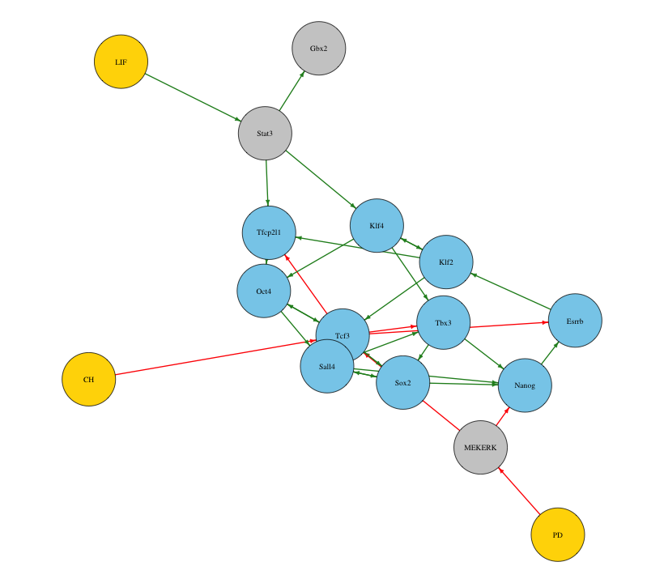

## 10D.1 Shortest paths in a directed graph

You are given a directed graph with $n_V = 10$ vertices and $n_E = 20$ edges, each edge carrying a non-negative weight (the cost of traveling along it). Implement a dynamic-programming algorithm to find the shortest-path distance from a chosen source vertex to every other vertex. This is the *Bellman-Ford* relaxation, a dynamic program on graphs closely related to the methods in [Part 9B](../09-optimization/09b-dynamic-programming.qmd).

| Source | Destination | Weight | | Source | Destination | Weight |
|:------:|:-----------:|:------:|-|:------:|:-----------:|:------:|
| 1 | 2 | 5 | | 4 | 9 | 5 |
| 1 | 3 | 3 | | 5 | 10 | 6 |
| 2 | 3 | 2 | | 6 | 7 | 2 |
| 2 | 4 | 6 | | 7 | 8 | 3 |
| 3 | 4 | 7 | | 8 | 9 | 4 |
| 3 | 5 | 4 | | 9 | 10 | 5 |
| 4 | 5 | 1 | | 10 | 6 | 6 |
| 1 | 6 | 2 | | 6 | 8 | 5 |
| 2 | 7 | 3 | | 2 | 5 | 1 |
| 3 | 8 | 4 | | 3 | 6 | 2 |

The following builds and draws the graph:

### R implementation {.impl}

```{r}
#| fig-width: 6
#| fig-height: 5
#| out-width: "65%"
#| message: false
library(igraph)
edges <- data.frame(
  from   = c(1, 1, 2, 2, 3, 3, 4, 1, 2, 3, 4, 5, 6, 7, 8, 9, 10, 6, 2, 3),
  to     = c(2, 3, 3, 4, 4, 5, 5, 6, 7, 8, 9, 10, 7, 8, 9, 10, 6, 8, 5, 6),
  weight = c(5, 3, 2, 6, 7, 4, 1, 2, 3, 4, 5, 6, 2, 3, 4, 5, 6, 5, 1, 2))
graph <- graph_from_data_frame(edges, directed = TRUE)
# Kamada-Kawai (as in Part 10C): deterministic, so the R and Python drawings agree
plot(graph, edge.label = edges$weight, edge.arrow.size = 0.5,
     vertex.color = "gold", vertex.frame.color = NA, edge.color = "#B3B3B3",
     layout = layout_with_kk(graph))
```

### Python implementation {.impl}

```{python}
#| fig-width: 6
#| fig-height: 5
#| out-width: "65%"
import networkx as nx
import matplotlib.pyplot as plt

edges = [(1, 2, 5), (1, 3, 3), (2, 3, 2), (2, 4, 6), (3, 4, 7), (3, 5, 4), (4, 5, 1),
         (1, 6, 2), (2, 7, 3), (3, 8, 4), (4, 9, 5), (5, 10, 6), (6, 7, 2), (7, 8, 3),
         (8, 9, 4), (9, 10, 5), (10, 6, 6), (6, 8, 5), (2, 5, 1), (3, 6, 2)]
graph = nx.DiGraph(); graph.add_weighted_edges_from(edges)
# Kamada-Kawai (as in Part 10C): deterministic, so the R and Python drawings agree
pos = nx.kamada_kawai_layout(graph)
# horizontal dark-blue labels, matching igraph's defaults on the R side
nx.draw(graph, pos, with_labels=True, node_color="gold", edge_color="#B3B3B3",
        font_color="darkblue")
_ = nx.draw_networkx_edge_labels(graph, pos, rotate=False, font_color="darkblue",
                                 edge_labels=nx.get_edge_attributes(graph, "weight"))
plt.show()
```

Write a function `shortest_path_dp(graph, nV, nE, s)`, where `graph` is a matrix whose rows are (source, destination, weight), `nV`/`nE` are the numbers of vertices/edges, and `s` is the source vertex. Inside it:

1. initialize a vector `dist` of length `nV` with `dist[s] = 0` and `dist[v] = Inf` for every other vertex;
2. sweep through all edges and *relax* each one, updating $\text{dist}[v] \leftarrow \min(\text{dist}[v],\ \text{dist}[u] + w(u, v))$;
3. repeat the full sweep `nV` times; `dist` then holds the shortest distances.

**(a)** Explain in words how the algorithm works, and why repeating the edge sweep $n_V$ times is enough to guarantee the shortest distances.

**(b)** Show your implementation of `shortest_path_dp`.

**(c)** Run it on the graph above with vertex 1 as the source, and print the shortest distance from vertex 1 to every other vertex.

## 10D.2 High-dimensional single-cell analysis

You are given a simulated single-cell gene-expression dataset, `gene_expression.csv`, with 100 genes measured in 1000 cells. You will visualize its structure with the low-dimensional projections of [Part 10A](10a-dimensionality-reduction.qmd) and then cluster it with the methods of [Part 10B](10b-clustering.qmd). Use the relevant libraries for each method.

### R implementation {.impl}

```r
expr <- read.csv("10-high-dim-data/data/gene_expression.csv", row.names = 1)   # 1000 cells x 100 genes
```

### Python implementation {.impl}

```python
import pandas as pd

expr = pd.read_csv("10-high-dim-data/data/gene_expression.csv", index_col=0)   # 1000 cells x 100 genes
```

**(a)** Load the data and apply a log transformation to the expression matrix, for example $\log(x + 1)$.

**(b)** Perform PCA on the log-transformed data and make a scatter plot of the cells on the first two principal components (PC1 vs PC2).

**(c)** Using the first 20 PCs from (b), run t-SNE and plot the cells on the first two t-SNE dimensions.

**(d)** Repeat (c) with UMAP instead of t-SNE, and plot the first two UMAP components.

**(e)** Compare (b)-(d): how clearly does each method reveal cluster structure in the data?

**(f)** Perform hierarchical clustering with a reasonable distance metric and linkage. From the gene-expression heatmap and its dendrogram, estimate the number of clusters.

**(g)** Apply k-means to the first two t-SNE dimensions, trying several values of $k$.

**(h)** Apply a Gaussian mixture model to the first two t-SNE dimensions, again exploring different numbers of components.

**(i)** Compare and interpret the clustering results from (f)-(h): where do the methods agree, and where do they differ?

## 10D.3 A Boolean model of embryonic stem cell pluripotency

Mouse embryonic stem cells are held in the naive pluripotent "ground state" by three signals: leukemia inhibitory factor (**LIF**) and the two "2i" inhibitors of GSK3 (**CH**) and MEK (**PD**). Dunn et al. distilled the core pluripotency gene-regulatory network into a minimal Boolean model [@dunn2014defining; @dunn2019common], with the three signals as fixed inputs driving a circuit of transcription factors. The synchronous update rules are:

```
LIF*     = LIF                     CH* = CH                     PD* = PD
Stat3*   = LIF
Gbx2*    = Stat3
MEKERK*  = not PD
Klf4*    = Stat3 and Klf2
Klf2*    = Klf4 or Esrrb
Tcf3*    = Klf2 and Oct4 and Sox2 and (not MEKERK and not CH)
Sall4*   = Oct4 and Sox2 and not Tcf3
Tbx3*    = Klf4 or (Sall4 and not Tcf3)
Esrrb*   = Nanog and not Tcf3
Tfcp2l1* = Klf2 or (Stat3 and not Tcf3)
Oct4*    = Klf4 or Tfcp2l1 or Tcf3
Nanog*   = (Sall4 or Sox2 or (Tbx3 and not MEKERK)) or (Sall4 and Sox2 and Tbx3)
Sox2*    = Tbx3 or Sall4 or Tcf3
```

The corresponding network is shown below (gold: signalling inputs; grey: signalling effectors; blue: transcription factors; green edges: activation; red edges: inhibition).

{width=75% fig-align="center"}

Using the synchronous-update and attractor machinery of [Part 10C](10c-network-algorithms.qmd):

**(a)** Implement the update rule. The three signals `LIF`, `CH`, `PD` are held fixed (they copy themselves), so each choice of signalling input defines a different network.

**(b)** For each of the $2^3 = 8$ combinations of the signalling inputs, find the attractor(s) and report the state of the core factors (for example `Nanog`, `Oct4`, `Sox2`, `Esrrb`, `Klf2`, `Klf4`, `Tfcp2l1`, `Tbx3`). Because the network may be multistable, enumerate attractors by running many initial conditions (or all $2^{13}$).

**(c)** Interpret the results: which signalling combinations support a self-renewing pluripotent attractor (with `Nanog` and the core factors on), and which lead to collapse (loss of pluripotency)? Relate your findings to the role of the 2i+LIF condition (`LIF = CH = PD = 1`) in maintaining the naive ground state.
